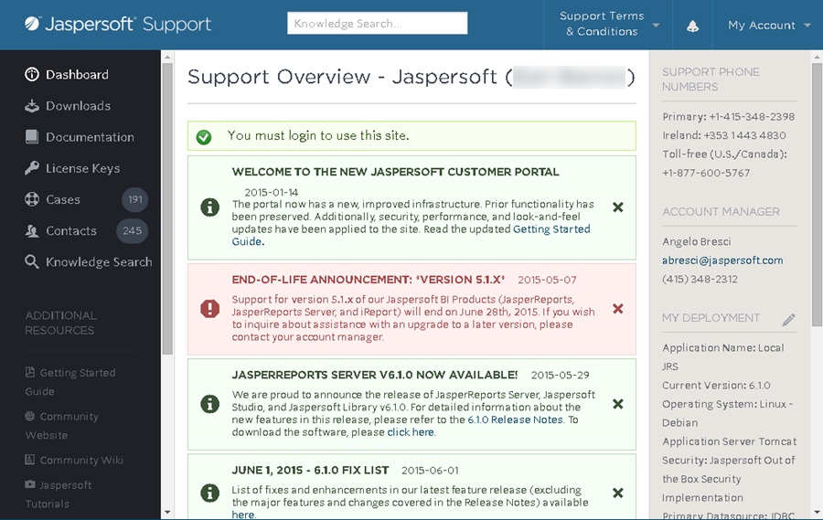

# Available Resources

Jaspersoft provides a comprehensive set of resources to help you learn about our products, answer your most difficult questions, and address any issues that may arise.

Each of the resources below is accessible through the Jaspersoft Online Customer Support Portal (<http://support.jaspersoft.com/>).  The portal is your single destination for information about your Jaspersoft products and support subscription.

Note: You'll find many of these resources by using the navigation panel on the left side of every page in the portal.

The navigation panel on the left side of the Online Customer Portal

<table>
<colgroup>
<col style="width: 33%" />
<col style="width: 33%" />
<col style="width: 33%" />
</colgroup>
<thead>
<tr>
<th>
Resource Name
</th>
<th>
Description
</th>
<th>
Location
</th>
</tr>
</thead>
<tbody>
<tr>
<td>
Product Downloads
</td>
<td>
Download product installers, patches, hot fixes, etc. from the Online Customer Portal
</td>
<td>
From the Online Customer Portal’s navigation menu, choose “Downloads” then click a product icon
</td>
</tr>
<tr>
<td>
License Downloads
</td>
<td>
Download your company’s Jaspersoft product license(s)
</td>
<td>
In the Online Customer Portal, hover over “My Account” and click the “Licenses/Keys” link
</td>
</tr>
<tr>
<td>
Ultimate Guides, User Guides, Admin Guides, and Other Product Documentation
</td>
<td>
Official product documentation authored, published, and distributed by Jaspersoft
</td>
<td>
In the Online Customer Portal, hover over “Documentation” and click the links for your products.
</td>
</tr>
<tr>
<td>
Knowledge Search (NEW)
</td>
<td>
Jaspersoft's Knowledge Search gives you centralized access to all the knowledge in the Jaspersoft universe, including Product Documentation, forums, Community Wiki articles, white papers, etc.
</td>
<td>
From the Online Customer Portal’s navigation menu, choose “Knowledge Search”
</td>
</tr>
<tr>
<td>
Community Wiki (Jaspersoft Knowledge Base)
</td>
<td>
Another searchable online resource containing how-to articles, examples of common deployments, usage patterns, troubleshooting tips, etc.
</td>
<td>
In the Online Customer Portal, hover over “Resources” and click the “Jaspersoft Community Wiki” link
</td>
</tr>
<tr>
<td>
Product Tutorials
</td>
<td>
Practical, concise user guides organized by “User Type,” offering common examples
</td>
<td>
In the Online Customer Portal, scroll down to “Resources” and click “Jaspersoft Tutorials”
</td>
</tr>
<tr>
<td>
Jaspersoft Training &amp; Materials
</td>
<td>
Jaspersoft University helps you improve your Jaspersoft skills, anytime, anywhere. With a full curriculum of courses delivered in classrooms, live online, and self-paced, you can take full classes or brush up on individual sections as needed.
</td>
<td>
On the Online Customer Portal’s home page, scroll down to “Resources” and click Training

Also visit the “Online Learning Portal” for free self-paced training. <a href="http://www.jaspersoft.com/bi-training-center">http://www.jaspersoft.com/bi-training-center</a> 
</td>
</tr>
<tr>
<td>
Jaspersoft Demos
</td>
<td>
Quick self-running demonstrations of our products
</td>
<td>
In the Online Customer Portal, hover over “Resources” and click the “Self-Running Demos” link
</td>
</tr>
<tr>
<td>
White Papers
</td>
<td>
Documents containing detailed information and research related to Jaspersoft Products
</td>
<td>
In the Online Customer Portal, hover over “Resources” and click the “White Papers” link
</td>
</tr>
<tr>
<td>
C/S  Submit and Track Cases
</td>
<td>
Available for annual subscription customers and those with incident-based support. Log cases with Jaspersoft Support in a simple online form, or track your existing cases (see the section below entitled “<a href="submitting-questions.md">Submitting a Case</a>”)
</td>
<td>
In the Online Customer Portal, hover over “Cases” and click the “Submit a Case” or “Track My Cases” link
</td>
</tr>
<tr>
<td>
Edit Contact Information
</td>
<td>
Edit your email address, password, etc.
</td>
<td>
In the Online Customer Portal, move your mouse (or cursor) over “My Account”, then click on the “My Contact Information” link
</td>
</tr>
<tr>
<td>
Edit Your Company’s Deployment/Environment Information
</td>
<td>
Update information about your operating system, application server, database, etc. for our records.
</td>
<td>
In the Online Customer Portal, hover over “My Account” and click the “My Company’s Deployment Information” link
</td>
</tr>
<tr>
<td>
Jaspersoft Professional Services
</td>
<td>
Consulting resources available to assist you with product customization, optimization, deployment, etc.
</td>
<td>
For more information about our Professional Services offerings, go to the Online Customer Portal’s home page, scroll down to “Resources” and click “Professional Services”
</td>
</tr>
<tr>
<td>
Community Site
</td>
<td>
Our public site, where you can find public forums, downloads of our community edition products, etc.
</td>
<td>
On the Online Customer Portal’s home page, scroll down to “Resources” and click “JasperForge Community Site”
</td>
</tr>
</tbody>
</table>
