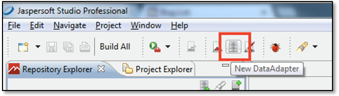
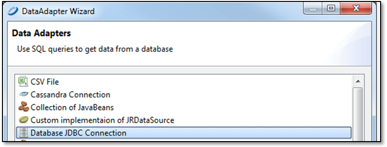
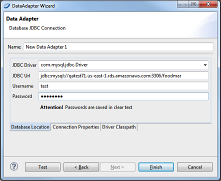
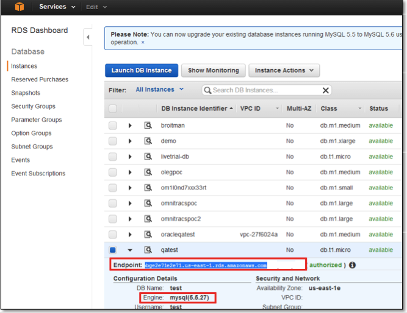
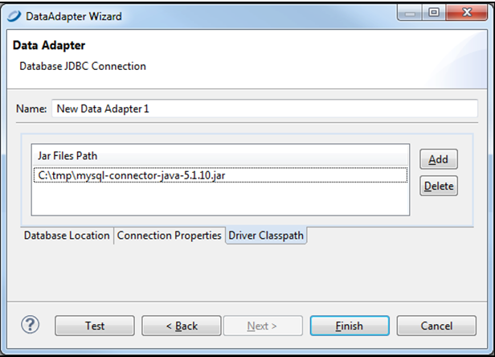
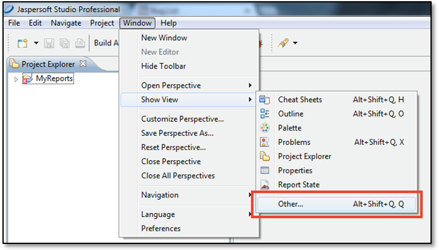
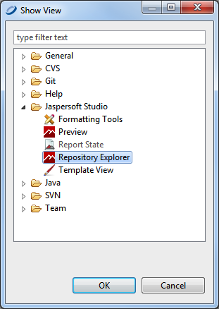
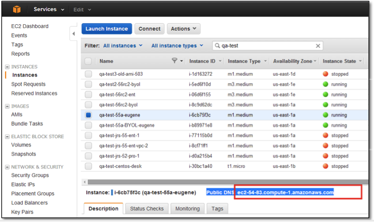
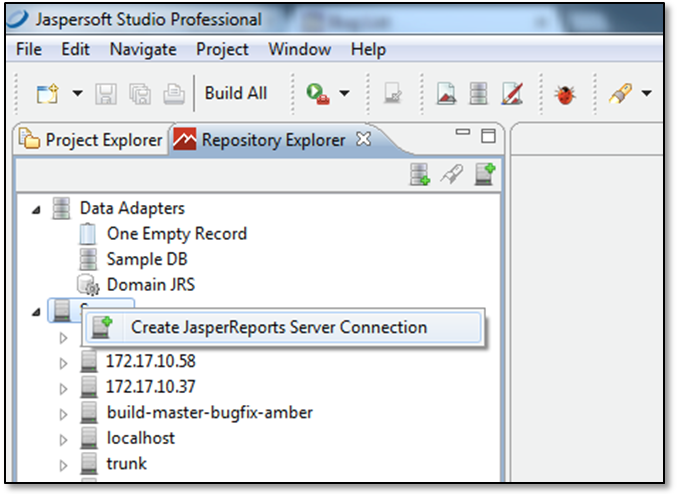
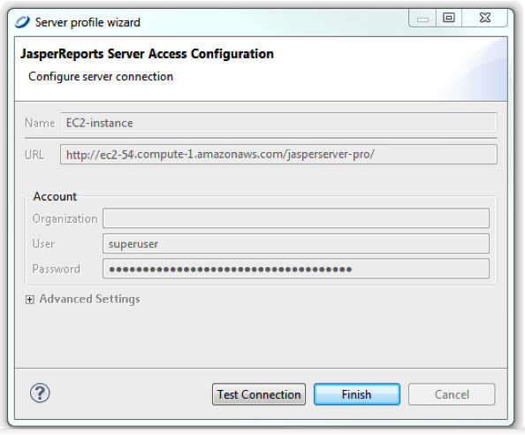

# Connecting JSS Pro to Your Data

1.  Create a new DataAdapter (called Data Source in JSS).

    New DataAdapter button

    In Jaspersoft Studio, click the New Data Adapter icon to display the DataAdapter wizard.

    

    DataAdapter wizard

2.  Name your DataAdapter and click **Next**.

    Selecting a data source type

3.  Select the data source type. For Amazon RDS and Redshift, use **JDBC**. Then click **Next**.

    Entering your database location

4.  Add the **JDBC Driver**. You may need to search the web for one that corresponds to your RDBMS or other technology on your EC2 instance.

5.  Enter the **JDBC Url**. This is the Endpoint URL from your Amazon EC2 dashboard (including the port) and database type.

    Locating the Endpoint

6.  Click the **Driver Classpath** tab and select the local path of the driver.

    Selecting the driver classpath

7.  Test the connection.

# Connecting JSS Pro to the JRS Repository

You'll need to connect to the JSS repository to manage and schedule reports

To define the Repository Explorer's connection

1.  In JSS, select **Window** &gt; **Show Views** &gt; **Other….**

    **Window** &gt; **Show Views** &gt; **Other….** menu

2.  Select **Repository Explorer**.

    Selecting the Repository Explorer

3.  Select the instance’s URL. It should start with `ec2`.

    Selecting the instance URL

4.  Right-click the name of your instance to create a JRS repository connection.

    Creating the JRS repository connection

5.  Fill in the instance’s url, but don’t add the port ID number. Make sure to include “/jasperserver-pro/” at the end of the path.

Filling in the instance URL

From here you should follow the Jaspersoft Studio documentation on how to create reports. There is also online training and tutorials available here:

<http://community.jaspersoft.com/wiki/jaspersoft-studio-tutorials-archive>
