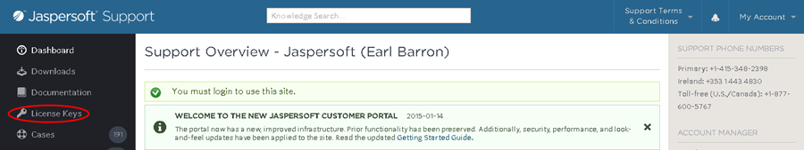

# Launching JasperReports Server on AWS Marketplace

Upon purchasing JasperReports Server (JRS) on AWS Marketplace or obtaining your BYOL (“Bring Your Own License”) license key from Jaspersoft, make sure you follow these instructions to launch the product: <http://community.jaspersoft.com/jaspersoft-aws/launch>

- If you purchase JRS directly on AWS Marketplace, the license key is included.
- If you're using the Jaspersoft BYOL license key option, you can download the BYOL license key from the Jaspersoft Customer Support Portal (<http://support.jaspersoft.com/>).

