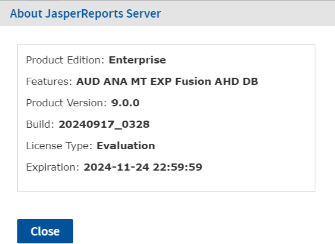

# Applying a Jaspersoft License for AWS BYOL

When creating your JasperReports Server instance or cluster for BYOL, AWS creates a S3 bucket for you to upload your JasperReports Server license. You need to upload your license after the trial license expires.

More information on applying for a license is available on the Jaspersoft Community Site, at <http://community.jaspersoft.com/wiki/applying-your-jaspersoft-product-licenses>.

Make sure you have all the prerequisites for applying for your license:

-   A valid license file.
-   Access to the AWS Management Console.
-   A BYOL instance or cluster already running in AWS.
-   A S3 bucket. You can find the name of the bucket on the Outputs tab of your CloudFormation stack.

!!! note

    These instructions are only for BYOL licenses. You cannot upload other JasperReports Server licenses to your S3 bucket.

    If you are using a BYOL license for a cluster, deleting an instance before applying your license may result in the automatic creation of a new instance using an older license.

## To apply your license file on instances created using a CFT option

1.  Log in to the AWS console. The address is generally something like `https://<yourAWSAccountID>.signin.aws.amazon.com/console`.

    If you would like more information on logging into the AWS console see: <https://docs.aws.amazon.com/IAM/latest/UserGuide/console.html>

2.  On the AWS Management Console home page, click **S3**.

3.  Click the name of the bucket for your instance or cluster.

4.  Click **Upload**.

5.  Click **Add Files** to find the license file on your local machine.

6.  Click **Start Upload**.

    AWS uploads the file and stores it in the S3 bucket.

7.  With the license in place, reboot your instance from the **EC2 &gt; Instances &gt; Instances** page.

## To apply your license file on instances created using an AMI option

To update the license for single BYOL instances, the jasperserver.license key needs to be put on the JasperReports Server instance.

1.  SFTP into the instance (like SSHing in below)

2.  copy the jasperserver.license file into the ec2-user home directory

3.  SSH into the instance

4.  Copy the jasperserver.license to the folder /usr/share/tomcat/webapps/jasperserver-pro/WEB-INF

5.  sudo systemctl restart tomcat

To verify that your license is uploaded, open JasperReports Server in a web browser and click **About JasperReports Server** in the lower left corner.

*Figure 1 Valid License Information*
