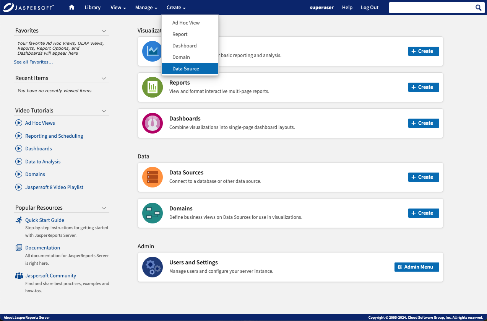
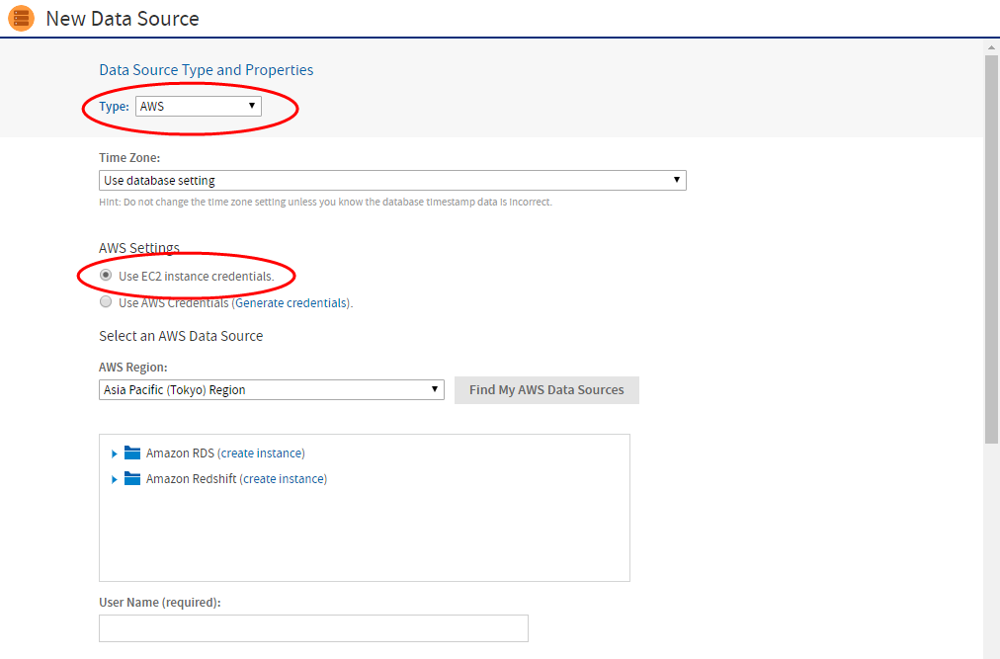
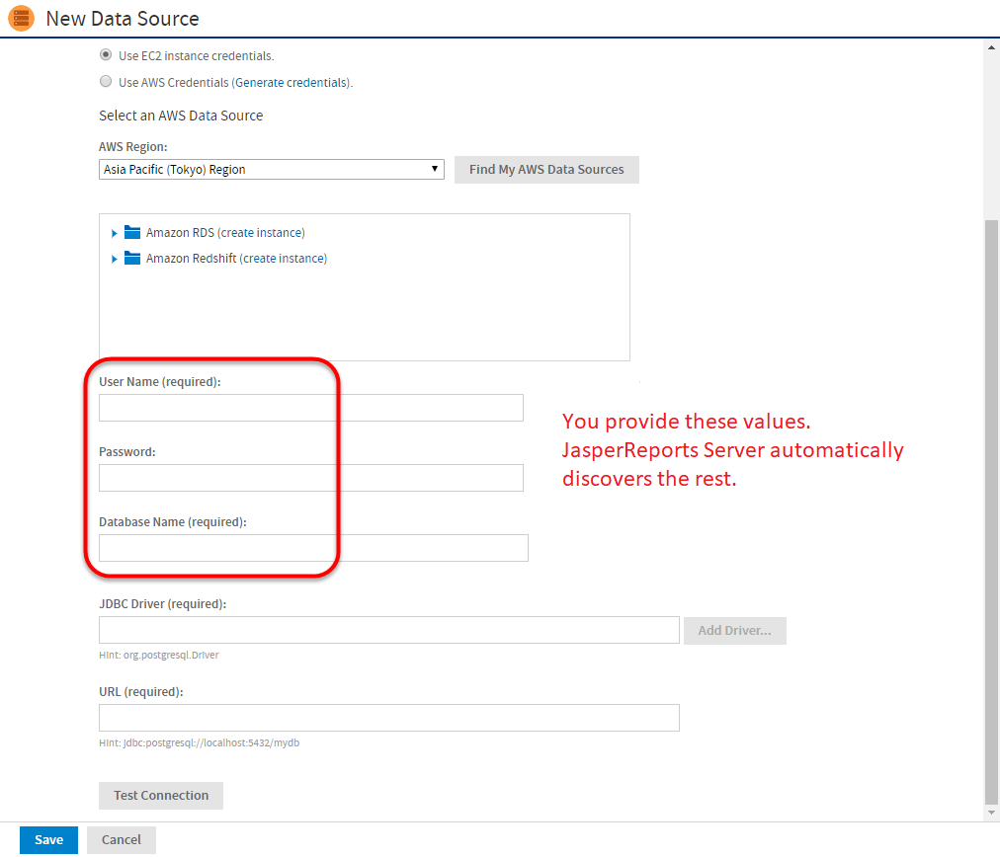
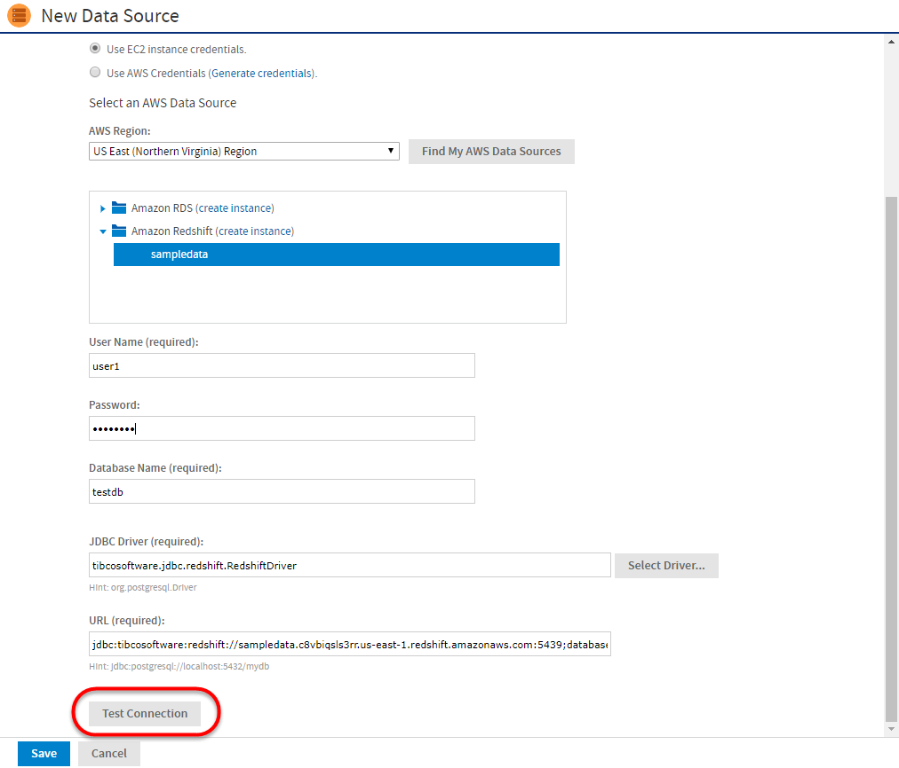
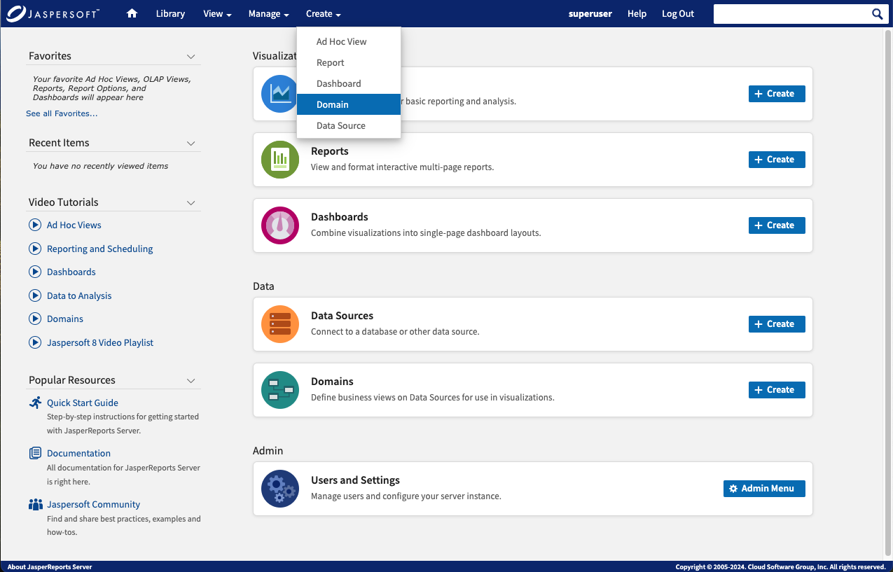
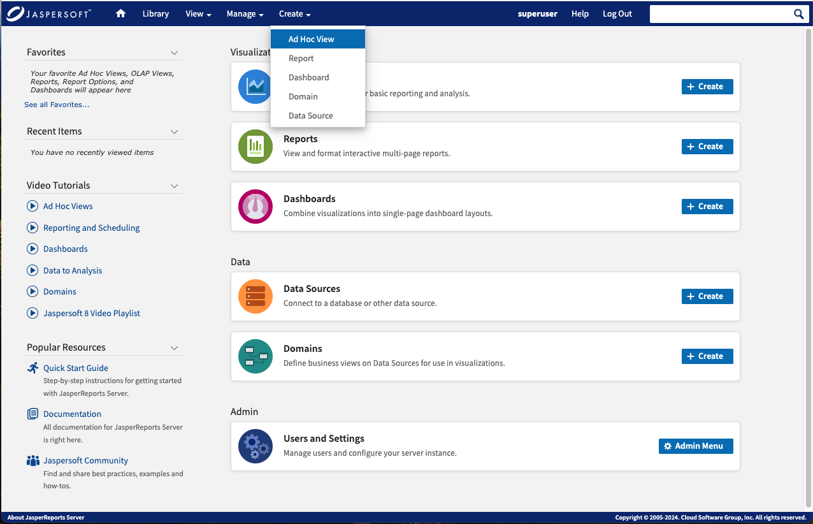
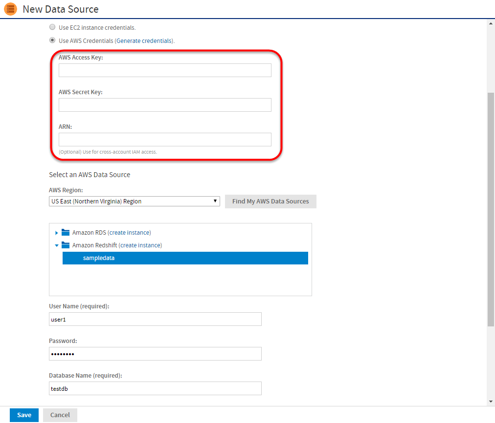
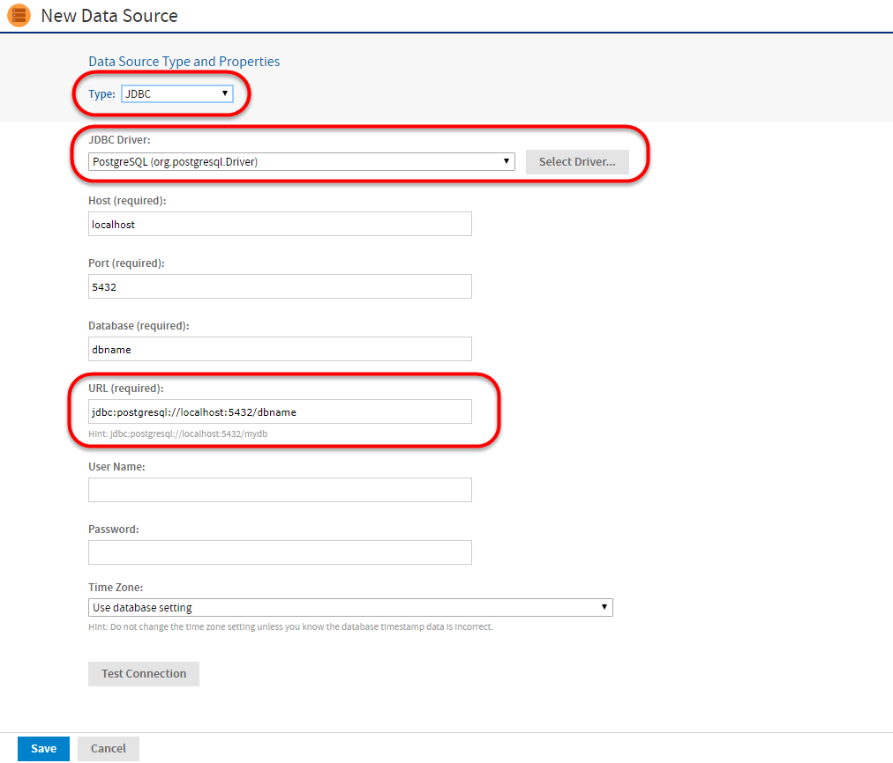

#

# Connecting to Your Data with JasperReports Server

Follow the instructions in the chapter to connect JasperReports Server to Amazon RDS or Redshift. For Amazon Elastic MapReduce (EMR) see Connect to Amazon EMR. For connecting JasperReports Server to non-Amazon data sources, see Additional Connection Types.

## Launching JasperReports Server on AWS Marketplace

On purchasing JasperReports Server on AWS Marketplace or obtaining your Bring Your Own License (BYOL) key from Jaspersoft, make sure you follow the instructions in [Applying a Jaspersoft License for AWS BYOL](applying-byol-license.md) to launch the product.

- If you purchase JasperReports Server directly on AWS Marketplace, the license key is included.
- If you are using the Jaspersoft BYOL license key option, you can download the BYOL license key from <https://www.jaspersoft.com/support>.

## Prerequisites

You need to update your IAM role using the AWS CloudFormation console before you auto-detect the Amazon Relational Database Server (RDS) and Amazon Redshift.

To add IAM role

1.  Select **JRSInstanceRole** in the **CloudFormation Resources** tab.
2.  Go to the **Role** \> **Edit JRSRolePolicy**.
3.  Select Redshift as a resource and then select **add actions** to add all the required permissions one by one.
4.  Add the resources by expanding the **Resources** section. You can either allow all resources or provide the specific Amazon Resource Name(ARN).

## Connect to Amazon RDS or Redshift

JasperReports Server can automatically discover and connect to Amazon Relational Database Server (RDS) and Amazon Redshift using the auto-connect feature.

To connect to Amazon RDS or Redshift

1.  Log into JasperReports Server as an administrator.
2.  Go to **Create** \> **Data Source**.

*Figure 1: Create \> Data Source menu*

1.  Select **AWS Data Source** from the **Type** dropdown menu.
2.  Enter your EC2 instance credentials. If EC2 instance credentials are not available, then see the Additional Connection Possibilities section below.
3.  Under **AWS Settings**, select **EC2 instance credentials**.

*Figure 2: Add Data Source dialog*

1.  Enter your database connection info:

JasperReports Server is able to detect your RDS and Redshift data sources. This is possible because the IAM Role associated with the EC2 instance is allowed to execute the actions "rds:Describe\*" and "redshift:Describe\*". It pre-populates the Database Name, Driver, and URL.

On the New Data Source page, You must enter the database username and password. For security reasons, Amazon does not store these credentials, and Jaspersoft cannot retrieve them.

The default database is automatically populated, but you may manually enter another if your RDS or Redshift instance has multiple databases.

*Figure 3: New Data Source dialog*

1.  Test your connection:

You should always test your connection. This button does much more than just testing:

- It creates a DB Security Group.
- It adds the internal IP of the EC2 instance to the security group to authorize ingress to RDS.

This is possible because the IAM Role provides the instance with credentials like "rds:CreateDBSecurityGroup" and "redshift:AuthorizeClusterSecurityGroupIngress".

- If you want to control details of the security group name or specify the IP address manually because you have a complex VPC Topology, then navigate to the menu **Manage \> Server Settings \> AWS Settings**.

*Figure 4: Test Connection dialog*

1.  Create a Domain:

Jaspersoft's metadata layer is called "Data Domains". Choose **Create \> Domain** from the main menu and follow the wizard to build a domain.

*Figure 5: Create \> Domain menu*

1.  Analyze your data:

Choose **Create \> Ad Hoc View**. Find your newly created domain and use the ad hoc environment to begin analyzing your data.

*Figure 6: Create \> Ad Hoc View menu*

1.  Next steps:

Refer to the [Online Learning Portal](https://www.jaspersoft.com/bi-training-center) for details on creating domains, performing ad hoc analysis, and creating reports.

## Additional Connection Types

- AWS Credentials

We recommend launching Jaspersoft BI on an EC2 instance with an associated IAM Role. This role provides EC2 credentials for your JasperReports Server instance.

If this option is not available, you can use AWS credentials instead. If you already have AWS Credentials, you can enter the Access Key and Secret Key.

*Figure 7: Entering AWS credentials*

- JDBC / JNDI Connections

!!! note

    When using JDBC for data source connections, you are responsible for managing the security groups to allow access from the Jaspersoft server to the data source.

*Figure 8: Using JDBC / JNDI connections*

- Amazon RDS or Redshift

When connecting to Amazon RDS or Redshift, it is best to use the AWS Data Source type to make configuration easier. If you prefer, you can use JDBC to connect to Amazon RDS or Redshift. To connect using JDBC, choose the JDBC Data Source type. Enter all connection information and test. Alternatively, you can choose JNDI Data Source and refer to a data source defined in Apache Tomcat.

Benefits of defining your own JDBC connections

- You have complete control

Benefits of using AWS Data Sources

- Jaspersoft provides the driver and URL
- Data source automatically recovers if the IP address changes
- Data source automatically recovers if DB Security Groups are modified

## Connect to Amazon EMR

The JasperReports Server auto-connect feature is not supported for Amazon EMR. Connections to EMR need to be configured manually. See the [Amazon EMR connection page](https://docs.aws.amazon.com/emr/latest/ManagementGuide/emr-manage.html) for details.
