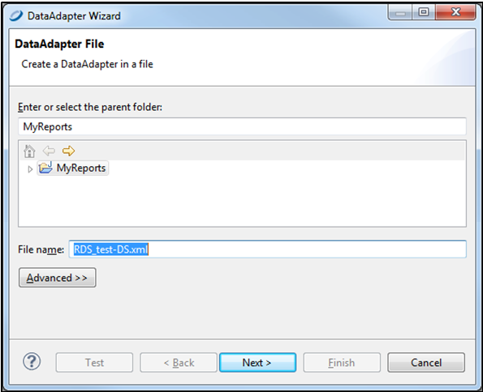

# Working With Jaspersoft Studio Professional

Jaspersoft Studio enables you to create sophisticated, pixel-perfect reports on the desktop and upload those reports to JasperReports Server on AWS. Jaspersoft Studio allows you to create sophisticated layouts containing charts, images, subreports, crosstabs, and more.

## Downloading Jaspersoft Studio

Jaspersoft Studio is available as an Eclipse Rich Client Package (RCP), downloadable from the following location: <http://community.jaspersoft.com/project/jaspersoft-studio/releases>.

See the Jaspersoft Studio User Guide for instructions on how to install Jaspersoft Studio on your local machine and installing your license.

## Connecting Jaspersoft Studio to Your Data

1.  To create a new Data Adapter (called Data Source in Jaspersoft Studio), in Jaspersoft Studio, click the Create Data Adapter icon to display the Data Adapter Wizard.

*Figure 1: Create Data Adapter button*

1.  Select the data source type. For Amazon RDS and Redshift, use **JDBC**. Then click **Next**.

*Figure 2: Selecting a data source type*

1.  Add the **JDBC Driver**. You may need to search the web for one that corresponds to your RDBMS or other technology on your EC2 instance.

*Figure 3: Entering your database location*

1.  Enter the **JDBC Url**. This is the Endpoint URL from your Amazon EC2 dashboard (including the port) and database type.
2.  Click the **Driver Classpath** tab and select the local path of the driver.
3.  Test the connection.

## Connecting Jaspersoft Studio Pro to the JasperReports Server Repository

You need to connect to the Jaspersoft Studio repository to manage and schedule reports

To define the Repository Explorer's connection

1.  In Jaspersoft Studio, select **Window** \> **Show Views** \> **Other….**

*Figure 6: **Window** \> **Show Views** \> **Other….** menu*

1.  Select **Repository Explorer**.

*Figure 7: Selecting the Repository Explorer*

1.  Select the instance’s URL. It should start with `ec2`.

*Figure 8: Selecting the instance URL*

1.  Right-click the name of your instance to create a JasperReports Server repository connection.

*Figure 9: Creating the JasperReports Server repository connection*

1.  Fill in the instance’s url, but don’t add the port ID number. Make sure to include `/jasperserver-pro/` at the end of the path.

*Figure 10: Filling in the instance URL*

From here you should follow the Jaspersoft Studio documentation on how to create reports. There is also online training and tutorials available here:

<http://community.jaspersoft.com/wiki/jaspersoft-studio-tutorials-archive>
