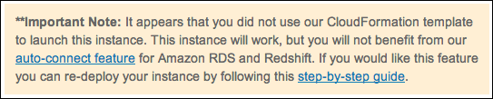
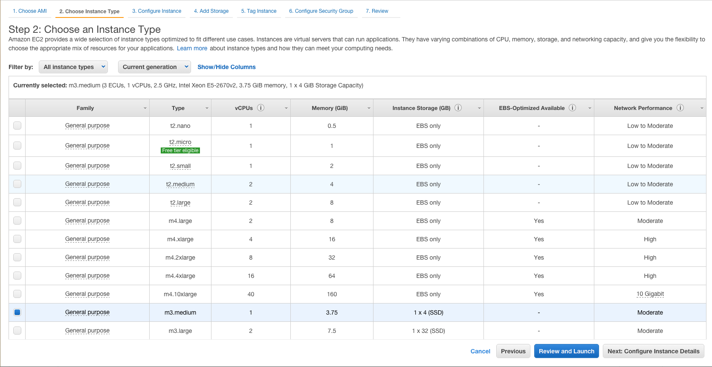
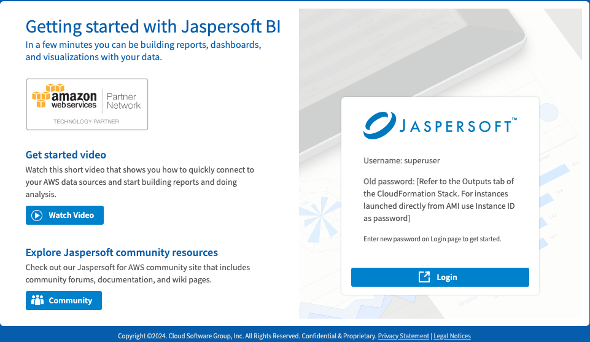
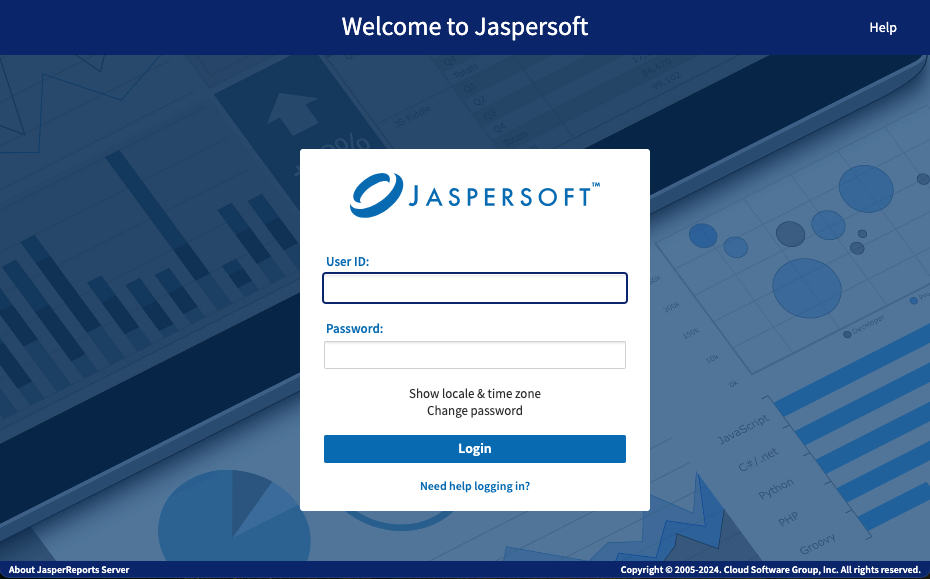
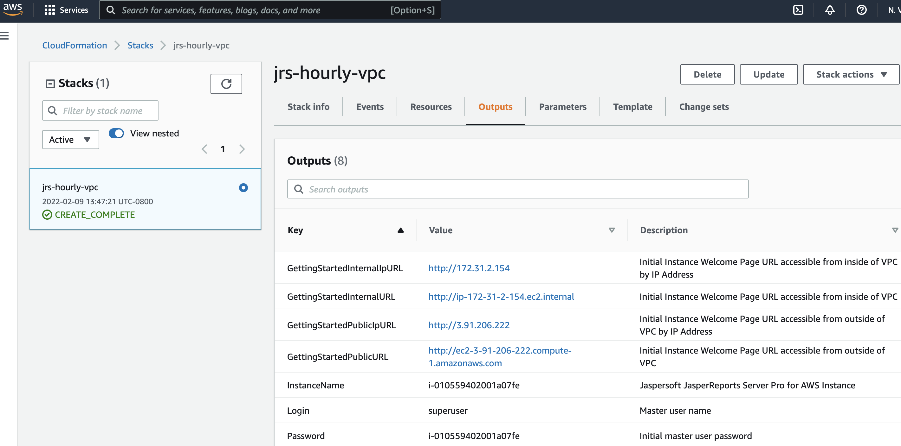
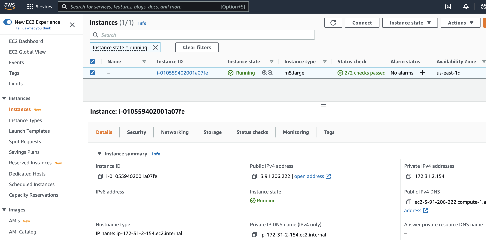
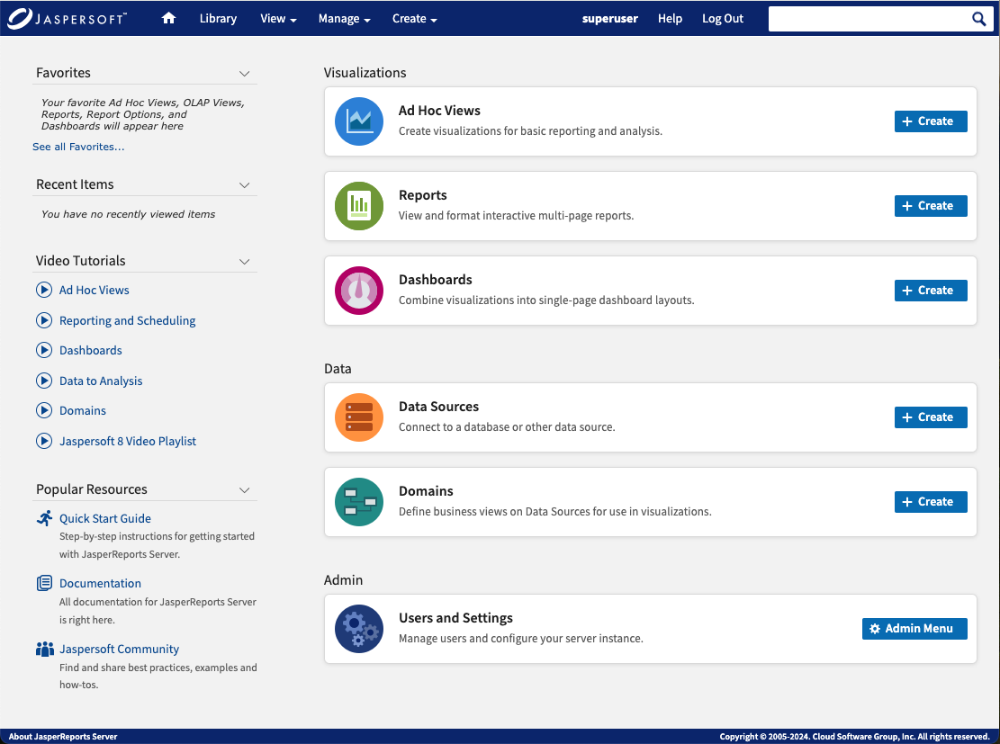

# Launching Instances

This section describes the processes for creating a JasperReports Server instance or cluster inside a Virtual Private Cloud (VPC).

!!! note

    Your Jaspersoft software is charged separately from the AWS EC2 instance charges. Please make sure you follow [these instructions](http://docs.aws.amazon.com/AWSEC2/latest/UserGuide/Stop_Start.html) to turn off your EC2 instance server running Jaspersoft after use. If not, you continue to be charged by the hour for EC2 use. Note that when you stop your EC2 instance server no one has access to the reports or dashboards you have created until you restart the EC2 instance server. When you stop an EC2 instance server, you can still be charged the small [EBS charge](http://aws.amazon.com/ebs/). If you do not want to be charged for EBS, make sure you [terminate your EC2 instance server](http://docs.aws.amazon.com/AWSEC2/latest/UserGuide/terminating-instances.html). Note that in this case none of your work can be retrievable unless you are using an auto-scaling cluster.

## Creating a JasperReports Server Instance in a VPC

The JasperReports Server instance is hosted in your Virtual Private Cloud (VPC).

To create a JasperReports Server instance in a VPC

1.  Select the Jaspersoft product that you want in the AWS Marketplace and [follow the subscription process](acceptingtou.md) to get to the **Configure the Software** page.

2.  Under the **Fulfillment Option**, select CloudFormation Template from the first dropdown list.

3.  From the second dropdown list, select the option specific to the Jaspersoft product:

    - **Jaspersoft Instance in a VPC** for Jaspersoft Reporting and Analytics for AWS (Hourly)
    - **Jaspersoft Multi-tenancy Instance in a VPC** for Jaspersoft for AWS with Multi-Tenancy (Hourly)
    - **BYOL Jaspersoft Stack VPC deployment** for Jaspersoft Reporting and Analytics for AWS (BYOL)

4.  Select the software version and region, then click **Continue to Launch**.

5.  Under **Choose Action**, select **Launch CloudFormation** and then click **Launch**. The **Create stack** page in the AWS console opens. Under the Specify template, the Amazon S3 URL option is already selected and a URL for the template file is filled in. Do not change these options.

6.  Click **Next**. The **Specify stack details** page appears.

7.  In the **Stack name** field, give your CloudFormation stack a unique name.

8.  Install **Chrome** to enable the export functionality. By default, it is set to **No**. Select **Yes** to install. For details, see [Chrome AWS](installing-phantomjs.md).

9.  Choose an **InstanceType**.

10. Choose the **KeyPairName** of your EC2 KeyPair.

11. Choose the **VpcId** from your account.

12. Choose the **SubnetId** from the VPC.

13. Choose whether to create a publicly accessible IP address for the instance using **EnablePublicIp**. Default is True. Select False to refuse.

14. In the **RemoteAccessCIDR** field, enter the IP address and mask for SSH access.

15. Click **Next**. The **Configure stack options** page appears.

16. Add any tags that you want to use to simplify the administration of your infrastructure.

    A tag consists of a key/value pair and can flow to resources inside your stack. You can add up to 10 unique keys to each instance, along with an optional value for each key.

17. Select an IAM role for managing the stack's resources.

18. Expand the **Advanced** section and set your notification, rollback, and other options.

19. Click **Next**. The **Review** page appears.

20. Double check your template, parameter, and option information.

21. Click the acknowledgment checkbox, then click **Create Stack**. You see a message telling you your stack has been created. The Services web page shows your stack's initial status as `CREATE_IN_PROGRESS`. It generally takes two to four minutes for the status to change to `CREATE_COMPLETE`.

22. Select your complete instance and click the **Outputs** tab. Here you can find the information you need when you are ready to log into JasperReports Server:

- The URL for Getting Started with JasperReports Server.
- The name of your instance.
- The login name and password.
- The name of your S3LicenseBucket.

## Creating a JasperReports Server Cluster Inside a VPC

Jaspersoft provides an auto-scaling cluster using the Amazon Relational Database Service (RDS) that ensures that there are enough EC2 instances to handle the workload for your JasperReports Server application. With the cluster, instances are created and removed depending on CPU usage. It also provides a failover mechanism by storing your repository in an external database, so if something happens to an instance it can be replaced and connected to your existing repository. The cluster uses the Amazon Elastic Load Balancer (ELB) to route traffic and only supports PostgreSQL databases. You need to create and initialize your PostgreSQL database and make sure that it is in the same VPC where the JasperReports® Server stack is created.

The CloudFormation template for the cluster creates the following AWS resources:

- An Auto Scaling group that contains the EC2 instances for your JasperReports Server cluster. When creating the stack, you can define the maximum number of instances in your cluster. The Auto Scaling group defines the thresholds for increasing and decreasing the instances in your cluster. For more information about auto scaling groups, see the AWS documentation:

<https://docs.aws.amazon.com/autoscaling/latest/userguide/AutoScalingGroup.html>

- An Amazon ELB that works as a static endpoint (DNS Name - URL) and monitors the clustered JasperReports Server instances. If something happens to one of your instances—the instance fails or JasperReports Server stops responding—it can be replaced with a new one. For more information on ELB, see the AWS documentation: <https://docs.aws.amazon.com/elasticloadbalancing/latest/application/introduction.html>

!!! note

    If you are using a BYOL license, make sure to delete any existing instances after applying your license. Deleting an instance before applying for your license may result in the automatic creation of a new instance using an older license. See [Applying a Jaspersoft License for AWS BYOL](applying-byol-license.md) for more information.

To create a new JasperReports Server cluster in a VPC

1.  Select the Jaspersoft product that you want in the AWS Marketplace and [follow the subscription process](acceptingtou.md) to get to the **Configure the Software** page.

2.  Under the **Fulfillment Option**, select CloudFormation Template from the first dropdown list.

3.  From the second dropdown list, select the option specific to the Jaspersoft product:

    - **JasperReports Server (Hourly) cluster** for Jaspersoft Reporting and Analytics for AWS (Hourly)
    - **JasperReports Server MT Hourly cluster** for Jaspersoft for AWS with Multi-Tenancy (Hourly)
    - **Jaspersoft BYOL Cluster** for Jaspersoft Reporting and Analytics for AWS (BYOL)

4.  Select the software version and region, then click **Continue to Launch**.

5.  Under **Choose Action**, select **Launch CloudFormation** and then click **Launch**. The **Create stack** page in the AWS console opens. Under the Specify template, the Amazon S3 URL option is already selected and a URL for the template file is filled in. Do not change these options.

6.  Click **Next**. The **Specify stack details** page appears.

7.  In the **Stack name** field, give your CloudFormation stack a unique name.

8.  Install **Chrome** to enable the export functionality. By default, it is set to **No**. Select **Yes** to install. For details, see [Chrome AWS](installing-phantomjs.md).

9.  Enter the host name of your database connection in **DBHost**, the database port number in **DBPort**, and the database name in **DBName**.

10. Enter the database username in the **DBUser** field and the database password in **DBPassword**.

11. Confirm if you want to **IncludeSamples**. By default, it is set to **No**.

12. Choose an **InstanceType**.

13. Provide the number of maximum instances in **MaxInstancesCount**. By default, the value is **2**.

14. Choose the **KeyPairName** of your EC2 KeyPair.

15. Choose your **VpcId** from the dropdowns.

16. Provide the required details in the **EC2InstanceSubnetIDs** and **RemoteAccessCIDR** fields.

17. Choose at least two **LoadBalancerSubnetIds** from the same VPC.

    !!! note

        Selecting two SubnetIds from the different VPCs generate an error.

18. Choose at least two **EC2InstanceSubnets** from the same VPC and ensure that these subnets have outbound internet connectivity.

19. **EnablePublicIp** defaults to true. Unless you change this setting, your initialization instance can be assigned a public IP address and an ELB (if enabled) can be configured as "internet-facing". See Amazon's documentation about internet-facing load balancers here:

    <http://docs.aws.amazon.com/ElasticLoadBalancing/latest/DeveloperGuide/elb-internet-facing-load-balancers.html>

20. In the **SecuredIp** field, enter the IP address and mask for SSH access.

21. Enter the maximum number of instances to create for your cluster in the **MaxInstancesCount** field. You can have a maximum of 10 instances in your cluster.

22. To enable notifications about your instance state, enter a valid email address in the **OperatorEMail** field. Leave this field blank to disable the notification.

23. Click **Next**. The **Configure stack options** page appears.

24. Add any tags that you want to simplify the administration of your infrastructure.

    A tag consists of a key/value pair and can flow to resources inside your stack. You can add up to 10 unique tags for each instance.

25. Expand the **Advanced** section of the **Configure stack options** page and set your notification, rollback, and other options.

26. Click **Next**. The **Review** page appears.

    Double-check your template, parameter, and option information.

27. Click the acknowledgment checkbox, then click **Create**.

    You can see your Stack Name listed in a table. While it is being created the Status column can display `CREATE_IN_PROGRESS`. After a few minutes, the status should change to `CREATE_COMPLETE`.

    If the status changes to `ROLLBACK` instead of `CREATE_COMPLETE`, you need to [accept the Terms of Use](acceptingtou.md). Check the **Events** tab for more information.

28. Select your complete instance and click the **Outputs** tab. Here you can find the information you need when you are ready to log into JasperReports Server:

- The URL for Getting Started with JasperReports Server.
- The login name and password.
- The name of your ProvisionInstance.
- The name of your Auto Scaling group.
- The name of your S3LicenseBucket.

### Initializing Repository

Manually create a new Repository database in an external PostgreSQL database and initialize it.

!!! note

    If a database connection issue occurs, make sure that the instance's public and private IP addresses are accessible to RDS.

To initialize the repository

1.  Log in to your instance by ssh using the `ssh -i EC2_KeyPair ec2-user@instance_name` command.

    You can find the instance name on the **Outputs** tab. See Amazon's documentation for more information on connecting to the instance:

    <http://docs.aws.amazon.com/AWSEC2/latest/UserGuide/AccessingInstances.html>

2.  Change the directory to:

    `/usr/share/jrs_dist/jasperreports-server-bin`

3.  Run the initialization script:

    `sudo -E ./deploy-database-to-external-repo.sh normal` if you want to create the sugarcrm and foodmart sample databases or `sudo -E ./deploy-database-to-external-repo.sh minimal` if you do not want those databases.

    !!! note

        You may want to skip the initialization script if your external database already contains a valid JasperReports Server repository that you want to use. The script can create (or recreate) a JasperReports Server repository database (for example from a previous dump or RDS snapshot) with a minimal set of resources or with samples.

4.  If initialization is successful, halt the instance: `sudo halt -p` 

    If initialization is unsuccessful, troubleshoot the database, then run the initialization script (step 3).

5.  Go to the EC2 Console and increase the instance count from 0 to 1 in the Auto Scaling group (the name is provided on the Outputs tab of the CloudFormation template).

6.  Use the Getting Started URL from the Outputs tab to access your JasperReports Server appliance.

## Creating a JasperReports Server Instance from the EC2 Console

If you have a complex network topology or special volume requirements, you might need to create your instance from the EC2 Console.

Before you can create a JasperReports Server instance from the EC2 console, you need to create a CloudFormation role. If you skip this step, when you get to the Welcome screen, you can see the following error message:

We do not recommend this method, because it does not provide the auto-connection feature for Amazon RDS and Redshift included with the CloudFormation templates. If you choose this method, be sure to define that option during the setup process.

*Figure 1: Missing Role Error Message*

If you launch your instance with a role, JasperReports Server use that Role to generate temporary AWS security tokens for automatic discovery and management of security between your JasperReports Server instance and RDS\Redshift instances.

If no role is defined in your JasperReports Server Instance, you have 2 options:

- Provide Access and Secret keys in AWS Datasource for Discovery and Automatic Security management.
- Manage security manually. (In this case, remember to disable Automatic security management in JasperReports Server Server Settings.)

To create a JasperReports Server instance from the EC2 console

1.  Open the AWS Management Console.

2.  Go to **Compute \> EC2**. The EC2 Dashboard page opens.

3.  On the left, select **Image \> AMIs**.

4.  Enter Jaspersoft in the **Search** text field and press Enter.

5.  Select the AMI that you want, and click the **Launch instance from AMI** button at the top of the page. The **Launch an Instance** page opens.

    !!! note

        Make sure you select the correct AMI for your license type (hourly, annual, or BYOL).

6.  Choose an **Instance Type** from the list.

    

    *Figure 4: Instance Type list*

7.  Click **Next: Configure Instance Details** at the bottom of the page, and configure the following details. Hover over the information icon  for descriptions of each item.

    - Number of instances
    - Purchasing option
    - Network
    - Auto-assign Public IP
    - IAM role
    - Shutdown behavior
    - Enable termination protection
    - Monitoring
    - Tenancy

8.  Expand the **Advanced Details** section and configure the following details:

    - Kernel ID
    - RAM disk ID
    - User data

9.  Click **Next: Add Storage** and review the details. Click the items that you want to edit. You can add EBS and instance store volumes by clicking the **Add New Volume** button.

10. Click **Next: Tag Instance** and add optional tags. To add more tags, click the **Create Tag** button.

    A tag is a key/value pair that flows to resources inside your stack. You can add up to 10 unique tags to each instance.

11. Click **Next: Configure Security Group** and configure your firewall rules. Choose an existing security group or create a new security group.

    !!! note

        We set up one AWS DB Security Group (using IP address) per JasperReports Server instance in each RDS region. The security group allows connections from the JasperReports Server instance to the specified AWS database instance.

12. Click **Review and Launch**. Review your information and edit if necessary.

13. Click **Launch**.

14. When prompted, select an existing key pair, or create a new key pair, and click **Launch Instances**.

    You can see a message telling you that your instance is now launching. Your instances may take a few minutes to launch, depending on the software you are running.

    !!! note

        Hours of use on your new instances start immediately and continue to accrue until you stop or terminate your instances.

15. Click **Close**.

## Logging in to JasperReports Server

Log into JasperReports Server using the Getting Started URL generated when you created your JasperReports Server instance. You can find this URL in the Cloud Formation **Outputs** tab.

The initial user is `superuser` and the password is your AWS instance ID. Located below the Getting Started URL in the **Outputs** tab or in the EC2 console. You can change the password after your initial login.

To log into JasperReports Server the first time

1.  Click the **GettingStartedURL** link in your **Outputs** tab. The **Welcome to Jaspersoft BI** page appears.

    

    *Figure 5: Welcome to Jaspersoft BI page*

2.  Choose what you want from the following:

- Upload your license to the server
- Explore resources
- Watch an introductory video
- Log in

*Figure 6: Login Screen*

If you are using BYOL, you can start with a 60 days license. This page displays a reminder when your license is set to expire.

Before you click the Login button on this page

1.  Enter `superuser` as your User ID.

2.  Your AWS EC2 instance ID is your initial password.

    You can find your AWS instance ID on the CloudFormation **Outputs** tab of your instance or in the EC2 console.

    

    *Figure 7: Finding the default password in the CloudFormation stack*

    

    *Figure 8: Finding the default password in the EC2 console.*

3.  Click **Change password** and enter a new password.

4.  Log in again. The **Home** screen appears.

*Figure 9: Home Screen*

!!! warning

    If you use PostgreSQL as your database, not all PostgreSQL-supported functions work with Redshift. See the Redshift documentation for details about supported functions.
