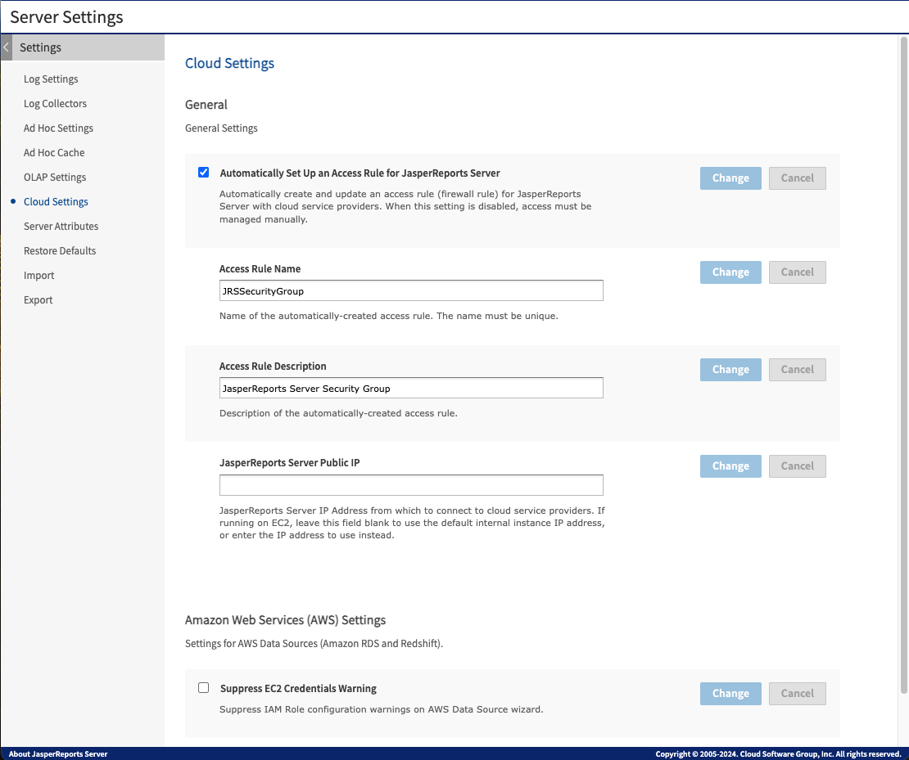

# Using the Cloud Settings Page

The cloud settings page enables you to change Security Group settings without restarting the server. This page is accessible only if you are logged in as a `superuser`.

To reach the AWS Settings page

1.  Click **Manage \> Server Settings**. The **Log Settings** page appears.
2.  Click **Cloud Settings** in the left menu. The **Cloud Settings** page appears.

*Figure 1: Cloud Settings Page*

On this page you can enable AWS Security Group changes for the following settings:

- Access Rule Name
- Access Rule Description
- JasperReports Server Public IP
- Suppress EC2 Credentials Warning

!!! note

    There is one AWS DB Security Group (using IP address) in each RDS region, per JasperReports Server instance. The security group allows connections from the JasperReports Server instance to the specified AWS database instance.

**Automatically Set Up an Access Rule for JasperReports Server**: This checkbox is generally left checked to allow JasperReports Server to use the instance credentials it assumes from the IAM role or the Access\Secret keys provided in AWS Datasource to grant itself access to RDS and Redshift data services. For example, let us say you stop your EC2 instance with JasperReports Server on Friday. When you restart it on Monday, the instance gets a new IP address. JasperReports Server then re-grants itself access to RDS. If you want to manage the security groups manually, clear this box.

**Access Rule Name**: JasperReports Server uses this security group name when creating security groups to support AWS data sources. The EC2 instance ID is appended to this name when your JasperReports Server instance is running on EC2. When running outside of EC2, make sure that the security group name is unique for each instance of JasperReports Server to ensure that IP addresses are properly granted access to the appropriate database instances.

**Access Rule Description**: This text is the description of the security group or groups in the AWS console.

**JasperReports Server Public IP:** Most users on EC2 should leave the field empty. On EC2, JasperReports Server determines the IP address automatically. If you are running JasperReports Server outside of EC2, determine your IP address and enter it in this field. It is also possible with complex EC2 topology involving Virtual Private Clouds (VPCs) that you need to provide your IP address manually.

**Suppress EC2 Credentials Warning**: If your JasperReports Server instance was created with no IAM role, when you go to the data source wizard to add a data source with EC2 credentials you get a warning that no proper role is set. Checking this box suppresses the warning and disables the option.
