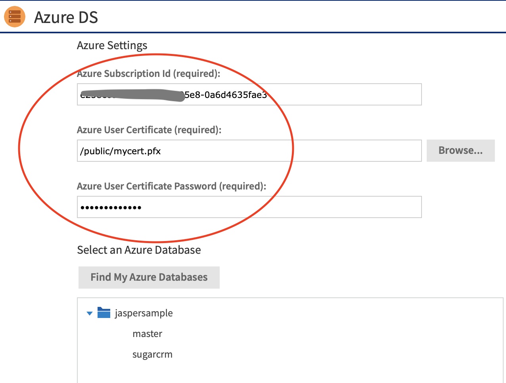
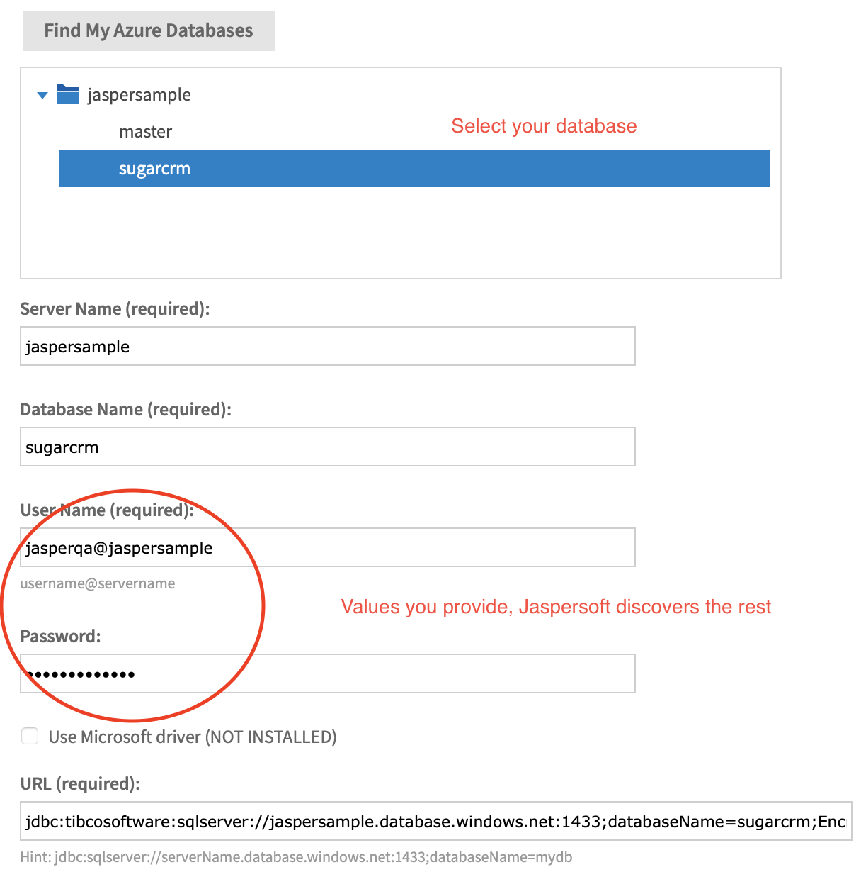
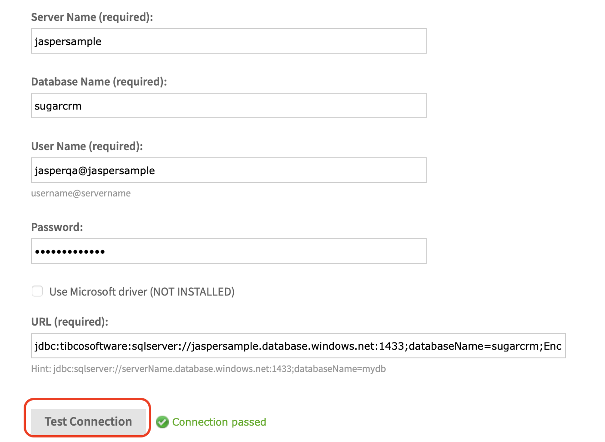
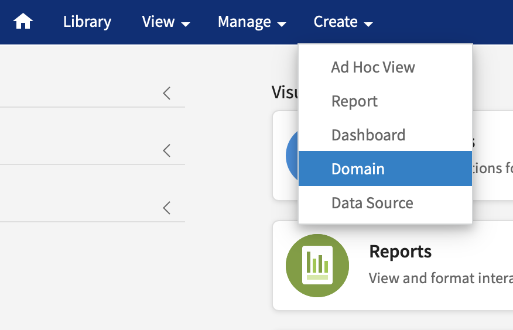
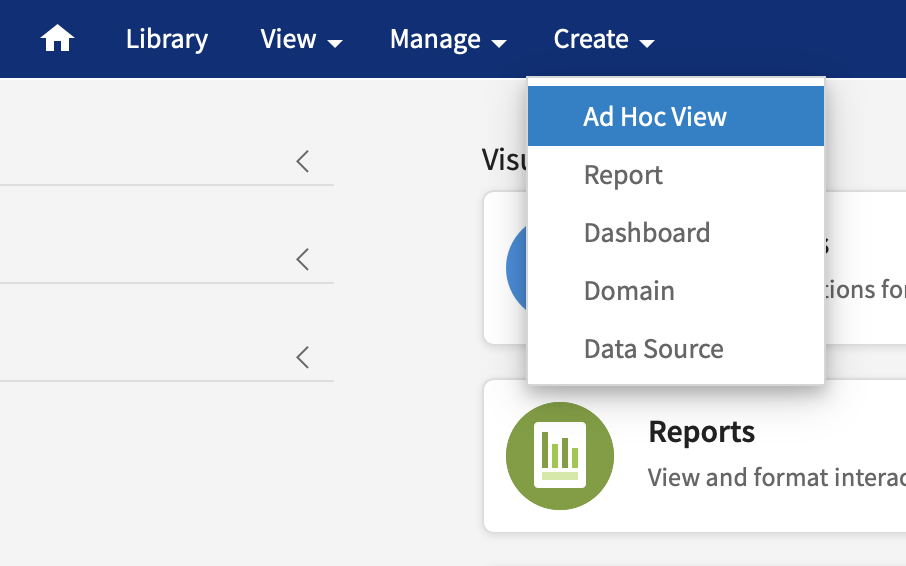

# Connecting to Azure SQL Database

!!! info "Before you begin"

    Run JasperReports Server and log in as a superuser.

JasperReports Server can discover and connect to Azure SQL DataSource using the **Find My Azure Databases** feature. Perform the following steps to connect to Azure SQL Database.

1.  From the JasperReports Server main menu, go to Create \> Data Source \> Azure SQL Data Source.

    

    Data Source type

2.  Use Azure Subscription and Certificate credentials. The data source type should be set to Azure SQL. 
    Enter your information in the Azure Subscription Id, Azure User Certificate, and Certificate Password fields, then click the Find My Azure Databases button. If Azure subscription and certificate credentials are not available, see the [Additional Connection Possibilities](https://community.jaspersoft.com/jaspersoft-aws/connect#additional) section.

    

3.  Enter Database connection information. JasperReports Server can detect your Azure SQL Database data sources when you enter the Subscription credentials. It pre-populates the Server Name, Database Name to form the URL. 
    Enter the database username and password. For security reasons, Azure does not store these credentials, so Jaspersoft cannot retrieve them.

    

4.  Test the connection. 
    It is best practice to always test your connection before saving the Datasource.

    

5.  Create a Domain. The Jaspersoft metadata layer is called **Data Domains**. From the main menu, go to Create \> Domain 
    Follow the domain creation wizard to build a domain.

    

6.  Analyze your data. 
    From the main menu, go to **Create \> Ad Hoc View**. Find your newly created domain and use the ad hoc environment to begin analyzing your data.

     
