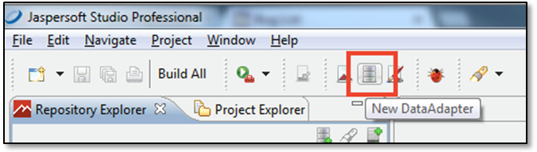
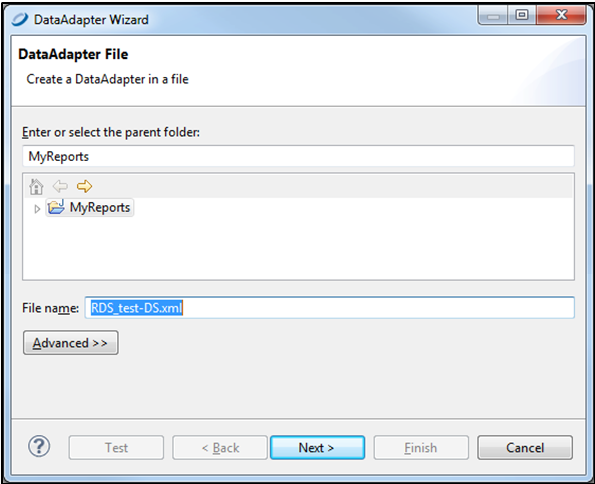
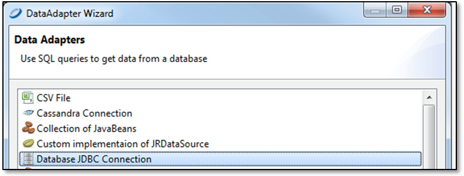
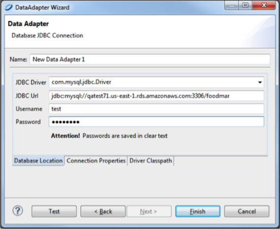
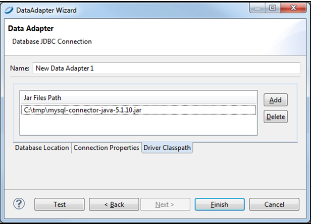
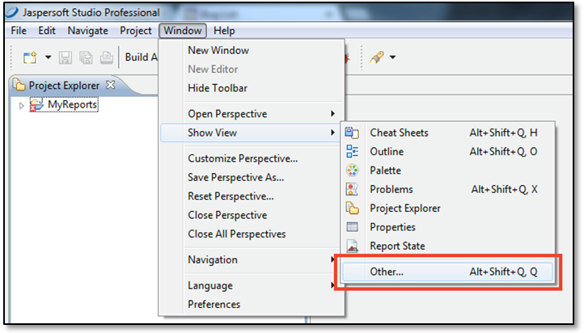
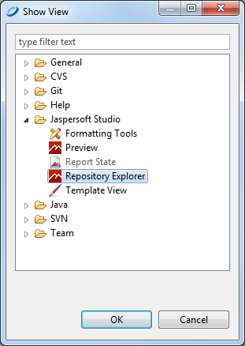
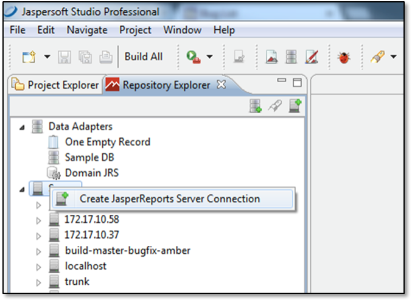
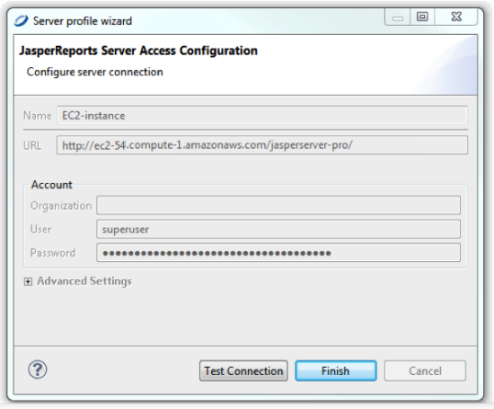

# Connecting Jaspersoft Studio to Your Data

1.  Create a data adapter (called data source in Jaspersoft Studio).

    

2.  In Jaspersoft Studio, click the **New Data Adapter** icon to display the DataAdapter wizard.

    

3.  Name your DataAdapter and click **Next**.

    

4.  Select the data source type. For Amazon RDS and Redshift, use JDBC. Then, click **Next**.

    

5.  Add the JDBC Driver. You may need to search the web for one that corresponds to RDBMS or other technology on your Azure instance.

6.  Enter the JDBC URL. This is the Endpoint URL from your Azure dashboard (including the port) and database type.

7.  On the Driver Classpath tab, select the local path of the driver.

    

8.  Test the connection. You need to connect to the Jaspersoft Studio repository to manage and schedule reports.

## Defining Repository Explorer Connection

1.  In Jaspersoft Studio, select **Window \> Show Views \> Other**.

    

2.  Select **Repository Explorer**.

    

3.  Select the URL of the instance.

4.  Right-click the name of your instance to create a JasperReports Server repository connection.

    

5.  Fill in the URL of the instance, but do not add the port ID number. At the end of the path include `/jasperserver-pro/`. 

    

<!-- -->

1.  See the Jaspersoft Studio documentation for more information about creating reports. For online training and tutorials, visit [Jaspersoft Community](http://community.jaspersoft.com/wiki/jaspersoft-studio-tutorials-archive). 
