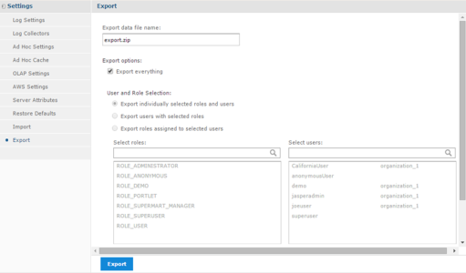
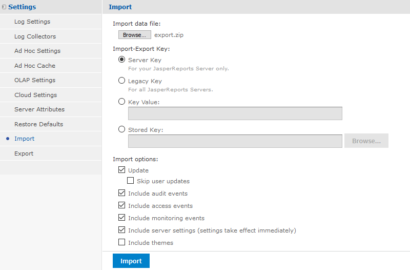

# Upgrading Your Azure Instance or Jaspersoft Version

!!! info "Before you begin"

    Before updating your Azure instance or Jaspersoft version, perform the following actions:

1.  Export your repository.
2.  Update the instance to accommodate a different instance size or to move to a different version of JasperReports Server.
3.  Import your repository into your new instance.

After the upgrade, reapply any customizations you made to the instance outside of the user interface.

!!! note

    You must be logged in as a `superuser` to upgrade your Azure instance.

1.  Navigate to **Manage \> Server Settings**.

2.  Click **Export** in the left column. The Export window is displayed.

    

3.  Name your export data file and select the items to export. Select **Export everything** or select specific items.

4.  Click the **Export** button. You see a message that your export is successful, and your file is saved to your default download location. If you are using a yearly subscription, you cannot run two instances on the same subscription.

    !!! note

        - Stop the current instance before creating the new one. From the Azure portal, select **Virtual machines** to see the status of all of your instances. Select the instance you want to shut down. Select **Stop** to shut down the instance.
        - Using the command line js-export gives more options, such as generation of keys and passwords that can be used for importing back into JasperReports Server.

5.  Back up your server keystore by copying the .jrsks & .jrsksp. files in the home directory of user.

    !!! note

        The properties of these files need to be the same if needed.

6.  Create a new instance that uses the latest version of Jaspersoft for Azure. For instructions on creating an instance, see Creating a VM from .vhd file. You can also find more information on keystore files in the *TIBCO JasperReports Server Security Guide*.

7.  When a new VM is generated, it creates new keystore files. If you need to use the existing keystore files, make sure that your original keys are available in the new server keystore. You can either create the VM with a copy of the keystore, so that it uses the same keys as the original server, or you can create the VM with new keys and then add the original import-export key.

8.  Log in to your new instance as a superuser.

9.  Navigate to **Manage \> Server** Settings.

10. Click **Import** in the left column. The Import window is displayed.

    

11. Click the **Choose File** button, and select the file you exported in Step 4.

12. Select your import options.

13. Click the **Import** button.

14. If you have customized your instance outside the user interface, reapply your changes.

!!! note

    Installing JasperReports Server automatically generates encryption keys that reside on the file system. These keys are stored in a dedicated TIBCO Jaspersoft keystore. Make sure this keystore is properly secured and backed up. For more information, see the JasperReports Server Security Guide.

# Retrieving Logs

For log collection, run the following command:

`/opt/jaspersoft/tomcat/logs/`

# Stopping and Restarting Tomcat

- To stop Tomcat, run the following command: `sudo service tomcat stop/start`
- To restart Tomcat, run the following command: `sudo service tomcat start`
