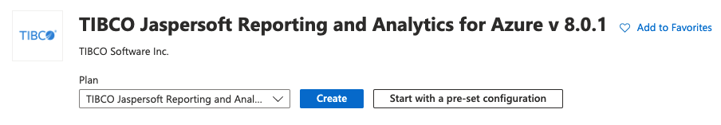

# Other VM Requirements

For additional credentials required for logging into JasperReports Server, go to

`/home/jasperserver/bitnami_credentials`.

## Launching Jaspersoft VM on Azure

!!! info "Before you begin"

    Before launching the Jaspersoft VM from Azure Marketplace, perform the following actions:

    - Microsoft Azure Account. Do not have an Azure account? [Sign up here](https://azure.microsoft.com/en-us/account/).
    - [Certificate](https://docs.microsoft.com/en-us/azure/key-vault/certificates/tutorial-import-certificate) is required to connect to Azure SQL Databases for security. Do not have a Key Pair created? [Generate one](https://docs.microsoft.com/en-us/azure/vpn-gateway/vpn-gateway-certificates-point-to-site-linux)
    - Existing Jaspersoft annual subscription (needed for BYOL)
    - Recommended starting VM Size is 4VCPUs.

1.  In Azure Marketplace, perform the following steps: 
    To find Jaspersoft on the Azure Marketplace, type Jaspersoft in the search field and press enter. The search result displays all the Jaspersoft offerings.
    1.  Select TIBCO Jaspersoft Reporting and Analytics for Azure. TIBCO Jaspersoft Reporting and Analytics for Azure screen is displayed.

    2.  Select any of the following options to launch the VM.

        - **Create**

        - **Start with a pre-set configuration**

          

        Selecting the **Create** initiates the Create a Virtual Machine wizard and **Start with a pre-set configuration** lets you customize your VM.

    3.  To start the pre-set configuration, click the **Start with a pre-set configuration** button.

    4.  On the **Choose recommended defaults that match your workload** wizard, select a workload environment.
        - Dev/Test
        - Production

    5.  Select one of these workload types.
        - General Purpose(D-series)
        - Memory optimized(E-series)
        - Compute optimized(F-series)

    6.  After you select the workload environment and workload type, click **Continue** to create a VM.
2.  Perform the following steps for installation.
    1.  On the **Create a Virtual Machine** wizard, select a resources group or click **Create new link** to create a resource group for your deployment - this gathers all the resources together in one folder.

    2.  Set a Virtual Machine name and pick a region to launch an instance of Jaspersoft for Azure.

    3.  Select VM Size - 4V CPUs with 16 GB RAM.

    4.  Select either **SSH public key** or **Password** for authentication type. You can download the SSH public key at the end of the creation process, and for Password, enter username and password.

    5.  On the Disk tab, set the **OS disk type** and select **Premium SSD**.

    6.  Enable HTTP and HTTPS ports. By default port 22 is selected. Also select port HTTP (80) and HTTPS (443) from the list in the **Select inbound ports**.

        !!! note

            Authorized users can access the port 22.

    7.  Click the **Next: Review + create** button. The **Review + create** page displays the summary of the your configuration.

    8.  Click **Create** to generate the VM. It takes some time for the instance to complete the build process, even though Azure displays the instance has been generated.

    9.  When the installation is completed, go to your **Resources Group** and select the VM that was created. On the VM Page, find **Public IP address**, which is the endpoint that you can log in to your new JasperReports Server installation.

        !!! note

            If a Public IP address is being used and the Jaspersoft Welcome page does not open, then the VM is still in process.

    10. On the J**aspersoft Welcome Screen**, register for the Jaspersoft Studio license and support. Change your first time credentials on the **Login Page**.
3.  Upload your license (for BYOL). 
    On obtaining a license from Jaspersoft, please reference this article to learn how to upload your Jaspersoft license.
