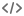
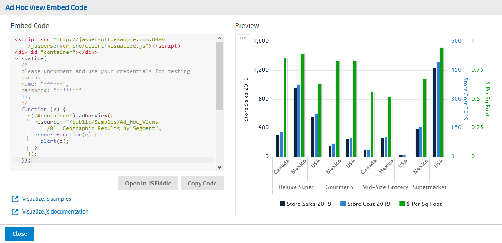

# API Reference - adhocView

The `adhocView` function displays an Ad Hoc view that allows users to interact with tables, crosstabs, and charts in the target container.

As of JasperReports Server 7.0, Visualize.js can render interactive Ad Hoc views in your web apps. In Visualize.js, only the table, crosstab, or chart of the Ad Hoc view is displayed, not the fields or filter panels. The server generates the user interface (UI) of an Ad Hoc view. You can also customize the appearance and behavior of the Ad Hoc view by accessing hyperlinks and setting event listeners.

This chapter contains the following sections:

- Ad Hoc View Properties
- Ad Hoc View Functions
- Ad Hoc View Data Structure
- Rendering an Ad Hoc View
- Getting the Embed Code of an Ad Hoc View
- Setting the Visualization Type
- Setting Ad Hoc View Filters
- Accessing Ad Hoc View Hyperlinks

## Ad Hoc View Properties

The properties structure passed to the `adhocView` function determines the view to be displayed and its initial state. It is defined as follows:

```
{
  "type": "object",
  "properties": {
    "server": {
      "type": "string",
      "description": "Url to JRS instance."
    },
    "resource": {
      "type": "string",
      "description": "Report resource URI.",
      "pattern": "^/[^/~!#\\$%^|\\s`@&*()\\-+=\\[\\]:;\"'<>,?/\\|\\\\]+(/[^/~!#\\$%|\\s`@&*()+=\\[\\]:;\"'<>,?/\\|\\\\]+)*$"
    },
    "container": {
      "oneOf": [
        {
          "type": "object",
          "additionalProperties": true,
          "description": "DOM element to render report to"
        },
        {
          "type": "string",
          "description": "CSS selector for container to render report to."
        }
      ]
    },
    "autoresize": {
      "type": "boolean",
      "description": "Automatically resize Ad Hoc View on browser window resize",
      "default": true
    },
    "canvas": {
      "type": "object",
      "properties": {
        "type" :{
          "description": "Type of visualization",
          "enum": [
            "Table", "Crosstab", "Bar", "Column", "Line", "Area", "Spline",
            "AreaSpline", "StackedBar", "StackedColumn", "StackedLine", "StackedArea",
            "StackedSpline", "StackedAreaSpline", "StackedPercentBar", "StackedPercentColumn",
            "StackedPercentLine", "StackedPercentArea", "StackedPercentSpline",
            "StackedPercentAreaSpline", "Pie", "DualLevelPie", "TimeSeriesLine",
            "TimeSeriesArea", "TimeSeriesSpline", "TimeSeriesAreaSpline", "ColumnLine",
            "ColumnSpline", "StackedColumnLine", "StackedColumnSpline", "MultiAxisLine",
            "MultiAxisSpline", "MultiAxisColumn", "Scatter", "Bubble", "SpiderColumn",
            "SpiderLine", "SpiderArea","HeatMap", "TimeSeriesHeatMap", "SemiPie",
            "DualMeasureTreeMap", "TreeMap", "OneParentTreeMap"
          ]
        },
        "chart": {
          "type": "object",
          "additionalProperties": false,
          "description": "Properties of Ad Hoc View's chart",
          "properties":
        }
      }
    },
    "linkOptions": {
      "type": "object",
      "description": "adhocView's parameters values",
      "properties": {
        "beforeRender": {
          "type": "function",
          "description": "A function to process link - link element pairs."
        },
        "events": {
          "type": "object",
          "description": "Backbone-like events object to be applied to JR links",
          "additionalProperties" : true
        }
      }
    },
    "loadingOverlay": {
      "type": "boolean",
      "description": "Enable/disable report loading overlay",
      "default": true
    },

    "showTitle": {
      "type": "boolean",
      "description": "Option to show/hide Ad Hoc view title",
      "default": true
    },

    "params": {
      "type": "object",
      "description": "Ad Hoc View's parameters values",
      "additionalProperties": {
        "type": "array"
      }
    }
  },
  "required": ["server", "resource"]
}
```

## Ad Hoc View Functions

The `adhocView` function exposes the following functions:

```
/**
 * @param {Object} properties - Ad Hoc View properties
 * @constructor
 */
function adhocView(properties)

//Special  getters

/**
 * Get any result after invoking run action
 * @returns any data which supported by this bi component
*/
adhocView.prototype.data = function();

//Actions

/**
 * Perform main action for bi component
 * Callbacks will be attached to  deferred object.
 *
 * @param {Function} callback - optional, invoked in case of successful run
 * @param {Function} errorback - optional, invoked in case of failed run
 * @param {Function} always - optional, invoked always
 * @return {Deferred} dfd
 */
adhocView.prototype.run = function(callback, errorback, always);

/**
 * Render ADV to container, previously specified in property.
 * Clean up all content of container before adding Ad Hoc View's content
 * @param {Function} callback - optional, invoked in case successful export
 * @param {Function} errorback - optional, invoked in case of failed export
 * @param {Function} always - optional, optional, invoked always
 * @return {Deferred} dfd
 */
adhocView.prototype.render = function(callback, errorback, always);

/**
 * Refresh ADV
 * @param {Function} callback - optional, invoked in case of successful refresh
 * @param {Function} errorback - optional, invoked in case of failed refresh
 * @param {Function} always - optional, invoked optional, invoked always
 * @return {Deferred} dfd
 */
adhocView.prototype.refresh = function(callback, errorback, always);

/**
 * Destroy ADV representation if any, leave only
 * properties
 * @param {Function} callback - optional, invoked in case of successful cleanup
 * @param {Function} errorback - optional, invoked in case of failed cleanup
 * @param {Function} always - optional, invoked optional, invoked always
 * @return {Deferred} dfd
 */
adhocView.prototype.destroy = function(callback, errorback, always);

return adhocView;
```

## Ad Hoc View Data Structure

The data object of an `adhocView` contains metadata about the Ad Hoc view:

```
{
  "title": "Ad Hoc View Data",
  "description": "A JSON Schema describing Ad Hoc View Data",
  "$schema": "http://json-schema.org/draft-04/schema#",
  "type": "object",
  "properties":{

    "metadata": {
      "type": "object",
      "description": "Set of available parameters",
      "properties": {
        "availableVisualizationTypes": {
          "type": "array",
          "description": "List of available visualization types, which can be setted as canvas.type",
          "enum": ["Crosstab", "Table", "Column", "StackedColumn",
                  "StackedPercentColumn", "Bar", "StackedBar",
                  "StackedPercentBar", "SpiderColumn", "Line",
                  "Spline", "Area", "StackedArea", "StakeckedPrecentArea",
                  "AreaSpline", "SpiderLine", "SpiderArea",
                  "Pie", "SemiPie", "HeatMap"]
        },
        "inputParameters": {
          "type": "array",
          "description": "List of available filters",
          "items": {
            "type": "object",
            "properties": {
              "id": {
                "type": "string",
                "description": "Unique id which can be used as filter name"
              },
              "type": {
                "type": "string",
                "description": "Type of filter data",
                "enum": ["boolean", "byte", "short", "integer", "bigInteger", "timestamp",
                        "float", "bouble", "bigDecimal", "string", "date", "time"]
              }
            },
            "required": ["id"]
          }
        },
        "outputParameters": {
          "type": "array",
          "description": "List of expected fields in hyperlink"
          "items": {
            "type": "object",
            "properties": {
              "id": {
                "type": "string",
                "description": "Name of field in hyperlink"
              },
              "type": {
                "type": "string",
                "description": "Type of field data",
                "enum": ["boolean", "byte", "short", "integer", "bigInteger", "timestamp",
                        "float", "bouble", "bigDecimal", "string", "date", "time"]
              }
            },
            "required": ["id", "type"]
          }
        }
      }
    },
  },
  "required": ["metadata"]
}
```

## Rendering an Ad Hoc View

As with reports and dashboards, Ad Hoc views run on the server and are rendered in a container on your page. First, you create an `adhocView` object and then set its properties. As with other objects, the resource property determines which Ad Hoc view to run, and the container property determines where it appears on your page.

```
var ahv = v.adhocView({
    resource: "/public/Sample_AdHocView",
    container: "#AdHocContainer",
    success: function() { console.log("rendered"); },
    error: function(e) { alert(e); }
});
```

Ad Hoc views are displayed in Visualize.js in the same state they are saved on the server. Only the table, crosstab, or chart of an Ad Hoc view is rendered in Visualize.js, not the design elements. Visualize.js is intended to display data, not access the underlying data structures used to create the Ad Hoc view.

However, the rendering of an Ad Hoc view includes the  icon in the top left corner that allows users to switch between table, crosstab, and chart type. For example, if the Ad Hoc view appears as a table, the user can switch the view to a crosstab or chart. The user may also change the type of chart, though not all chart types work with the data in a given Ad Hoc view.

If you wish to disable the chart selector, specify the following property on the container:

```
#AdHocContainer .jr-mAdhoc-visualization-launcher.jr {
  display: none;
}
```

!!! note

    Unlike a report that is meant to have a static layout and look the same every time it runs, an Ad Hoc view is more of a data exploration tool that users edit often and may save in an intermediate state. In order to have consistent results, you should design and save specific Ad Hoc views that are relevant to your visualize.js user, and not allow other users on the server to modify them.

    Alternatively, you can use the dynamic nature of Ad Hoc views, for example to explicitly display the latest data visualization that has been designed and saved on the server. In this case, your Visualize.js app should label the container so that your users know the content of the view may change.

In the following example, the adhocView object is created and initialized first, and then it runs and renders later on demand in the specified container.

```
var ahv = v.adhocView({
    resource: "/public/Sample_AdHocView",
    runImmediately: false
});

ahv
    .run()
    .done(function() {
        this
            .container("#AdHocContainer")
            .render()
            .done(function() { console.log("rendered"); })
            .fail(function(e) { alert(e); });
    })
    .fail(function(e) { alert(e); });
```

Of course, you can add styles to change the size and placement of your Ad Hoc view container, as shown in the following CSS sample.

```
#AdHocContainer {
  width: 800px;
  height: 400px;
  padding-left: 50px;
  position: relative;
}
```

There are two more functions to manage your Ad Hoc view. Refresh will update the rendered view, and destroy will remove it, leaving only the `adhocView` object with its properties set.

```
var ahv = v.adhocView({
    resource: "/public/Sample_AdHocView",
    container: "#AdHocContainer"
});

ahv.refresh();

...

ahv.destroy();
```

## Getting the Embed Code of an Ad Hoc View

As of JasperReports Server 7.9, the server can provide the code to embed any Ad Hoc view displayed in the Ad Hoc Editor. This lets you browse the repository, preview an Ad Hoc view, and get its basic embed code. You can paste this code directly in your application, and then edit it for your needs. You can also open the view's embed code in JSFiddle to see the effect of your edits in real time, then copy the final code from JSFiddle.

To copy the embed code of an Ad Hoc view:

1.  Log into JasperReports Server and browse the repository to find the Ad Hoc view you want to embed.
2.  Open the Ad Hoc view so that it is displayed in the server's Ad Hoc Editor.
3.  Click the  icon in the menu bar to view the embed code. If this icon is not visible in the menu bar, click the  icon to toggle design mode first.
4.  The **Ad Hoc Embed Code** dialog shows you the Visualize.js code and a preview of the view as it is currently saved. Select **Copy Code** to copy the entire code block to your clipboard. You can also highlight selected parts of the code and use Ctrl-C (Command-C on Mac OS), for example if you want only the main function.

|                                                                      |
|----------------------------------------------------------------------|
|  |
| *Figure 1: The Embed Code of an Ad Hoc View*                         |

The code sample includes comments where you can enter credentials for authentication. You should also change the name of the container to match the one in your application.

1.  Alternatively, select **Open in JSFiddle** to load the same code into a new Fiddle, an online JavaScript viewer and interactive editor. This lets you modify the JavaScript or HTML, and add CSS if desired, then see the results in real time.

As shown by the preview, Visualize.js displays the table, crosstab, or chart of the Ad Hoc views without any design elements such as data selection panel, layout band, or filter panel. Regardless of any changes you make in the Ad Hoc editor, Visualize.js always displays the latest saved version of an Ad Hoc view, as determined by the repository URL in the embed code.

When displayed through Visualize.js, an Ad Hoc view includes the  icon in the top left corner that allows users to switch between table, crosstab, and chart type, though not all chart types work with the data in a given Ad Hoc view. This selector changes the appearance of the Ad Hoc view in the user's current session, but the changes can't be saved. For every new session, Visualize.js displays the default appearance of the Ad Hoc view.

## Setting the Visualization Type

Visualize.js allows your code to also interact programmatically with the Ad Hoc view, to customize its appearance in response to other events or inputs. The following sections give examples of how to update the appearance of the Ad Hoc view through your code.

An Ad Hoc view has a default visualization type, either table, crosstab, or chart that is determined by its creator and saved in the repository. When you run and render an Ad Hoc view, your users will see the visualization type of the view as it was last saved. Through Visualize.js, you can change the visualization type, for example so that users first see a crosstab or a specific type of chart.

!!! note

    The same data can usually be displayed in tables, crosstabs, and charts, but it often appears slightly differently. Different charts require different data series, so not all chart types may be compatible with the data that is currently selected in the Ad Hoc view. Before changing the visualization type, you should make sure it is compatible with your Ad Hoc view.

The following example shows how your code can set the visualization type by modifying the `canvas` object of your `adhocView` object during initialization.

```
var ahv = v.adhocView({
    resource: "/public/Sample_AdHocView",
    container: "#AdHocContainer",
    canvas: {
        type: "Pie"
    },
    error: function(e) { alert(e); }
});
```

You can also let the Ad Hoc view render with the default visualization and then change to a different the visualization type at a later time:

```
var ahv = v.adhocView({
    resource: "/public/Sample_AdHocView",
    container: "#AdHocContainer",
    error: function(e) { alert(e); }
});
...
ahv.canvas({
        type: "Crosstab"
}).run();
```

The available visualization types and charts are listed by the `type` property of the `canvas` object:

```
    "canvas": {
      "type": "object",
      "properties": {
        "type" :{
          "description": "Type of visualization",
          "enum": [
            "Table", "Crosstab", "Bar", "Column", "Line", "Area", "Spline",
            "AreaSpline", "StackedBar", "StackedColumn", "StackedLine", "StackedArea",
            "StackedSpline", "StackedAreaSpline", "StackedPercentBar", "StackedPercentColumn", "StackedPercentLine",
            "StackedPercentArea", "StackedPercentSpline", "StackedPercentAreaSpline", "Pie",
            "DualLevelPie", "TimeSeriesLine", "TimeSeriesArea", "TimeSeriesSpline",
            "TimeSeriesAreaSpline", "ColumnLine", "ColumnSpline", "StackedColumnLine",
            "StackedColumnSpline", "MultiAxisLine", "MultiAxisSpline", "MultiAxisColumn",
            "Scatter", "Bubble", "SpiderColumn", "SpiderLine", "SpiderArea","HeatMap", "TimeSeriesHeatMap",
            "SemiPie", "DualMeasureTreeMap", "TreeMap", "OneParentTreeMap"
          ]
        },
```

## Setting Ad Hoc View Filters

Another way to interact programmatically with Ad Hoc views is to get and set any filters that are defined in the view. Note that unlike a report, the set of available filters in an Ad Hoc view may change if the view is modified on the server. Once an Ad Hoc view is rendered, your code should read the current filters and values before setting them.

As with reports and dashboards, filter values are called parameters and exposed through the `params` object. In the following example, the Country filter is known to be saved in the Ad Hoc view, so it can be set during initialization of the view, just before it is run and rendered.

```
var ahv = v.adhocView({
    resource: "/public/Sample_AdHocView",
    container: "#AdHocContainer",
    params: {
        Country: ["USA", "Mexico", "Canada"]
    },
    error: function(e) { alert(e); }
});

// read back parameter/filter values
ahv.params(); // returns { Country: ["USA", "Mexico", "Canada"] }

// if you know that filters won't change, you can set new values
ahv.params({ Country: ["Canada"] }).run();
```

You can use the `metadata.inputParameters` property of the `data` object to obtain the name and type of each current filter. The structure of the `metadata.inputParameters` is shown in Ad Hoc View Data Structure.

In the next example, the code requests the current filter values, processes them, and then uses the information about the current filters and values to set different values, in this case a different selection:

```
var ahv = v.adhocView({
    resource: "/public/Sample_AdHocView",
    container: "#AdHocContainer",
    error: function(e) { alert(e); }
});

// read current paramter/filter names
currentFilters = ahv.data().metadata.inputParameters;

// read current parameter/filter values
currentValues = ahv.params(); // returns { State: ["California", "Oregon", "Washington"] }

// process current filters here
// now set a new filter value
ahv.params({ State: ["Oregon"] }).run();
```

## Accessing Ad Hoc View Hyperlinks

Hyperlinks, or simply links, are elements of the Ad Hoc view that your code can interact with. These are generally the contents of cells in a table, for example a field name in a column header or the value in a cell. As the user interacts with the Ad Hoc View, you can capture events on these elements such as clicks and then take action using the values of the element.

The elements that you can access are called `outputParameters`, and their structure is defined in the Ad Hoc View Data Structure. You can use the `metadata.outputParameters` property of the `data` object to obtain the name and type of each hyperlink.

```
var ahv = v.adhocView({
    resource: "/public/Sample_AdHocView"
    container: "#AdHocContainer",
    success: function () {
      console.log(ahv.data().metadata.outputParameters); // Expected fields in hyperlink
    }
});

ahv.canvas({
        type: "Crosstab"
}).run();
```

Using the `linkOptions` properties, you can access the events on links, use the link values, and take other actions. The following example shows how to add a listener that displays link values in the console:

```
var ahv = v.adhocView({
    resource: "/public/Sample_AdHocView",
    linkOptions: {
        events: {
            click: function (el, link, defaultHandler, tableLink) {
                console.log(link); // prints the link data
                console.log(tableLink); // prints the table's link data
            },
            mouseover: function (el, link, defaultHandler, tableLink),
            mouseenter: function (el, link, defaultHandler, tableLink),
            mouseleave: function (el, link, defaultHandler, tableLink)
        }
    }
});
```

You can use the `beforeRender` property of the `linkOptions` to modify the appearance of elements in the Ad Hoc view. In the following example, every element is printed to the log and given the same color, but you could implement logic to highlight high or low values based on other thresholds.

```
var ahv = v.adhocView({
    resource: "/public/Sample",
    linkOptions: {
        beforeRender: function (linkToElemPairs) {
            linkToElemPairs.forEach(function (pair) {
                console.log(pair.element); // prints html element reference
                console.log(pair.link); // prints link's data related to current element

                pair.element.style.backgroundColor = "lightblue"; // set lightblue background color to each hyperlink
            });
        }
    }
});
```

The following structure defines what properties are available for values in an Ad Hoc table, also called an Ad Hoc hyperlink:

```
{
    "title": "Adhoc Hyperlink",
    "description": "A JSON Schema describing embeddable adhoc hyperlink",
    "$schema": "http://json-schema.org/draft-04/schema#",
    "type": "object",
    "properties":{
        "Measures": {
            "type": "array",
            "description": "An array of measure names",
            "items": {
                "type": "string",
                "description": "Measure name"
            }
        }
    },
    "additionalProperties": {
        "type": "string",
        "description": "Key is name of field and value is value of it"
    }
}
```

The following structure defines what properties are available for the table element of an Ad Hoc view, also called an Ad Hoc Table hyperlink. In particular, this structure gives your code access to the rows, columns, groups, and aggregation information about the Ad Hoc table:

```
{
    "title": "Extended Adhoc Hyperlink",
    "description": "An Extended JSON Schema describing embeddable adhoc hyperlink",
    "$schema": "http://json-schema.org/draft-04/schema#",
    "type": "object",
    "properties":{
        "id": {
            "type": "string",
            "description": "Hyperlink id, reflected in corresponding attribute in DOM"
        },
        "linkType": {
            "type": "string",
            "description": "Hyperlink type",
            "enum": ["HEADER", "DATA", "GROUP_LABEL", "GROUP_TOTAL", "GRAND_TOTAL"]
        },
        "value": {
            "type": "string",
            "description": "Hyperlink value, which is displayed to user"
        },
        "column": {
            "type": "object",
            "description": "Map of aggregated information related to whole column",
            "properties": {
                "aggregatedFiledReferences": {
                    "type": "array",
                    "items": {
                        "type": "string",
                        "description": "Measure name"
                    }
                },
                "aggregationFormat": {
                    "type": "string",
                    "description": "Format which should be used to display aggregated values"
                },
                "aggregationFormatId" : {
                    "type": "string",
                    "description": "Unique key of aggregation format"
                },
                "aggregationType": {
                    "type": "string",
                    "description": "Type for aggregated value"
                },
                "defaultFunctionName": {
                    "type": "string",
                    "description": "Default aggregation function name"
                },
                "detailFieldReference": {
                    "type": "string",
                    "description": "Reference name to get more details of field"
                },
                "dimension": {
                    "type": "string",
                    "description": "Dimension name"
                },
                "field": {
                    "type": "string",
                    "description": "field name"
                },
                "firstLevelExpansion": {
                    "type": "string",
                    "description": ""
                },
                "format": {
                    "type": "string",
                    "description": "Format which should be used to display value"
                },
                "formatId": {
                    "type": "string",
                    "description": "Unique format id"
                },
                "functionName": {
                    "type": "string",
                    "description": "Name of aggregation function which is set by user"
                },
                "hierarchicalName": {
                    "type": "string",
                    "description": "Field name in schema"
                },
                "horizontalAlign": {
                    "type": "string",
                    "description": "Cell's horizontal alignment",
                    "enum": ["Left", "Center", "Right"]
                },
                "id": {
                    "type": "string",
                    "description": "Reference name to get more details of field"
                },
                "includeAll": {
                    "type": "boolean",
                    "description": "Identify that this is total value"
                },
                "index": {
                    "type": "number",
                    "description": "Column index. Starts form 0"
                },
                "initialValue": {
                    "type": "string",
                    "description": "Initial value of field"
                },
                "kind": {
                    "type": "string",
                    "description": "value type",
                    "enum": ["field", "measure"]
                },
                "label": {
                    "type": "string",
                    "description": "Column label"
                },
                "labelId": {
                    "type": "string",
                    "description": "Column label id"
                },
                "reference": {
                    "type": "string",
                    "description": "Reference name to get more details of field"
                },
                "showSummary": {
                    "type": "boolean",
                    "description": "Show totals for column"
                },
                "timeBalanceFunctionName": {
                    "type": "string",
                    "description": "Time balance function name"
                },
                "type": {
                    "type": "string",
                    "description": "type for value"
                },
                "value": {
                    "type": "string",
                    "description": "raw value, which should be formatted"
                },
                "width": {
                    "type": "number",
                    "description": "Column width"
                }
            }
        },
        "group": {
            "type": "array",
            "description": "Grouping sequence",
            "items": {
                "type": {
                    "$ref": "#/properties/column"
                 }
            }
        },
"row": {
            "type": "object",
            "description": "Items related to whole row",
            "properties": {
                "index": {
                    "type": "number",
                    "description": "Absolute row index in dataset"
                },
                "relativeIndex": {
                    "type": "number",
                    "description": "Relative row index. Index of currently rendered data"
                },
                "cells": {
                    "type": "array",
                    "description": "Cell in row",
                    "items": {
                        "type": {
                            "$ref": "#/properties/column"
                        }
                    }
                }
            }
        }
    },
    required: ["id"]
}
```

The following example displays a lot of information about an Ad Hoc view in the console. You can use a generic script like this to examine your Ad Hoc views and determine which fields and data you can use to add interactive features.

```
visualize({
  auth: {
    name: "superuser",
    password: "superuser"
  }
}, function(v) {
  var ahv = v.adhocView({
    resource: "/public/Samples/Ad_Hoc_Views/01__Geographic_Results_by_Segment",
    container: "#container",
    success: function() {
      console.log("All data available:");
      console.log(ahv.data());

      console.log("Available filters:");
      console.log(determineFilters(ahv.data().metadata.inputParameters));

      console.log("Expected fields in data on click:");
      console.log(determineFilters(ahv.data().metadata.outputParameters));
    },
    error: function(e) {
      console.log(e);
    },
    linkOptions: {
      events: {
        click: function(ev, data, defaultHandler, extendedData) {
          console.log("Click");
          console.log(data, extendedData);
        }
      }
    }
  });
});

function determineFilters(parameters) {
  var res = [];

  for (var i = 0; i < parameters.length; i++) {
    res.push(parameters[i].id);
  }
  return res;
}
HTML:
<script src="http://localhost:8080/jasperserver-pro/client/visualize.js"></script>
<div id="container"></div>
```
