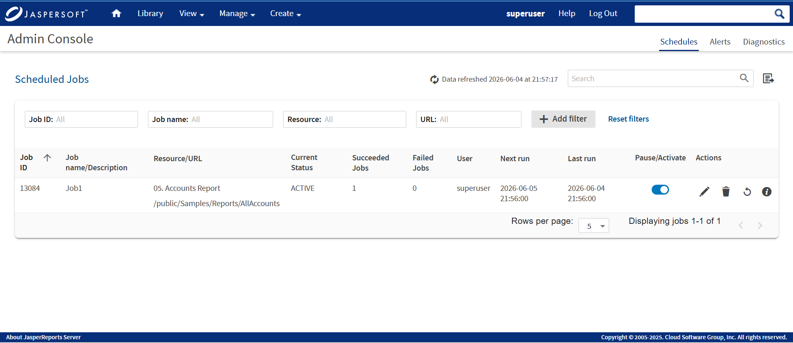
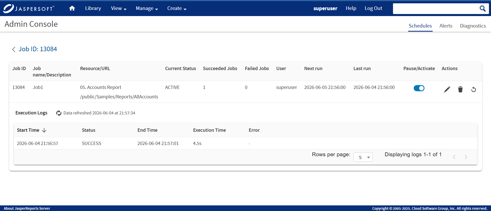
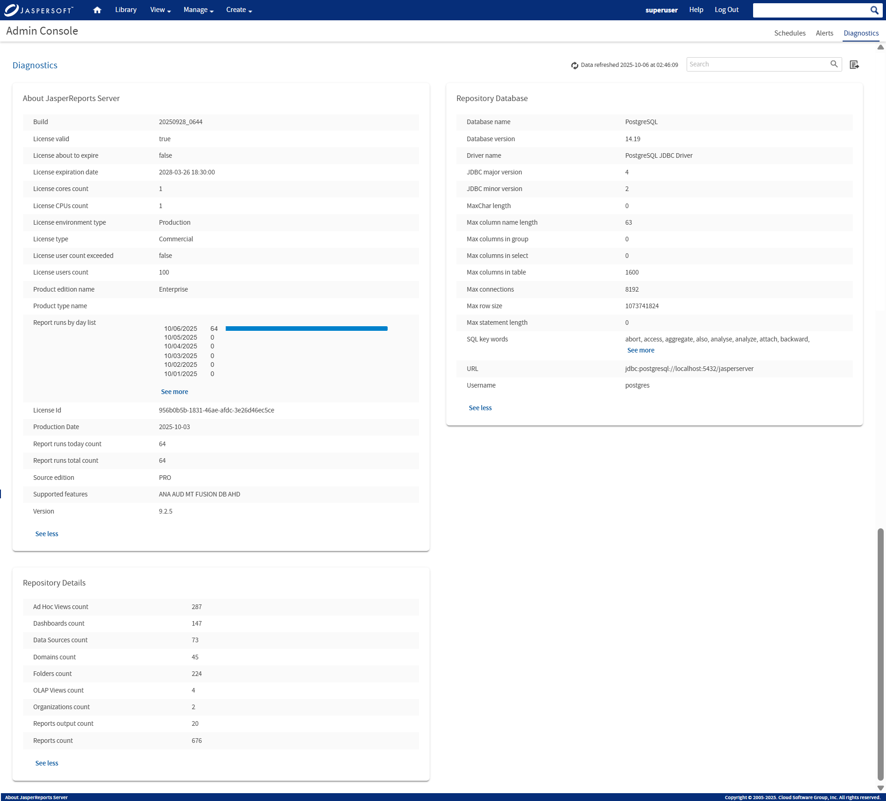

# Admin Console

The Admin Console is a new page for JasperReports Server that allows system admins (`superuser`) and organization admins (`jasperadmin`) with detailed views of **Schedules**, **Alerts**, and **Diagnostic** data.

Users, other than administrators, do not have access to the **Admin Console** page and can view the **Schedules, Alerts** and **Diagnostics** details within the **View\>Schedules and Alerts** page. For more information, see the JasperReports Server User Guide.

This chapter contains the following sections:

- Schedules
- Alerts
- Diagnostics

## Schedules Tab

The Schedules tab in the Admin Console page is accessible to the system admins (`superuser`) and organization admins (`jasperadmin`).

### List of All Schedules

All scheduled jobs that the user has defined appear in the Schedules tab of the **Manage\>Admin Console** page. In the **Schedules** page, you can search, sort, add filter, refresh, and download a scheduled report. For more information on these operations, see the List of Scheduled Jobs section in the JasperReports Server User Guide.

*Figure 1: Schedules Page*

Typical users can see only the jobs that they have defined. Administrators can view the jobs defined by all users.

The **Schedules** page shows the following:

| Column Name | Description |
|----|----|
| **Job ID** | The unique identifier of a job. |
| **Job name/Description** | Name of the scheduled job and description. |
| **Resource/URL** | Repository URL of the job. |
| **Current Status** | The status of the job in **NORMAL**, **EXECUTING**, **COMPLETE**, **PAUSED**, **ERROR**, or **UNKNOWN** state. |
| **Succeeded Jobs** | The jobs that are completed successfully without any errors. |
| **Failed Jobs** | The jobs that are triggered but encountered an error and did not complete successfully. |
| **User** | The owner who created the job. |
| **Next run** | Filters by date and time to view the count and list of schedules that will run next at the filtered time. |
| **Last run** | Filters by date and time to view the count and list of schedules that was run last at the filtered time. |
| **Pause/Activate** | Enable or disable the job. |
| **Actions** | Edit, delete, restart the job and show execution logs. |

### Editing a Schedule

To edit a scheduled job for a report

1.  Click **Manage\> Admin Console \> Schedules**.

2.  Click the Edit icon  in the row of the job that you want to update.

3.  Edit the fields in the **Schedule**, **Parameters**, **Output Options**, and **Notifications** tabs.

    !!! note

        See Creating a Schedule section in the JasperReports Server User Guide and repeat from steps 4-10.

4.  Click **Save**. The update occurs immediately.

### Pausing a Job

To stop a job from running without deleting it, disable the job.

To pause a scheduled job:

1.  Click **Manage\>Admin Console \> Schedules**.

2.  In the row of the job that you want to stop, disable the **Pause/Activate** toggle switch.

!!! note

    You can resume the job by enabling the **Pause/Activate** toggle switch. When a stopped job is re-enabled, it waits until the next scheduled time to run.

### Deleting a Job

To delete a scheduled job:

1.  Click **Manage\> Admin Console \> Schedules**.

2.  Click the delete icon  in the row of the job you want to delete. A confirmation dialog with a warning message is displayed to confirm if you want to delete this job.

    If the delete request is sent for the job that is still running, the server completes running the job before deleting it.

3.  Click **Delete** to delete the scheduled job else click **Cancel** to cancel the delete action.

4.  Click **Close** to close the **Scheduled** job panel.

### Showing Execution Logs

The execution logs shows the following:

| Column Name | Description |
|----|----|
| **Start Time** | The exact time when the scheduled job started running. |
| **Status** | Indicates whether the execution was successful or failed. |
| **End Time** | The exact time when the job finished running (whether successfully or with an error). |
| **Execution Time** | The total duration the job took to complete. |
| **Error** | Displays the detailed failure diagnostics for failed jobs |

Execution Logs Page

## Alerts Tab

The **Alerts** tab is the new feature in the **Admin Console** page. You can view the list of all the report alerts in the **Alerts** tab. System admin (`superuser`) and organization admin (`jasperadmin`) have complete access to view report alerts in the Admin Console. The `superuser` can view the list of report alerts for all the users and the `jasperadmin` can view alerts of their respective organization. Other users do not have access to the **Admin Console** page and can only view report alerts of the folders with permissions assigned.

!!! note

    Currently, the **Alerts** tab in the **Admin Console** page is a new beta feature that may not be fully stable or supported. For more information on the Alerts Beta feature, see [Admin Console Beta](https://community.jaspersoft.com/wiki/admin-console).

## Diagnostics Tab

The **Diagnostics** tab in the **Admin Console** page provides a snapshot overview of your entire Jaspersoft system. Only the system admin (`superuser`) can view the diagnostic information. This user interface lets you quickly and easily view the status of license validity date, repository - database, configuration, size, total count of reports run, product details, and so on.

The following figure shows all the diagnostics information that the user has defined appear in the **Diagnostics** tab of the **Manage\>Admin Console** page.

*Figure 2: Diagnostics Page*

The **Diagnostics** page includes the following controls:

| Diagnostics Page Controls | Description |
|----|----|
|  | Displays the latest updated diagnostics information with the recent date and time. |
|  | Displays the search term. |
|  | Downloads the diagnostic information of the report in CSV format. |
| **See more** | Expands the list of information for Report runs by day list, SQL key words, and Repository Details. |
| **See less** | Collapse the list of viewed information for Report runs by day list, SQL key words, and Repository Details. |

The **See more** and **See less** controls lets you expand or collapse the viewed information in the Diagnostics page.

The information of the report displayed in the **Diagnostics** tab can be viewed on the **View\>Repository** page. For more information on the diagnostics, refer to the [Using the Diagnostic Data in Reports](../diagnostics/using_the_diagnostic_data_in_reports.md).
