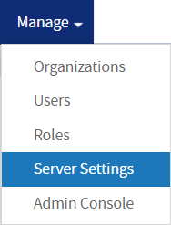
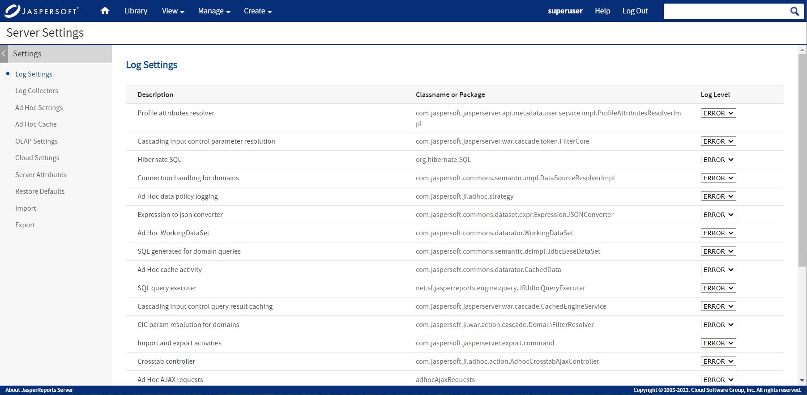
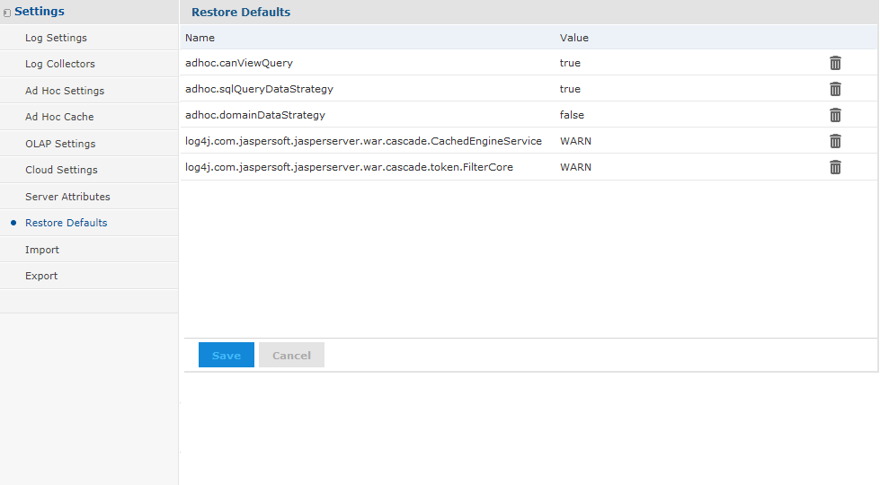

# Configuration Settings in the User Interface

Configuration settings are persistent through server restart, though this wasn't always the case. Some previous versions would reload configuration settings from the server's configuration files.

To make persistent configuration changes through the JasperReports Server user interface

1.  Log in as system administrator (`superuser` by default).

2.  Select **Manage &gt; Server Settings**: 

3.  Choose a category of settings or administrator actions from the left-hand **Settings** panel.

    

    *Figure 1 The User Interface for Configuration Settings*

4.  Find the configuration setting you want to change and edit its value. In the case of log levels, the new value takes effect immediately. In the case of other settings, click **Change** beside the individual setting. 
    The settings and administrator actions are documented in their respective sections:

| Settings | Documentation |
|----|----|
| **Log Settings** | [Configuring System Logs](../diagnostics/configuring_system_logs.md) |
| **Log Collectors** | [Using Log Collectors](../diagnostics/using_log_collectors.md) |
| **Ad Hoc Settings** | [Ad Hoc Query Settings](configuring_ad_hoc.md) |
| **Ad Hoc Cache** | [Ad Hoc Cache Management](configuring_ad_hoc.md) |
| **OLAP Settings** | Jaspersoft OLAP User Guide |
| **Cloud Settings** | [Configuring Cloud Services](configuring_cloud_services.md) |
| **Server Attributes** | [Managing Attributes](../management/managing_attributes.md) |
| **Restore Defaults** | [Restoring Default Settings](#restoring-default-settings) |
| **Import** | [Importing from the Settings](../importexport/through_the_web_ui.md) |
| **Export** | [Exporting from the Settings](../importexport/through_the_web_ui.md) |

## Understanding Persistent Settings

When making changes through the Settings UI, you should understand how persistent settings made in the UI are stored internally and relate to the settings in configuration files:

-   The **Settings** pages display a subset of the settings available in configuration files. Therefore, all settings in the UI also exist in a configuration file.

-   By default, the **Settings** pages display the values of settings that exist in the corresponding configuration file. If you modify only the files and restart the server, your new file settings take effect on the server and are visible in the UI.

-   When you change a value on the **Settings** pages, the new setting takes effect immediately, but the new value is *not* written to the corresponding configuration file. Instead, it's stored in the server's internal database so the value is persistent when the server is restarted.

!!! note

    Only configuration settings that have a value modified on the **Settings** pages of the UI are stored and made persistent in the database.

-   When the server restarts, any stored values take precedence over values for the same settings in the configuration files. However, each setting is independent, so a value that's not modified in the **Settings** UI is read from the configuration files.

-   The **Settings** pages display the values of the settings in effect on the server.

!!! note

    Be aware that the configuration values that appear on the Settings pages are possibly a mixture of values loaded from configuration files and from the persistent storage.

-   Changing a setting that has already been modified updates its value stored internally, even if it is set to the same original value stored in a configuration file. The stored value continues to take precedence over any changes to this setting in the configuration file.

## Restoring Default Settings

If a setting has been modified in the UI, it will remain in persistent storage and always override the corresponding setting in a configuration file. If you want to reset a value so that it is read from the configuration file instead, use the Restore Defaults page.

To restore a default setting

1.  Log in as system administrator (`superuser` by default).

2.  Select **Manage &gt; Server Settings** and choose **Restore Defaults** from the left-hand panel.

    

    *Figure 2 The Restore Defaults Page Containing Persistent Configuration Settings*

    The configuration values on the **Restore Defaults** page represent the settings that have been modified through the UI and are stored in persistent storage.

    !!! note

        The **Restore Defaults** page also includes JDBC drivers configured during the installation or through the data source creation wizard. Do not remove the drivers with `[SYSTEM]` values. For more information, see [Managing JDBC Drivers](../datasources/managing_jdbc_drivers.md).

3.  To restore a setting to its configuration file default, click the  icon beside its current value and confirm.

4.  Click **Save** to make the change permanent. 
    The setting is removed from persistent storage and the value of the setting is restored to its default value from the corresponding configuration file. The next time the server restarts, its value will be read from the configuration file.

!!! note

    The settings listed on the **Restore Defaults** page are those that can be exported to different servers or re-imported after a server upgrade. For more information, see [Importing from the Settings](../importexport/through_the_web_ui.md).
