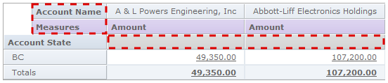
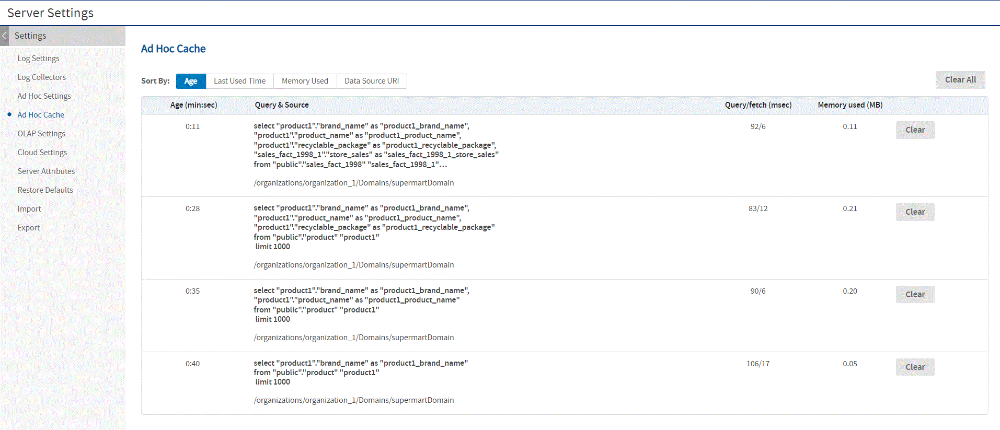
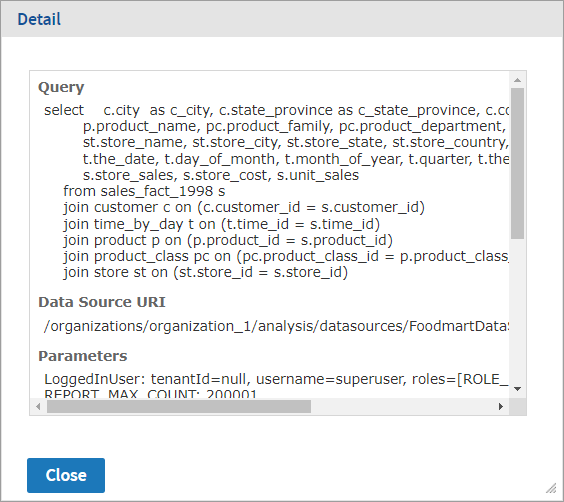

# Configuring Ad Hoc

Ad Hoc settings help you fine-tune the Ad Hoc Editor and how users interact with Ad Hoc views, in particlar the cache settings that may affect performance for large data sets. Users with `ROLE_SUPERUSER` can manage the Ad Hoc settings and cache through the UI. Less used settings are located in configuration files.

When opening Ad Hoc views or reprts that are based on Domains, data structures are verified against those in the Domain and may cause errors if the view or report reference items that are no longer in the Domain. To modify this behavior, see [Setting the Level of Referential Integrity](configuring_domains.md).

This section covers the following ways to configure Ad Hoc:

- Ad Hoc Settings

- Ad Hoc Data Policies

- Ad Hoc Data Policies for Big Data

- Ad Hoc Templates and Report Generators

- Ad Hoc Configuration File

- Ad Hoc Cache Management

- Ad Hoc OLAP Filter Configuration

## Ad Hoc Settings

!!! note

    The Ad Hoc settings apply to Ad Hoc views based on Topics or Domains. Ad Hoc views based on OLAP connections use the OLAP settings described in the Jaspersoft OLAP User Guide.

The Ad Hoc settings include the following:

- General Settings to modify the Ad Hoc Editor user interface:

  - **Show Duplicate Table Rows**. It sets the default behavior for **Show duplicate rows** in the Ad Hoc Editor. Users with `ROLE_SUPERUSER` can edit the Ad Hoc settings. This setting is applied by default when the Ad Hoc view is created. If a user logs in and changes the default setting of **Show duplicate rows** in the **Ad Hoc Designer \> Format Visualization \> Appearance**, then the server setting gets overridden for a particular Ad Hoc view.
  - **Configure View Query**. Determines whether users can see a button in the Ad Hoc Editor to display the SQL or MDX query generated for the view. This can be useful for advanced users, but you should consider your data security before enabling this. System admins can always view queries in the Ad Hoc Cache (see Ad Hoc Cache Management).
  - Use Old Layout Band. By default, the New Layout Band is displayed in the Ad Hoc editor. Select the Old Layout band checkbox to use the old layout, to build visualization in the Ad Hoc editor. For more information, see JasperReports® Server User Guide, The Layout Band topic.
  - **Display Null as Zero**. Determines the appearance of null values in crosstabs and time-series charts. By default, this setting is disabled and null values are displayed as empty cells in crosstabs or missing points in time series charts (thus causing irregular intervals). When enabled, null values are displayed as zero in crosstabs and in time-series (creating regular intervals). Regardless of this setting, null values are always displayed as zero in all other chart types.
  - **Always show input controls**. By default, this option is not enabled. When this option is selected, it displays the **Input Controls** dialog to prompt the user when the Ad Hoc report runs. **Input Controls** dialog appears only for the Ad Hoc reports created when the option is selected, while Ad Hoc reports created when the option was disabled, do not get affected. When this option is not selected, the **Input Controls** dialog still appears for Ad Hoc reports created when this option was enabled.
  - **Default Ad Hoc Visualization Type**. Sets the default visualization type when a new Ad Hoc view is created. A superuser can select the default visualization type from the drop-down list.

- Query Limits to preserve resources used by queries when Ad Hoc views are designed and run:

  - **Ad Hoc Filter List of Values Row Limit**. The maximum number of items that should be displayed in the **Condition Editor** when a user defines filters for an Ad Hoc view based on a Domain. If this limit is exceeded when users define filters, JasperReports Server displays a message to that effect. Setting this to a lower value can improve performance.

  <div class="admonition note">
  <p class="admonition-title">Note</p>
  <p>If the input control has more options  than the limit given in this setting,  the <b>Equals</b> input control changes into a free input field in the Ad Hoc report. Therefore, the field does not display the options to choose from and the user has to enter the option manually.</p>
  </div>

  - **Ad Hoc Dataset Row Limit**. The maximum number of rows that an Ad Hoc view will request in a query. Be aware that JasperReports Server truncates the data displayed in the report when the limit is reached. Setting this to a lower number may improve performance, but your reports may not reflect the full data set.

  - **Ad Hoc Query Timeout**. The number of seconds the server should wait before timing out an Ad Hoc view while running its query. Setting this to a lower number may prevent exceptions when users run Ad Hoc views. Setting this to a higher number may prevent complex calculations from timing out, but may use more database connections.

- Data Policies that determine how JasperReports Server handles data loading and processing for certain kinds of Ad Hoc views. See Ad Hoc Data Policies in the next section.

To configure the Ad Hoc query settings

1.  Log in as system administrator (`superuser` by default).
2.  Select **Manage \> Server Settings** and choose **Ad Hoc Settings** in the left-panel.
3.  Set the configuration values as described above.
4.  Click **Change** beside each value you modified to make your changes effective. Or click **Cancel** to reset it to the previously saved value.

## Ad Hoc Data Policies

!!! note

    Data snapshots, described in [Data Snapshots](../repository/jasperreport_structure.md) and [Enabling Data Snapshots](enabling_data_snapshots.md), apply only to reports displayed in the report viewer. This section covers data policies that apply only to views in the Ad Hoc Editor.

Data policies determine how data is cached and where certain calculations occur. All Ad Hoc work is based on a query, either from a Domain or Domain Topic, or from the JRXML of a plain Topic. Data policies determine whether the Ad Hoc engine uses the query as-is and processes the data in memory, or rewrites the query so that the database processes data and returns only what Ad Hoc needs to display.

By default, the data accessed by Domain-based reports is grouped, sorted, and aggregated in the database, rather than processed in memory on the server. This way the server retrieves only the columns that appear in the report rather than the entire set of fields in the Domain. Calculated fields are also processed by the database. For Topic queries based on JDBC (and JNDI) data sources, the default behavior is to request the entire result set and process the columns for display in memory. Note that independent check boxes control the behavior, one checkbox for Domains and another for JDBC data sources.

When these checkboxes are cleared, the server loads the entire set of fields associated with a Domain or Topic into memory, then applies the necessary calculations, grouping, sorting, and aggregation. This is also the case for Ad Hoc views that do not rely on Domains or JDBC data sources; in these cases, the server processes the data in memory.

Generally, we recommend that these settings be enabled, especially when working with large datasets. In deciding whether JasperReports Server should process the data in memory or push that processing to the database, consider these factors:

- The size and complexity of your reports. Reports with calculated fields, complex sorting, grouping, or aggregation may perform better when the server optimizes the queries so that the database performs the work.

- The amount of data in your data sources. If your data sources include a great deal of data, reports against them may perform better when the server optimizes the queries.

- The number of users editing and running Ad Hoc views. If you have a large number of users creating and running Ad Hoc views, performance may be better when the server optimizes the queries. Implementations with fewer users may perform better when the options are disabled.

- The performance characteristics of your data source. If the database or other data source is tuned for maximum performance, Ad Hoc views may perform better when the server optimizes the queries.

- If your data source is hosted by MySQL, we recommend that you keep the default (unchecked) for the **Optimize Queries for JDBC-based Reports** setting. MySQL has poor performance with the nested queries that this setting would generate.

- The amount of memory allocated to JasperReports Server's Java Virtual Machine (JVM). If the JVM of the application server hosting JasperReports Server is allocated plenty of memory, Ad Hoc views may perform better when JasperReports Server optimizes the queries. This is especially true if your data source tends to be slow.

To decide whether JasperReports Server should optimize queries for Ad Hoc views, we recommend disabling the settings, opening and saving some representative reports, and testing their performance. If the performance improves, leave the settings disabled and open and save the remaining reports.

The data policies you can set are:

- **Optimize Queries for JDBC-based Reports**. When checked, Ad Hoc rewrites the query to calculate, filter, group, sort, and aggregate columns when using Topics based on JDBC and JNDI data sources. Otherwise, the queries run unaltered and calculated fields, filtering, grouping, sorting, and aggregation take place in memory.
- **Optimize Queries for Domain-based Reports**. When checked, Ad Hoc rewrites the query to calculate filter, group, sort, and aggregate columns when using Domains or Domain Topics. Otherwise, the queries run unaltered and calculated fields, filtering, grouping, sorting, and aggregation take place in memory.

!!! note

    These data policy settings do not retroactively update the existing reports created from Ad Hoc views in your repository. To change the data policy for an existing report, select the appropriate policy setting, open the corresponding view in the Ad Hoc Editor, and save the report again.

To configure the Ad data policies

1.  Log in as system administrator (`superuser` by default).
2.  Select **Manage \> Server Settings** and choose **Ad Hoc Settings** in the left-hand panel.
3.  Select **Optimize Queries for JDBC-based Reports** to optimize and rewrite queries for JDBC-based Topics.
4.  Select **Optimize Queries for Domain-based Reports** to optimize and rewrite queries for Domain-based reports.
5.  Click **Change** next each value you modified to make your changes effective. Or click **Cancel** to reset it to the previously saved value.

## Ad Hoc Data Policies for Big Data

When handling large datasets (big data) from a Domain source in the Ad Hoc Editor, fields summarized by distinct count are computationally intensive. The server optimizes the distinct count by requesting distinct count calculations from the data source, as opposed to performing the calculations in memory. Database servers are usually optimized for these calculations, which improves the overall performance of the Ad Hoc Editor.

<table>
<colgroup>
<col style="width: 33%" />
<col style="width: 33%" />
<col style="width: 33%" />
</colgroup>
<thead>
<tr>
<th colspan="3"><p>Ad Hoc for Big Data</p></th>
</tr>
</thead>
<tbody>
<tr>
<td colspan="3"><p>Configuration File</p></td>
</tr>
<tr>
<td colspan="3"><p><code>.../WEB-INF/applicationContext-adhoc-dataStrategy.xml</code></p></td>
</tr>
<tr>
<td><p>Property</p></td>
<td><p>Bean</p></td>
<td><p>Description</p></td>
</tr>
<tr>
<td><p><code>calcMethod</code></p></td>
<td><p><code>Distinct</code><br />
<code>Count</code></p></td>
<td><p>This property's default value is <code>sqlUnionAll</code>. The <code>UnionAll</code> is the optimized query that provides distinct count computed by the database.</p>
<p>If this setting causes issues with your database, you can reset its value to <code>sqlGroupBy</code>. If you make this change, redeploy the web app or restart the application server.</p></td>
</tr>
</tbody>
</table>

Performing distinct count aggregates in the database applies only in the following cases:

- Crosstabs based on Domains contain measures aggregated by distinct count.

- Tables based on Domains contain groups aggregated by distinct count, but no detail rows.

This setting has no effect when there is a row or column group involving a time, timestamp, or date. In this case, Ad Hoc performs the distinct count summary calculations in memory, regardless of the `calcMethod` setting.

## Ad Hoc Templates and Report Generators

Ad Hoc templates are JRXML files in the repository that define the format for reports generated from Ad Hoc views. Report generators are custom beans that create custom output from Ad Hoc views.

In the user interface, users can select either the default template, browse for a different template, or select a report generator, if any are defined. For more information about the report template interface, see the JasperReports Server User Guide. This section explains how to configure these controls.

### Changing the Default Ad Hoc Template

The default Ad Hoc template creates a report that resembles the Ad Hoc user interface. It's meant for online viewing and doesn't restrict the size of the contents for printing. To set a different template, modify the following property:

<table>
<colgroup>
<col style="width: 33%" />
<col style="width: 33%" />
<col style="width: 33%" />
</colgroup>
<thead>
<tr>
<th colspan="3"><p>Default Ad Hoc Template</p></th>
</tr>
</thead>
<tbody>
<tr>
<td colspan="3"><p>Configuration File</p></td>
</tr>
<tr>
<td colspan="3"><p><code>.../WEB-INF/applicationContext-adhoc.xml</code></p></td>
</tr>
<tr>
<td><p>Property</p></td>
<td><p>Bean</p></td>
<td><p>Description</p></td>
</tr>
<tr>
<td><p><code>defaultTemplateUri</code></p></td>
<td><p><code>util:map id="report</code><br />
<code>Generator</code><br />
<code>DefaultConf"</code></p></td>
<td><p>Specify the repository path of your new default template. Make sure the template has permissions so it's accessible to all users. The default value is <code>/public/templates/actual_size.510.jrxml</code>.</p></td>
</tr>
</tbody>
</table>

### Modifying the Ad Hoc Template Folders

Ad Hoc templates must be uploaded to specific folders in the repository. The default folders are `/templates` (in every organization) and `/public/templates`. To set different folders, modify the following property:

<table>
<colgroup>
<col style="width: 33%" />
<col style="width: 33%" />
<col style="width: 33%" />
</colgroup>
<thead>
<tr>
<th colspan="3"><p>Ad Hoc Template Folders</p></th>
</tr>
</thead>
<tbody>
<tr>
<td colspan="3"><p>Configuration File</p></td>
</tr>
<tr>
<td colspan="3"><p><code>.../WEB-INF/applicationContext-adhoc.xml</code></p></td>
</tr>
<tr>
<td><p>Property</p></td>
<td><p>Bean</p></td>
<td><p>Description</p></td>
</tr>
<tr>
<td><p><code>templateURIParent</code><br />
<code>SQLPatternList</code></p></td>
<td><p><code>adhocEngine</code><br />
<code>Service</code></p></td>
<td><p>Add, change, or remove the values in this list to specify the folders in the repository where the server looks for Ad Hoc templates.</p></td>
</tr>
</tbody>
</table>

The default Ad Hoc template locations contain the default template. If you move or delete those folders in the repository, be sure to update the definition of the default Ad Hoc template as described in the previous section.

Also, organization templates include the `adhoc/templates` folder so it appears in every new organization. You should update all organization templates if you change or remove the `/templates` value. For more information, see [Default Folders for Organizations](../management/managing_organizations.md).

### Adding Ad Hoc Report Generators

By default no custom report generators defined on the server, and none appear in the user interface.

To add a custom report generator

1.  Create a Java class that implements the `com.jaspersoft.ji.adhoc.service.AdhocReportGenerator` interface.

2.  Compile the class and place the resulting JAR file in `.../WEB-INF/lib`.

3.  Open the file `.../WEB-INF/applicationContext-adhoc.xml` for editing and register your class as a Spring bean as shown in the following example:

    ``` xml
    <bean id="myCustomReportGenerator" class="com.example.myCustomReportGenerator">
        <property name="id" value="my-custom-generator"/>
        <property name="..." value="..."/>
        ...
    </bean>
    ```

4.  In the same file, update the `reportGeneratorFactory` bean to include your custom generator bean:

    ``` xml
    <bean id="reportGeneratorFactory" class="com.jaspersoft.ji.adhoc.service.ReportGeneratorFactoryImpl">
        <property name="reportGenerators">
            <list>
                <ref bean="myCustomReportGenerator" />
                <!--<ref bean="actualSizeReportGenerator" />-->
                <!--<ref bean="letterPortraitReportGenerator" />-->
                <!--<ref bean="letterLandscapeReportGenerator" />-->
                <!--<ref bean="a4PortraitReportGenerator" />-->
                <!--<ref bean="a4LandscapeReportGenerator" />-->
            </list>
        </property>
    </bean>
    ```

5.  Edit the `.../WEB-INF/bundles/adhoc_messages.properties` file to add a UI label for your custom generator. The key has the form `ADH_REPORT_GENERATOR_<generator-id>`. Add the same key to other language bundles if you want to support other languages.

    ``` text
        ADH_REPORT_GENERATOR_my-custom-generator=Corporate Template
    ```

6.  Restart the server or redeploy the JasperReports Server web app. The label for your custom generator appears in the list of report generators when users create and save a report from an Ad Hoc view.

## Ad Hoc Configuration File

The following properties are among those that can be configured in the `WEB-INF/applicationContext-adhoc.xml` file:

<table>
<caption><p>Configurable Properties in <code>WEB-INF/applicationContext-adhoc.xml</code></p></caption>
<colgroup>
<col style="width: 50%" />
<col style="width: 50%" />
</colgroup>
<thead>
<tr>
<th><p>Property</p></th>
<th><p>Description</p></th>
</tr>
</thead>
<tbody>
<tr>
<td><p><code>JrxmlScriptURI</code></p></td>
<td><p>The location in the file system of the <code>state2jrxml.js</code> script, which generates the JRXML report based on the current Ad Hoc Editor selections. By default, this file is located in the <code>/adhoc</code> folder of the repository.</p></td>
</tr>
<tr>
<td><p><code>realmsURI</code> and <code>realmsURIParent</code><br />
<code>SQLPatternList</code></p></td>
<td><p>The repository locations where Topics should reside. The defaults are <code>/adhoc/topics</code> and <code>/public/adhoc/topics</code>.</p></td>
</tr>
<tr>
<td><p><code>defaultTheme</code></p></td>
<td><p>The name of the default style for Ad Hoc views. This name must match a style defined in both a CSS and a JRXML file. The default is <code>default</code>.</p></td>
</tr>
<tr>
<td><p><code>aruFolder</code></p></td>
<td><p>The repository location where users are allowed to save their Ad Hoc views. The default is<code> /</code>. This allows your users to save Ad Hoc views anywhere. If you have a folder specifically for user content, specify this folder, for example <code>/userviews</code>.</p></td>
</tr>
<tr>
<td><p><code>tempFolderName</code></p></td>
<td><p>The repository location where JasperReports Server saves reports created from Ad Hoc views. The default is <code>/temp</code> relative to root and to every organization.</p>
<p>The server allows users with <code>ROLE_ADMINISTRATOR</code> or <code>ROLE_SUPERUSER</code> to view the temporary folders and their contents. The server manages these temporary files automatically, but files may accumulate in certain cases. As part of regular maintenance, you should periodically delete the files in these folders.</p></td>
</tr>
<tr>
<td><p><code>maxSafeGroupMembers</code></p></td>
<td><p>The maximum number of row groups or column groups a crosstab can display before the editor prompts the user for confirmation. This limit is a safeguard to avoid performance issues when grouping a field with too many values. The default is 100. Set it higher to allow more groups to appear without prompting users.</p></td>
</tr>
<tr>
<td><p><code>createColumn</code><br />
<code>CrosstabHeaders</code></p></td>
<td><p>This property is located in the <code>actualSizeReportGenerator</code> bean. With the default setting of <code>false</code>, column group headers appear in the Ad Hoc view but not in the report generated from the view (this is the historical behavior). When set to <code>true</code>, column group headers appear in both the Ad Hoc view and in the generated report. When column group headers are included in a crosstab, an extra row is added below the column headers for spacing.</p>
<p></p></td>
</tr>
<tr>
<td><code>resolveRuntimeAdhocFilterLabels</code></td>
<td><p>This property resolves the inconsistency between Adhoc View Filters and Filters/Input Controls labels in dependent Adhoc Reports/Dashboards/Visualize where operators were not previously shown, and it is disabled by default.</p>
<p>To have Ad Hoc Designer resolve Ad Hoc filter labels at runtime, set this property to <code>true</code> and restart the application server. Otherwise (with default setting), you need to re-save all the Ad Hoc views for the operator to be displayed in the dependent report, dashboard and in Visualize.</p>
<p>**Note** If the property is set to true (which means the UI ignores any custom labels given by user on the UI) and the existing dashboard has 2 views/reports with the same filters name, the UI uses the label sent by the server. As a result, those filters have the same labels. For example, creating dashboard with `Country` filter for both will display them as `Country` and `Country2`.</p></td>
</tr>
<tr>
<td><code>resolveAdhocFiltersExpressions </code></td>
<td><p>This property controls the filter values selection in dashboard designer, when the embedded Ad Hoc View has a filter with all the selected values. By default the value is set to true.</p>
<p>When the property is true: If an Ad Hoc has ALL filter values selected, then the Dashboard automatically selects All filter values.</p>
<p>When the property is false: For an Ad Hoc having ALL filter values selected, in the Dashboard, the filter would have 0 selected values.</p></td>
</tr>
</tbody>
</table>

!!! note

    The repository URI locations are relative to each and every organization in the server instance. For example, for a user in the default organization, the URI `/adhoc` actually refers to `/organizations/organization_1/adhoc`.

## Ad Hoc Cache Management

!!! note

    The Ad Hoc cache applies to Ad Hoc views based on Topics or Domains, and any reports generated from those Ad Hoc views. Ad Hoc views based on OLAP connections use the OLAP cache. For a comparison of the two caches, see Comparison with Jaspersoft OLAP Cache. For instructions on setting the OLAP cache, see the Jaspersoft OLAP User Guide.

JasperReports Server can temporarily cache Ad Hoc query result sets for re-use. The cache is populated by the data that results from queries when creating or running Ad Hoc views. The datasets are uniquely identified by a key that references the query itself, the data source URI, and parameters used when the query was issued.

Caching reduces database loads and delivers frequently-used datasets to the user quickly. Caching applies when reports are created and when they're run. The cache implementation uses [Ehcache](http://ehcache.org), which allows the administrator to view cache entry memory size and set limits on memory use. Configure the Ad Hoc cache to optimize memory use and response time for your use patterns.

### Setting the Cache Granularity

By default, datasets for each user are cached separately. A parameter in the cache key identifies the user. This per-user caching can result in duplicate datasets and impaired performance when different users run the same query. You can configure JasperReports Server to share cached datasets across users by editing the `.../WEB-INF/applicationContext-datarator.xml` file.

The following code configures the `cacheKeyInterceptor` bean to ignore logged-in users' credentials when creating the cache keys:

``` xml
<property name="ignoredParameters">
    <list>
        ...
        <value>LoggedInUser</value>
        <value>LoggedInUsername</value>
    </list>
</property>
```

Restart JasperReports Server after saving the modified file.

### Configuring the Cache

Caching improves overall performance of data retrieval and sorting, but unused datasets can consume memory and cached data can become stale. To address these concerns, the cache automatically removes datasets periodically. By default, datasets are removed from the cache if they are not accessed for 30 minutes. They are also cleared after 90 minutes, regardless of how recently they were accessed.

To configure the frequency with which the cache is automatically cleared, edit the following configuration file:

<table>
<colgroup>
<col style="width: 33%" />
<col style="width: 33%" />
<col style="width: 33%" />
</colgroup>
<thead>
<tr>
<th colspan="3"><p>Ad Hoc Cache Expiration</p></th>
</tr>
</thead>
<tbody>
<tr>
<td colspan="3"><p>Configuration File</p></td>
</tr>
<tr>
<td colspan="3"><p><code>.../WEB-INF/adhoc-ehcache.xml</code></p></td>
</tr>
<tr>
<td><p>Property</p></td>
<td><p>Default Value</p></td>
<td><p>Description</p></td>
</tr>
<tr>
<td><p><code>maxBytesLocalHeap</code></p></td>
<td><p><code>400M</code></p></td>
<td><p>The maximum memory use of the entire cache, by default 400 MB. Use <code>K</code> for kilobytes, <code>M</code> for megabytes, and <code>G</code> for gigabytes.</p>
<p>If left unbounded, the Ad Hoc cache can use up all available memory in your JVM. Set this value according to your server's available memory, the size of your datasets, and the number of cache entries you expect based on concurrent Ad Hoc use and the time settings below. We recommend setting this value to about half of the maximum heap size you configured for the JVM (<code>-Xmx</code> setting).</p></td>
</tr>
<tr>
<td><p><code>timeToIdleSeconds</code></p></td>
<td><p><code>1800</code></p></td>
<td><p>The number of seconds to wait after a dataset is has been accessed before removing it from the cache. The default is equivalent to 30 minutes. Use 0 (zero) for no limit.</p></td>
</tr>
<tr>
<td><p><code>timeToLiveSeconds</code></p></td>
<td><p><code>5400</code></p></td>
<td><p>The maximum time that a dataset is stored in the cache, even if it is being repeatedly accessed. Ensures that stale data is periodically replaced. The default is equivalent to 90 minutes. Use 0 (zero) for no limit.</p></td>
</tr>
</tbody>
</table>

Restart JasperReports Server after modifying these values.

### Manually Clearing the Cache

Administrators can also use the server interface to view the queries whose datasets are in the cache. Administrators can see the full query but never the contents of the dataset. The Ad Hoc cache page also displays performance data about each query. This information can be helpful when trying to resolve performance issues. The interface displays several values for every query:

- Age (min:sec) – Time since the dataset was first stored in the cache.
- Query (msec) – Time in milliseconds from when query was sent to the data source (database) until the first row was received.
- Fetch (msec) – Time in milliseconds from when first row was received from the data source (database) until the last row was received.
- Memory used (MB) – Size in megabytes of the resulting dataset being stored in the cache entry.

The Ad Hoc cache page also allows administrators to manually remove datasets if necessary. Removing a dataset from the cache forces the server to get fresh data the next time a user creates or runs an Ad Hoc view with that query.

To view queries and manually clear the Ad Hoc cache

1.  In JasperReports Server, log in as system administrator (`superuser` by default).

2.  Click **Manage \> Server Settings** and choose **Ad Hoc Cache** in the left panel.<br>
    The **Ad Hoc Cache** page appears, displaying all the datasets in the cache, sorted by age.

    

    *Figure 1: Ad Hoc Dataset Caching Administration Page*

    Each dataset is listed by its corresponding query and data source. Recall that Ad Hoc Topics have user-defined queries, so they tend to be short, whereas the query for Domains are generated from the design of the Domain and user selections in the **Data Chooser** dialog. The **Ad Hoc Cache** page displays only the first few lines of a query, as well as the data source.

3.  To remove all datasets, click **Clear All** at the bottom of the **Ad Hoc Cache** page. This also clears the Teiid cache used by virtual data sources, including a virtual data source that wraps a data source for big data.

4.  To remove a specific dataset from the cache, and click **Clear** beside the corresponding query.

5.  To find a specific cache entry, you can change the sorting in the upper-left by clicking **Age**, **Last Used Time**, **Memory Used**, or **Data Source URI**.

6.  To view the details of a specific query, including the full query string, click the query itself in the **Query & Source** column. The **Detail** page appears, displaying additional information for the selected query, such as the number of rows in the cached dataset.



*Figure 2: Typical Dataset in Ad Hoc Cache*

### Comparison with Jaspersoft OLAP Cache

The following table contrasts the key features of the Ad Hoc cache in JasperReports Server and Jaspersoft OLAP.

<table>
<caption><p>Ad Hoc Caching in JasperReports Server and Jaspersoft OLAP</p></caption>
<colgroup>
<col style="width: 33%" />
<col style="width: 33%" />
<col style="width: 33%" />
</colgroup>
<thead>
<tr>
<th><p>Cache Feature</p></th>
<th><p>JasperReports Server</p></th>
<th><p>Jaspersoft OLAP</p></th>
</tr>
</thead>
<tbody>
<tr>
<td><p>Structure of cache</p></td>
<td><p>Result caches are held at the query level: query text and language, plus data source URI and query parameters.</p></td>
<td><p>Result caches are held at the analysis connection level: schema plus database connection.</p></td>
</tr>
<tr>
<td><p>Sharing</p></td>
<td><p>Not by default, but can be enabled as described in <span>Setting the Cache Granularity</span>, above.</p></td>
<td><p>There is only one cache; it is shared across all queries and users.</p></td>
</tr>
<tr>
<td><p>Security</p></td>
<td colspan="2"><p>Applied to cache control so that users are not allowed to see privileged data.</p></td>
</tr>
<tr>
<td><p>Populating</p></td>
<td colspan="2"><p>Queries populate the cache. You can also schedule reports to pre-populate the cache during off-hours.</p></td>
</tr>
<tr>
<td><p>Size</p></td>
<td colspan="2"><p>Limited by available JVM memory (heap). Not configurable.</p>
<p>Running out of memory is unusual. It can only happen if a single query returns too many elements for available memory. The report fails with an out-of-memory error.</p></td>
</tr>
<tr>
<td><p>Automatic time-based cache policy</p></td>
<td><p>Configurable, as described in <span>Configuring the Cache</span> above.</p></td>
<td><p>In low-memory situations, cached items are removed automatically by JVM garbage collection; the least-recently-used items are cleared first. There is no way to remove data based on how long it has been in memory.</p></td>
</tr>
<tr>
<td><p>Clearing selected datasets manually</p></td>
<td><p>Configurable, as described in <span>Manually Clearing the Cache</span> above.</p></td>
<td><p>Cache regions can be defined and cleared programmatically with APIs.</p></td>
</tr>
<tr>
<td><p>Clearing all datasets manually</p></td>
<td><p>Configurable, as described in <span>Manually Clearing the Cache</span> above.</p></td>
<td><p>In JasperReports Server, select <strong>Manage &gt; Server Settings</strong>, then select <strong>OLAP Settings</strong> and click <strong>Flush OLAP Cache</strong>. For additional methods, see the <span>Jaspersoft OLAP Ultimate Guide</span>.</p></td>
</tr>
</tbody>
</table>

### Disabling the Ad Hoc Cache

!!! warning

    Disabling either cache is a server-wide setting that applies to all data sources or connections used in any Ad Hoc view. Make sure that other views aren't negatively affected by this change.

There are two reasons to consider disabling the Ad Hoc cache:

- You have a high-performance database that returns results so fast that additional caching in the server does not improve response times. In this case, the slight overhead of the cache may actually impact performance.

- Your database manages real-time data, and you create Ad Hoc views that present up-to-the-minute information from this data source. In this case, you don't want to retrieve old data out of the cache.

To disable the Ad Hoc cache for Topics and Domains, set the value of `maxBytesLocalHeap` to 1 (1 byte). For instructions, see Configuring the Cache. This effectively turns off the cache so that every query is retrieved directly from the data source.

To disable the OLAP cache for OLAP connections used in the Ad Hoc Editor, check the `mondrian.rolap.star.disable-Caching` setting on the **Manage \> Server Settings \> OLAP Settings** page. For more information, see the Jaspersoft OLAP User Guide.

In addition, if you have modified any of these three properties in `applicationContext-adhoc.xml`, set them back to false:

- `<property name="applyQueryFilterInMemory" value="false"/>`

- `<property name="applySecurityFilterInMemory" value="false"/>`

- `<property name="applyDynamicFilterInMemory" value="false"/>`

## Ad Hoc OLAP Filter Configuration

When using filters in Ad Hoc OLAP, the server queries the database to display a list of values to select from. To avoid performance issues, the number of items in a filter is limited. By default, the limit is 250 possible values.

If your filters reach this limit and your list of values is truncated, you should first consider using a different filter operation. For example, instead of “city is one of \<list\>,” use “City starts with \<letter\>.” If you still need to change this limit, modify the following property:

<table>
<thead>
<tr>
<th colspan="3"><p>Ad Hoc OLAP Filter Limit</p></th>
</tr>
</thead>
<tbody>
<tr>
<td colspan="3"><p>Configuration File</p></td>
</tr>
<tr>
<td colspan="3"><p><code>.../WEB-INF/applicationContext-adhoc-dataStrategy.xml</code></p></td>
</tr>
<tr>
<td><p>Property</p></td>
<td><p>Bean</p></td>
<td><p>Description</p></td>
</tr>
<tr>
<td><p><code>maxFilterValues</code></p></td>
<td><p><code>mdxDataStrategy</code></p></td>
<td><p>Set the value to the maximum number of filter values you expect. Setting this value higher than the default of 250 may cause performance issues.</p></td>
</tr>
</tbody>
</table>
