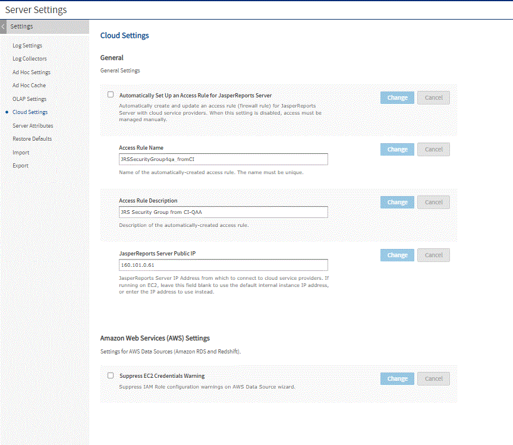

# Configuring Cloud Services

The following settings control how JasperReports Server interacts with a cloud service provider, such as AWS and Microsoft Azure:

-   The **Cloud Settings** page enables you to create and change firewall rules without restarting the server. For the Microsoft Azure service, these rules are called "access rules". For AWS, they are called "security groups".

-   The AWS configuration file allows you to change the JDBC driver used for AWS data sources.

-   The Azure configuration file allows you to change the JDBC driver and URL template used for Azure data sources.

For more information about AWS and Azure data sources, see [“AWS Data Sources” on page 1](../datasources/aws_data_sources.md) and [Azure SQL Data Sources](../datasources/azure_data_sources.md).

## Changing Cloud Services Settings

To change cloud services settings

1.  Log in as a system administrator (superuser by default).

2.  Click **Manage &gt; Server Settings**.

3.  Click **Cloud Settings** in the left-menu.<br>
    The **Cloud Settings** panel appears.

    

    *Figure 1 Cloud Settings Page*

    !!! note

        We set up one AWS DB Security Group (using IP address) in each RDS region, per JasperReports Server instance. The security group allows connections from the specific JasperReports Server instance to the specified AWS database instance.

4.  Modify the following settings and click **Change** after each modification. Changes are effective immediately on the server:

    -   **Automatically Set Up an Access Rule for JasperReports Server**: This checkbox is generally left checked. When checked the JasperReports Server will automatically create and update an access rule that allows connections from JasperReports Server to the database hosted by the cloud service provider. If you want to manage the access rules manually, uncheck this box.

    -   **Access Rule Name**: When JasperReports Server creates access rules to support cloud-based data sources on this instance, it uses this name as the basis of the access rule name. When the JasperReports Server instance is running on AWS EC2, the EC2 instance ID is appended. When running outside of AWS EC2, you must make sure that the name is unique among JasperReports Server instances (that is, each instance should have its own name), so the IP addresses are properly granted access to the appropriate database instances.

    -   `Access Rule Description`: This text is used as the description for the access rule.

    -   **JasperReports Server Public IP:** Enter the public IP address for JasperReports Server. Most users on AWS EC2 should leave this field empty and let JasperReports Server determine the IP address automatically. It is possible with complex EC2 topology involving Virtual Private Clouds (VPCs) that you need to provide your IP address manually.

    -   **Suppress EC2 Credentials Warning**: If your JasperReports Server instance was created with no IAM role, when you go to the data source wizard to add an AWS data source with EC2 credentials there will be a warning message saying there is no proper role set. Checking this box suppresses the warning and disables the option.

## Changing the Default JDBC Driver for AWS Data Sources

When adding an AWS data source, JasperReports Server uses the JDBC driver specified in the `.../WEB-INF/applicationContext-webapp.xml` file. You can configure JasperReports Server to use a different JDBC driver.

To change the JDBC driver used with AWS data sources

1.  Open the file `.../WEB-INF/applicationContext-webapp.xml` for editing.

2.  Locate the `jdbcConnectionMap` bean and the key of your AWS database type within it. Modify this key to specify a different JDBC driver. For example, the default driver for MySQL databases is set to the MariaDB driver:

    ``` xml
    <entry key="mysql">
    <util:map>
        ...
        <entry key="jdbcUrl" value="jdbc:mysql://$[dbHost]:$[dbPort]/$[dbName]"/>
        <entry key="jdbcDriverClass" value="org.mariadb.jdbc.Driver"/>
        ...
    </util:map>
    ```

3.  Save the file and restart JasperReports Server.

## Changing Azure SQL Data Source Defaults

When creating an Azure SQL data source, JasperReports Server uses the JDBC driver and JDBC connector URL template specified in the `.../WEB-INF/applicationContext-azure-sql-datasource.xml` configuration file. You have the choice of changing the URL string and using the Microsoft JDBC driver for SQL Server when creating the data source or you can change the default driver and URL string in the configuration file.

<table>
<thead>
<tr>
<th colspan="3"><p>Azure Data Source Defaults</p></th>
</tr>
</thead>
<tbody>
<tr>
<td colspan="3"><p>Configuration File</p></td>
</tr>
<tr>
<td colspan="3"><p><code>.../WEB-INF/applicationContext-azure-sql-datasource.xml</code></p></td>
</tr>
<tr>
<td><p>Bean</p></td>
<td colspan="2"><p>Description</p></td>
</tr>
<tr>
<td><code>defaultAzureJdbcDriverClassName</code></td>
<td colspan="2"><p>The JDBC driver is used for Azure SQL Server data sources. The default is the native JDBC driver for SQL Server (<code>com.microsoft.sqlserver.jdbc.SQLServerDriver</code>).</p></td>
</tr>
<tr>
<td><code>defaultAzureJdbcUrlSyntax</code></td>
<td colspan="2">The template for the JDBC connector URL for Azure SQL Server data sources. The connector string contains properties required for the JDBC driver to access the Azure data source. The default string specifies the server name, database name, and the use of SSL as an encryption method.</td>
</tr>
<tr>
<td colspan="3"><p>Configuration File</p></td>
</tr>
<tr>
<td colspan="3"><p><code>.../WEB-INF/applicationContext-webapp.xml</code></p></td>
</tr>
<tr>
<td><p>Bean</p></td>
<td colspan="2"><p>Description</p></td>
</tr>
<tr>
<td><code>defaultAzureKeyStoreType</code></td>
<td colspan="2">The file format for storing the certificate key exchange files used for Azure data sources. The default file format is <code>pkcs12</code>.</td>
</tr>
</tbody>
</table>
