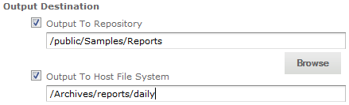
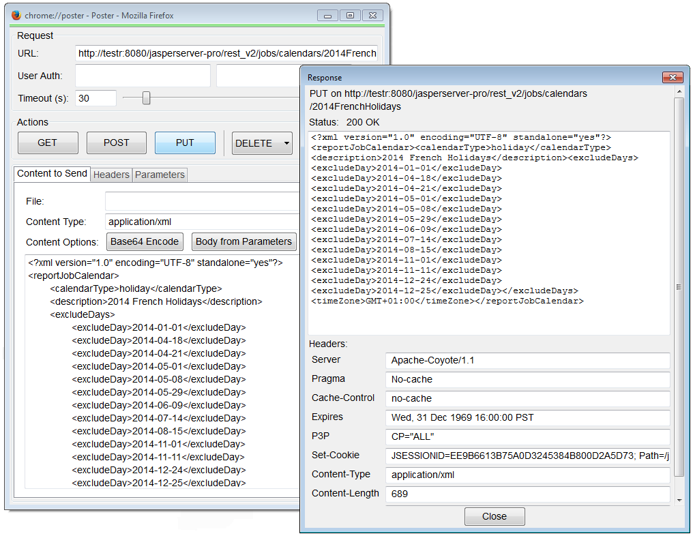
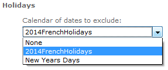

# Configuring the Scheduler

The scheduler runs reports in the background according to a user-defined schedule (also called a job). You can configure the following aspects of the scheduler:

- Configuring the Scheduler Misfire Policy

- Configuring Scheduler Failure Notifications

- Restricting File System Output

- Removing Report Scheduling Interval Options

- Adding a Holiday Exclusion Calendar

- Changing the Default Output Folder

- Configuring the Scheduler for Dashboards

- [Configuring the Scheduler to Fetch Attributes](configuring_the_scheduler.md)

- [Configuring Job Persistence for Immediate Execution Schedule](configuring_the_scheduler.md)

## Configuring the Scheduler Misfire Policy

A scheduler misfire occurs when the scheduler cannot run a report at the designated time, for example because JasperReports Server is offline, its database is offline, or the number of threads is limited. In this case, you can configure the behavior of the scheduler to retry the report or skip the scheduled run.

You can set a different misfire policy for each kind of job schedule: single job, repeating job, and calendar job. Misfire policies are defined in the Quartz Scheduler documentation and other online resources:

<https://www.quartz-scheduler.org/documentation/quartz-2.3.0/tutorials/tutorial-lesson-05.html>

<https://www.quartz-scheduler.org/documentation/quartz-2.3.0/tutorials/tutorial-lesson-06.html>

<https://nurkiewicz.com/2012/04/quartz-scheduler-misfire-instructions.html>

<table>
<colgroup>
<col style="width: 50%" />
<col style="width: 50%" />
</colgroup>
<thead>
<tr>
<th colspan="2"><p>Configuring Scheduler Misfire Policy</p></th>
</tr>
</thead>
<tbody>
<tr>
<td colspan="2"><p>Configuration File</p></td>
</tr>
<tr>
<td colspan="2"><p><code>.../WEB-INF/js.quartz.properties</code></p></td>
</tr>
<tr>
<td><p>Property</p></td>
<td><p>Description</p></td>
</tr>
<tr>
<td><p><code>report.quartz.misfirepolicy.singlesimplejob</code></p></td>
<td><p>Sets the misfire policy for single jobs to one of the following:</p>
<ul>
<li><code>SMART_POLICY</code></li>
<li><code>MISFIRE_INSTRUCTION_FIRE_NOW</code></li>
<li><code>MISFIRE_INSTRUCTION_IGNORE_MISFIRE_POLICY</code></li>
</ul></td>
</tr>
<tr>
<td><code>report.quartz.misfirepolicy.</code><br />
<code>repeatingsimplejob</code></td>
<td><p>Sets the misfire policy for repeating jobs to one of the following values:</p>
<ul>
<li><code>SMART_POLICY</code></li>
<li><code>MISFIRE_INSTRUCTION_FIRE_NOW</code></li>
<li><code>MISFIRE_INSTRUCTION_IGNORE_MISFIRE_POLICY</code></li>
<li><code>MISFIRE_INSTRUCTION_RESCHEDULE_NEXT_WITH_EXISTING_COUNT</code></li>
<li><code>MISFIRE_INSTRUCTION_RESCHEDULE_NOW_WITH_EXISTING_REPEAT_COUNT</code></li>
<li><code>MISFIRE_INSTRUCTION_RESCHEDULE_NOW_WITH_REMAINING_REPEAT_COUNT</code></li>
</ul></td>
</tr>
<tr>
<td><code>report.quartz.misfirepolicy.</code><br />
<code>calendarjob</code></td>
<td><p>Sets the misfire policy for jobs with calendar recursion to one of the following values:</p>
<ul>
<li><code>SMART_POLICY</code></li>
<li><code>MISFIRE_INSTRUCTION_IGNORE_MISFIRE_POLICY</code></li>
<li><code>MISFIRE_INSTRUCTION_FIRE_ONCE_NOW</code></li>
<li><code>MISFIRE_INSTRUCTION_DO_NOTHING</code></li>
</ul></td>
</tr>
</tbody>
</table>

When importing scheduled jobs, all calendar jobs with misfired triggers are re-executed. This results in unwanted and unplanned executions. This can be overcome by changing the Misfire policy on the server. But, that will impact all other jobs along with the calendar trigger.

To avoid changing the misfire policy globally for all jobs with trigger, two new properties `calenderTrigger.resetStartTimeOnImport` and `simpleTrigger.resetStartTimeOnImport` are added in the `js.quartz.properties` file. The new properties skip firing calendar jobs right after import, and job is executed at the next trigger (calendar or simple) time.

<table>
<colgroup>
<col style="width: 50%" />
<col style="width: 50%" />
</colgroup>
<thead>
<tr>
<th colspan="2"><p>Configuring Scheduler Misfire Policy</p></th>
</tr>
</thead>
<tbody>
<tr>
<td colspan="2"><p>Configuration File</p></td>
</tr>
<tr>
<td colspan="2"><p><code>.../WEB-INF/js.quartz.properties</code></p></td>
</tr>
<tr>
<td><p>Property</p></td>
<td><p>Description</p></td>
</tr>
<tr>
<td><p><code>calenderTrigger.resetStartTimeOnImport</code></p></td>
<td>By default, <code>calenderTrigger.resetStartTimeOnImport=false</code>. If set to <code>true</code>, then while importing the job, start time is recalculated to the import time. And, the job execution starts in the future based on the condition set in calendar trigger.</td>
</tr>
<tr>
<td><code>simpleTrigger.resetStartTimeOnImport</code></td>
<td><p>By default, <code>simpleTrigger.resetStartTimeOnImport=false</code>. If set to <code>true</code>, then job start time is refreshed to current time.</p>
<p>**Note** For old jobs with simple triggers that were completed, but remained in the system, the jobs are executed again because the start time recalculated to the current time.</p></td>
</tr>
</tbody>
</table>

## Configuring Scheduler Failure Notifications

By default, if a scheduled report runs but causes an error, the scheduler sends an email to the schedule owner and to all JasperReports Server administrators in the same organization. This is in addition to any failure notification addresses specified on the **Notifications** tab of the scheduler wizard. To receive these scheduler failure alerts, administrators must have valid email addresses defined in their user accounts.

You can also configure the scheduler to send failure notifications to different users based on roles, or turn off failure notifications.

<table>
<colgroup>
<col style="width: 33%" />
<col style="width: 33%" />
<col style="width: 33%" />
</colgroup>
<thead>
<tr>
<th colspan="3"><p>Configuring Scheduler Failure Notifications</p></th>
</tr>
</thead>
<tbody>
<tr>
<td colspan="3"><p>Configuration File</p></td>
</tr>
<tr>
<td colspan="3"><p><strong>.../WEB-INF/applicationContext-report-scheduling.xml</strong></p></td>
</tr>
<tr>
<td><p>Entry Key</p></td>
<td><p>Bean</p></td>
<td><p>Description</p></td>
</tr>
<tr>
<td><p><strong>administrator<br />
Role</strong></p></td>
<td><p><strong>quartz<br />
Scheduler</strong></p></td>
<td>This setting determines the role to which the scheduler failure notifications will be sent. All users <span>in the organization </span>with this role and a valid email address defined in their user profile will receive the email notification. By default, this setting is <code>ROLE_ADMINISTRATOR</code>.</td>
</tr>
<tr>
<td><p><code>disableSending</code><br />
<code>AlertToAdmin</code></p></td>
<td><p><code>quartz</code><br />
<code>Scheduler</code></p></td>
<td>Disables or allows failure notifications to be sent to the role in the previous setting. By default, this setting is <code>false</code>, meaning that notifications are sent. Set this value to <code>true</code> to disable scheduler failure notifications being sent to administrators (or the role defined above).</td>
</tr>
<tr>
<td><p><code>disableSending</code><br />
<code>AlertToOwner</code></p></td>
<td><p><code>quartz</code><br />
<code>Scheduler</code></p></td>
<td>Disables or allows failure notifications to be sent to the schedule owner. By default, this setting is <code>false</code>, meaning that notifications are sent. Set this value to <code>true</code> to disable scheduler failure notifications to the schedule owner.</td>
</tr>
</tbody>
</table>

## Restricting File System Output

The scheduler outputs reports through several channels. Most reports are emailed, but reports can also be written to FTP folders. You can also configure the scheduler to write reports to the server's local file system. This option is disabled by default for security reasons.

!!! warning

    If you turn on scheduler file system output, make sure you have configured user and folder access rights to make sure that malicious files cannot be written to your file system. The process that writes the files is the same user that runs the application server hosting JasperReports Server.

<table>
<colgroup>
<col style="width: 50%" />
<col style="width: 50%" />
</colgroup>
<thead>
<tr>
<th colspan="2"><p>Scheduler File System Output</p></th>
</tr>
</thead>
<tbody>
<tr>
<td colspan="2"><p>Configuration File</p></td>
</tr>
<tr>
<td colspan="2"><p><code>.../WEB-INF/applicationContext.xml</code></p></td>
</tr>
<tr>
<td><p>Property to Update</p></td>
<td><p>Description</p></td>
</tr>
<tr>
<td><p><code>enableSaveToHostFS</code></p></td>
<td><p>Set the value from <code>false</code> (the default) to <code>true</code>.</p>
<p>When true, the user interface for the scheduler displays active fields that allow the schedule creator to specify a folder in the server's file system. The scheduler will write files to this location every time it runs the schedule for this report.</p>
<p></p>
<p>This property also determines the scheduler's overall access to the file system. When true, any schedule configured with a file system folder will write to the file system. When false, no scheduled reports will write output to the file system (FTP and email output are not affected). However, any file system output specified in a schedule remains defined and will again trigger file system output when this property is true again.</p></td>
</tr>
</tbody>
</table>

## Removing Report Scheduling Interval Options

!!! note

    The information covered in this section only applies to jobs with simple recurrence, not calendar recurrence type.

Users can schedule reports to run at regular intervals. The default interval can be expressed in weeks, days, hours or minutes. To prevent users from scheduling frequent reports, you can limit the intervals to days or hours by editing the following configuration file:

<table>
<thead>
<tr>
<th colspan="2"><p>Scheduling Interval Options</p></th>
</tr>
</thead>
<tbody>
<tr>
<td colspan="2"><p>Configuration File</p></td>
</tr>
<tr>
<td colspan="2"><p><code>.../WEB-INF/flows/reportJobBeans.xml</code></p></td>
</tr>
<tr>
<td><p>Section to Update</p></td>
<td><p>Description</p></td>
</tr>
<tr>
<td><p><code>recurrenceIntervalUnits</code></p></td>
<td><p>Comment out the intervals you want to disable.</p></td>
</tr>
</tbody>
</table>

To remove a temporal interval, enclose the corresponding bean in comment characters. For example, to prevent users from scheduling reports at minute intervals, comment out the bean containing the `INTERVAL_MINUTE` field:

``` text
<!--
<bean class="com.jaspersoft.jasperserver.war.dto.ByteEnum">
    <property name="code">
        <util:constant static-field="com.jaspersoft.jasperserver.api.engine.scheduling.
            domain.ReportJobSimpleTrigger.INTERVAL_MINUTE"/>
    </property>
    <property name="labelMessage">
        <value>job.interval.unit.minute.label</value>
    </property>
</bean>
-->
```

## Adding a Holiday Exclusion Calendar

The scheduler supports exclusion calendars to specify days or times when no report should be run, even if scheduled. For example, you might not want a report to run on a bank holiday when the financial data would be meaningless.

The scheduler maintains a list of named calendars, and the user interface allows the schedule creator to select a calendar whose dates will be excluded from the schedule.

Currently, the only method to define a holiday calendar is through the REST API. You can use any browser plug-in that acts as a REST client and can send PUT requests to JasperReports Server. Using such a plug-in, compose and send the following REST request (header and body) to your server:

``` text
PUT http://<host>:<port>/jasperserver[-pro]/rest_v2/jobs/calendars/2014FrenchHolidays
Content-Type: application/xml

<?xml version="1.0" encoding="UTF-8" standalone="yes"?>
<reportJobCalendar>
    <calendarType>holiday</calendarType>
    <description>2014 French Holidays</description>
    <excludeDays>
        <excludeDay>2014-01-01</excludeDay>
        <excludeDay>2014-04-18</excludeDay>
        <excludeDay>2014-04-21</excludeDay>
        <excludeDay>2014-05-01</excludeDay>
        <excludeDay>2014-05-08</excludeDay>
        <excludeDay>2014-05-29</excludeDay>
        <excludeDay>2014-06-09</excludeDay>
        <excludeDay>2014-07-14</excludeDay>
        <excludeDay>2014-08-15</excludeDay>
        <excludeDay>2014-11-01</excludeDay>
        <excludeDay>2014-11-11</excludeDay>
        <excludeDay>2014-12-24</excludeDay>
        <excludeDay>2014-12-25</excludeDay>
    </excludeDays>
    <timeZone>GMT+01:00</timeZone>
</reportJobCalendar>
```

For example, using the [Poster plug-in for Firefox](https://addons.mozilla.org/En-us/firefox/addon/poster/), you can submit this request as shown in the following figure. The figure also shows the successful reply from the server.



*Figure 2: Creating a Holiday Calendar with REST Web Services*

Then you should see your new calendar in the list of calendars in the Schedule tab.



*Figure 3: Selecting a Custom Holiday Calendar in the Scheduler*

The REST API supports other types of calendars, however, the user interface lists only calendars of type `holiday`. Using the REST API, you can create and manage any number of calendars and update any schedule to use them. For more information, see the JasperReports Server REST API Reference.

## Changing the Default Output Folder

By default, the scheduler will save the output of scheduled reports to the directory in which the report resides and scheduled dashboard exports to the `/public/Samples/Dashboards` folder. You can change this default location to another folder in the repository by editing the `applicationContext-report-scheduling.xml` configuration file on the server.

To enable file data sources in the UI

1.  Open the file `<js-install>/WEB-INF/applicationContext-report-scheduling.xml` for editing.
2.  Locate the element `<util:map id="reportJobDefaults">`.
3.  Update `<entry key="scheduler.job.repositoryDestination.folderURI" value="/job_output" />` and replace `"/job_output"` with the URI for the new default folder in the repository.
4.  Restart the server or redeploy the JasperReports Server web app. The new default folder appears on the **Output Options** tab when you try to schedule a report or dashboard.

## Configuring the Scheduler for Dashboards

You can configure the following property to enable the scheduler and headless browser to load the dashboard on the server side and export it.

<table>
<colgroup>
<col style="width: 50%" />
<col style="width: 50%" />
</colgroup>
<thead>
<tr>
<th colspan="2"><p>Configuring the Scheduler for Dashboards</p></th>
</tr>
</thead>
<tbody>
<tr>
<td colspan="2"><p>Configuration File</p></td>
</tr>
<tr>
<td colspan="2"><p><code>.../WEB-INF/js.config.properties</code></p></td>
</tr>
<tr>
<td><p>Property</p></td>
<td><p>Description</p></td>
</tr>
<tr>
<td><code>deploy.base.local.url</code></td>
<td><p>This property is used by scheduler and headless browsers to load the dashboard on the server side and export it.</p>
<p>**Note** You will need to set this property when the **Export** option **Detailed** is selected.</p>
<p>Set this property to the localhost URL. This URL must include the application name. For example:</p>
<p><code>http://localhost:8080/jasperserver-pro</code></p>
<p>Specify <code>http</code> or <code>https</code> in your URL.</p></td>
</tr>
</tbody>
</table>

## Configuring the Scheduler to Fetch Attributes for Graph API

You can configure the following property to enable the scheduler to fetch attributes for Graph API.

<table>
<colgroup>
<col style="width: 50%" />
<col style="width: 50%" />
</colgroup>
<thead>
<tr>
<th colspan="2"><p>Configuring the Scheduler to Fetch Attributes</p></th>
</tr>
</thead>
<tbody>
<tr>
<td colspan="2"><p>Configuration File</p></td>
</tr>
<tr>
<td colspan="2"><p><code>.../WEB-INF/js.quartz.properties</code></p></td>
</tr>
<tr>
<td><p>Property</p></td>
<td><p>Description</p></td>
</tr>
<tr>
<td><code>notification.service.multiTenant.config</code></td>
<td><p>This property is used by scheduler to fetch attributes. This property can be set to any of the following values:</p>
<ul>
<li><code>none</code></li>
<li><code>tenant</code></li>
<li><code>hierarchical</code></li>
</ul>
<p>By default, <code>notification.service.multiTenant.config=none</code></p>
<p>If this property is set to <code>hierarchical</code>, the attribute is referred across all levels, starting from the user level. The server searches for an attribute with the given name in the following order, stopping and returning the first value that it finds:</p>
<ul>
<li>At the user level, the server searches the attributes of the logged-in user and creates the bean with those attributes.</li>
<li>If attribute is not found at user level, the server searches at organization or tenant level. In the organization attributes of the logged-in user's organization. The server also searches in all parent organizations and creates the bean with those attributes.</li>
<li>If attributes are not found at user and organization or tenant level, attributes are searched at the server level and create the bean with those attributes.</li>
</ul></td>
</tr>
</tbody>
</table>

If properties are configured for `tenant` or `hierarchical`, the system creates beans (`JavaMailSender` and `GraphServiceClient`) with tenant-specific or hierarchical-specific attributes, respectively. Else, it creates beans using the default properties configured in the `js.quartz.properties` file.

## Setting Properties in the jasperserver_config.properties File

You can set the following properties while composing emails:

|  |  |
|----|----|
| Property | Description |
| `graph.service.body.scheduler.template=<html><head><meta http-equiv='Content-Type' content='text/html; charset=utf-8'><title>My Page</title></head><body><p>${linkDescription} <a href='${resourceURI}'>${resourceURI}</a></p>${preamble}</body></html>` | Defines the HTML template used for composing emails with links when scheduling jobs or alerts in the scheduler using graph API. |
| `graph.service.body.scheduler.notification.template = <br/>${preamble}<br/>${jobinfo}<br/>Label = ${label}<br/>ID = ${id}<br/>Description = ${description}<br/>Status = ${status}<br/>` | Defines the template used for composing notification mails when scheduling notification using graph API. |
| `mail.service.body.scheduler.notification.template = ${preamble}${jobinfo}\nLabel = ${label}\nID = ${id}\nDescription = ${description}\nStatus = ${status}${preamble}` | Defines the template used for composing notification mails when scheduling notification using mail. |

!!! note

    The template used to composing notification mails contains placeholders for dynamic content to be added. The placeholders include `${label}, ${jobinfo}, ${id}, ${description}`, and `${status}`.

## Configuring the Scheduler to Fetch Attributes for SendGrid API

You can configure the following property to enable the scheduler to fetch attributes for SendGrid API.

<table>
<colgroup>
<col style="width: 50%" />
<col style="width: 50%" />
</colgroup>
<thead>
<tr>
<th colspan="2"><p>Configuring the Scheduler to Fetch Attributes</p></th>
</tr>
</thead>
<tbody>
<tr>
<td colspan="2"><p>Configuration File</p></td>
</tr>
<tr>
<td colspan="2"><p><code>.../WEB-INF/js.quartz.properties</code></p></td>
</tr>
<tr>
<td><p>Property</p></td>
<td><p>Description</p></td>
</tr>
<tr>
<td><code>notification.service.multiTenant.config</code></td>
<td><p>This property is used by scheduler to fetch attributes. This property can be set to any of the following values:</p>
<ul>
<li><code>none</code></li>
<li><code>tenant</code></li>
<li><code>hierarchical</code></li>
</ul>
<p>By default, <code>notification.service.multiTenant.config=none</code></p>
<p>If this property is set to <code>hierarchical</code>, the attribute is referred across all levels, starting from the user level. The server searches for the SendGrid attribute, (<code>sendGrid.api</code>) with value as the API ke,y with the given name in the following order, stopping and returning the first value that it finds:</p>
<ul>
<li>At the user level, the server searches the attributes of the logged-in user and creates the bean with those attributes.</li>
<li>If attribute is not found at user level, the server searches at organization level. It searches in the organization attributes of the logged-in user's organization and all parent organizations and creates the bean with those attributes.</li>
<li>If attributes are not found at user or tenant level, attributes are searched at the server level and create the bean with those attributes.</li>
</ul></td>
</tr>
</tbody>
</table>

If properties are configured per tenant level, then SendGrid API key must be defined in the profile attribute of the users belonging to that specific tenant.

!!! note

    If any of these mandatory parameters are missed, it creates beans using the default values mentioned in the `js.quartz.properties` file.

## Configuring the Scheduler Dashboard

To display execution metrics and logs in the Scheduler Dashboard, configure the following properties:

<table>
<colgroup>
<col style="width: 50%" />
<col style="width: 50%" />
</colgroup>
<thead>
<tr>
<th colspan="2"><p>Configuring the Scheduler Dashboard</p></th>
</tr>
</thead>
<tbody>
<tr>
<td colspan="2"><p>Configuration File</p></td>
</tr>
<tr>
<td colspan="2"><p><code>.../WEB-INF/js.config.properties</code></p></td>
</tr>
<tr>
<td><p>Property</p></td>
<td><p>Description</p></td>
</tr>
<tr>
<td><code>isJobsHistoricalDataEnabled</code></td>
<td><p>Enables access to Jobs Historical Data for the Scheduler Dashboard and related APIs.</p>
<p>By default this property is set to <code>True</code>.</p>
<p>When<code> isJobsHistoricalDataEnabled=true</code> and the following audit properties are enabled:</p>
<ul>
<li><p><code>feature.audit_monitoring.enabled=true</code></p></li>
<li><p><code>audit.records.enabled=true</code></p></li>
</ul>
<p>You can view the historical job execution data, including <strong>Succeeded Jobs</strong> count, <strong>Failed Jobs</strong> count, <strong>Restart</strong> action, and <strong>Execution Logs</strong> from the Admin Console Schedules and Schedules and Alerts pages.</p>
<p>When<code> isJobsHistoricalDataEnabled=false</code>, the historical data features are hidden from the user interface, and the Jobs Historical Data API returns a 403 Forbidden response.</p>
<p>Audit data and job metrics may continue to be collected and stored if audit configurations remain enabled, and will become available again if the property is re-enabled.</p></td>
</tr>
</tbody>
</table>

!!! note

    To enable access to Jobs Historical Data, ensure that both `feature.audit_monitoring.enabled` and `audit.records.enabled` are set to `True`. For more information, see [Configuring Auditing and Monitoring.](../diagnostics/configuring_auditing_and_monitoring.md)
