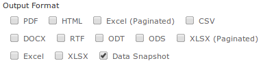

# Enabling Data Snapshots

!!! info "Important"

    The features in this section may be restricted by your JasperReports Server software license. If you don't see some of the options described, your current license likely prohibits their use. Contact us to learn about your licensed features or to discuss upgrading.

The data snapshot feature stores report data in the server, which can change in the user experience significantly:

-   Without data snapshots – Whenever users run a report, the server queries the data source and displays the latest data. When the same report is run over and over, the data source is often returning the same data every time. This is the default behavior.

-   With data snapshots – The first time a report runs, it queries the data source and stores a copy of the data with the report in the repository. Users who view the report later see the data from the saved snapshot, not from querying the data source. Reports accessed through REST APIs and Visualize.js are also based on the saved snapshot. For large reports or frequently viewed reports, the persisted snapshot provides a significant performance gain and reduces load on your data sources. Every user who has access to the report will see the data from the same snapshot. For users who require it, the report viewer provides a button to manually refresh the data snapshot anytime. In addition, when the scheduler runs a job on a report it always updates the snapshot. Enable data snapshots if you'd like to use them.

We encourage enabling data snapshots with the following recommendations:

-   If you have a new installation of JasperReports Server, enable snapshots to get the full server functionality. In the future, persistent data snapshots may be enabled by default.

-   If you're upgrading from an early release that predates data snapshots, first follow the upgrade procedure and verify the outcome, as instructed in the JasperReports Server Installation Guide. Then, before enabling data snapshots, notify your users about this new functionality.

-   Data snapshots are stored in the server's repository, which must be sized accordingly. If you have a large number of reports, or very large reports, consider the performance of your repository database before enabling snapshots. If your users rely on data that changes frequently or if they expect to see real-time data when opening a report, do not enable snapshots. Alternatively, you can enable snapshots selectively as described below.

## Global Data Snapshot Configuration

The server-level settings determine whether the snapshot feature is available on the server.

<table>
<colgroup>
<col style="width: 33%" />
<col style="width: 33%" />
<col style="width: 33%" />
</colgroup>
<thead>
<tr>
<th colspan="3"><p>Data Snapshots Server-Level Configuration</p></th>
</tr>
</thead>
<tbody>
<tr>
<td colspan="3"><p>Configuration File</p></td>
</tr>
<tr>
<td colspan="3"><p><code>.../WEB-INF/applicationContext-data-snapshots.xml</code></p></td>
</tr>
<tr>
<td><p>Property</p></td>
<td><p>Bean</p></td>
<td><p>Description</p></td>
</tr>
<tr>
<td><p><code>snapshot</code><br />
<code>Persistence</code><br />
<code>Enabled</code></p></td>
<td><p><code>dataSnapshot</code><br />
<code>Service</code></p></td>
<td><p>When set to <code>true</code>, it allows the JasperReports Server report viewer to save data snapshots in the repository and open them the next time the report is run. By default, this is set to <code>false</code>.</p></td>
</tr>
</tbody>
</table>

!!! note

    There is also a property named `snapshotRecordingEnabled` that caches a snapshot in the report viewer memory when sorting and filtering columns interactively. This allows the report viewer to refresh the display without querying the database every time. Regardless of persistence, `snapshotRecordingEnabled` improves report viewing performance and decreases database load, so it should remain set to `true`.

## Report-level Data Snapshot Configuration

You can disable snapshots on a specific report by setting the following property in the report's JRXML:

``` properties
net.sf.jasperreports.data.cache.persistable=false
```

!!! note

    This report-level property depends on the snapshot mechanism in JasperReports Server. This property has no effect in other report viewers without such a mechanism, like the viewer integrated in Jaspersoft Studio.

There are two ways to control snapshots at the report level. In the case above:

-   Data snapshots are enabled on the server, so most reports use them.

-   Reports that don't benefit from data snapshots can explicitly disable snapshots in their own JRXML.

As with all report-level properties, you can set server-wide default values, as described in [Configuring JasperReports Library](configuring_jasperreports_library.md):

<table>
<colgroup>
<col style="width: 33%" />
<col style="width: 33%" />
<col style="width: 33%" />
</colgroup>
<thead>
<tr>
<th colspan="3"><p>Data Snapshots Default Report-Level Configuration</p></th>
</tr>
</thead>
<tbody>
<tr>
<td colspan="3"><p>Configuration File</p></td>
</tr>
<tr>
<td colspan="3"><p><code>.../WEB-INF/classes/jasperreports.properties</code></p></td>
</tr>
<tr>
<td colspan="2"><p>Property</p></td>
<td><p>Description</p></td>
</tr>
<tr>
<td colspan="2"><p><code>net.sf.jasperreports.data.cache.</code><br />
<code>persistable=false</code></p></td>
<td><p>When set to <code>false</code>, the server-wide default for reports is to not use data snapshots, however, they are still available if a report overrides this value to true in its own JRXML.</p></td>
</tr>
</tbody>
</table>

Because the report-level property takes precedence over the server-level property, this enables a second way to control snapshots:

-   Data snapshots are enabled on the server.

-   But the server-wide default is set to false, so most reports don't use them.

-   Reports that benefit from data snapshots can explicitly enable snapshots in their own JRXML with: `net.sf.jasperreports.data.cache.persistable=true`

## Data Snapshots in the Scheduler

Scheduled jobs always run the report by accessing the data source, so the output has up-to-the-minute data. When data snapshots are enabled on reports, the job always updates the data snapshot with this new data after it runs. This way, when you schedule a report, it also refreshes the data snapshot periodically: hourly, daily, weekly, or whatever suits your data requirements.

When data snapshots are enabled on the server, the scheduler interface has an extra option to output the data snapshot. This option, as shown in the following figure, generates a copy of the report with the new data snapshot. This copy is stored in the repository as a JasperReport, identical to the report being run. Over time, this will create an archive of your report data.

If you clear the **Data Snapshot Output Format** option, no copy of the report is saved with the new data snapshot, but the data snapshot on the original report is still updated when the job runs. Also, you must select at least one other output format to schedule the report.



*Figure 1 The Data Snapshot Output Option in the Scheduler*

Finally, when data snapshots are enabled, you can also update them through REST web services calls. When specifying the report to run with the `rest_v2/reportExecutions` service, you can add arguments to explicitly update or not update the associated data snapshot. For more information, see the JasperReports Server REST API Reference.
