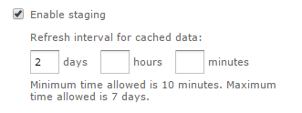

# Enabling Data Staging

Data staging is a new feature in JasperReports Server 6.0 that can optimize the performance of certain Ad Hoc views and reports. With data staging, the entire dataset for a Domain Topic is indefinitely cached in the server's Ad Hoc cache. When the entire dataset is pre-loaded in the server, Ad Hoc views and reports from that Domain Topic run faster because they fetch data from the local cache, not by querying the production database. To keep data fresh, you can specify a reloading interval so that the server periodically accesses the database in the background to reload the entire dataset.

By default, data staging is not enabled on the server. You must enable data staging first, then each creator of a Domain Topic can choose to configure it for their Domain Topic.

When a Domain Topic uses data staging, it no longer uses any Domain-based optimizations (data policies) configured in the server because those apply only to database queries. Datasets that are staged are also exempt from the Ad Hoc cache time limits such as idle time and time-to-live. Data policies and Ad Hoc cache settings still apply to Domain Topics that do not use data staging.

When deciding to enable data staging, you should consider the nature of your data, its size, your database performance, and your access patterns to determine whether staging will help your views and reports run faster. You should also perform realistic usage tests to determine the amount of memory and size of data that give you the best performance. You can see staged datasets on the Ad Hoc cache page (**Manage \> Server Settings \> Ad Hoc Cache**), which displays their size and fetch time.

To get the full benefit of data staging, you must ensure your server has enough physical memory allocated to the Java virtual machine so that the cached dataset stays in memory. The cache for data staging will use disk storage when memory is full, but response times will suffer. Therefore, you must apply data staging to carefully selected Domain Topics so that the resulting sum of all staged datasets does not overwhelm your cache or your Java virtual machine (JVM) memory limits.

The cache for data staging also uses disk storage so that staged datasets are persistent during server restarts. Another advantage of staged datasets is that they allow fast reporting even when your original database has latency or downtime issues.

!!! note

    When you enable Data Staging, Ad Hoc views based on Domain topics may return duplicate data.

## Global Data Staging Configuration

The following setting determines whether the data staging feature is available on the server:

<table>
<thead>
<tr>
<th colspan="3">
Data Staging Server-Level Configuration
</th>
</tr>
</thead>
<tbody>
<tr>
<td colspan="3">
Configuration File
</td>
</tr>
<tr>
<td colspan="3">
<code>.../WEB-INF/applicationContext-adhoc-dataStrategy.xml</code>
</td>
</tr>
<tr>
<td>
Property
</td>
<td>
Bean
</td>
<td>
Description
</td>
</tr>
<tr>
<td>
<code>enabled</code>
</td>
<td><code>stagingService</code></td>
<td>
When set to <code>true</code>, it allows Domain Topic creators to configure data staging on Domain Topics. When a Domain Topic uses data staging, its entire data set is stored permanently in the Ad Hoc cache. By default, this is set to <code>false</code>.
</td>
</tr>
<tr>
<td colspan="3">
Configuration File
</td>
</tr>
<tr>
<td colspan="3">
<code>.../WEB-INF/adhoc-ehcache.xml</code>
</td>
</tr>
<tr>
<td>
Property
</td>
<td>
Bean
</td>
<td>
Description
</td>
</tr>
<tr>
<td>
<code>maxBytesLocalHeap</code>
</td>
<td>
<code>ehcache</code>
</td>
<td>
The total size of the heap shared between the Ad Hoc cache and the staging cache. The default is 400 MB. Use <code>K</code> for kilobytes, <code>M</code> for megabytes, and <code>G</code> for gigabytes. If you expect to have very large datasets being staged (hundreds of MB), you should increase this number to accommodate them. This value should still be about half of the maximum heap size you configured for the JVM (<code>-Xmx</code> setting).
</td>
</tr>
<tr>
<td>
<code>maxBytesLocalDisk</code>
</td>
<td>
<code>ehcache</code>
</td>
<td>
The maximum size of the staging cache stored on disk. The default is 2 GB. Use <code>K</code> for kilobytes, <code>M</code> for megabytes, and <code>G</code> for gigabytes. If you expect to have extremely large data sets being staged, you should increase this value as well.
</td>
</tr>
</tbody>
</table>

## Topic-level Data Staging Configuration

To use data staging, you must first create a Domain Topic by creating an Ad Hoc view and selecting a Domain as its source. After selecting a Domain, use the Data Chooser dialog to specify the sets and fields of the Domain in your Topic, along with any pre-filters and display names. The items chosen from the Domain, the filters in the Domain, along with any pre-filters in the Domain Topic all determine the dataset that data staging will store in the cache.

When data staging is enabled on the server as shown above, Domain Topics offer two new settings in the **Save as Topic** tab of the **Data Chooser** dialog.

*Figure 1: Data Staging Options in Domain Topics*

The two settings control data staging behavior:

- Enable staging: Turns on data staging for this Domain Topic. All Ad Hoc Editor actions, Ad Hoc views, and Ad Hoc reports based on this Domain Topic will use the staged data in the cache.

- Refresh interval for cached data: Determines the refresh interval of the staged data. The default minimum interval is 10 minutes. The maximum interval you can specify is 7 days.

Each time the specified interval is reached, the server refreshes the staged data by querying the data source for the entire dataset again. The new staged data replaces the old staged data in the cache so that the staging lasts indefinitely, but the dataset is renewed. Staged data is refreshed asynchronously every interval by the server, independently of any access to the staged data by an Ad Hoc view or report.

!!! note

    To ensure data security, data staging is disabled when your Domain is based on a data source that is defined with attributes. Server-level attributes are the exception and are allowed. Therefore, when a data source is defined with organization attributes or user attributes, the data staging settings are not available in the UI. For more information, see [Attributes in Data Source Definitions](../datasources/attributes_in_data_source_definitions.md).

## Data Staging Dependencies

Data staging stores a dataset based on the items and filters selected in the Domain and Domain Topic. Views and reports based on the Domain Topic rely on this data being staged, that is, available in the cache.

When data staging has been turned on and views or reports have been created based on this Domain Topic, you can edit the Domain Topic as follows:

- You can add items from the Domain to the Domain Topic. When you save the Domain Topic, the server immediately retrieves the new dataset with the new items and stores it in the cache.

- You cannot remove items from the Domain Topic. If you try to remove items, the **Data Chooser** dialog will give an error. Look in the log file to find details about these dependencies.

- You cannot turn off data staging for this Domain Topic unless all Ad Hoc views and reports based on it have been deleted.

- You can change the refresh interval of the staged data. When you save the Domain Topic, the server immediately retrieves the dataset again and applies the new refresh interval in the future.
