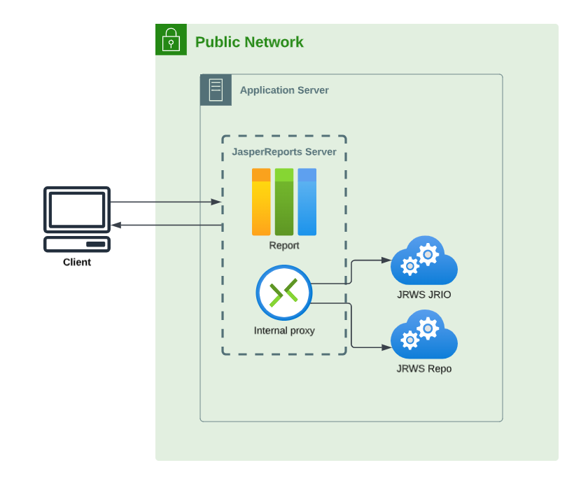
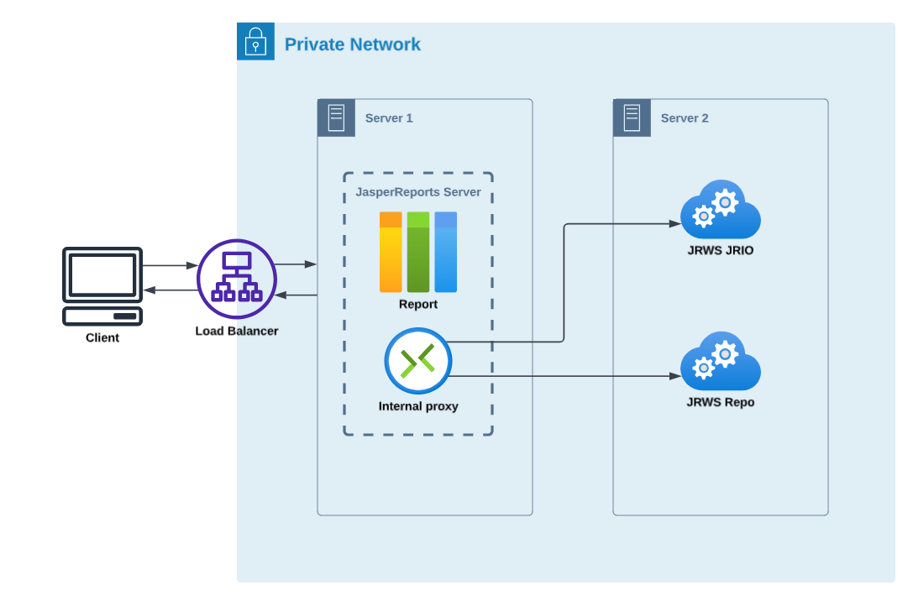

# Configuring JasperReports Web Studio Access

JasperReports Web Studio is the visual designer for creating and editing report templates for the JasperReports Library reporting engine and the whole Jaspersoft family of products that use this open source library to produce dynamic content and rich data visualizations. It comes as a web-based alternative to Jaspersoft Studio, the desktop application, which is the most complete and powerful designer for JasperReports templates.

JasperReports Web Studio can be run on its own or added to an existing JasperReports Server 8.2.0 instance as a pluggable report editing feature.

When JasperReports Web Studio is added to an existing JasperReports Server instance, two new JasperReports Web Studio applications `jrio` and `repo` are deployed along with `jasperserver-pro` in the application server.

`jrio` enables you to render reports and is used by JasperReports Web Studio for report preview.

`repo` is a JasperReports Server repository plug-in used by JasperReports Web Studio to store reports and files.

## JasperReports Server and JasperReports Web Studio jrio/repo deployment

JasperReports Web Studio `jrio` and `repo` and JasperReports Server can be deployed either in a public network or in a private network.

In a public network, the JasperReports Server and JasperReports Web Studio `jrio` and `repo` are deployed on the same application server. `jrio` and `repo` are connected to JasperReports Server using an internal proxy server. JasperReports Server can directly access `jrio` and `repo`.

*Figure 1 Deployment on public network*

In a private network, the JasperReports Server and JasperReports Web Studio `jrio` and `repo` are deployed on remote application servers, connected using an internal proxy server. This is useful when deploying in a cluster where `jrio` and `repo` applications can be accessed only by JasperReports Server instance , and not users.

JasperReports Server can access `jrio` and `repo` via backend. Hence, the connection between the JasperReports Server instance and `jrio` and `repo` must be set.

*Figure 2 Deployment on private network*

The following table describes the JasperReports Web Studio properties:

<table>
<colgroup>
<col style="width: 50%" />
<col style="width: 50%" />
</colgroup>
<thead>
<tr>
<th colspan="2">
JasperReports Web Studio Properties
</th>
</tr>
</thead>
<tbody>
<tr>
<td colspan="2">
Configuration File
</td>
</tr>
<tr>
<td colspan="2">
<code>.../WEB-INF/js.config.properties</code>
</td>
</tr>
<tr>
<td>
Property
</td>
<td>
Description
</td>
</tr>
<tr>
<td>
<code>jrws.jrio.url</code>
</td>
<td>
This URL is used to control where <code>jrio</code> is deployed. By default, the value is <code>http://localhost:8080/jrio</code>

You can set this property for JasperReports Server by providing an environment variable, using the following syntax:

<code>JRWS_JRIO_URL=http://&lt;hostname&gt;:&lt;port&gt;/jrio</code>
</td>
</tr>
<tr>
<td>
<code>jrws.repo.url</code>
</td>
<td>
This URL is used to control where <code>repo</code> is deployed. By default, the value is <code>http://localhost:8080/repo</code>

You can set this property for JasperReports Server by providing an environment variable, using the following syntax:

<code>JRWS_REPO_URL=http://&lt;hostname&gt;:&lt;port&gt;/repo</code>
</td>
</tr>
</tbody>
</table>

If environment variables are provided, they take the precedence and the values set in the `js.config.properties` file are not considered.

You can deploy the `jrio` and `repo` applications on separate server, or service too. It is useful when JasperReports Server cluster is deployed and you want to keep `jrio` and `repo` applications aside on a separate service or instance.

### Configuring JasperReports Web Studio Access

To disable access to JasperReports Web Studio access based on role, remove that role from the following property, located in the `.../WEB-INF/applicationContext-security-pro-web.xml` file:

`<security:intercept-url pattern="/webstudio/**" access="ROLE_USER,ROLE_ADMINISTRATOR" />`
