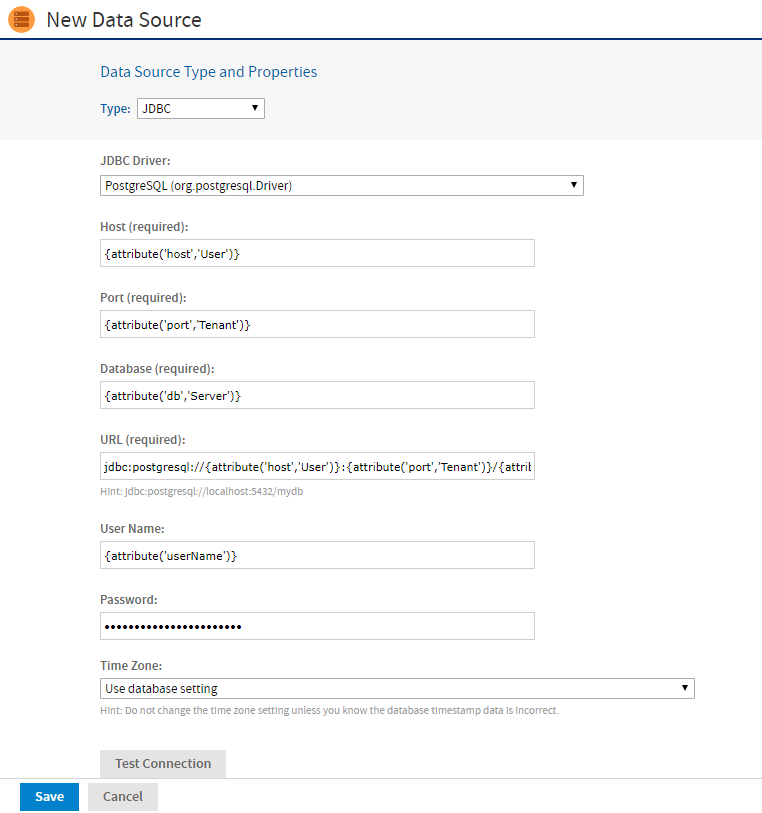

# Attributes in Data Source Definitions

You have two options for defining the parameters of a data source, such as the host and port number:

-   Define the parameters statically, so that they are the same for every user.
-   Have the server derive these parameters at run time based on the attributes you provide.

Attributes can be used to derive all data source parameters that are not selected from dropdown lists. For instructions on how to create attributes, see [Managing Attributes](../management/managing_attributes.md).

When referring to an attribute in a data source definition, you can specify the attribute categorically or hierarchically:

-   Categorical reference: If you specify a category for the attribute value, the server attempts to find that particular value of the attribute. If the attribute is not defined where specified, reports using this data source fails with an error. You can specify these attribute categories:

    -   User: In the attributes defined on the logged in user.
    -   Tenant: In the attributes defined on the organization of the logged in user.
    -   Server: In the attributes defined at the server-level.

-   Hierarchical reference: If you do not specify a category for the attribute, the server searches attributes hierarchically and uses the value of the first attribute it finds with the given name. This search starts with the logged in user, then proceeds to the user's organization and parent organizations, and finally to the server level. If the specified attribute is not found in any of these, reports using this data source fails with an error.

The following figure is an example of the attributes used to define data source parameters.

*Figure 1 Using Attributes for Data Source Parameters*

In the example above, the following data source parameters are specified by attributes:

-   `{attribute('host','User')}`: **Host** is derived categorically from the logged in user's attributes, because the "User" category is specified.
-   `{attribute('port','Tenant')}`: **Port** is derived from the logged in user's organization attributes.
-   `{attribute('db','Server')}`: **Database** name is derived from the server-level attributes.
-   **URL**: Generated automatically from the **Host, Port**, and **Database** fields.
-   `{attribute('userName')}`: **User Name** is derived hierarchically, because no category is specified. JasperReports Server looks for a host first in the logged in user's attributes, then in the organization attributes, and finally the server-level attributes.
-   `{attribute('password')}`: The **Password** field can also reference an attribute, here a hierarchical attribute.

For information about attributes on users, organizations, and the server, see [Managing Attributes](../management/managing_attributes.md).
