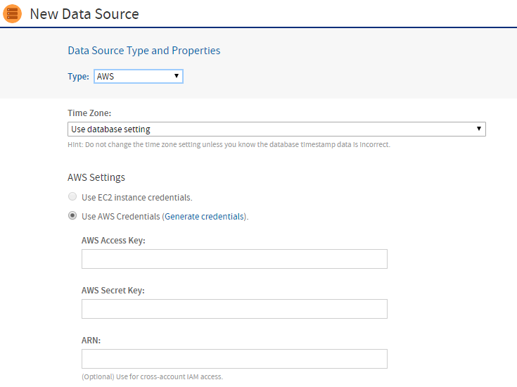
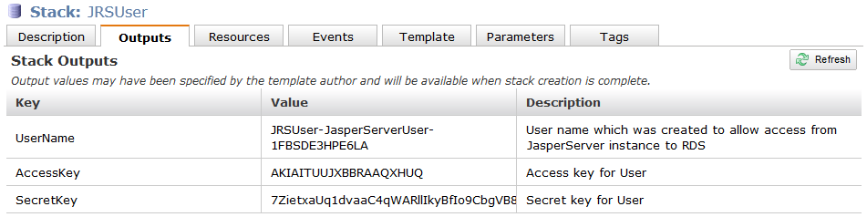
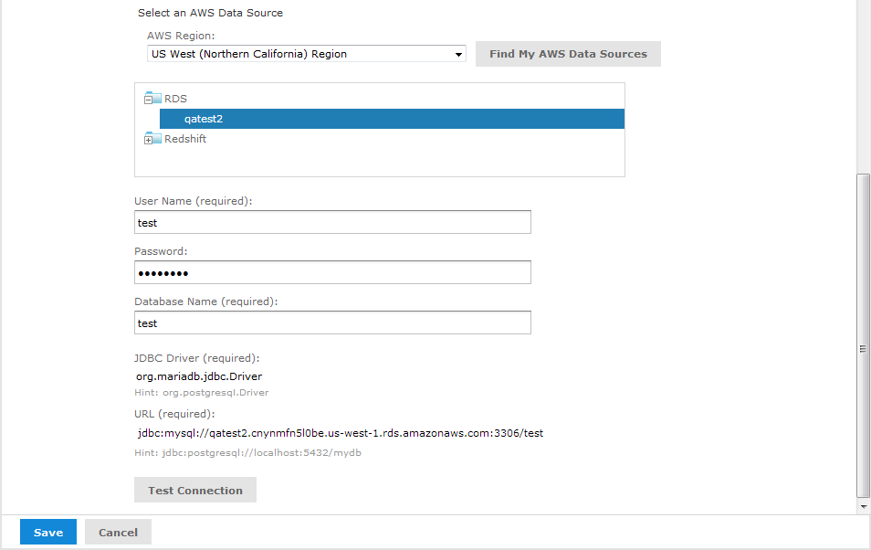

# AWS Data Sources

Amazon Web Services (AWS) provide computation and data storage on demand in the cloud. We partner with Amazon to deliver business intelligence solutions based on AWS.

JasperReports Server supports two of the AWS database services as data sources for reporting:

-   Amazon Relational Database Service (RDS)

-   Amazon Redshift data warehouse

JasperReports Server can access either of these services when you define a data source with the correct configuration information and credentials. The AWS data source wizard uses the AWS credentials that you provide to discover RDS and Redshift data sources. Then it uses those credentials to properly configure security groups to maintain the connection between JasperReports Server and the AWS data source, even when the IP address changes. You can access AWS data sources from both stand-alone server instances that you maintain on your own computers and virtual server instances that you run on Amazon's Elastic Compute Cloud (EC2). For more information, see <https://www.jaspersoft.com/cloud>.

## Creating an AWS Data Source

To create an AWS Data Source

1.  Log into JasperReports Server as an administrator.

2.  Click **View &gt; Repository**, expand the folder tree, and right-click a folder to select **Add Resource &gt; Data Source** from the context menu. Alternatively, you can select **Create &gt; Data Source** from the main menu on any page and specify a folder location later. If you installed the sample data, the suggested folder is **Data Sources**. The **New Data Source** page appears.

3.  From the **Type** dropdown, select **AWS**. The information on the page changes to reflect what is needed to define an AWS data source.

    

    *Figure 1 Selecting AWS Credentials*

4.  Under **AWS Settings**, specify your Amazon credentials in one of the following ways:

    -   If your JasperReports Server is running in Amazon's EC2 service, and it has the proper instance role assigned, the server detects this and automatically use your EC2 credentials. Using the EC2 instance credentials requires that the role was properly set up and assigned when the instance was created. If you are using the EC2 service, we strongly recommend that you use the EC2 credentials.
    -   If your JasperReports Server is not running on Amazon's EC2, enter the AWS credentials associated with the RDS or Redshift service. If you do not have AWS keys, click **Generate credentials**, then look for them on the **Outputs** tab for your Stack on the Amazon console:

    

    *Figure 2 AWS Access and Secret Keys*

5.  Under **Select an AWS Data Source**, specify the connection details of the AWS data source that you want to connect to:

    1.  Select your **AWS Region** from the dropdown.
    2.  Click the **Find My AWS Data Sources** button.<br>
        The AWS data source queries your environment and displays your available data sources, as shown in the figure below.
    3.  Select your data source.
    4.  Enter your **User Name, Password**, and **Database Name**.<br>
        The AWS data source queries your environment and adds the appropriate **JDBC Driver** and **URL**.

    

    *Figure 3 Select an AWS Data Source Section*

6.  When you have entered all the information, click **Test Connection**.<br>
    If your connection is successful, a message appears to the right of the button. Sometimes the process takes a few minutes. In that case you will see an alert. Try the test again after one or two minutes. The test performs the following actions:

    -   Validates the username and password.
    -   Creates a database security group.
    -   Adds the IP address of your JasperReports Server instance to the security group to authorize ingress to the data service (RDS or Redshift).

    If you want to control details of the security group name or specify the IP address manually because you have a complex VPC Topology, see [Configuring Cloud Services](../configuration/configuring_cloud_services.md). You can also change the default JDBC driver through the configuration.

7.  Click **Save**. The **Save** dialog appears.

8.  Enter a **Data source Name** and an optional **Description**. The **Resource ID** is generated from the name that you enter. If you have not already specified a location, expand the folder tree and select the location for your data source.

9.  Click **Save** in the dialog. The data source appears in the repository.

## Filtering the Regions For AWS Data Source

JasperReports Server automatically displays the regions associated with your AWS credentials when creating an AWS data source. You can remove regions from the **AWS Region** dropdown list by editing the .../WEB-INF/applicationContext.xml file.

For a list of the supported regions, see the AWS documentation: <https://docs.aws.amazon.com/general/latest/gr/rande.html>

To filter AWS regions for your data source

1.  Open the **.../WEB-INF/applicationContext.xml** file for editing.

2.  Locate the element **&lt;util:list id="filterAwsRegionList" list-class="java.util.ArrayList"&gt;**.

3.  Add the AWS regions that you want to remove from the dropdown list within the element. For example:

    ``` xml
    <util:list id="filterAwsRegionList" list-class="java.util.ArrayList">
       <value>us-gov-west-1.amazonaws.com</value>
       <value>us-gov-east-1.amazonaws.com</value>
    </util:list>
    ```

4.  Save the file.

5.  Restart JasperReports Server.
