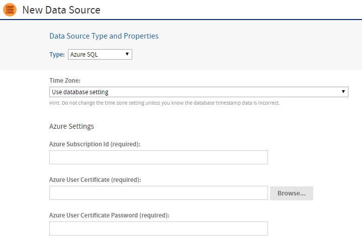
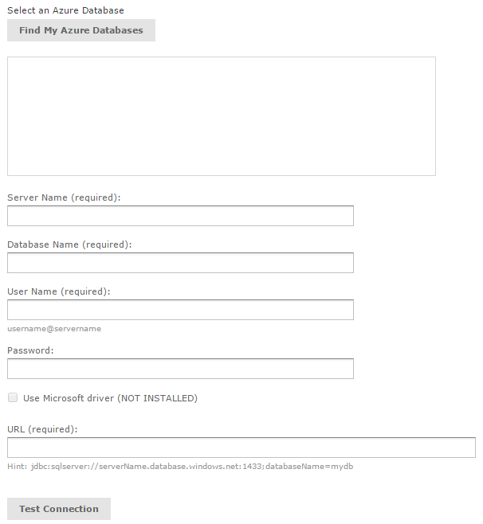

# Azure SQL Data Sources

Microsoft Azure provides data storage in the cloud as a service. Microsoft offers different types of storage options for Azure users, but only the Azure SQL Server database service is currently supported. JasperReports Server uses the Microsoft SQL Server JDBC driver (`com.microsoft.sqlserver.jdbc.SQLServerDriver`), a management certificate, and your credentials to create a secure connection between JasperReports Server and the Azure SQL data source.

## Uploading an Azure Certificate File to the Repository

Before you can create an Azure SQL data source, you will need a management certificate to authenticate JasperReports Server with Azure. The management certificate must be a `x.509` certificate and can be either self-signed or signed by a trusted certificate authority. The certificate can use a public or private key. You will need to upload the management certificate (`.cer`) file to the Azure Management Portal and the key exchange (`.pfx`) file, which contains the server certificate and the key, to JasperReports Server. You can also store a server certificate (`.cer`) file in the repository.

To upload a certificate file to the repository

1.  Log into JasperReports Server as an administrator.
2.  Click **View &gt;Repository** and expand the folder tree.
3.  Browse to the folder where you want to save the certificate.
4.  Right-click the folder and select **Add Resource &gt; File &gt; Azure Certificate** from the context menu.
5.  Click **Choose File** to locate and upload the certificate key exchange (`.pfx`) or server certificate (`.cer`) file.
6.  Enter a name and resource ID for the file.
7.  Click **Submit** to save the file to the repository.

## Creating an Azure SQL Server Data Source

The data source wizard uses the Azure credentials that you provide to discover your Azure SQL Server databases. It then uses those credentials to properly configure access rules to maintain the connection between JasperReports Server and the data source. For information on configuring access rules for Azure, see [Configuring Cloud Services](../configuration/configuring_cloud_services.md).

To create an Azure SQL data source

1.  Log into JasperReports Server as an administrator.

2.  Click **View &gt; Repository**, expand the folder tree, and right-click a folder to select **Add Resource &gt; Data Source** from the context menu. Alternatively, you can select **Create &gt; Data Source** from the main menu on any page and specify a folder location later. If you installed the sample data, the suggested folder is **Data Sources**. The **New Data Source** page appears.

3.  From the **Type** dropdown, select **Azure SQL**. The information on the page changes to reflect what's needed to define an Azure SQL data source.

    

    *Figure 1 Entering Azure User Information*

4.  Under **Azure Settings**, enter your **Azure Subscription ID, user certificate (.pfx) file**, and **Azure User Certificate**. Click **Browse** to select the certificate file from your repository. See [Uploading an Azure Certificate File to the Repository](#uploading-an-azure-certificate-file-to-the-repository) for instructions on uploading the certificate file.

5.  Under **Select an Azure Database**, specify the connection details of the Azure database that you want to connect to:

    1.  Click the **Find My Azure Databases** button. 
        JasperReports Server queries Azure and displays your available SQL Server databases.
    2.  Select your database.
    3.  Enter your server name, database name, user name, and database name. 
        The Azure data source queries your environment and adds the appropriate URL.
    4.  If you have Microsoft's JDBC driver for SQL Server installed on your JasperReports Server instance, you can choose to use it instead of the existing JDBC driver by checking **Use Microsoft Driver**.

    

    *Figure 2 Selecting an Azure SQL Data Source*

6.  When you've entered all the information, click **Test Connection**. 
    If your connection is successful, a message appears to the right of the button. Sometimes the process takes a few minutes. In that case you'll see an alert. Try the test again after one or two minutes. The test performs the following actions:

    -   Validates the user name and password.

    -   Creates firewall access rules to authorize ingress to the data service.

    -   Adds the IP address of your JasperReports Server instance to the access rule.

        If you want to control details of the access rule name or specify the IP address manually, see [Configuring Cloud Services](../configuration/configuring_cloud_services.md).

7.  Click **Save**. The **Save** dialog appears.

8.  Enter the **Data source name** and an optional description. The **Resource ID** is generated from the name you enter. If you haven't already specified a location, expand the folder tree and select the location for your data source.

9.  Click **Save** in the dialog. The data source appears in the repository.
