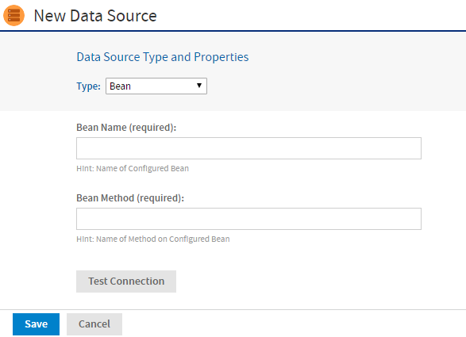

# Bean Data Sources

The bean data source type is a key extension because it allows you to make use of any custom or exotic data that you might need to report on. Bean data sources serve as a bridge between a Spring-defined bean and a JasperReport. The Spring bean is responsible for providing the data or parameters that fill the report.

To use a bean data source, you must first configure the underlying Spring bean and make it available in the server's web application context. For example, you would add a bean definition to one of the .../WEB-INF/applicationContext\*.xml files.

The bean must resolve to a `ReportDataSourceService` instance, either directly or by way of a factory no-argument method. You can use any Spring instantiation method (for example, a constructor or factory) and bean scope (for example, singleton or prototype) for the data source service bean.

The `ReportDataSourceService` instance is responsible for supplying data source parameters to the JasperReport. Custom `ReportDataSourceService` implementations can follow two approaches:

- If the implementation can provide the data to be used to fill a report, it needs to wrap the data into a suitable `JRDataSource` implementation and pass the data using the `REPORT_DATA_SOURCE` report parameter.

- If the data comes from the report query by way of a JasperReports query executor, the data source service must set values for the connection parameters defined by the query executor. The connection parameters are usually obtained from the properties of the data source service instance.

For example, you could implement a Hibernate data source service that would be injected in a session factory. The factory would create a Hibernate session that would be passed as a value for the `HIBERNATE_SESSION` parameter. The JasperReports Hibernate query executor then uses the parameter to run the HQL report query.

The `ReportDataSourceService` interface contains two methods: `setReportParameterValues` and `closeConnection`. The former provides data and connection parameter values; the latter is required to close and release any resources or connections created during the call to `setReportParameterValues`.

As of JasperReports Server 6.0, there have been some changes to bean data sources that might affect your custom code. If your custom data sources generate errors after upgrading, see the troubleshooting section [Upgrading Bean Data Sources](../troubleshooting/working_with_data_sources.md).

Once the data source service bean is available through Spring, you can add the bean data source to the repository.

To create a bean data source

1.  Log on as an administrator.

2.  Click **View \> Repository**, expand the folder tree, and right-click a folder to select **Add Resource \> Data Source** from the context menu. Alternatively, you can select **Create \> Data Source** from the main menu on any page and specify a folder location later. If you installed the sample data, the suggested folder is Data Sources. The **New Data Source** page appears, as shown in the figure below.

3.  From the **Type** dropdown, select **Bean**. The information on the page changes to reflect what's needed to define a bean data source.

4.  Enter the **Bean Name**. If the data source service is to be instantiated through a factory method of the Spring bean, you should also enter the name of the method.

    

    *Figure 1: Bean Data Source Page*

5.  Click **Test Connection** to validate the data source. If the validation fails, ensure that the values you entered are correct and that the bean is in the classpath.

6.  When the test is successful, click **Save**. The **Save** dialog appears.

7.  Enter the **Data source name** and an optional description. The **Resource ID** is generated from the name you enter. If you haven't already specified a location, expand the folder tree and select the location for your data source.

8.  Click **Save** in the dialog. The data source appears in the repository.
