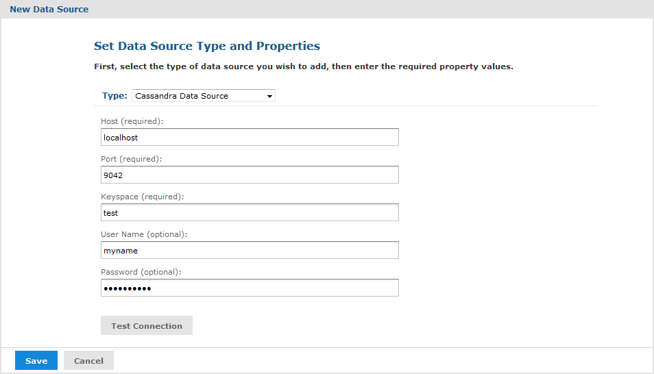

# Cassandra Data Sources

The Apache Cassandra database provides scalability and high availability for certain applications of big data. JasperReports Server includes a JDBC driver for the Cassandra database. See [JDBC Data Sources](jdbc_data_sources.md) for information on creating a JDBC data source.

JasperReports Server also includes a native Cassandra driver, which has been deprecated and should only be used for existing Cassandra data sources. It does not appear in the list of available data source types and it can only be enabled by editing the .../WEB-INF/applicationContext-remote-services.xml file.

The native driver for the Cassandra data source has certain limitations on how your data can be structured and accessed:

- The current version of Cassandra does not support NULL values in the data. All required fields must have non-NULL default values. This also means that input controls cannot be null and must be given a value.
- The current version of the driver does not support aggregate functions (sum, min, max).
- For query parameters, the current version of the driver supports \$X(IN...), but no other \$X functions.

The Cassandra data source supports queries in the Cassandra Query Language 3 (CQL3). To improve performance, design your Cassandra data using the following guidelines:

- Specify the `ALLOW FILTERING` suffix to speed up queries.
- All fields referenced in `WHERE` clauses of a query should be indexed.

As with all big data stores, Cassandra data sources have the following limitations and usage guidelines within JasperReports Server:

- Cassandra data sources are not supported for OLAP connections.
- Cassandra data sources cannot be used directly in Domains unless you are using the JDBC driver. To use a Cassandra data source with a native driver in a Domain, see [Creating Cassandra Data Connectors](virtual_data_sources.md).
- Cassandra data sources can be used in Ad Hoc Topics, but they do not support query optimization.
- You must configure your query limits to handle big data (see [“Ad Hoc Data Policies for Big Data” on page 1](../configuration/configuring_ad_hoc.md)).
- You must configure your JVM memory to handle the expected amount of data (see the JasperReports Server Installation Guide).

!!! note

    Unlike the native driver, the JDBC driver allows access to Cassandra data sources through a Domain, Domain Topic, Ad Hoc view, and Ad Hoc report without needing to create a virtual data source.

For more information about Cassandra, see <http://cassandra.apache.org/>.

## Creating a Cassandra Data Source with the Native Cassandra Driver

1.  Log on as an administrator.

2.  Click **View \> Repository**, expand the folder tree, and right-click a folder to select **Add Resource \> Data Source** from the context menu. Alternatively, you can select **Create \> Data Source** from the main menu on any page and specify a folder location later. If you installed the sample data, the suggested folder is Data Sources. The New Data Source page appears.

3.  In the Type field, select **Cassandra Data Source**. The information on the page changes to reflect what's needed to define a Cassandra data source.

    You have the option to use attributes in the values of data source parameters. See ["Attributes in Data Source Definitions"](attributes_in_data_source_definitions.md).

    

    Cassandra Data Source Page

4.  Fill in the required fields, along with any optional information you choose.

    Use port 9042 with the Cassandra data source. Cassandra's default port of 9160 is for the Thrift client that is commonly used with Cassandra. To use the Cassandra Query Language (CQL) with our Cassandra data source, you may need to configure your Cassandra instance as follows:

    `start_native_transport: true`

    `native_transport_port: 9042`

5.  If you have configured your Cassandra source to be password protected, specify a valid username and password. Due to compatibility issues, Cassandra authentication is supported only when you use Cassandra 1.12.18 and above.

6.  Click **Test Connection** to check the values you entered. Make sure that the port is set to 9042, because the connection test will also work with the wrong port (9160).

7.  When done, click **Save**. The Save dialog appears.

8.  Enter a name for the data source and an optional description. The Resource ID is generated from the name you enter. If you haven't already specified a location, expand the folder tree and select the location for your data source.

9.  Click **Save** in the dialog. The data source appears in the repository.

## Increasing File Descriptor Limits for Cassandra

Many users have reported errors when viewing multiple reports from a Cassandra data source. Cassandra generally needs more than the default limit of open file descriptors (1024).

To increase the number of file descriptors, administrators need to change the security limits on the Cassandra nodes and on the operating systems running JasperReports Server.

To test this configuration, you can increase the limits for the current session with the following Linux commands:

`sudo ulimit -Hn 32768`

or

`sudo ulimit -Sn 32768`

The effects of the commands above will be reset when the computer restarts. To make the changes permanent, edit the file /etc/security/limits.conf to add the following settings:

<table>
<colgroup>
<col style="width: 100%" />
</colgroup>
<tbody>
<tr>
<td>
<pre><code>* soft nofile 32768
* hard nofile 32768
root soft nofile 32768
root hard nofile 32768
* soft memlock unlimited
* hard memlock unlimited
root soft memlock unlimited
root hard memlock unlimited
* soft  unlimited
* hard unlimited
root soft unlimited
root hard unlimited</code></pre>
</td>
</tr>
</tbody>
</table>
