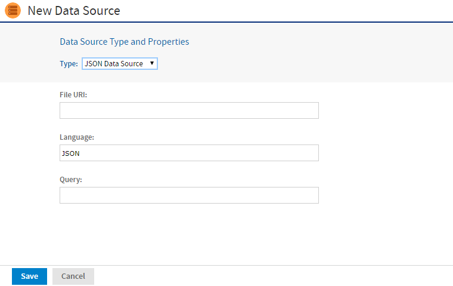

# File Data Sources

File-based data sources read a text file in JSON, XML, or XMLA format and allow you to query its contents as a relational table. A text file in JSON format may be stored in the server's repository, in the server's file system. While a text file stored in JSON, XML, or XMLA format can be accessed from a URL. This means you can create a data source based on data retrieved from websites and even REST APIs.

Domains support file-based data sources, such as text files in JSON and XML format as well as Excel files. These file-based data sources support features domain-related features like returning JDBC metadata, creating derived tables, supporting calculated fields, domain pre-filtering, joining other data sources in a virtual data source, and full support in the Domain Designer.

Older file-based data sources, which presented domain data in a single flat table and lack the features of the newer data sources, appear in the Type dropdown menu with `(Before 6.4)` next to their names.

By default file data sources do not appear in the New Data Source dialog and must be enabled first.

The following file-based data sources are available:

- Remote XML data source (Simple single-table support and full domain support)

- JSON data source (Simple single-table support and full domain support)

- JSON Series data source (Simple single-table support)

- JSONQL (JSON Query Language) data source (Simple single-table support and full domain support)

- Text (CSV) data source (Full domain support)

- XMLA Query data source (Simple single-table support)

!!! note

    If there are two versions of a file-based data source type in the .../WEB-INF/applicationContext-remote-services.xml file, the version with full domain support has a `2` at the end of its name.

To enable file data sources in the UI

1.  Open the file `.../WEB-INF/applicationContext-remote-services.xml` for editing.
2.  Locate the element `<util:set id="customDataSourcesToHide">`.
3.  Comment out the file data sources that you want to display.
4.  Save the file and restart JasperReports Server.

In the following example, the JSON with simple domain and full domain support is commented out so it appears in the Type dropdown:

``` xml
    <util:set id="customDataSourcesToHide">
        <!-- value>remoteXmlDataSource2</value>
        <!-- value>remoteXmlDataSource</value>
        <value>mongoDBQueryDataSource2</value>
        <value>mongoDBQueryDataSource</value>
        <!-- value>jsonDataSource2</value>
        <!-- value>jsonDataSource</value>
        <value>jdbcQueryDataSource2</value>
        <value>jdbcQueryDataSource</value>
        <!-- value>xlsDataSource</value>
        <!-- value>xlsxDataSource</value>
        <value>textDataSource</value>
        <value>JsonSeriesDataSource</value>
        <value>xmlaQueryDataSource</value>
    </util:set>
```

After file data sources are enabled, you can create a file data source.

!!! note

    The headers in data source text files must not be blank and cannot contain spaces or special characters other than underscores.

    To upload a JSON file to the JasperReports Server repository, you must save it with the .xml extension on your computer. Then create an XML file resource and select your JSON.xml file. Give your resource a name such as MyDataFile_JSON so you can find it. The repository calls it an XML file, but the data source can interpret the JSON contents.

To create a file data source

1.  Log in as an administrator.

2.  Click **View \> Repository**, expand the folder tree, and right-click a folder to select **Add Resource \> Data Source** from the context menu. Alternatively, you can select **Create \> Data Source** from the main menu on any page and specify a folder location later. If you installed the sample data, the suggested folder is **Data Sources**. The **New Data Source** page appears.

3.  From the **Type** dropdown, select a file data source that you enabled, for example **JSON Data Source** or **Remote XML Data Source**. In this example, we create a JSON data source. The fields on the page change to reflect what is needed to define a file data source.<br>
    You have the option to use attributes in the values of data source parameters. See [Attributes in Data Source Definitions](attributes_in_data_source_definitions.md).

    

    *Figure 1: File Data Source Page for a JSON Data Source*

4.  Enter the URI of the JSON file. You can specify a file in the repository with the `repo:` syntax, followed by the repository path of the file. Specify `ftp:`, `http:` or `https:` to use those Internet protocols. To specify a file on your server's file system, specify its path directly, starting from the root, for example `/tmp/MyDataFile.json`. The user running the server process must have permission to access the file.

5.  You can specify an optional query to limit or select the data accessible through the data source. The query has the following syntax:<br>

    ``` xml
    <tableName> or <tableName>/<fieldName>
    ```

    where:

    \<tableName\> corresponds to an XML element or JSON structure name

    \<fieldName\> corresponds to an XML sub-element or JSON field name

6.  Click **Save**. The **Save** dialog appears.

7.  Enter the **Data source name** and an optional description. The Resource ID is generated from the name that you enter. If you have not already specified a location, expand the folder tree and select the location for your data source.

8.  Click **Save** in the dialog. The data source appears in the repository.

Once you have defined a file data source:

- You can use SQL queries in reports to access the data as a relational table.
- You can create a Domain on a file data source, allowing you to alter the visibility and names of the fields extracted from the file. On the Display tab of the Domain Designer, you can also specify which fields are measured.
- You can create Ad Hoc views using the Domain based on your file data source, allowing you to explore and interact with data from the file.
- You can create virtual data sources that combine several file data sources, even different file formats such as XML and JSON, as long as their data structure is compatible so the tables can be joined. You can then create a Domain based on the virtual data source to join the tables and access the joined data in Ad Hoc views and reports.

## Enabling JasperReports Server XMLA Server

The XMLA server component is disabled by default. JasperReports Server can still receive and process data from a Mondrian XMLA data source as a client, but that XMLA connection can no longer be used as a server to define a second data source. If you have reports based on such a datasource, they must be modified to use the Mondrian XMLA data source directly.

It is strongly encouraged to keep the JasperReports Server XMLA Server disabled for security considerations. However, the XMLA Server can be re-enabled through the following steps:

1.  Edit **web.xml**.

2.  Find `JasperXmlaServlet3`.

3.  Uncomment the servlet definition and mapping to:

    ``` xml
    <servlet>
    <servlet-name>JasperXmlaServlet</servlet-name>
    <servlet-class>com.jaspersoft.jasperserver.war.xmla.XmlaServletImpl</servlet-class>
    <load-on-startup>50</load-on-startup>
    </servlet>
    <servlet-mapping>
    <servlet-name>JasperXmlaServlet</servlet-name>
    <url-pattern>/xmla</url-pattern>
    </servlet-mapping>
    ```

4.  Restart the server.
