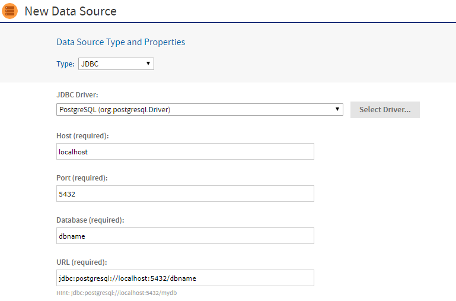
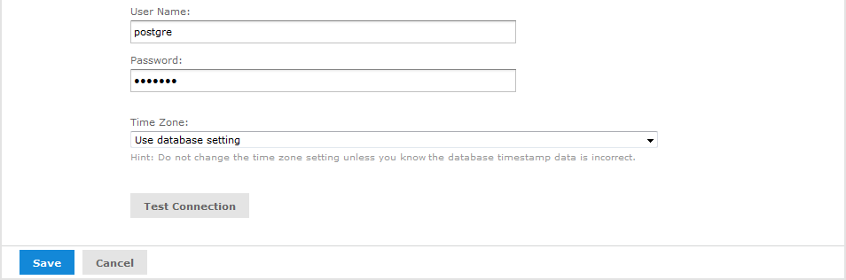
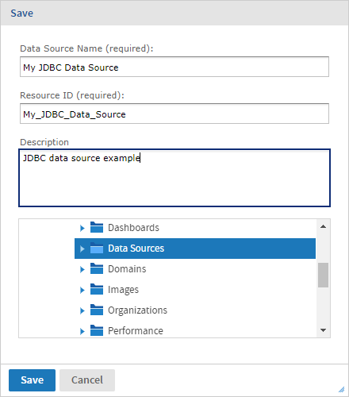

# JDBC Data Sources

JDBC data sources are direct connections to your database managed by JasperReports Server. To create one, you must provide the URL and credentials to access your database, along with any database-specific configuration parameters.

JasperReports Server includes JDBC drivers for the most used databases. If your database is not included, or if you want to use different JDBC drivers, the system administrator must upload the appropriate JDBC driver before creating a data source. For more information on JDBC drivers, see [Managing JDBC Drivers](managing_jdbc_drivers.md).

To create a JDBC data source

1.  Log on as an administrator.

2.  Select **View &gt; Repository**, right-click a folder's name, and select **Add Resource &gt; Data Source** from the context menu. Alternatively, you can select **Create &gt; Data Source** from the main menu on any page and specify a folder location later. If you installed the sample data, the suggested folder is Data Sources. The **New Data Source** page appears.

3.  In the **Type** field, select **JDBC**. The page refreshes to show the fields required for a JDBC data source.

    

    *Figure 1: Setting the JDBC Data Source Type*

4.  Select the **JDBC Driver** for your database. If your driver is listed as **NOT INSTALLED**, a system administrator must first upload the driver as described in [Managing JDBC Drivers](managing_jdbc_drivers.md).

    !!! note

        Jaspersoft provides a set of JDBC drivers in the installed server. These drivers support a slightly different SQL syntax. If you see errors when running reports or creating domains that use scalar functions, see [Working With Data Sources](../troubleshooting/working_with_data_sources.md).

5.  Enter the **Hostname, Port**, and **Database** name for your database. The default hostname is localhost, and the default port is the typical port for the specified database vendor. The three fields are combined automatically to create the JDBC URL where the server will access the database. When specifying values for your JDBC data source:

    -   The JDBC drivers for some databases have their own unique fields and optional URL parameters. These are described in [Unique JDBC Data Source Fields](../troubleshooting/working_with_data_sources.md) and [JDBC Database URLs](../troubleshooting/working_with_data_sources.md).
    -   You have the option to use attributes in the values of data source parameters. See [Attributes in Data Source Definitions](attributes_in_data_source_definitions.md).

6.  Fill in the **Database, User Name** and **Password**. These are the credentials the server will use to access the database.

    

    *Figure 2: Entering the User Name and Password*

    !!! note

        The database user needs the privileges to run SELECT queries on the tables used in your reports. The server blocks any DROP, INSERT, UPDATE, and DELETE SQL commands through its SQL injection protection. In some cases, additional permissions may be required to execute stored procedures, depending on your configuration and needs. For more information, see [Database Permissions](../troubleshooting/working_with_data_sources.md).

7.  If the date-time values stored in your database do not indicate a time zone, set the **Time Zone** field. When in doubt, leave the default **Time Zone** value (**Use database setting**). 
    When date-time values are stored in a format other than local time zone offset relative to Greenwich Mean time (GMT), you must specify a time zone so that the server can properly convert date-time values read from the target database. Set the **Time Zone** field to the correct time zone for the data in the database. The list of time zones is configurable, as described in [Specifying Additional Time Zones](../localization/offering_a_locale.md).

8.  Click **Test Connection** to validate the data source. If the validation fails, ensure that the values you entered are correct and that the database is running. To diagnose JDBC connection issues, you can turn on logging as described in the troubleshooting section [Logging JDBC Operations](../troubleshooting/working_with_data_sources.md).

9.  When the test is successful, click **Save**. The **Save** dialog appears.

    

    *Figure 3: Saving the JDBC Data Source*

10. Enter a name for the data source and an optional description. The **Resource ID** is generated from the name you enter. If you haven't already specified a location, expand the folder tree and select the location for your data source.

11. Click **Save** in the dialog. The data source appears in the repository.

## Creating a Trino Data Source

To create a Trino data source

1.  Add the JAR as explained in the section [Adding a Trino JDBC Driver](managing_jdbc_drivers.md).
2.  Enter URL as: `jdbc:trino://<host>:<port>`
3.  You can also refer to the [Trino documentation](https://trino.io/docs/current/client/jdbc.html#connecting) to get information on JDBC URL formats supported by Trino.
4.  Enter **username**: *admin* and leave **password** as blank.
5.  Click **Test connection**.
6.  Once passed, click **Save** to save the data source in the repository.
