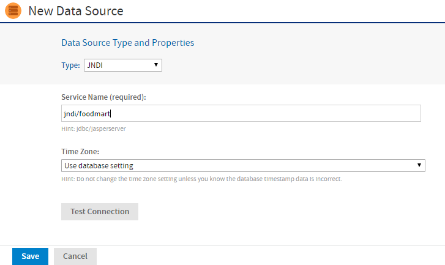

# JNDI Data Sources

The JNDI data source accesses a database connection previously defined in the application server and published as a resource or service through JNDI (Java Naming and Directory Interface). Instead of specifying a driver and database as you do with JDBC data sources, you need to specify only the JNDI service name in your application server.

!!! note

    Application servers use JDBC connections themselves to expose a database through JNDI. You must specify the JNDI service name of a JDBC connection. Your application server must also have the appropriate JDBC drivers and be configured to use them. Ensure the database user in your JNDI definition has the privileges to run SELECT queries on the tables used in your reports. In some cases, additional permissions may be required to run stored procedures, depending on your configuration and needs. For more information, see [Database Permissions](../troubleshooting/working_with_data_sources.md).

For information about setting up a JNDI connection in your application server, see the following sections:

- [JNDI Services on Apache Tomcat](../troubleshooting/working_with_data_sources.md)

- [JNDI Services on JBoss](../troubleshooting/working_with_data_sources.md)

- [JNDI Services on WebLogic](../troubleshooting/working_with_data_sources.md)

To create a JNDI data source

1.  Log in as an administrator.

2.  Click **View \> Repository**, expand the folder tree, and right-click a folder to select **Add Resource \> Data Source** from the context menu. Alternatively, you can select **Create \> Data Source** from the main menu on any page and specify a folder location later. If you installed the sample data, the suggested folder is Data Sources. The New Data Source page appears.

3.  In the **Type** field, select **JNDI**. The information on the page changes to reflect what is needed to define a JNDI data source.

4.  Fill in the **Service Name**. This is the name the application server exposes through JNDI. 
    You have the option to use attributes in the service name. See [Attributes in Data Source Definitions](attributes_in_data_source_definitions.md).

    

    *Figure 1: JNDI Data Source Page*

5.  If the date-time values stored in your database do not indicate a time zone, set the Time Zone field. When in doubt, leave the default Time Zone value (**Use database setting**).

    When date-time values are stored in a format other than local time zone offset relative to Greenwich Mean Time (GMT), you must specify a time zone so that the server can properly convert date-time values read from the target database. Set the **Time Zone** field to the correct time zone for the data in the database. The list of time zones is configurable, as described in [Specifying Additional Time Zones](../localization/offering_a_locale.md).

6.  Click **Test Connection** to validate the data source. If the validation fails, ensure that the values you entered are correct, that the database is exposed through JNDI, and that the database is running. Also see the troubleshooting section [JNDI Services on Apache Tomcat](../troubleshooting/working_with_data_sources.md).

7.  When the test is successful, click **Save**. The **Save** dialog appears.

8.  Enter a name for the data source and an optional description. The **Resource ID** is generated from the name you enter. If you have not already specified a location, expand the folder tree and select the location for your data source.

9.  Click **Save** in the dialog. The data source appears in the repository.
