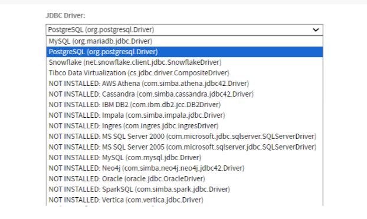
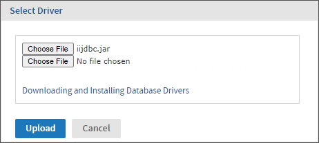
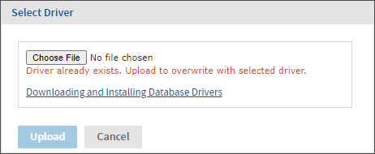
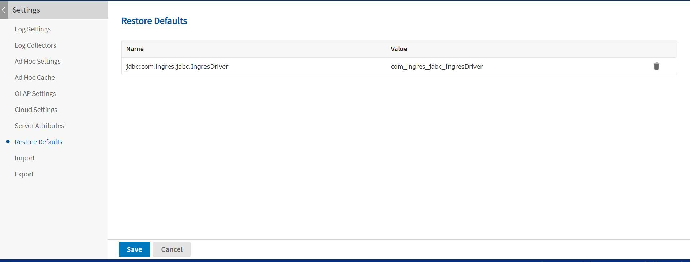

# Managing JDBC Drivers

To access a database from JasperReports Server using JDBC, you need an appropriate driver that is accessible in the server's classpath. The following drivers are pre-configured by default:

-   Snowflake (`net.snowflake.client.jdbc.SnowflakeDriver`)

-   Hive (`com.cloudera.hive.jdbc.HS2Driver`)

-   SparkSQL (`com.ddtek.jdbc.sparksql.SparkSQLDriver`)

-   Impala (`com.cloudera.impala.jdbc.Driver`)

-   Neo4j (`com.simba.neo4j.jdbc.Driver`)

-   Elasticsearch (`org.elasticsearch.xpack.sql.jdbc.EsDriver`)

-   Cassandra (`com.simba.cassandra.jdbc42.Driver`)

-   Native MongoDB

Drivers for other databases can be downloaded from links on the [Jaspersoft community website](http://community.jaspersoft.com/wiki/downloading-and-installing-database-drivers):

The system administrator (`superuser`) can add JDBC drivers for other databases in the following ways:

-   During installation. For more information, see the JasperReports Server Installation Guide.

-   Through the UI, if the setting is enabled in `js.config.properties`. As described in the following procedures, the system admin can add, replace, or remove JDBC drivers through the user interface, without needing to restart the server.

By default, no one can upload or update JAR files for JDBC drivers from the UI. Only the system administrator (`superuser`) can enable the setting and then manage the JDBC drivers, but once uploaded, the JDBC drivers are available to all administrators who create data sources. For more information, see the following sections:

-   Enabling JDBC Driver Uploads

-   Adding a JDBC Driver

-   Updating a JDBC Driver

!!! note

    JasperReports Server includes a JDBC driver for ElasticSearch that is not enabled by default. For information on enabling the driver and its limitations, see [Enabling the JDBC Driver for ElasticSearch Data Sources.](../troubleshooting/working_with_data_sources.md)

!!! note

    JasperReports Serveralso supports Trino. Trino drivers are not installed by default in JasperReports Server. Refer to Trino's [JDBC driver](https://trino.io/docs/current/client/jdbc.html#installing) documentation for more information. For instructions on uploading Trino drivers, see Adding a Trino JDBC Driver.

## Enabling JDBC Driver Uploads

By default, no one can upload or modify JAR files for JDBC drivers from the UI. Only the system administrator (`superuser`) can enable the setting and then manage the JDBC drivers, but once uploaded, the JDBC drivers are available to all administrators who create data sources.

To enable JAR upload

1.  Open the `./jasperserver-pro/WEB-INF/js.config.properties` file for editing.

2.  Set the `jdbc.driver.upload.enabled` property as follows:

    ``` properties
    jdbc.driver.upload.enabled=true
    ```

3.  Save the file and restart JasperReports Server.

Result: The **Select Driver** button should be enabled.

To disable JAR upload

1.  Open the `./jasperserver-pro/WEB-INF/js.config.properties` file for editing.

2.  Set the `jdbc.driver.upload.enabled` property as follows:

    ``` properties
    jdbc.driver.upload.enabled=false
    ```

3.  Save the file and restart JasperReports Server.

Result: The **Select Driver** button for JAR upload should be disabled.

For more information, see the following sections:

-   Adding a JDBC Driver

-   Updating a JDBC Driver

!!! note

    After uploading a JDBC driver, Jaspersoft recommends disabling driver uploads again for security reasons. This avoids the risk of drivers being accidentally modified or malicious JAR files being uploaded

## Adding a JDBC Driver

1.  Log in as the system administrator (`superuser`).

2.  Enable JDBC driver uploads, as described in Enabling JDBC Driver Uploads.

3.  Select **View &gt; Repository**, right-click a folder's name, and select **Add Resource &gt; Data Source** from the context menu. Alternatively, you can select **Create &gt; Data Source** from the main menu on any page.

4.  In the **Type** field, select **JDBC Data Source**. The page refreshes to show the fields necessary for a JDBC data source.

5.  The **JDBC Driver** dropdown shows the available JDBC drivers and those that are not installed.

    

    *Figure 1: Viewing the List of Available JDBC Drivers*

6.  Select the driver that has not been installed, then click **Select Driver**. The **Select Driver** dialog appears.

7.  If you have not yet obtained the driver, click the link to Jaspersoft's community website for [Downloading and Installing Database Drivers](http://community.jaspersoft.com/wiki/downloading-and-installing-database-drivers). That page has links to the most commonly used JDBC drivers. After you download a driver to your file system, you can return to the **Select Driver** dialog.

    

    *Figure 2: Adding a JDBC Driver*

8.  In the **Select Driver** dialog, click **Browse** to locate the appropriate driver JAR file. If your driver has more than one JAR file, click the **Browse** button that appears after selecting the first file.

9.  Click **Upload** to install the driver and make it available immediately.

You can replace any driver that you upload with newer versions of the same driver. If you want to use the vendor's own driver instead of the JDBC driver, you can install it as a new driver as described in the JasperReports Server Installation Guide.

## Updating a JDBC Driver

1.  Log in as the system administrator (`superuser`).

2.  Enable JDBC driver uploads, as described in Enabling JDBC Driver Uploads.

3.  Select **View &gt; Repository**, right-click a folder's name, and select **Add Resource &gt; Data Source** from the context menu. Alternatively, you can select **Create &gt; Data Source** from the main menu on any page.

4.  In the **Type** field, select **JDBC Data Source**.

5.  The page refreshes to show the fields necessary for a JDBC data source.

6.  The **JDBC Driver** dropdown selector shows the available JDBC drivers and those that are not installed.

7.  To update a driver that has already been installed, select it from the list, then click **Select Driver**. The **Select Driver** dialog appears and notifies you that selecting a driver will overwrite the existing one.

    

    *Figure 3: Updating a JDBC Driver*

8.  In the **Select Driver** dialog, click **Browse** to locate the JAR file for the new driver.

9.  Click **Upload** to replace the existing driver and make it available immediately.

10. You can now use this driver to create a data source, and the driver will be installed when other administrators create data sources.

## Removing an Uploaded JDBC Driver

1.  Log in as the system administrator (`superuser`).

2.  Select **Manage &gt; Server Settings** and choose **Restore Defaults** from the left-hand panel.

3.  Locate the driver you uploaded in the list of properties. The drivers with the value **\[SYSTEM\]** are the default drivers configured at installation time. Do not remove the **\[SYSTEM\]** drivers.

4.  Click  beside the driver that you want to remove, then confirm your choice.

    

    *Figure 4: Removing an Uploaded JDBC Driver*

5.  Click **Save** to save your changes.

!!! note

    If the JDBC driver you remove is one that updated a default driver, the default driver will reappear as an installed driver the next time you use the New Data Source wizard.
