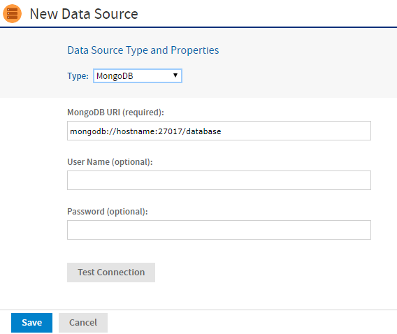

# MongoDB Data Sources

MongoDB is a big data architecture based on the NoSQL model that is not relational or SQL-based. We provide connectors that allow reports to use a MongoDB data source or a MongoDB JDBC data source. Reports based on MongoDB data sources can be used as Topics that allow users to create Ad Hoc views based on the fields returned by the MongoDB query. JasperReports Server also supports Kerberos, SSL, and x509 authentication for MongoDB data sources.

As with all big data stores, MongoDB data sources have the following limitations and usage guidelines within JasperReports Server:

- MongoDB data sources are not supported for OLAP connections.

- MongoDB data sources cannot be used directly in Domains. To use MongoDB in a Domain, see [Creating a MongoDB JDBC Data Source](mongodb_data_sources.md).

- MongoDB data sources can be used in Ad Hoc Topics, but they do not support query optimization.

- You must configure your query limits to handle big data (see [Ad Hoc Data Policies for Big Data](../configuration/configuring_ad_hoc.md)).

- You must configure your JVM memory to handle the expected amount of data (see the JasperReports Server Installation Guide).

## Creating a MongoDB Data Source with the Native MongoDB Driver

!!! note

    MongoDB data sources do not support virtual data sources when using the native MongoDB driver. For virtual data support, Create a MongoDB JDBC data source. See Creating a MongoDB JDBC Data Source.

To create a MongoDB data source with the native driver

Follow these steps to create a MongoDB data source with the native MongoDB driver.

1.  Log in as an administrator.
2.  Click **View \> Repository**, expand the folder tree, and right-click a folder to select **Add Resource \> Data Source** from the context menu. Alternatively, you can select **Create \> Data Source** from the main menu on any page and specify a folder location later. If you have installed the sample data, the suggested folder is Data Sources. The **New Data Source** page appears.
3.  From the **Type** field, select **MongoDB**. The information on the page changes to reflect what is needed to define a MongoDB data source.<br>
    You have the option to use attributes in the values of data source parameters. See [Attributes in Data Source Definitions](attributes_in_data_source_definitions.md).



*Figure 1: MongoDB Data Source Page*

4.  Fill in the required fields, along with any optional information.<br>
    The MongoDB URI has the form:

    `mongodb://<hostname>:27017/<database>`

    To enable SSL, include the argument `ssl=true` in the URI. For example:

    `mongodb://<hostname>:27017/<database>?ssl=true`

    To enable x509 authentication for the data source include it as well in the URI. For example:

    `mongodb://<hostname>:27017/<database>?ssl=true&authMechanism=MONGODB-X509`<br>
    To enable Kerberos authentication for the data source include the data source and Kerberos username in the URI. For example:

    `mongodb://<hostname>:27017/<database>?authMechanism=GSSAPI`<br>

!!! note

    Before you can enable x509 authentication, you need to set up the Java Secure Socket Extension (JSSE) in your application server. Before you can enable Kerberos authentication, you need to perform the steps in Using Kerberos Authentication with MongoDB Data Sources.

5.  Click **Test Connection** to validate the data source.
6.  When the test is successful, click **Save**. The **Save** dialog appears.
7.  Enter the **Data source name** and an optional description. The **Resource ID** is generated from the name that you enter. If you have not already specified a location, expand the folder tree and select the location for your data source.
8.  Click **Save** in the dialog. The data source appears in the repository.

### The Jaspersoft MongoDB Query Language

MongoDB is designed to be accessed through API calls in an application or a command shell. As a consequence, it does not have a defined query language. To write queries for MongoDB data sources, we have developed a query language based on the JSON-like objects on which MongoDB operates. JSON is the JavaScript Object Notation, a textual representation of data structures that is both human- and machine-readable.

The Jaspersoft MongoDB Query Language is a declarative language for specifying what data to retrieve from MongoDB. The connector converts this query into the appropriate API calls and uses the MongoDB Java connector to query the MongoDB instance. The following examples give an overview of the Jaspersoft MongoDB Query Language, with the equivalent SQL terms in parentheses in the descriptions:

- Retrieve all documents (rows) in the given collection (table):

```
{ 'collectionName' : 'accounts' }
```

- From all documents in the given collection, select the named fields (columns) and sort the results:

```
{
  'collectionName' : 'accounts',
  'findFields' : {'name':1,'phone_office':1,'billing_address_city':1,
                  'billing_address_street':1,'billing_address_country':1},
  'sort' : {'billing_address_country':-1,'billing_address_city':1}
}
```

- Retrieve only the documents (rows) in the given collection (table) that match the query (where clause). In this case, the date is greater-than-or-equal to the input parameter, and the name matches a string (starts with N):

```
{
  'collectionName' : 'accounts',
  'findQuery' : {
    'status_date' : { '$gte' : $P{StartDate} },
    'name' : { '$regex' : '^N', '$options' : '' }
  }
}
```

The Jaspersoft MongoDB Query Language also supports advanced features of MongoDB such as map-reduce functions and aggregation that are beyond the scope of this document. For more information, see the [language reference](http://community.jaspersoft.com/wiki/jaspersoft-mongodb-query-language) on the [Community website](http://community.jaspersoft.com/).

## Using Kerberos Authentication with MongoDB Data Sources

The native MongoDB driver can connect to MongoDB Enterprise using Kerberos Authentication. Kerberos is a network authentication protocol that allows clients and servers on a non-secure network to use "tickets" to identify themselves.

To use Kerberos authentication, you need to set up the following

1.  Install the Kerberos client tools on the JasperReports Server host. The client tools are included in the `JDK/JRE` for Windows. Client tools packages are available for Linux and OS X. You are prompted to enter information on your Kerberos system during the installation.
2.  Download the Java Cryptography Extension (`JCE`) Unlimited Strength Jurisdiction Policy files from Oracle and install them on the JasperReports Server. The files are available for download at [the Oracle Java SE Downloads page](http://www.oracle.com/technetwork/java/javase/downloads/index.html).
3.  Set these Java system properties for JasperReports Server:

```
java.security.krb5.realm=<Kerberos_realm>
java.security.krb5.kdc=<KDC_server_hostname>
jakarta.security.auth.useSubjectCredsOnly=false
java.security.auth.login.config=<path>/jaas.conf
```

4.  Edit the `jaas.conf` file to add the following:

```
com.sun.security.jgss.krb5.initiate {
   com.sun.security.auth.module.Krb5LoginModule
   required
   useTicketCache=true
   doNotPrompt=true;
};
```

5.  Run the `kinit mongodb/[mongo-db-hostname]@<Kerberos_realm>` command on the JasperReports Server host to create or renew a ticket for the Kerberos user. This is the account that you enter as the username for the data source.
