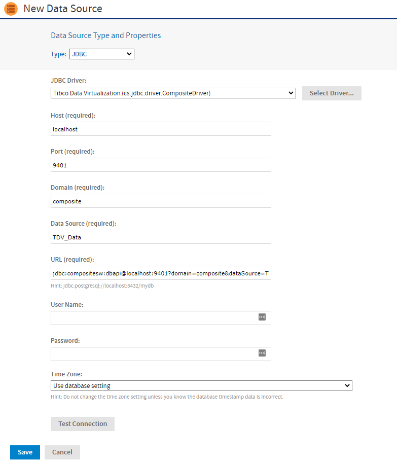

# TIBCO Data Virtualization

A TIBCO Data Virtualization (TDV) virtual data source integrates multiple data sources into a single virtual data layer. The TDV enteprise solution provides tools that support all phases of data virtualization development, run-time, and management. With these tools, you can build a virtualized view for your data sources that acts like a single database and provide JasperReports Server access to the data through a JDBC driver. This allows JasperReports Server to query and retrieve data from the virtual database like it would for a normal database.

Documentation for TDV is available at <https://docs.tibco.com/products/tibco-data-virtualization>.

To create a TIBCO Data Virtualization data source

1.  Log in as an administrator.

2.  Select **View &gt; Repository**, right-click a folder's name, and select **Add Resource &gt; Data Source** from the context menu. Alternatively, you can select **Create &gt; Data Source** from the main menu on any page and specify a folder location later. If you installed the sample data, the suggested folder is Data Sources. The New Data Source page appears.

3.  From the **Type** dropdown, select **JDBC** and then select **Tibco Data Virtualization** from the JDBC driver list. The page refreshes to show the fields required for the data source.

    

    *Figure 1: TIBCO Data Virtualization Driver*

4.  Enter the host machine and port number for the data source. The default hostname is localhost, and the default port is 9401.

5.  Enter the name of the domain (composite or LDAP) to which the database user belongs.

6.  Enter the name of the published TDV virtual data source. Please note that JasperReports Server only works with published data sources. Do not enter the name of the folder that stores your TDV data resources. 
    The four fields are combined automatically to create the URL where the server accesses the database.

7.  Fill in the database username and password. These are the credentials that the server uses to access the database.

8.  Click **Test Connection** to validate the data source. If the validation fails, ensure that the values you entered are correct and that the database is running.

9.  When the test is successful, click **Save**. The **Save** dialog appears.

10. Enter the **Data source name** and an optional description. The **Resource ID** is generated from the name that you enter. If you have not already specified a location, expand the folder tree and select the location for your data source.

11. Click **Save** in the dialog. The data source appears in the repository.
