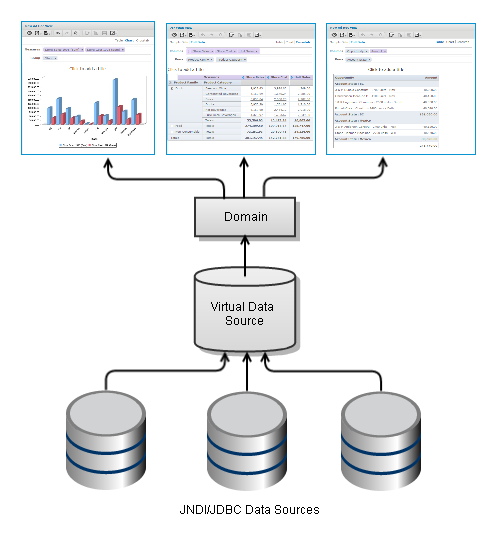
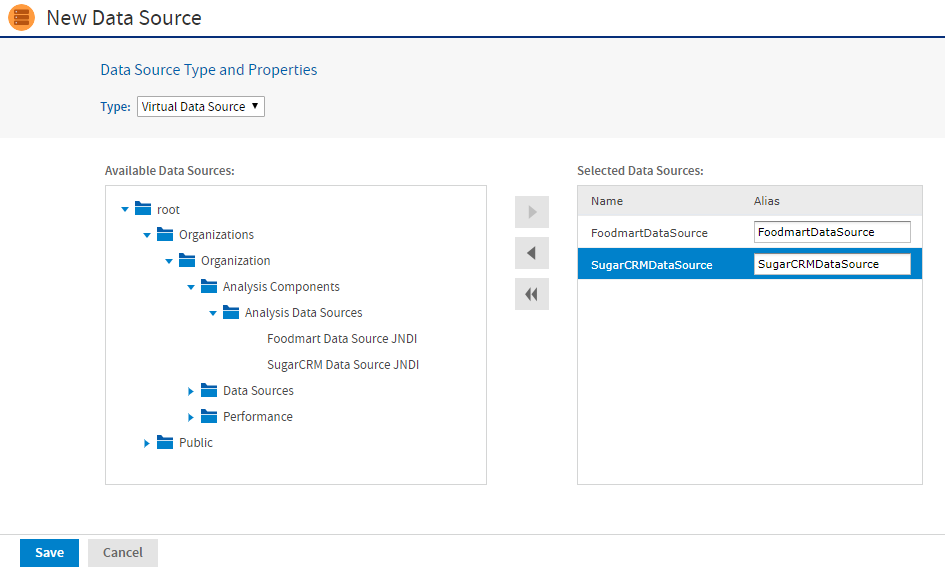

# Virtual Data Sources

!!! info "Important"

    The features in this section may be restricted by your JasperReports Server software license. If you don't see some of the options described, your current license likely prohibits their use. Contact us to learn about your licensed features or to discuss upgrading.

Virtual data sources allow you to combine multiple JDBC and JNDI data sources and make them available to be joined through a Domain. You can combine any number of data sources, including schemas from different databases, databases from different vendors, and different schemas within the same database into a single object.

A virtual data source can wrap a single data source for big data, or combine any number of big data, JDBC, and JNDI data sources.

Once you have created a virtual data source, you create a Domain that joins tables across the data sources to define the relationships among the data. Ad Hoc views and reports based on the Domain can access the combined data transparently. For more information about Domains, see the JasperReports Server Data Management Using Domains.



*Figure 1: Virtual Data Source Scenario*

When you combine data sources into a virtual data source, you select an alias for each data source you include. This alias is added as a prefix to the tables in the original data source to ensure that table names are unique across the virtual data source.

To create a virtual data source

1.  Log in as an administrator.
2.  Click **View \> Repository**, expand the folder tree, and right-click a folder to select **Add Resource \> Data Source** from the context menu. Alternatively, you can select **Create \> Data Source** from the main menu on any page and specify a folder location later. If you have installed the sample data, the suggested folder is Data Sources. The **New Data Source** page appears.
3.  From the **Type** dropdown, select **Virtual Data Source**.
4.  Locate the data sources that you want to use in the **Available Data Sources** pane. Double-click to select each chosen data source. The data source is shown in the **Selected Data Sources** pane.
5.  Change the aliases by editing them directly in the **Alias** column (optional). The alias identifies the selected data source within the virtual data source. It is also added as a prefix to the name of each table in that data source. Spaces are not allowed in aliases.

The following figure shows the values for creating a virtual data source by combining two of the databases included in the sample data: the Foodmart database and the SugarCRM database.



*Figure 2: Creating a Virtual Data Source*

!!! note

    Virtual data sources cannot use the Time Zone field that may be set on individual data sources. If used in a virtual data source, a target data source with a time zone will not return the expected date-time values. Therefore, we recommend that you do not use data sources with time zone settings in a virtual data source.

6.  Click **Save**. The **Save** dialog appears.
7.  Enter the **Data source name** and an optional description. The **Resource ID** is generated from the name that you enter. If you have not already specified a location, expand the folder tree and select the location for your data source.
8.  Click **Save** in the dialog. The data source appears in the repository.

You can edit a virtual data source to add or remove the data sources it uses. If the virtual data source is used by a Domain, you can add data sources, but you cannot remove them. Removing a data source from a virtual data source modifies only the virtual data source. The data source that you removed remains in the repository.

To edit a virtual data source

1.  Log in as an administrator.
2.  Click **View \> Repository** and expand the folder tree to locate the folder containing the data source.
3.  Right-click the data source and select **Edit** from the context menu.
4.  To add a data source, locate the data source in the **Available Data Sources** pane and double-click. To remove a data source, select it in the **Selected Data Sources** pane and click the left arrow.
5.  Click **Save**. If you try to delete a data source from a virtual data source that is used by a Domain, you will receive a warning and the data source remain unchanged. Otherwise, the data source is updated in the repository.

## Performance Considerations

Virtual data sources are based on the Teiid engine to handle multiple data sources and combine the results from them. How you design the tables in each of your data sources and how you combine them in a Domain join can significantly affect performance.

Consider these issues when designing a solution that combines several databases in a virtual data source:

- When using a virtual data source in a Domain, you must select at least one of the tables from the Tables tab to appear in the Domain before using it to create a derived table. Virtual data sources are optimized to use the smallest set of metadata, but they do detect Domains that use only derived tables.
- The virtual data source runs in JasperReports Server and must allocate memory and use processing to handle result sets.
- The Teiid engine uses its own cache for data accessed through a virtual data source. You can clear the Teiid cache at the same time as the Ad Hoc cache, as described in [Ad Hoc Cache Management](../configuration/configuring_ad_hoc.md).
- The virtual data source can push down certain operations (joins, filters, and aggregations) to the database, others it must perform in memory. The more it can push down, the smaller the datasets it handles in memory.
- You should design your schema to maximize the processing pushed to the database and minimize data handled in the virtual data source in a join between data sources.

For example, if you create a duplicate copy of a date dimension table in both of your data sources, they can be joined much more efficiently. If this table existed in only one database, the Teiid engine would need to retrieve all the rows from the other database and perform the join itself. With this table in both data bases, the Teiid engine can push down all of the time-dimension joins to the individual databases and perform a final join on much smaller datasets.

It might take a long time to get a list of virtual data source tables in a domain designer for the first time. It happens because the Teiid engine performs indexing on each table inside the schema, and it can be a long process for the databases having many schemas.

To improve the performance, do the following:

1.  Open the file `.../WEB-INF/applicationContext-virtual-data-source.xml `for editing.
2.  Locate the bean named `abstractTeiidVirtualQueryService` and the following property.

```
<property name="customSelectedSchemas">
```

3.  Add new entries to the map.

```
     <entry key="Microsoft SQL Server">
           <map>
              <entry key="schemasToBeIncluded">
                  <set value-type="java.lang.String">                        <value>[schema1]</value>                  </set>              </entry>
           </map>     </entry>
```

This would look like the following.

```
<property name="customSelectedSchemas">
     <map>
        <entry key="oracle">
            <map>
                <entry key="usernameAsSchema">
                   <set value-type="java.lang.String>
                      <value></value> <!-- username will be used as schema here -->
                   </set>
                </entry>
<!-- if only specific schema(s) needs to included for this DB then uncomment the below entry and add the schemas to be included-->
                 <!--<entry key="schemasToBeIncluded">
                     <set value-type="java.lang.String">
                          <value>[schema1]</value>
                          <value>[schema2]</value>
                     </set>
                </entry>-->
              </map>
           </entry>
           <entry key="Microsoft SQL Server">
                <map>
                    <entry key="schemasToBeIncluded">
                          <set value-type="java.lang.String">
                              <value>[schema1]</value>
                          </set>
                    </entry>
                </map>
           </entry>
     </map>
</property>
```

!!! note

    The entry key should be JDBC type, and the set of values should contain only the schemas that are used for indexing the tables.

Another fix that you can do to improve the performance is increasing the time for cached schemas metadata to stay longer. Use the following procedure to increase the time for cached schemas metadata.

1.  In the same bean, find the following line:

```
 <property name="poolTimeoutInMinute" value="20"/>
```

2.  Change the line as follows to increase the time for cached schemas metadata.

```
 <property name="poolTimeoutInMinute" value="720"/>
```

For more information about optimizing your data for use in Teiid, see <http://www.jboss.org/teiid/>.

## Creating Cassandra Data Connectors

Virtual data sources can connect to Cassandra big data sources to make them available to a Domain. The virtual data source extracts the connection information from the Cassandra data source and uses an internal Teiid connector to access the data. The Teiid connectors map the various structures used in Cassandra's big data model to a relational model with tables and fields. This connector is distinct from what are called the native data sources for big data. For this reason, when a data source for big data is wrapped in a virtual data source, the resulting data source has the following limitations:

- The Cassandra connector in virtual data sources does not support query parameters (`$P` and `$X`). Therefore, if you use a big data connector wrapped in a virtual data source as the data source for a stand-alone query, report or Topic, you cannot include parameters to create input controls. When used in Domains and then Ad Hoc views, you can define filters to replace this functionality.
- The Cassandra connector for virtual data sources does not support any aggregation functions.

However, there are significant advantages to accessing big data through virtual data sources:

- When wrapped in a virtual data source, you can access Cassandra through a Domain, Domain Topic, Ad Hoc view, and Ad Hoc report.
- A virtual data source can contain any mix of JDBC, JNDI, and Cassandra data connectors. When you define a Domain using this data source, you can access the tables from each store and define joins between compatible fields.
- Virtual data sources that use a Cassandra data connector support query optimization, unlike the native data sources for big data. In fact, the big data connectors for virtual data sources support query optimization in Ad Hoc views and reports based on stand-alone Topics, and in Ad Ho views and reports based on Domains. The only exceptions are calculated fields, which cannot be optimized when used in Ad Hoc views or reports that are based on Topics or Domains. For more information about query optimization, see [Ad Hoc Data Policies for Big Data](../configuration/configuring_ad_hoc.md).

!!! note

    If you plan to use a Cassandra data source with Domains or Ad Hoc views, use the JDBC Cassandra data source driver. You do not need to create a virtual data source as was required in some older JasperReports Server versions.

To create a virtual data source that accesses a Cassandra data source

1.  Create a Cassandra data source, or verify that it was created as described in [JDBC Data Sources](jdbc_data_sources.md).
2.  Create a virtual data source as described in Virtual Data Sources.
3.  In the virtual data source creation dialog, select the Cassandra data source that you created in the first step, and save the virtual data source. You can select one or more Cassandra data sources, or any mix of Cassandra, JDBC, and JNDI data sources.
4.  Create a Domain, specify the virtual data source you just created, and then select the Cassandra data tables when you create the Domain schema. The data from the data source is mapped to tables and fields in the Domain that you can use to create joins, filters, and all other features of a Domain.

## Logging for Virtual Data Sources

If you have issues with your big data connections through virtual data sources, you can enable logging in the following classes:

```
com.jaspersoft.jasperserver.api.common.virtualdatasourcequery.VirtualDataSourceQueryService
com.jaspersoft.jasperserver.api.engine.common.virtualdatasourcequery.teiid.TeiidEmbeddedServer
```

For information about enabling logging, see [Configuring System Logs](../diagnostics/configuring_system_logs.md).
