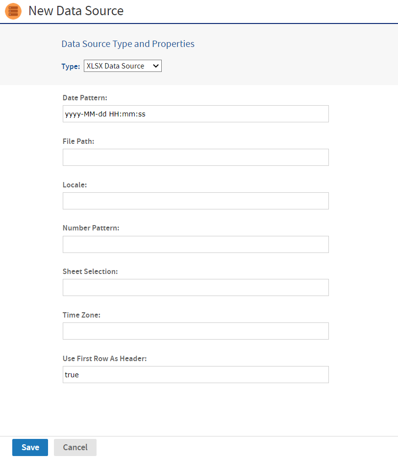

# XLS and XLSX Data Sources

XLS and XLSX data sources read a file in the Microsoft Excel XLS or XLSX format and allow you to query its contents as a relational table. These data sources support Domain-related features like:

-   Returning JDBC metadata
-   Creating derived tables
-   Supporting calculated fields
-   Domain pre-filtering
-   Joining other data sources in a virtual data source
-   Full support in the Domain Designer

To create an XLS or XLSX data source

1.  Log in as an administrator.

2.  Click **View &gt; Repository**, expand the folder tree, and right-click a folder to select **Add Resource &gt; Data Source** from the context menu. Alternatively, you can select **Create &gt; Data Source** from the main menu on any page and specify a folder location later. If you installed the sample data, the suggested folder is **Data Sources**. The **New Data Source** page appears.

3.  From the **Type** dropdown, select either the **XLS or XLSX Data Sourc**e. In this example, we create an XLSX data source.

    

    *Figure 1 File Data Source Page for an XLS/XLXS Data Source*

4.  Enter the date and time format patterns used for the data source.

5.  Enter the file path for the XLSX file. You can specify a file in the repository with the `repo:` syntax, followed by the repository path of the file. Specify `ftp:`, `http:` or `https:` to use those Internet protocols. To specify a file on your server's file system, specify its path directly, starting from the root, for example `/tmp/MyDataFile.xlsx`. The user running the server process must have permission to access the file.

    !!! note

        Only the **File Path field** is required, and the remaining fields are optional.

6.  Enter the regional locale for the file. The locale property displays the data in a specific format based on the region. (optional)

7.  Enter the number pattern for the file. (optional)

8.  Enter the name of the Excel file sheet to use for the data source. (optional)

9.  Enter the local time zone for the file. (optional)

10. Specify whether the first row in the XLSX file is a header as **true** or **false**. (optional)

11. Click **Save**. The Save dialog appears.

12. Enter the **Data source name** for and an optional description. The **Resource ID** is generated from the name that you enter. If you have not already specified a location, expand the folder tree and select the location for your data source.

13. Click **Save** in the dialog. The data source appears in the repository.
