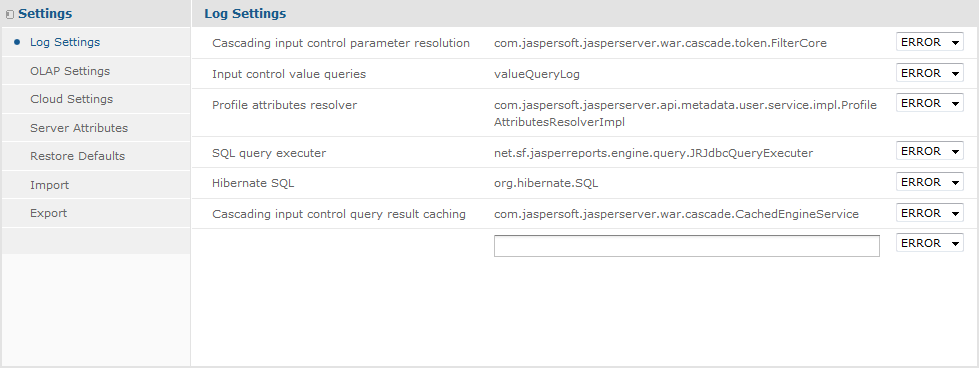

# Configuring System Logs

The log files contain important information about how the server is running. If you suspect a problem or cannot pinpoint an error, you can change log levels to capture verbose messages while you test your issue.

This chapter contains the following sections:

- Log File Location

- Log Levels

- Editing the Log Configuration File

- Setting Log Levels in the UI

- Adding a Logger to the Log Settings Page

## Log File Location

JasperReports Server now uses the [Apache Log4j 2](http://logging.apache.org/log4j/2.x/index.html) package to generate log files. JasperReports Server also uses the [SLF4J](http://www.slf4j.org/) facade (Simple Logging Facade for Java) and the `Log4j 2 SLF4J` Binding.

- The default log file is `.../WEB-INF/logs/jasperserver.log`.

- The default log configuration file is `.../WEB-INF/log4j2.properties`.

To view the log file, you must have access to the file system where JasperReports Server is installed. This chapter describes the settings that control the information JasperReports Server writes to its logs.

!!! note

    Because of the Log4j 2 upgrade, JasperReports Server logs now have a slightly different time format than versions 7.2 and earlier. If necessary, you can change the output format by configuring properties in the `log4j2.properties` file. For information about date and time formats, see <http://logging.apache.org/log4j/2.x/manual/layouts.html#PatternLayout>.

## Log Levels

A logger is a Java class that implements a logging interface for sending messages related to internal events of the server. The various features or internal modules of the server have separate loggers that can be controlled independently. The level of a logger determines the number and types of events it writes to the log file.

| Log Level | Amount of Information |
|----|----|
| ERROR | Writes minimal information to the log, only when describing serious program faults. |
| WARN | Writes error and warning messages to the log. Warning messages contain cautionary information to help you to decide whether the logged events require your attention. |
| INFO | Writes error, warning, and informational messages to the log describing significant events, such as those that affect application performance. |
| DEBUG | Writes error, warning, informational, and additional messages to the log. Debug messages are very detailed and often voluminous. Use this setting only to diagnose a problem. DEBUG can impact system performance and should not be used in production environments. If several loggers are set to DEBUG, the server may generate huge logs, and performance can suffer. |

Log levels may be set in two places, either the `log4j2.properties` configuration file or the **Log Settings** page, or both. Because there may be multiple settings for a given logger, the effective level is determined in the following order:

1.  The root log level defined in `log4j2.properties` and inherited by all loggers. By default, it is set to ERROR, the least verbose.
2.  A logger level defined in the `log4j2.properties` file.
3.  A logger level set on the Log Settings UI page and stored in the repository.

All loggers that are not explicitly set to another level will have the root level. Jaspersoft does not recommend changing the root level because any other level than ERROR will generate huge log files and affect performance. Setting a log level in the `log4j2.properties` configuration file requires restarting the server. Setting a log level on the Log Settings UI page will take effect immediately and override any level set in the `log4j2.properties` file.

These settings are described in the following sections.

## Editing the Log Configuration File

The log configuration file can be used to define new loggers, logging levels, log output, and log format, but you must restart the server for your changes to take effect.

!!! note

    If you defined a custom logger in JasperReports Server 7.2 or earlier versions, you must update its definition in the `log4j2.properties` file using the new syntax below.

The configuration file for logging depends on whether you want to define loggers for import or export operations or all other server functionality.

| Functionality to Log | File Location |
|----|----|
| Import or Export | `<js-install>/buildomatic/conf_source/ieCE/log4j2.properties` |
| JasperReports Server | `.../WEB-INF/log4j2.properties` |

Loggers are based on the Java classname of the functionality that you want to log. To find an existing logger or create a new one, you must know the corresponding classname. A logger in the configuration file is defined by three related definitions with the following syntax:

``` text
logger.<logger-name>.name=<Java-classname>
logger.<logger-name>.level=<log-level>
logger.<logger-name>.appenderRef.<output-type>.ref=<output-name>
```

where:

- `<logger-name>` is the name of the logger and usually based on the Java classname. The name cannot contain dots (`.`), so the convention is to use the entire classname with dots replaced by underscores.
- `<Java-classname>` is the name of the Java class you want to monitor.
- `<log-level>` is `error`, `warn`, `info`, or `debug`.
- `<output-type>` is a Log4j 2 output type, either `stdout` or `rolling`. The respective `<output-name>` is either `stdout` or the name of a file output defined in the `log4j2.properties` file. There can be multiple output types, as shown in the following example:

``` properties
logger.net_sf_jasperreports_engine_query_JRJdbcQueryExecuter.name=net.sf.jasperreports.engine.query.JRJdbcQueryExecuter
logger.net_sf_jasperreports_engine_query_JRJdbcQueryExecuter.level=debug
logger.net_sf_jasperreports_engine_query_JRJdbcQueryExecuter.appenderRef.stdout.ref = stdout
logger.net_sf_jasperreports_engine_query_JRJdbcQueryExecuter.appenderRef.rolling.ref = fileout
```

Some common loggers are given as comments in the configuration file, simply remove the comment character (`#`) from each line to add the logger. Otherwise, add all three properties to create a new logger.

Restart the server for your changes to take effect.

If you've made modifications in the Log Settings UI, those settings are persistent in the repository and take precedence over the configuration files. However, changes in the UI are `not` written to the configuration files. Each setting is independent. For more information, see Log Levels.

#### Configuring the Log Format

The available parameters for JasperReports Server logs include:

- **USER_ID**: The username with which JasperReports Server is logged in.
- **SESSION_ID**: Session ID of the logged in User.
- **RESOURCE_URI**: URI of the Resource opened.
- **REQUEST_TYPE**: The HTTP request type, for example: GET, POST, DELETE or PUT.
- **REQUEST_STATUS**: The HTTP request status code, such as 200 for OK.
- **TIME_TAKEN**: Time taken by a request in milliseconds.

JasperReports Server logs follow the following format, for example, for Log4j:

``` xml
<Log4j pattern> <Request type> <Session Id> <User Id> <Resource URI> <Request Status> <TimeTaken> - <Actual text log message>
```

Here is an example log from `jasperserver.log` when Data source fails:

``` text
2023-07-14T03:22:13,469 ERROR SecureExceptionHandlerImpl,http-nio-8080-exec-6:135 -
{REQUEST_STATUS=200, REQUEST_TYPE=POST, SESSION_ID=7F1DCDC110417960C651152A80E1877E, TIME_TAKEN=13, USER_ID=superuser}
- FATAL: no PostgreSQL user name specified in startup packet org.postgresql.util.PSQLException: FATAL: no PostgreSQL user name specified in startup packet
```

To configure the log format, use the `log4j.properties` file located in the `WEB-INF` folder. You can log all available parameters, or log a specific parameter.

!!! note

    - Any delimiter can be used between the parameters.
    - If any parameter is not applicable for given thread request, then that parameter will not be logged.
    - By default, the log format used with version JasperReports Server 8.2 or earlier is still supported, but you can configure/add new parameters as per your requirements.

To log **all** parameters of Log4j's ThreadContext, use *%X* in layout pattern.

For example, use *%X* in log4j2.properties:

`appender.fileout.layout.pattern=%d{ISO8601}%5p %c{1},%t:%L - %X - %m%ex%n`

To log **a specific parameter**, use:

*%X***{parameter_name}**

For example:

`%X{USER_ID}`

To log **more than 1 parameter**, use:

`%X{parameter_name1}, %X{parameter_name2}, %X{parameter_name3}`

For example:

`appender.fileout.layout.pattern=%d {ISO8601} %5p %c {1},%t:%L - %X{USER_ID}, %X{SESSION_ID}- %m%ex%n`

## Setting Log Levels in the UI

JasperReports Server provides a simple way to set log levels through the UI, and these settings take effect immediately on the server. Log settings in the UI are also stored persistently in the repository. This is useful for debugging any issues by setting the log level temporarily to avoid too much log output. However, you must remember to set it back or remove the setting when done.

To set the current logging levels

1.  Log in as administrator (`jasperadmin` by default).
2.  Select **Manage \> Server Settings** and choose **Log Settings** in the left panel.



*Figure 1: System Log Settings*

1.  In the list of loggers, use the drop-down selectors to change the log level for a given logger. Any change to a logging level on this page takes effect immediately, without restarting JasperReports Server.
2.  If you want to set a logger that is not listed on the page, enter its Java classname in the text field.
3.  Use the associated drop-down to set its logging level. When set, the new logger will take effect immediately.

After creating a logger in this manner, the logger appears on the page and you can change its level again when necessary. The new logger is also stored in the repository and is persistent when the server is restarted, but it will no longer appear in the Log Settings Page. You can however enter its classname again with the desired log level.

When viewing and setting loggers on the Log Settings page, keep the following in mind:

- The list of loggers on this page is a pre-determined set that may be useful for debugging. This list of loggers is not related to those defined or set in the log4j2.properties file.
- Setting a logger or log level on this page does not write or change any configuration in the log4j2.properties file.
- In the list of loggers, the logging levels reflect the current run-time level. If a logger level is set in the configuration file and never modified through this page, its level will appear here. Otherwise, these loggers have the inherited root level of ERROR.
- As explained in Log Levels, a log level may be defined differently in the configuration file and on this page, in which case the level on this page takes precedence.
- Once you set a level or define a logger on the Log Settings page, its value is stored in the repository and becomes persistent when the server is restarted. Because the level stored in the repository has precedence, it will be the log level in effect after the server restarts.
- If you want to remove a logger or log level that was set on the Log Settings page and stored in the repository, select **Restore Defaults** in the left panel of the Server Settings UI. Click the delete icon beside the logger you want to remove.

The following table describes the loggers presented on the Log Settings page. To change which loggers appear permanently on the page, see Adding a Logger to the Log Settings Page.

| Logger Name | Identifier in Log | Description |
|----|----|----|
| SQL query executer | JRJdbcQueryExecuter | Logs SQL text and parameter values for queries that are run by the SQL query executer. |
| Input control value queries | valueQueryLog | Logs SQL text and parameter values for queries associated with input controls. |
| Cascading input control parameter resolution | FilterCore | Logs activity associated with cascading input controls. Query-driven input controls can cascade when a query has a parameter whose value comes from another input control. When the parameter value is changed, the query is automatically rerun, possibly changing the list of values for its input control. |
| Cascading input control query result caching | TokenControlLogic | Logs use of the cache for results of cascading input control queries. |
| Profile attributes resolver | ProfileAttributesResolverImpl | Determines the values of attributes when they are referenced. |
| Hibernate SQL | SQL | Logs SQL run by the Hibernate layer to access the JasperReports Server repository database. This logger generates a large volume of logging that could affect performance. |

## Adding a Logger to the Log Settings Page

If you know of a Log4j2 logger that JasperReports Server uses, you can edit a configuration file to add it to the Log Settings page available to the administrator.

To edit the list of loggers on the Log Settings page

1.  Edit the file .../WEB-INF/bundles/logger_descriptions.properties.

2.  Add a new line and specify the logger's classname and a brief description of it.

    Entries should be in the form `<Java-classname> = <description>`.

    See the other properties in the file for guidance.

3.  Restart the server for your changes to take effect.

The logger_descriptions_pro.properties file does not set any logger levels, it only determines which loggers are listed in the Log Settings UI. Loggers are shown in the UI with their currently active level, as described in Log Levels.

!!! note

    The logger_descriptions.properties file controls the descriptions for the English locale. You can specify text for other locales by editing the logger description property files for those locales. For example, to add the description in French, add an entry to the logger_descriptions_fr.properties file. For more information on supporting other languages, refer to [Localization](../localization/localization_intro.md).
