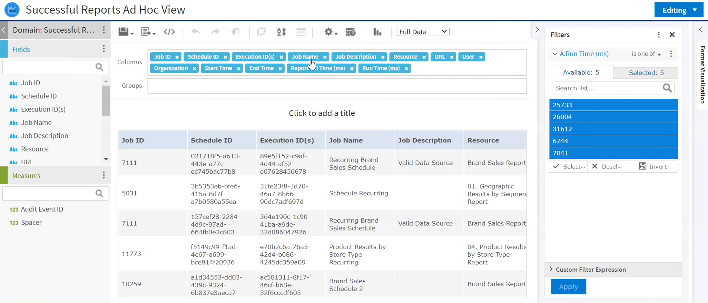
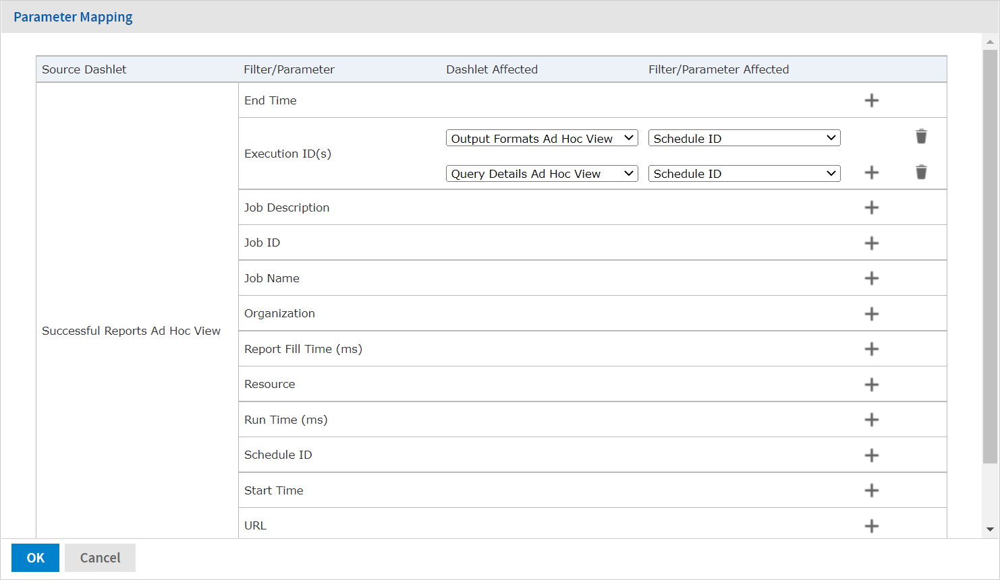
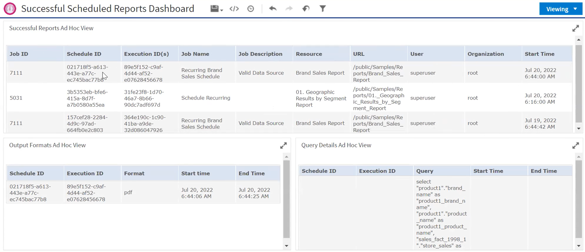
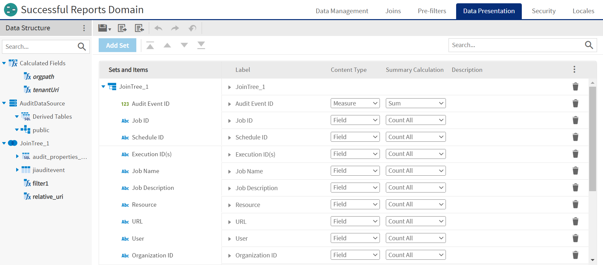

# Server Monitoring

Administrative users have access to a set of Ad Hoc views with details of the completed scheduled reports via the server monitoring feature. Administrators can monitor the completed scheduled reports using these Ad Hoc views. Administrators can only monitor the data that they have access to using these Ad Hoc views. System admins (`superusers`) have access to all the data and organization admins (`jasperadmin`) have access to the data of their organization. This feature is available to users with access to the Audit database. Auditing and Monitoring options should be enabled in the `.../WEBINF/js.config.properties` file. For instructions on enabling these options, see [Enabling Auditing and Monitoring](configuring_auditing_and_monitoring.md).

Administrators also have access to Domains with the data that is used to create Ad Hoc views. You can change column headers, create calculated fields, and so on, using the data provided in domains.

The Ad Hoc views and domains are located in the `/Public/Completed Schedules` folder of the repository.

## Monitoring Ad Hoc Views

The Ad Hoc views are provided in the `/Public/``Completed Schedules/Ad Hoc Views` folder. The following Ad Hoc views are available:

- Successful Reports Ad Hoc View
- Failed Reports Ad Hoc View
- Output Formats Ad Hoc View
- Query Details Ad Hoc View

*Figure 1: Ad Hoc Views in Completed Schedules*

You can click the Ad Hoc view name to open it. You can add filters to the views. For Query Details Ad Hoc View and Output Formats Ad Hoc View, you need to use a specific Execution ID as an input control to view the data.

*Figure 2: Successful Reports Ad Hoc View*

Ad Hoc views use cached data for better performance, so the recommendation is to create a dashboard using these Ad Hoc views to view real-time data.

We have two levels of data for the completed scheduled reports:

- Level 1:
  - Successful Reports Ad Hoc View: Table showing successful scheduled report executions with data like Job ID, Schedule ID, Execution ID, User, Start Time, End Time, Run Time, and more.
  - Failed Reports Ad Hoc View: Table showing failed scheduled report executions with data like Job ID, Schedule ID, Execution ID, User, Start Time, End Time, Run Time, Execution Error Category, Error Messages, and more.

You can add scheduled report executions to a dashboard to view the latest data every time the dashboard runs.

- Level 2:
  - Output Formats Ad Hoc View: Lists the output formats of a specific scheduled report execution.
  - Query Details Ad Hoc View: Lists the query details of a specific scheduled report execution.

You can add these views to the dashboard with the Successful Reports Ad Hoc View/Failed Reports Ad Hoc View and use Execution ID as input control for these views. Using the Execution ID as an input control to drill down from level 1 to level 2, you can view detailed data of the specific scheduled reports.

### Viewing Real-Time Ad Hoc View Data

For performance reasons, Ad Hoc views use cached data. To see the real-time data do any of the following:

#### Clearing Ad Hoc Cache

To clear Ad Hoc cache

1.  Log in as an administrator (`jasperadmin` in the user's organization or any parent organization, or `superuser`).
2.  Select **Manage \> Server Setting**, and then click **Ad Hoc Cache** in the left panel.
3.  Click **Clear All**.

#### Create Reports using Ad Hoc Views

To view the real-time Ad Hoc View data using reports

1.  Create reports using Ad Hoc views.
2.  For the updated data, click the **Refresh** button on the report.

!!! note

    By default, on refresh, the cache is deleted and new data is retrieved. (If you do not want to delete the cache on report refresh, the following property needs to be added to the `js.config.properties` file: `flushAdHocCacheOnRefresh = false`. By default, this property is not added and is `true`.)

!!! note

    The report refresh works fine for Successful Reports Ad Hoc View and Failed Reports Ad Hoc View reports. However, it does not work for Query Details Ad Hoc View and Output Formats Ad Hoc View reports, because these views have input controls.

#### Adding Ad Hoc Views to Dashboards (Recommended)

To view the real-time Ad Hoc View data using dashboards

1.  Create a dashboard.
2.  Add Successful Reports Ad Hoc View/Failed Reports Ad Hoc View to the dashboard.
3.  Add Output Formats Ad Hoc View and Query Details Ad Hoc View to the dashboard.
4.  For the Successful Reports Ad Hoc View/Failed Reports Ad Hoc View dashlet, in the Dashlet Settings, turn **Enable hyperlinks** on.
5.  In the **Dashlet Settings**, click **Map Parameters** to open the **Parameter Mapping** dialog box. Map the **Execution ID** parameter of Successful Reports Ad Hoc View/Failed Reports Ad Hoc View dashlet with Output Formats Ad Hoc View and Query Details Ad Hoc View dashlets. For the Filter/Parameter Affected field, select **Schedule ID** for both the dashlets.

*Figure 3: Parameter Mapping Dialog Box*

For more information on parameter mapping, see the JasperReports Server User Guide.

6.  For all dashlets, in **Dashlet Settings**, enable **Auto-refresh**. 
    Successful Reports Ad Hoc View/Failed Reports Ad Hoc View Dashlet shows the updated data.
7.  Click on the Execution ID of any scheduled report in the Successful Reports Ad Hoc View/Failed Reports Ad Hoc View dashlet, to view updated data of that report in the Query Details Ad Hoc View and Output Formats Ad Hoc View dashlets.

*Figure 4: Successful Scheduled Reports Dashboard*

## Domains

The Domains are provided in the /Public/`Completed Schedules/Domains` folder. Administrators have access to Domains with the data that is used to create Ad Hoc views. You can change column headers, create calculated fields, and so on, using the data provided in domains. The following Domains are available:

- Successful Reports Domain
- Failed Reports Domain
- Query Details Domain
- Output Formats Domain

*Figure 5: Domains in Completed Schedules*

### Editing the Domains

To edit the data of a domain

1.  From the list of domains, select the domain and click **Edit**.
2.  On the **Domains** page that displays, change the data as required for the Ad Hoc views.

*Figure 6: Successful Reports Domain*

For more information on editing domains, see JasperReports Server Data Management Using Domains.
