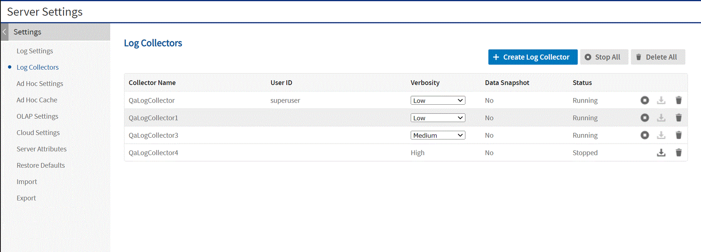
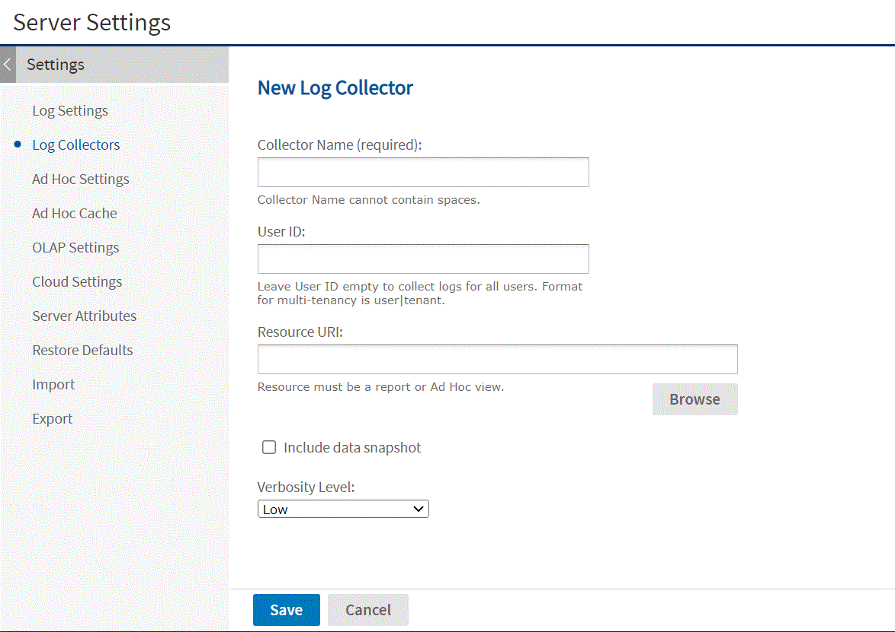

# Using Log Collectors

Logs are useful for finding problems when the server is not behaving as expected. However, log files can be huge and difficult to search for the log messages associated with your issue.

Log collectors help you diagnose server errors by recording logs from a specific user or report for a specific duration, and make this excerpt of the log files available through the server's UI for administrators.

The output of a log collector includes excerpts from the log files and an export catalog of the resources being logged, including useful information such as the dataset being used for a report or Ad Hoc view. The export catalog and its dataset can be used to replay the report or view on another server.

Because the output may contain data or other sensitive information, it is always encrypted for security. After downloading this output, you can move the file to a test server or send to Jaspersoft support. The first time you share a diagnostic log between two servers, you must also export and transfer the encryption key so the files can be decrypted.

To create and start a log collector

1.  Log in as system administrator (`superuser` by default).

2.  Set your logging levels and your loggers for the classes you wish to capture, as described in [Configuring System Logs](configuring_system_logs.md).

3.  Select `Manage > Server Settings` and choose `Log Collectors` in the left panel.<br>
    The page displays any current log collectors, either running or stopped and ready to be downloaded.

    

    *Figure 1: Viewing Log Collectors*

4.  Click `Create Log Collector`.

    

    *Figure 2: Creating a New Log Collector*

5.  On the `New Log Collector` page, enter a name for the collector and the following optional information:

    -   A user ID, in the format `username|organizationID` for commercial editions. When a user ID is specified, only logs related to that user are collected. When empty, logs for all user are included.
    -   The resource URI of a JasperReport or an Ad Hoc view. You can use the **Browse** button to select the report or Ad Hoc view in the repository. When specified, only the logs for that report or view will be collected. When empty, all logs are included.
    -   If you specified a report or view, and you have data snapshots enabled, you can select the check box to include the snapshot data from the report. The snapshot data is a separate file that can be imported to another server for verification.
    -   Set a verbosity level of low, medium or high. Low is the default.

6.  Click **Save** to save your log collector and begin collecting the specified logs.

7.  Perform the actions on the server for which you want to collect logs. If you specified a user ID, the user should log in or an administrator can log in as the user from the **Manage &gt; Users** page. If you specified a report or view, run it and interact with it to collect logs about it.


To stop a log collector and download its output

1.  Log in as system administrator (`superuser` by default).
2.  Select **Manage &gt; Server Settings** and choose **Log Collectors** in the left panel.
3.  On the **Log Collectors** page, locate your log collector and click the stop icon . The status for the collector shows **Stopping...**
4.  After the log collector has stopped, the logs are ready to download in a compressed zip file. Click the download icon  to save the collected logs on your computer.
5.  After downloading the logs, the log collector can be kept in case you want to download the files again. When you no longer need the log collector, click the delete icon  and confirm. If you want to run a collector again, you must delete it first and create it again.

The zip archive contains two encrypted files: a log file and an export catalog of the resource being logged, including any associated data such as a dataset or snapshot for a report or Ad Hoc view. To view the log file or import the catalog on another server, you need to export the corresponding encryption key.

To view the contents of a log collector output

1.  On the server that generated the log file, log into the host system as the user who installed JasperReports Server, and run the following commands:

    ``` bash
    cd <js-install>/buildomatic
    js-export.sh --keyalias diagnosticDataEncSecret --destkeystore myks
    --deststorepass mykspw --destkeypass logkeypw
    ```

    You only need to export the key once, and then import it once to each of the servers with which you share the logs.

2.  Securely transfer your log output and the keystore file created by the command above to the destination server.

3.  On the destination server, log into the host system as the user who installed JasperReports Server, and run the following commands:

    ``` bash
    cd <js-install>/buildomatic
    js-import.sh --input-key --keystore <path>/myks --storepass mykspw
    --destkeypass logkeypw --keyalias diagnosticDataEncSecret
    ```

    Now the destination server shares the same encryption key for decrypting the log and importing the catalog.

4.  While still logged in as the system user, run the following commands:

``` bash
js-import.sh --input-zip <logCollectorCatalog>
js-ant decrypt-diagnostics-data -DinFile=diagnostic.log.jsEncrypted
-Dkeyalias=diagnosticDataEncSecret -Dkeypass=logkeypw
```

It is also possible specify a hexadecimal key for the decryption. This can be used if you have previously replaced the source server's diagnosticDataEncSecret key with the same custom key.

``` bash
js-ant decrypt-diagnostics-data -DinFile=diagnostic.log.jsEncrypted
-Dsecret-key="0x81 0x8d 0x3e 0x9b 0x1b 0xe0 0x9b 0x57 0x5a 0x93 0x4f 0xe6 0x43 0x90 0xb5 0x5e"
```

The `js-ant` output displays the content of the encrypted log file.

For more information about buildomatic and js-ant, see the JasperReports Server Installation Guide.

For more information about the diagnostic encryption key and how to export and import keys, see the JasperReports Server Security Guide.

To configure the properties of the log collector

1.  Open the file `.../WEB-INF/applicationContext-diagnosticCollectors-pro.xml` for editing and locate the `diagnosticCollectorService bean`.
2.  If you want to collect more than 50MB of log data per file, modify the `appenderMaxFileSize` property.
3.  If you want your log files to be compressed inside the downloaded archive, specify a filename pattern with the `.gz` extension, for example:<br>
    `<property name="logFilePattern" value="diagnostic.%i.log.gz"/>`
