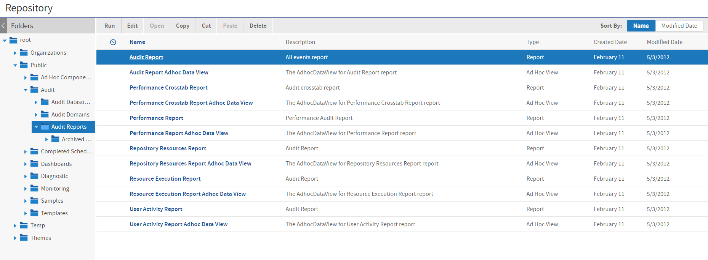
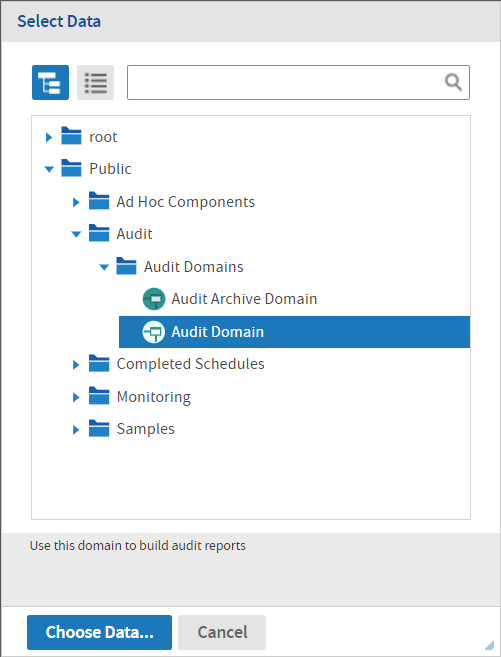

# Using the Audit Data

JasperReports Server makes the audit data available to system admins through Domains and several prepared views and reports. These are located in the `/Public/Audit` folder of the repository.

*Figure 1 Audit Reports in the Repository*

There are two Domains and two sets of reports created for accessing audit data:

-   Audit Domain and Audit Reports: Use these to view the current audit data; they run against the active audit database.

-   Audit Archive Domain and Archived Audit Reports: Use these to run reports on archived data; they run against the archive database.

The contents of both Domains and reports are identical. They differ only in the database tables accessed in each case.

To create an Ad Hoc View based on the audit Domains:

1.  Select **Create &gt; Ad Hoc View**
2.  Select the **Domains** tab in the **Data Chooser**, and expand the folders to select one of the audit Domains.

*Figure 2 Selecting an Audit Domain to Create an Ad Hoc View*

For instructions on using Domains in reports, see the Ad Hoc chapter in JasperReports Server User Guide. For documentation of Domains in general, see the Domains chapter in the same manual.

The following sections explain the contents of the Domains and the reports provided.

## Audit Domain Items

The audit Domains expose the fields of the audit logging tables stored in the server's internal database. As with all Domains, the database tables are joined, and the fields are presented as items that can be used in Ad Hoc views.

The following tables describe the items in both audit Domains (Audit Domain and Audit Archive Domain). These items correspond to the information recorded for each event. When creating a view based on either Domain, choose the items that correspond to the type of event you want to report on.

These domain items are used in both general events and repository events:

| Domain Item | Description |
|----|----|
| Date | Date event occurred. |
| Prop Long Value | `clob` value of event property, such as query. |
| Prop Type | Type of event property, such as destination folder, as per event map in configuration file. |
| Prop Value | `string` value of event property, such as folder name. |
| Time | The time event occurred. |
| Event Type | Type of event, such as save resource, as per the event map in the configuration file. |
| Request Type | Repository request type of event. |
| Resource Type | Repository type of resource accessed in an event. |
| Resource URI | URI of repository resource. |

Domain items in the following table are recorded for user events:

| Domain Item      | Description                                           |
|------------------|-------------------------------------------------------|
| E-mail           | E-mail address of event user (user at time of event). |
| Enabled          | Whether the event user is currently a user.           |
| External         | Whether the event user was an external user.          |
| Full Name        | Full name of event user.                              |
| Password Changed | Whether the event was a change of password            |
| Organization     | Organization of event user.                           |
| User Name        | UserID of event user.                                 |

Domain items in the following table are recorded for role events:

| Domain Item  | Description                                       |
|--------------|---------------------------------------------------|
| External     | Whether a role was defined in an external system. |
| Role Name    | Name of the role in the event.                    |
| Organization | Organization of the role in the event.            |

Domain items in the following table are recorded when a report is generated:

| Domain Item | Description |
|----|----|
| Date | The date the report is generated. |
| Time | The time at which the report is generated. |
| Resource URI | URI of repository resource accessed for report. |
| Resource Type | Repository type of resource accessed for report. |
| Datasource URI | URI of data source accessed for report. |
| Query Execution Time | Time to execute the query in the database. |
| Report Rendering Time | Time to prepare query results for display. |
| Report Execution Time | Total time to execute the report (query execution + report rendering + overhead). Overhead includes tasks such as loading repository resources (report unit, data source, etc.) and obtaining a DB connection from the data source. |
| Query | Specification of the report query. |
| User Name | UserID of event user. |
| Organization | Organization of event user. |
| Crosstab Group Field | Field name used in crosstab |

## Audit Reports and Ad Hoc Views

!!! note

    Auditing is disabled by default, so the audit reports and their views are initially blank. To view audit reports, enable auditing as described in [Configuring Auditing and Monitoring](configuring_auditing_and_monitoring.md), then wait for user activity to generate events.

A number of Ad Hoc views and reports based on the audit Domains are provided in the `/Public/Audit/Audit Reports` folder. The same views and reports are also provided in the `Archived Audit Reports` subfolder. These reports are identical, except they use the Audit Archive Domain and run against the archived audit data. These reports are visible only to administrators.

The reports are designed to cover common audit needs and can be used as-is. When auditing is enabled, audit events are recorded, the reports contain an up-to-the-minute record of events on your server. You can run the reports or schedule them as needed. When running the audit reports, you can also change the input controls to filter different sets of events or date ranges. By default, the input control for event types contains no selection, which indicates that all are to be displayed. You can change this selection to display only the events you wish to observe.

The Ad Hoc views used to create each report are also included. You can open them in the Ad Hoc Editor to explore the audit data in real-time. You can also modify these views in the Ad Hoc Editor to generate new reports to suit your auditing requirements.

The following views and reports are provided:

-   Audit Report: Generic example of an audit report showing commonly audited events.
-   Performance Crosstab Report: A crosstab that shows average performance of reports.
-   Performance Report: Generates a list of reports, sorted by run-time to identify slow reports.
-   Repository Resources Report: Shows repository resources and their associated events.
-   Resource Execution Report: Generates a list of executed reports.
-   User Activity Report: Generates a list of reports run by a specified user.
