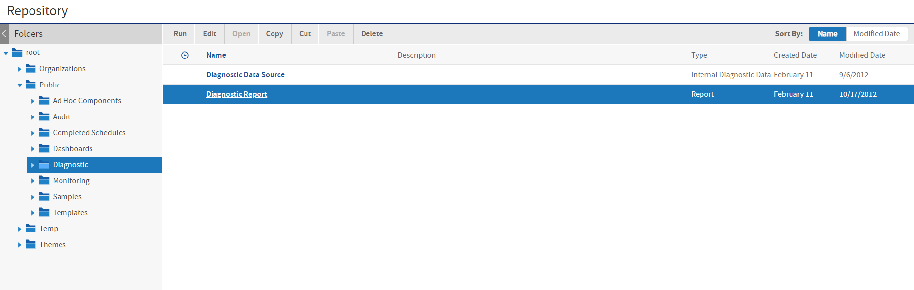
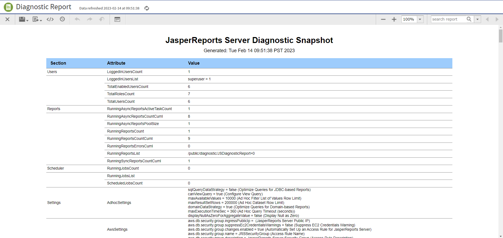

# Using the Diagnostic Data in Reports

In addition to remote JMX connections, JasperReports Server makes the diagnostic data available to administrators for internal reports. The following resources are visible to the system admin (`superuser` by default) in the repository:

-   `/Public/Diagnostic/Diagnostic Data Source`: A custom data source that returns all of the diagnostic fields.
-   `/Public/Diagnostic/Diagnostic Report`: A report that displays nearly every single diagnostic field.
-   `/Public/Ad Hoc Components/Topics/Diagnostic Topic`: A JRXML resource that can be used as a Topic to create an Ad Hoc view using diagnostic fields.

*Figure 1: Diagnostic Report in the Repository*

The diagnostic topic and report are based on the diagnostic data source. This is a custom data source that encapsulates the JMX information and makes it available as a data source for reports. In addition, there is an Internal Diagnostic Data Source type that can be used to create a new data source. If you accidentally delete the diagnostic data source, select **Create &gt; Data Source**, set the type to **Internal Diagnostic Data Source**, and set the name and location to re-create it.

The following figure shows the beginning of the diagnostic report. This report displays nearly every field available through JMX and the diagnostic subsystem. This report serves as a reference for the diagnostic data. The report is also very useful when configuring your server, because it shows many server configuration settings as well as system information such as memory use. You can use this information to fine tune the performance of your JasperReports Server instance.

*Figure 2: Contents of the Diagnostic Report*
