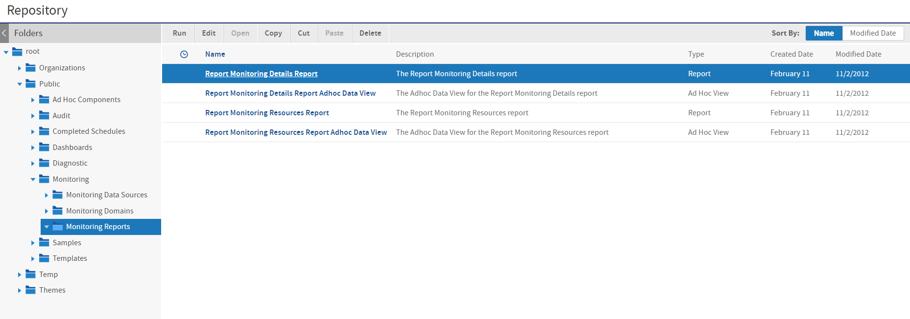
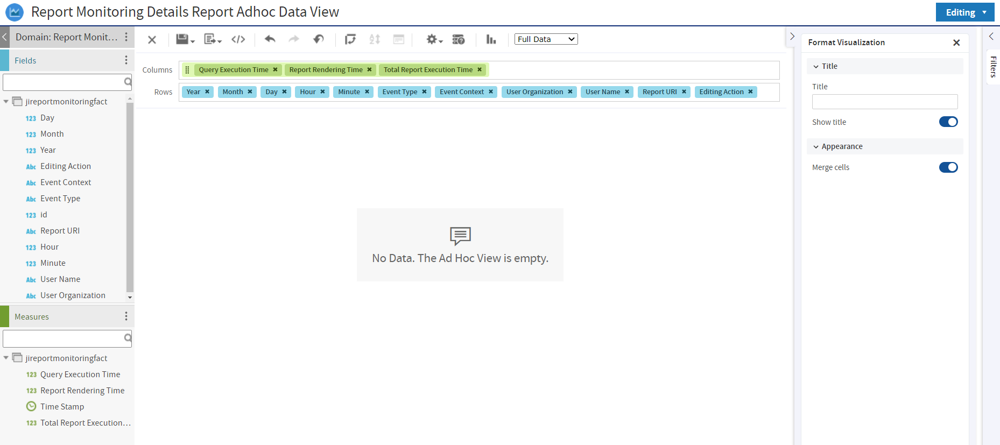

# Using the Monitoring Data

JasperReports Server makes the monitoring data available to administrators through a Domain and several prepared views and reports. These are in the `/Public/Monitoring` folder of the repository.

*Figure 1: Monitoring Reports in the Repository*

To create an Ad Hoc View based on the audit Domains, select **Create &gt; Ad Hoc View**, select the **Domains** tab in the **Data Chooser**, and select the monitoring Domain. For instructions on using Domains in reports, see the Ad Hoc chapter in JasperReports Server User Guide. For documentation of Domains in general, see the JasperReports Server Data Management Using Domains.

The following sections explain the contents of the Domains and the reports provided.

## Monitoring Domain Items

The monitoring Domain exposes the fields of the monitoring tables stored in the server's internal database. As with all Domains, the database tables are joined, and the fields are presented as items that can be used in Ad Hoc views.

In this release of JasperReports Server, the monitoring fields are limited to those that record report execution events:

<table>
<colgroup>
<col style="width: 50%" />
<col style="width: 50%" />
</colgroup>
<thead>
<tr>
<th>
Domain Item
</th>
<th>
Description
</th>
</tr>
</thead>
<tbody>
<tr>
<td>
Day
</td>
<td>
Day of the month the report finished running.
</td>
</tr>
<tr>
<td>
Editing Action
</td>
<td>
The Ad Hoc editing step the user just performed (null for report execution):

<ul>
<li><code>insertDimensionInAxisWithChild</code> - A dimension was added.</li>
<li><code>addMeasure</code> - A measure was added.</li>
<li><code>setProperty</code> - A property was set.</li>
<li><code>moveDimension</code> - A dimension was moved.</li>
</ul></td>
</tr>
<tr>
<td>
Event Context
</td>
<td>
The context that triggered the report execution. Possible values are:

<ul>
<li><code>ui</code> - The report ran interactively from the user interface.</li>
<li><code>web services</code> - The report was run via web services.</li>
<li><code>internal</code> - The report ran from an internal process, usually the scheduler.</li>
</ul></td>
</tr>
<tr>
<td>
Event Type
</td>
<td>
The type of report that was executed. Possible values are:

<ul>
<li><code>report execution</code> - A report that ran from the repository.</li>
<li><code>ad hoc editing</code> - A report that ran from an Ad Hoc view being edited.</li>
</ul></td>
</tr>
<tr>
<td>
Hour
</td>
<td>
The hour the report finished running.
</td>
</tr>
<tr>
<td>
id
</td>
<td>
ID number of the monitoring event.
</td>
</tr>
<tr>
<td>
Minute
</td>
<td>
The minute the report finished running.
</td>
</tr>
<tr>
<td>
Month
</td>
<td>
The month report finished running.
</td>
</tr>
<tr>
<td>
Query Execution Time
</td>
<td>
The time spent executing the SQL query in the database.
</td>
</tr>
<tr>
<td>
Report Rendering Time
</td>
<td>
The time spent rendering the report after receiving the query results (dataset).
</td>
</tr>
<tr>
<td>
Report URI
</td>
<td>
Repository path of the report that was run.
</td>
</tr>
<tr>
<td>
Time Stamp
</td>
<td>
Full time and date when the report was finished running, including milliseconds.
</td>
</tr>
<tr>
<td>
Total Report Execution Time
</td>
<td>
The total time spent running the report. Typically this is a little more than the sum of the query execution and report rendering times. This is due to overhead such as loading repository resources (report unit, data source, etc.) and obtaining a DB connection from the data source.
</td>
</tr>
<tr>
<td>
User Name
</td>
<td>
The user who ran the report.
</td>
</tr>
<tr>
<td>
User Organization
</td>
<td>
The organization of the user who ran the report.
</td>
</tr>
<tr>
<td>
Year
</td>
<td>
The year the report finished running.
</td>
</tr>
</tbody>
</table>

## Monitoring Reports and Ad Hoc Views

!!! note

    The monitoring reports and their views are blank by default. This is because the audit subsystem that monitoring depends on is disabled by default and no audit data exists. To view these reports, first enable auditing as described in the section [Configuring Auditing and Monitoring](configuring_auditing_and_monitoring.md), then wait for user activity to generate events.

A number of Ad Hoc views and reports based on the monitoring Domain are provided in the `/Public/Monitoring/Monitoring` Reports folder.

The reports are designed to cover common monitoring needs and can be used as-is. When monitoring is enabled, audit events are recorded, and the reports contain an up-to-the-minute record of events on your server. You can run the reports or schedule them as needed.

The Ad Hoc views used to create each report are also included. You can open them in the Ad Hoc Editor to explore the monitoring data in real-time. You can also modify these views in the Ad Hoc Editor to generate new reports to suit your monitoring requirements.

The following views and reports are provided:

-   Report Monitoring Resources Report: Gives a list of all reports and shows their average and high-low execution times.

-   Report Monitoring Details Report: A crosstab that shows report execution times on one axis and many dimensions on the other axis such as:

    -   A time hierarchy
    -   User and organization
    -   Event type

*Figure 2: Monitoring Ad Hoc View with Multidimensional Analysis*
