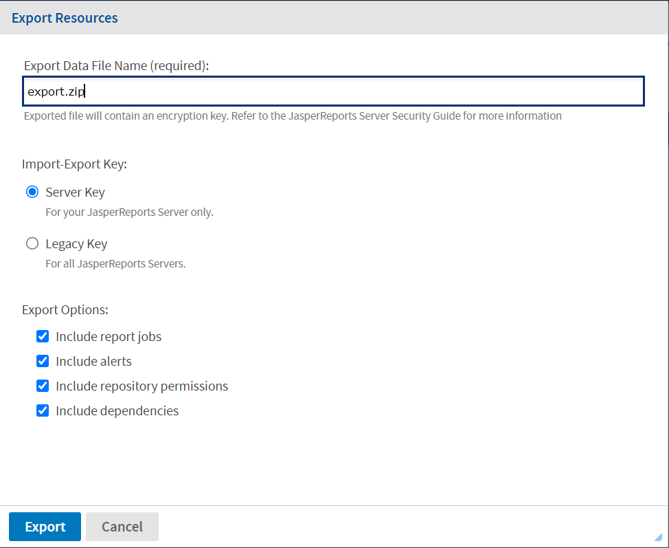
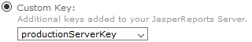
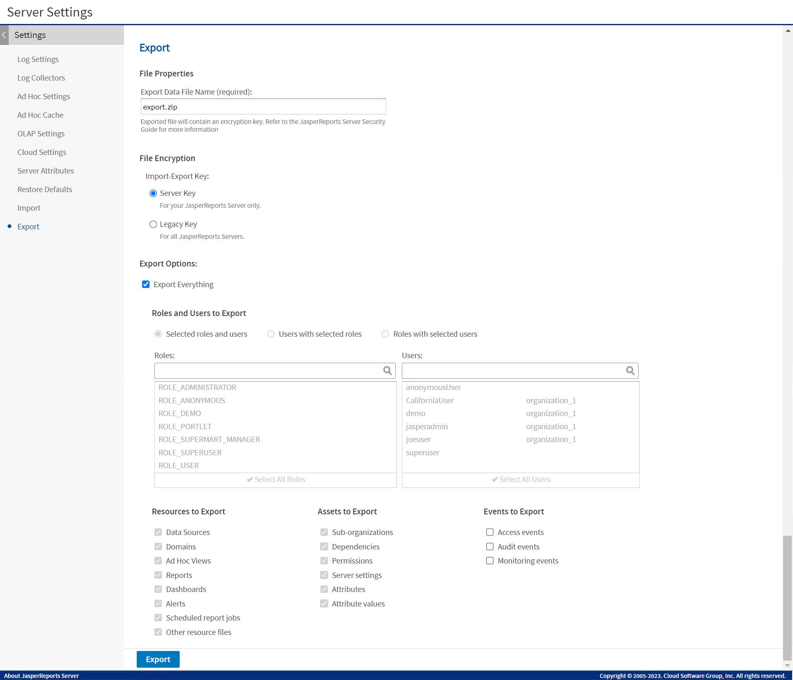
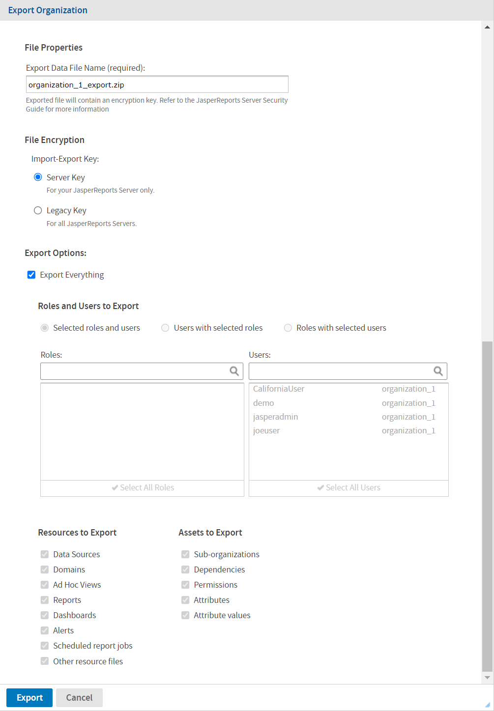
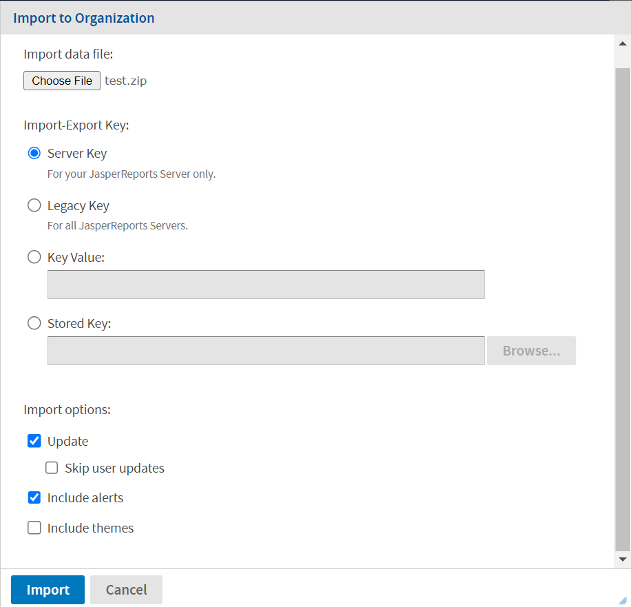
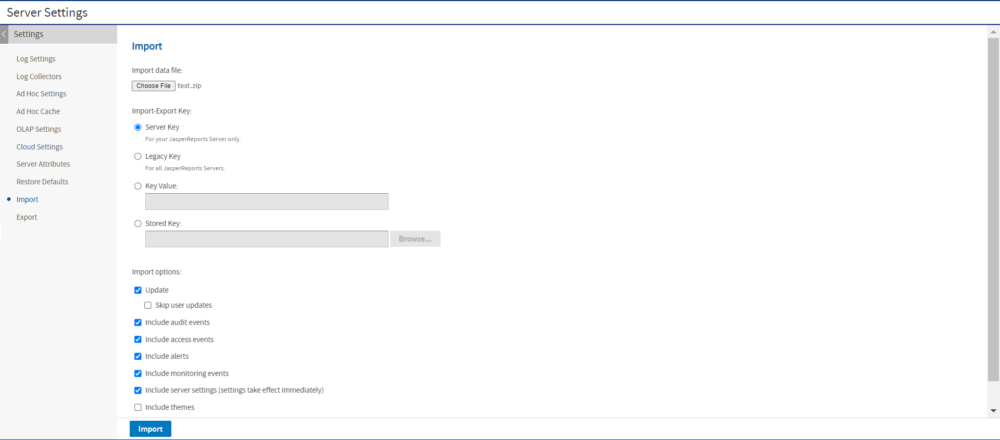

# Import and Export Through the Web UI

JasperReports Server allows administrators to import and export resources and users through the user interface:

<table>
<colgroup>
<col style="width: 33%" />
<col style="width: 33%" />
<col style="width: 33%" />
</colgroup>
<thead>
<tr>
<th>Section</th>
<th>Actions</th>
<th>Users</th>
</tr>
</thead>
<tbody>
<tr>
<td><a href="#exporting-from-the-repository">Exporting from the Repository</a></td>
<td>Export entire folders 
Export selected resources</td>
<td>
System admins and Organization admins
</td>
</tr>
<tr>
<td><a href="#exporting-from-the-settings">Exporting from the Settings</a></td>
<td>Export everything 
Export selected users or roles 
Export resources by type</td>
<td>System admins only</td>
</tr>
<tr>
<td>
<a href="#exporting-from-organizations">Exporting from Organizations</a>
</td>
<td>
Export entire organizations

Export selected users or roles 
Export resources by type
</td>
<td>System admins and Organization admins</td>
</tr>
<tr>
<td><a href="#importing-to-organizations">Importing to Organizations</a></td>
<td>Import into a specific organization</td>
<td>System admins and Organization admins</td>
</tr>
<tr>
<td><a href="#importing-from-the-settings">Importing from the Settings</a></td>
<td>Import any catalog into the server</td>
<td>System admins only</td>
</tr>
</tbody>
</table>

## Exporting from the Repository

System administrators and organization administrators can browse the repository and easily export folders and individual resources from the context menu. System administrators can export any resource from the repository while organization administrators can only export resources within their organization and the Public folder.

!!! note

    Catalogs may be very large and take a long time to generate and then download. During this time, the export operation may affect server performance.

To export resources from the repository

1.  Log in as an administrator that has access to the resources you want to export.

2.  Select **View&gt;Repository**.

3.  Select one or more resources in the main panel, or select a folder in the left-panel.

4.  Right-click the selected folder or resources and select **Export** from the context menu. The **Export Resources** dialog appears:

    

    *Figure 1 Export Resources Dialog in the Repository*

5.  If required, change the default name of the zip file for the exported catalog.

6.  Select the import-export encryption key to protect any passwords in the export catalog. For more information, see [The Import-Export Encryption Keys](import_and_export_catalogs.md).

    -   Use the **Server Key** if this is a backup to be imported into the same server later.

    -   Use the **Legacy Key** if the catalog has to be imported into a different server.

    -   If you have added custom keys to the keystore on this server, select one from the list that appears:

        

7.  Choose the export options:

    -   **Include report jobs**: When checked, the export includes scheduled report jobs that are associated with any reports in your repository selection.

    -   **Include alerts**: When checked, the export includes scheduled report alerts that are associated with any reports in your repository selection.

        !!! note

            The exported report includes alerts only for the reports for which the alert is turned on. If the alert is turned off for the report, then the exported report includes the alert with an empty report alerts folder.

    -   **Include repository permissions**: When checked, the export includes any explicit permissions on all items in your repository selection. When this option is cleared, the exported items inherit the permissions of the repository where they are later imported.

    -   **Include dependencies**: When checked, the export includes all dependencies for your resources, even if they are not included in your selected folders. For more information, see [Dependencies During Import and Export](import_and_export_catalogs.md).

    -   **Include full resource path**: This option appears when the selected files or folders belong to an organization. When checked, the export includes the full file structure of each resource, starting with the Organizations root folder. This helps for archiving items that would be reimported later into the same organization. If you want to import the resources into a different organization, uncheck this box so the export includes only the selected items and their relative path within the organization.

8.  Click **Export**. The server generates the catalog zip file. Depending on the size of the repository and the options selected, it may take several minutes to generate the catalog file.

## Exporting from the Settings

For more export options, use the server settings page for system administrators. The settings export the following resources:

-   Everything - The entire repository, including all resources in all organizations, as well as all users, roles, and other settings stored internally. With the proper options, this creates a backup of the server.

-   Any combination of users and roles - Lets you choose from lists of users and roles, with options to include users by role or roles by user.

-   All resources of a given type - For example, all reports or all dashboards.

To export resources from the settings page

1.  Log in as a system administrator (`superuser` by default).

2.  Select **Manage&gt;Server Settings**, then click **Export** in the left-hand panel.

    

    *Figure 2 User Interface for Export*

3.  If required, change the default name of the zip file for the exported catalog.

4.  Select the import-export encryption key to protect any passwords in the export catalog. For more information, see [The Import-Export Encryption Keys](import_and_export_catalogs.md).

    -   Use the **Server Key** if this is a backup to be imported into the same server later.

    -   Use the **Legacy Key** if the catalog has to be imported into a different server.

    -   If you have added custom keys to the keystore on this server, select one from the list that appears:

        

5.  Use the checkboxes and radio buttons to choose the contents of your exported catalog file:

    Select **Export Everything** (default) to export the entire repository, including all organizations, users and roles, and all types of assets. Select the checkboxes under **Events to Export** to include the different types of events in your export catalog.

6.  Clear **Export Everything** to select users and roles or resource types to export.

    1.  To export roles and users, choose one of the following radio buttons to select individual users and roles from the lists:

        -   **Selected roles and users** - Only the roles and users you select explicitly are exported.

        -   **Users with selected roles** - Select one or more roles, and all users with those roles are exported, along with the selected roles.

        -   **Roles with selected users** - Select one or more users, and all roles assigned to those users are exported, along with the selected users.

    2.  In **Resources to Export**, perform either one of the following:

        1.  If you only want users and roles, clear all checkboxes.

        2.  If you only want resources, do not select any users and roles, then select the resource types you want to export.

    3.  Select the checkboxes under **Assets to Export** to include these various assets in your export catalog.

    4.  Select the checkboxes under **Events to Export** to include the different types of monitoring events.

    5.  Select the checkbox under **Events to Export** to include repository create and modify dates.

7.  Click **Export**. The server generates the catalog zip file.

!!! note

    Resources are exported along with any dependencies, even if they are not included in your repository selection. For more information, see [Dependencies During Import and Export](import_and_export_catalogs.md).

    Depending on the size of your repository, and the options you have selected, it may take several minutes to generate the catalog file. During this time, the export operation may affect server performance.

## Exporting from Organizations

Both system admins and organization admins can use the Manage Organizations page to select organizations for export. For example, an organization admin can use this feature to back up his entire organization or to move suborganizations from one parent to another.

To export organizations

1.  Log in as an administrator that has access to the organizations you want to export.

    For example, to move an organization, you must log in as the administrator of the parent organization.

2.  Select **Manage&gt;Organizations** to display the hierarchy of organizations.

3.  In the left-hand panel, right-click the organization you want to export and select **Export** from the context menu.

    

    *Figure 3 User Interface for Organization Export*

4.  If required, change the default name of the zip file for the exported catalog.

5.  Select the import-export encryption key to protect any passwords in the export catalog. For more information, see [The Import-Export Encryption Keys](import_and_export_catalogs.md).

    -   Use the **Server Key** if this is a backup to be imported into the same server later.

    -   Use the **Legacy Key** if the catalog has to be imported into a different server.

    -   If you have added custom keys to the keystore on this server, select one from the list that appears:

        

6.  Use the checkboxes and radio buttons to choose the items to be exported from this organization. 
    Select **Export Everything** (default) to export the entire organization, including all resources, report jobs, users, and roles.

7.  Clear **Export Everything** to select users and roles or resource types to export.

    1.  To export roles and users, choose one of the following radio buttons to select individual users and roles from the lists:

        -   **Selected roles and users** - Only the roles and users you select explicitly are exported.

        -   **Users with selected roles** - Select one or more roles, and all users with those roles are exported, along with the selected roles.

        -   **Roles with selected users** - Select one or more users, and all roles assigned to those users are exported, along with the selected users.

    2.  In **Resources to Export**, perform either one of the following:

        -   If you only want users and roles, clear all checkboxes.

        -   If you only want resources, do not select any users and roles, then select the resource types you want to export.

        -   Select the checkboxes under **Assets to Export** to include these various resources in your export catalog.

8.  Click **Export**. The server generates the catalog zip file. The server displays a message if there are any broken dependencies.

!!! note

    Resources are exported along with some dependencies. You must have permission to access them or they should be in the parent organization. Broken dependencies may block the export or import operations. For more information, see [Dependencies During Import and Export](import_and_export_catalogs.md).

    When logged on as system admin (`superuser`) and exporting from the root node, the dialog is functionally equivalent to exporting from the **Settings** page. In this case, there are additional options to export events.

    Catalogs may be very large and take a long time to generate and then download. During this time, the export operation may affect server performance.

## Importing to Organizations

Both system admins and organization admins can use the **Manage Organizations** page to import an organization. An import merges the content of the export catalog into the selected organization. When merging organizations with the update option, the contents of the import override the target organization for any user, role, or resource with the same name. If the imported organization has a different ID than the destination, the merged organization takes the organization ID of the imported organization.

To move an organization, create an empty organization as the destination, and then import it into it.

To import organizations

1.  Log in as an administrator that has access to the destination organization.

2.  Select **Manage&gt;Organizations** to display the hierarchy of organizations.

3.  In the left-hand panel, right-click the organization you want to import into and select **Import** from the context menu.

    

    *Figure 4 User Interface for Organization Import*

4.  Click **Browse** to choose the catalog zip file to import. The catalog file must be created by the export of an organization.

5.  Select the key that was used to export the catalog file. For more information, see [The Import-Export Encryption Keys](import_and_export_catalogs.md).

    -   Use the **Server Key** if the catalog was exported from the same server with the server key.

    -   Use the **Legacy Key** if the catalog was exported from any server with the legacy key, or if it was exported from any server prior to release 7.5.

    -   If you have added custom keys to the keystore on this server, select one from the list that appears:

        

    -   Use the **Key Value** and enter a key in hexadecimal notation if you exported with a one-time key (the command-line `js-export --genkey` option).

    -   Use the **Stored Key** and specify its location if you saved the export key in the repository.

6.  Use the checkboxes to change the behavior of the import operation:

    -   **Update** - When checked, it imports only resources that are newer than ones with the same URI in the current organization. The **Skip user updates** field allows you to keep the current definition of any users that also exist in the imported organization.

    -   **Include alerts** - When checked, it imports all alerts of any users that exist in the imported organization.

    -   **Include themes** - When checked, imports any themes that exist in the imported organization.

7.  Click **Import**.

    The server uploads the catalog zip file and imports its contents into the organization. If there are any broken dependencies in the catalog, the server displays a message with three choices:

    -   **Skip** - Does not import the resource with the broken dependency, but continues to import other resources.

    -   **Include** - Attempts to import the resource with the broken dependency. The import succeeds if there is already a resource in the destination that satisfies the dependency. If the dependency is not satisfied in the destination, the resource is skipped and the import continues.

    -   **Cancel** - Stops the import operation.

    !!! note

        For more information, see [Dependencies During Import and Export](import_and_export_catalogs.md).

        When logged on as system admin (`superuser`) and importing to the root node, the dialog is functionally equivalent to importing on the Settings page. In this case, there are additional options to import events. But you cannot import an organization to the root.

        Catalogs may be very large and take a long time to upload and then process. During this time, the import operation may affect server performance.

## Importing from the Settings

The Settings pages for system administrators include a user interface to simplify the import procedure.

This import operates on a running instance of the server, and all imported resources are visible immediately. In addition, any configuration or security settings in the imported catalog take effect immediately, with no need to restart the server.

To import data from the Settings page

1.  Log in as a system administrator (`superuser` by default).

2.  Select **Manage&gt;Server Settings** and choose **Import** in the left-hand panel.

    

    *Figure 5 User Interface for Import*

3.  Click **Browse** to choose the catalog zip file to import. This dialog cannot import a catalog file that was created from the export of an organization.

4.  Select the key that was used to export the catalog file. For more information, see [The Import-Export Encryption Keys](import_and_export_catalogs.md).

    -   Use the **Server Key** if the catalog was exported from the same server with the server key.

    -   Use the **Legacy Key** if the catalog was exported from any server with the legacy key, or if it was exported from any server prior to release 7.5.

    -   If you have added custom keys to the keystore on this server, select one from the list that appears:

        

    -   Use the **Key Value** and enter a key in hexadecimal notation if you exported with a one-time key (the command-line `js-export --genkey` option).

    -   Use the **Stored Key** and specify its location if you saved the export key in the repository.

5.  Use the checkboxes to change the behavior of the import operation:

    -   **Update** - When checked, it imports only resources that are newer than ones with the same URI in the current repository. The **Skip user updates** field allows you to keep the current definition of any users that also exist in the imported catalog.

    -   **Include access events** - When checked, it imports the modification times of resources from the catalog. When cleared, resources keep their existing access times if they already exist.

    -   **Include alerts** - When checked, the import includes scheduled report alerts that are associated with any reports in your repository selection.

        !!! note

            Importing alert details for a single report is comparatively quicker than importing alert details for the report having multiple alerts. As including multiple alerts in the report results in downgrading the performance of the server.

    -   **Include audit events** and **Include monitoring events** - These fields determine whether access and monitoring events from the catalog, if any, are imported.

    -   **Include server settings** - This field determines whether the system configuration is updated from the catalog. There are two prerequisites for the catalog to contain configuration settings:

        -   The originating server settings must be modified through the UI. Thus, only **Log Settings**, **Ad Hoc Settings,** and **Cloud Settings** are affected. For more information, see [Configuration Settings in the User Interface](../configuration/configuration_settings_in_the_ui.md)

        -   The catalog must be exported with the "everything" option or the specific **Server Settings** option.

            When server settings are imported, they take effect immediately and appear in the Settings UI.

    -   **Include themes** - This field determines whether you want to import themes from the catalog.

6.  Click **Import**.

    The server uploads the catalog zip file and imports its contents into the repository. Depending on the size of the catalog, and the options you have selected, it may take several minutes to perform the import.

!!! warning

    Theme files in catalogs exported from older JasperReports Server versions may not be compatible, and can cause HTML display errors. When you import certain catalogs created in older versions, you may need to uncheck the **Include themes** option so that the incompatible files are not imported.

    If you have a custom theme to import, you can use the web UI to download it from the source server and upload it to the target server. You may need to edit the catalog manually. For example, if your theme contains the file `pageSpecific.css`, you must remove it from the ZIP file before uploading. Then redo changes to the file based on the `pageSpecific.css` file in the target server. For more information, see [Downloading and Uploading Theme ZIP Files](../themes/creating_themes.md).

!!! note

    Resources are imported along with any dependencies. You must have permission to write at the dependency's location in the organization. Broken dependencies may block the import operation. For more information, see [Dependencies During Import and Export](import_and_export_catalogs.md).

    Catalogs may be very large and take a long time to upload and then process. During this time, the import operation may affect server performance.
