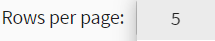

# Managing Admin Console

Using the JasperReports Server Admin Console page, you can view the list of Scheduled jobs, Reports alerts, and Diagnostic information of the Jaspersoft system. The Admin Console page in the JasperReports Server includes Schedules, Alerts, and Diagnostic tabs.

You can view a list of scheduled jobs, report alerts, and diagnostic information on the **Manage \> Admin Console** page.

Administrative (`superuser` or `jasperadmin`) users have complete access to view all the tabs in the Admin Console page. However, the `joeuser` does not have complete access in the Admin Console page and therefore, can view Schedules and Alerts on the **View \> Schedules and Alerts**. For more information, refer to User Guide.

## Alerts

The Alerts tab is the new enhancement in the Admin Console page. You can view the list of all the report alerts in the Alerts tab. Admin users (`superusers` or `jasperadmin`) in the Alerts tab have complete access to view report alerts in the Admin Console page. The `superuser` can view the list of report alerts for all the users, however, the `jasperadmin` can view alerts of their respective organization. The `joeuser` does not have access to the Admin Console page and can only view report alerts of the folders with permissions assigned.

!!! note

    Currently, the Alerts tab in the Admin Console page is a new beta feature that may not be fully stable or supported. For more information on the Alerts beta feature, refer to this [page](https://community.jaspersoft.com/wiki/admin-console).

## Schedule

The Schedule tab in the Admin Console is accessible to all Admin users. In the Schedule page, you can now do the following tasks:

- Sort - You can sort any column except the Actions column in ascending or descending order. Hover on the column header and then click  to view the schedules in ascending or descending order.
- Filter - You can filter to find information of the scheduled jobs of the report using the **Add Filter** button. Based on the selected filter settings, the Scheduled Jobs page is refreshed without effecting the other filters on the page. Select the **Reset filters** to reset the Scheduled Jobs page to the default filter values.
- Data refresh - You can view the latest updated date and time of new schedules. Click  to refresh the scheduled job with the recent date and time.
- Search - You can find a scheduled job by job name from the list of available or created schedule. Click  to search by schedule job name. if the job name in the search criteria does not match with the names available in the Job name/description column.
- Export - You can export the schedule jobs in CSV format. Click  to download and view the report of all the scheduled jobs.

### Viewing a list of all scheduled jobs:

All scheduled jobs that the user has defined appear on the **Manage \> Admin Console \> Schedule** page.

Scheduled Jobs Page (SC will be added once UI is ready)

The `joeusers` users see only the jobs that they have defined; administrators can see the jobs defined by all users.

The Scheduled Job page shows:

- Internal ID number of the job.
- Name of the scheduled job or description.
- Repository URL of the job.
- Status.
- User (owner) who created the job.
- Next run filtered by date and time.
- Last run filtered by date and time.
- Pause/activate state.
- Actions.

In the Status column, you can view the following status of the scheduled jobs:

- **NORMAL** - The job is scheduled.
- **EXECUTING** - The server is generating the output.
- **COMPLETE** - The server has finished running the job and placed output to the repository.
- **PAUSED** - The job has been disabled.
- **ACTIVE** - The job is active.
- **ERROR** - The scheduler encountered an error while scheduling or triggering the job. This does not include cases where the job is successfully triggered, but an error occurs while it runs.
- **UNKNOWN** - The scheduler encountered an error with the job trigger.

The Scheduled Job page includes these controls:

-  – When enabled, the job state is set to **Active**. When disabled, the job state is set to **PAUSED**.
- – Edits the scheduled job.
-  – Deletes the scheduled job.
-  – Displays the previous instance of the search term.
-  – Displays the next instance of the search term.
-  – Displays the number of schedule records. By default, five rows per page are
- displayed. You can change the number of rows per page to 5, 10, 25, or 100. Based on your selection, records are displayed. The total count of records in the schedule job page is equivalent to the number of rows selected per page.

### Editing a Schedule

To edit a schedule

1.  Click **Manage \> Admin Console**.
2.  Select the **Schedules** tab. The Scheduled Jobs page appears.
3.  Click the Edit icon  in the row of the job that you want to update.
4.  Modify the fields in the Schedule, Parameters, Output, and Notifications pages.
5.  Click **Save**. The update occurs immediately.

SC will be added once the UI is ready

### Pausing a Job

To stop a job from running without deleting it, disable the job.

To pause a scheduled job

1.  Click **View \> Schedules**.
2.  Disable **Pause/activate**, in the row of the job you want to stop.

To resume a paused job

1.  Click **View \> Schedules**.
2.  Enable **Pause/activate** in the row of the job you want to resume. When a stopped job is re-enabled, it waits until the next scheduled time to run.

### Deleting a Job

To delete a scheduled job

1.  Click **Manage \> Admin Console**.
2.  Select **Schedules**. The Scheduled Jobs page appears.
3.  Click the delete icon  in the row of the job you want to delete. A warning message is displayed to confirm if the user wants to delete the job.

When the server receives a request to delete a job that is running, the server completes running the job before deleting it.

SC will be added once the UI is ready

1.  Click **Delete** to delete the scheduled job else click **Cancel** to cancel the delete action.
2.  Click **Close** to close the Scheduled job panel.

## Diagnostic

The Diagnostic tab in the Admin Console page provides a snapshot overview of your entire Jaspersoft system. Only `superusers` can view the Diagnostic tab in the Admin Console page. This user interface lets you quickly and easily view the status of license validity date, repository - database, configuration, size, total count of reports run, product details, and so on.

All the diagnostic information that the user has defined appear on the **Manage \> Admin Console \> Diagnostic** page.

Diagnostic Page

The Diagnostic page includes these controls:

-  - Displays the search term.
-  - Downloads the diagnostic information of the report in CSV format.
- **See more** - Expands the list of information for Report runs by day list, SQL key words, and Repository Details.
- **See less** - Collapse the list of viewed information for Report runs by day list, SQL key words, and Repository Details.

The **See more** and **See less** controls lets you expand or collapse the viewed information in the Diagnostic page.

The information of the report displayed in the Diagnostic tab can be viewed on the **View \> Repository** page. For more information on the Diagnostic, refer to the [Using the Diagnostic Data in Reports](../diagnostics/using_the_diagnostic_data_in_reports.md).
