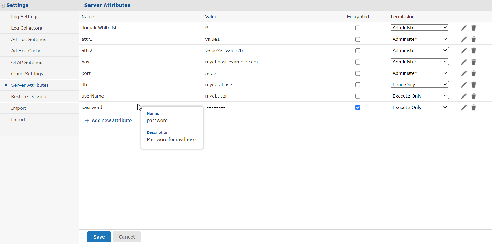
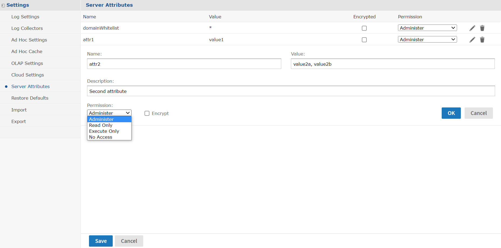
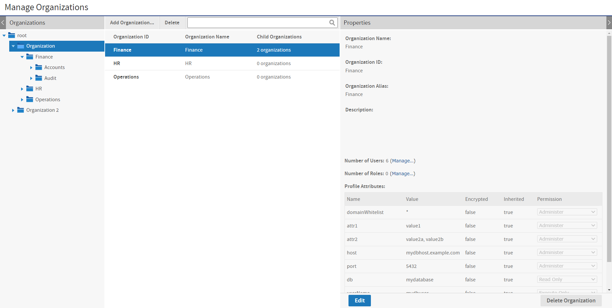
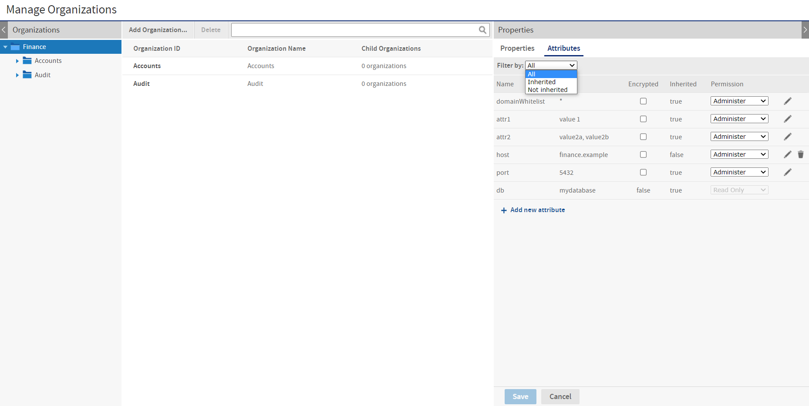
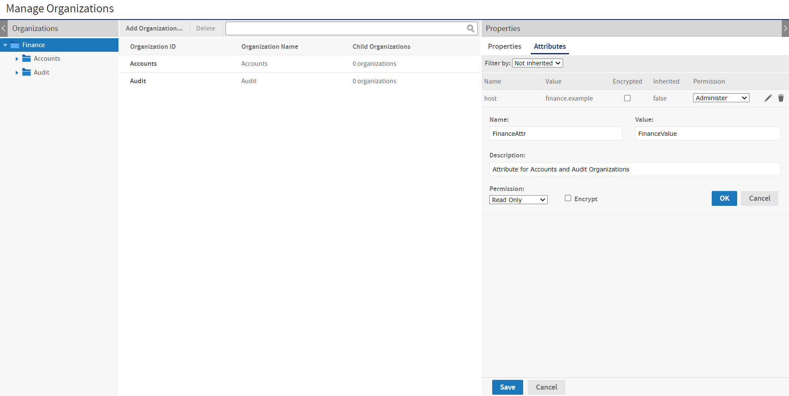
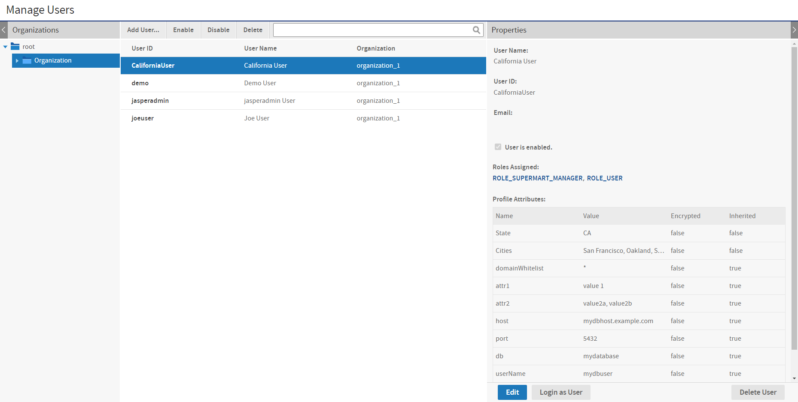
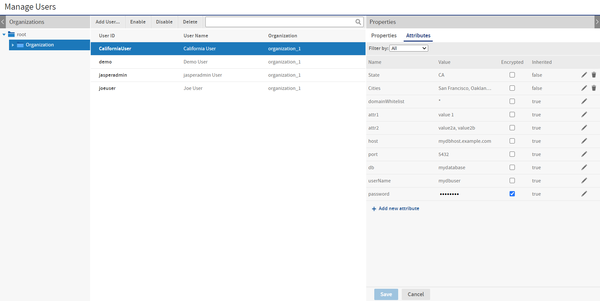
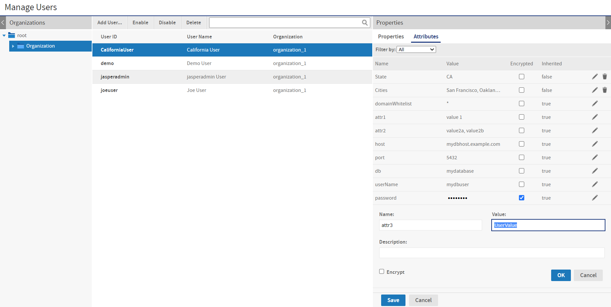

# Managing Attributes

Attributes are name-value pairs that are associated with users, organizations, and the server itself. Attribute values can be used to parameterize access to data sources, Domain data, OLAP data, and report output. Attributes were previously known as profile attributes.

For example, when defining a data source, you can specify that the database name be defined by an organization-level attribute called `dbname`. Each organization then has an attribute called `dbname` with a different value. You have a single data source in your repository that is accessible in each organization, but when a user runs a report with that data source, it takes data from the database specified by the value of `dbname` in that user's organization.

Attributes have permissions, so that system admins or organization admins can restrict the visibility and use of specific attributes at lower levels.

!!! note

    The permission feature of attributes is designed to work with multiple organizations in commercial editions of JasperReports Server. The feature is enabled in all editions of the server, but has limited use in servers with only a single default organization.

## Referencing Attributes

There are several features of JasperReports Server that can read attributes and use attribute values. The following features can limit or restrict access to data or take different behavior based on the user, organization, or server-level attributes. Each feature reads or references attributes in its own syntax that is described with that feature:

-   Data sources - The host name, port number, database name, username, and user password can be defined through attributes. See [Attributes in Data Source Definitions](../datasources/attributes_in_data_source_definitions.md).
-   Reports - Attribute values can be referenced in the calculations as described in [Attribute-Based Parameters for Queries and Reports](../resources/query-based_input_controls.md).
-   Domain security files - Access rules for rows and columns can be defined with attributes so that users or organizations may only see data that they are allowed to access. See the JasperReports Server Data Management Using Domains and a comprehensive example in the chapter "Securing Data in a Domain" in the JasperReports Server Data Management Using Domains.
-   Domain pre-filters and calculated fields - Attribute values can be part of filters and calculated fields when creating Domains using the Domain Designer. See the chapter "Working with the Domain Designer" in the JasperReports Server Data Management Using Domains.
-   OLAP schemas - Similar to Domains, access rules can be defined with attributes so that users may only see data that they are allowed to access. See the Jaspersoft OLAP User Guide.

Attributes are always referenced in relation to the currently logged in user who is performing an operation or running a report:

-   If the value of a user-level attribute is requested, it refers to the attributes of the logged in user.
-   If the value of an organization-level attribute is requested, it refers to the attributes of the logged in user's organization.
-   If the value of a server-level attribute is requested, the value depends on which server the user is logged into. For example, test and production servers may have a copy of the same repository, but different server-level attributes. For a given server, server-level attributes are shared and thus have the same value for all users in all organizations.

## Attribute Hierarchy

An attribute is a named value that is defined on a user, organization, or root of the server. Any number of attributes with any name can be defined at any or all of these levels. The definition of each attribute at each level is independent of other attributes at other levels. Attributes at different levels may have the same name, unless explicitly forbidden as described in [Attribute Permissions](#attribute-permissions).

In the places that you reference attributes (see above), there are two ways to determine the value of an attribute:

-   Categorical value - References the value of a named attribute at a specific level, either user level, organization level, or server level. If the attribute does not exist at the requested level, no value is returned.

-   Hierarchical value - References the value of a named attribute across all levels, starting at the user level. The server searches for an attribute with the given name in the following order, stopping and returning the first value that it finds:

    -   At the user level, in the user attributes of the logged in user.

    -   At the organization level, in the organization the attributes of the logged in user's organization and all parent organizations.

    -   At the server level.

    -   If the attributes do not exist at any level, no value is returned.

With hierarchical values, attributes with the same name but different values may be defined at several levels and on many users or organizations. Each attribute is a distinct attribute definition, but the hierarchical value referencing takes into account the level and the presence of the definition for every given user and organization.

To help administrators define attributes on users and organizations, the UI displays all attributes that are visible in the attribute hierarchy. If an attribute is defined in a parent organization or at the server level, its hierarchical value is shown at the lower organization level and user level, and the attribute is called inherited. This allows the administrator to see all hierarchical values that are in effect in lower levels, either to override them in the hierarchy or leave them as inherited.

Categorical and hierarchical approaches usually involve different strategies for defining and naming attributes. When using categorical values, you must ensure that each and every user or organization has the attribute defined, and you must handle the case when it is accidentally undefined, such as a new user. When using hierarchical values, you define attributes with the same name at different levels, such that each user may have a custom value, but then the organization level provides a default value for all users, and the server level provides a default value for all organizations. Each strategy is useful for different applications, depending on your needs to access and protect data. However, both strategies can co-exist and be used by at the same time by different resources, as long as the names of attributes used in each strategy or each resource are kept distinct.

## Attribute Encryption

Because of the attribute hierarchy and the way that attributes are referenced, attribute names and values are one of the few mechanisms that allow lower organizations to see items defined in higher organizations. By default, an attribute and its value can be known to administrators throughout the server.

JasperReports Server provides two mechanisms to protect sensitive attributes:

-   Attribute encryption - Prevents the attribute value from ever being seen. Does not prevent the attribute name from being seen or the value from being redefined at a lower level. When an attribute value is encrypted, the value stored internally is encrypted and never decrypted in the user interface. The server decrypts the attribute only when it is referenced by one of the features of the server. The decrypted value is then used for internal operations and is never visible to the user.

For example, an encrypted attribute could store the password for a database. Once typed in and saved, the UI displays \*\*\* as the value of the attribute. When a report uses that database, the server decrypts the password and sends it as part of the database protocol, so the user and the admin never see the password.

Encrypted attributes are similar to user passwords in the server. Administrators can change the encrypted value to a new value, but they can never view the current value, even the system admin (`superuser`).

-   Attribute permissions - Prevents the attribute from being visible or redefined at a lower level. Attribute permissions are described in the next section.

To properly secure an attribute, you should make it encrypted so it cannot be seen and then set permissions so it cannot be overridden.

## Attribute Permissions

!!! note

    Attribute permissions were designed to work with multiple organizations in JasperReports Server. The feature has limited use in servers with only a single default organization.

Because the attribute hierarchy allows attribute values at lower levels to take precedence over attributes with the same name at higher levels, administrators need a mechanism to enforce the priority of higher-level attributes. The permissions on attributes allow admins to prevent the same attribute name from being seen or redefined in lower levels. Otherwise, a low-level organization admin could define an attribute with the same name as a critical server-level attribute defined by the system admin.

The attribute permissions and their effects are as follows:

-   Administer - This is the absence of any restrictions. It allows lower-level administrators to define attributes with the same name and set their permissions locally for their suborganizations. This is the default permission.

In servers with only a single default organization, use this permission unless you want to disable an attribute with the no-access permission.

-   Read Only - The attribute and its value are visible to lower-level administrators, but they cannot define locally an attribute with the same name. In servers with only a single default organization, this permission has no effect.
-   Execute Only - The attribute and its value are not visible to lower-level administrators, and they see an error if they try to create an attribute with the same name. However, the attribute returns its value when properly referenced. In servers with only a single default organization, this permission has no effect.
-   No Access - The attribute and its value are not visible to lower-level administrators, and they see an error if they try to create an attribute with the same name. In addition, the attribute is disabled and its value cannot be referenced. When referenced, an attribute with no-access permission returns an error.

It is important to remember that attributes are always defined individually at each level. When permissions prevent a lower-level admin from "writing" an attribute, in actuality, the permission is preventing the lower-level admin from creating a new attribute at his level with the same name (regardless of its value).

As the root user, the system admin (`superuser`) is not restricted by attribute permissions. Therefore, the system admin can view all attributes defined at all levels and create or modify attributes on any organization or user, regardless of the permission. Thus, the system admin could create an execute-only attribute at the server level and then define an attribute with the same name but different value on an organization or user.

The permission system is based on the permissions above, and when combined with multiple levels of organizations, it can be used to create complex attribute definitions.

## Managing Server Attributes

Attributes can be defined at the server level, which is equivalent to the root organization. If a given attribute name is not defined on an organization or a user, it can have a value at the server level to act as a default value. Server-level attributes may also be used as parameters in data source definitions. For example, the same data source may be imported to several servers, such as test and production servers, but a server-level attribute with the same name on each server makes the data source connect to a different database.

To view, create, modify, or delete server-level attributes

1.  Log in as the system admin (`superuser`).

2.  Select **Manage &gt; Server Settings** and choose **Server Attributes** from the left-hand panel.

    Each server level attribute is listed with its value, encrypted status, and permission. Holding the pointer over an attribute name shows the description associated with the attribute. When an attribute value is encrypted, its value is shown as \*\*\* symbols.

    

    *Figure 1 Managing Attributes at the Server Level*

3.  To create a new server-level attribute, click **Add new attribute**. Enter the attribute name and value, as well as an optional description. If desired, set the permission from the dropdown list and select the Encrypt checkbox. Click **OK** to close the dialog and then click **Save** to submit the new attribute.

    

    *Figure 2 Adding a Server Attribute*

4.  To modify an attribute, click the edit icon . In the edit dialog, modify the desired fields. Click **OK** to close the dialog and then click **Save** to modify the attribute.

    You can also modify the attribute's permission and encryption by using the dropdown and checkbox in its table row. After confirming any changes, click **Save** to make them take effect.

    When modifying an attribute, be aware of the following:

    -   Changing the name of an attribute is equivalent to deleting the original attribute and adding a new attribute with the same value. Because this may impact features that reference the attribute, you are asked to confirm the name change.
    -   Be aware that changing the encryption or permission of an attribute can impact the visibility of an attribute and the features that might rely on referencing its value. Again, you are asked to confirm the change.
    -   Removing encryption does not decrypt an encrypted attribute. To safeguard encrypted values, removing the encryption on an attribute also erases its value. You should give the attribute a new value by clicking the edit icon.

5.  To delete an attribute at the server level, click the delete icon  in the attribute row and confirm the operation. Because this may impact features that reference attributes, you are asked to confirm the deletion. Click **Save** to make the deletion take effect.

## Managing Organization Attributes

Organization attributes are attributes defined on an organization, regardless of whether it's a top-level organization or suborganization. For example, an attribute with the same name could have different values in each organization, so that the same data source definition would access a different database specific to each organization. Furthermore, suborganizations could also define the same attribute if they need access to a different database than their parent organization.

Organization attributes are managed by either the system admin or the organization admin. As with all management operations, organization admins can set the attributes in their organization and any of their sub-organizations, and the system admin can set the attributes in any organization. If a higher admin wants to restrict access to certain attributes by a lower-level admin, the higher admin must set permissions, as described in [Attribute Permissions](#attribute-permissions).

To view, create, modify, or delete organization-level attributes

1.  Log in as an administrator (`jasperadmin` in the target organization or any parent organization, or `superuser`).

2.  Select **Manage &gt; Organizations**.

3.  Select the parent organization in the left-hand column, then select the target organization in the center column.

    The right-hand column displays the properties of the target organization, including a table of all attributes visible at this organization's level. The attributes include locally defined attributes, as well as inherited attributes. An inherited attribute is one defined in a parent organization or at the server-level, and whose permissions allow it to be visible in this organization.

    

    *Figure 3 Viewing Attributes on the Manage Organizations Page*

    !!! note

        In the figure above, the system admin (superuser) is logged in and viewing organization attributes. The system admin can view all attributes at all levels, even inherited attributes, regardless of permissions. Also, the root organization is visible and represents the server level. Selecting root in the Manage Organizations page displays the same attributes and offers the same functionality as the **Server Attributes** page under **Manage &gt; Server Settings**. By definition, none of the attributes at the server level are inherited.

4.  To create, modify, or delete the attributes on an organization, click **Edit** in the right-hand column, then select the **Attributes** tab. In the following figure, the Finance organization admin is logged in and does not see the `userName` and `password` attributes because they are hidden by permissions. Also, inherited attributes with the read-only permission are shown but cannot be modified.

    

    *Figure 4 Editing Organization Attributes*

5.  You can filter the attributes in the list to include only the inherited attributes or only the locally defined (not inherited) ones.

6.  To create a new organization attribute, click **Add new attribute**. Enter the attribute name and value, as well as an optional description. If desired, set the permission from the dropdown list and select the Encrypt checkbox. Click **OK** to close the dialog and then click **Save** to submit the new attribute.

    

    *Figure 5 Adding an Organization Attribute*

7.  To modify an attribute, click the edit icon . In the edit dialog, modify the desired fields. Click **OK** to close the dialog and then click **Save** to modify the attribute. 
    You can also modify the attribute's permission and encryption by using the dropdown and checkbox in its table row. After confirming any changes, click **Save** to make them take effect. 
    When modifying an organization attribute, be aware of the following:

    -   Inherited attributes belong to a parent organization or server root and are shown at the organization level to display the hierarchical attribute values. Any modification to an inherited attribute actually creates a local attribute definition with the modified parameters. In the hierarchy for the selected organization, this new attribute takes precedence over the previously inherited attribute.
    -   Changing the name of a locally defined attribute is equivalent to deleting the original attribute and adding a new attribute with the same value. Because this may impact features that reference the attribute, you are asked to confirm the name change.
    -   Be aware that changing the encryption or permission of an attribute can impact the visibility of an attribute and the features that might rely on referencing its value. Again, this may impact features that reference the attribute, and you are asked to confirm the change.
    -   Removing encryption does not decrypt an encrypted attribute. To safeguard encrypted values, removing the encryption on an attribute also erases its value. Click the edit icon to give the attribute a new value.

8.  To delete an organization attribute, click the delete icon  in the attribute row and confirm the operation. Because this may impact features that reference attributes, you are asked to confirm the deletion. Click **Save** to make the deletion take effect. 
    When deleting an organization attribute, be aware of the following:

    -   On deletion, some attributes remain in the list as inherited attributes. This indicates that the local definition of the attribute was deleted, but another attribute with the same name is visible higher in the attribute hierarchy.
    -   You cannot delete an inherited attribute, because it belongs to a higher organization or server root. To remove an inherited attribute, you must find where it is defined then delete it at that level. The system admin can also change the permission of the attribute where it is defined to Execute Only or No Access so it does not appear to organization admins in the lower organization anymore.

## Managing User Attributes

Attributes on users can provide additional information about a user and can restrict access to data through Domain security files and OLAP schemas. Every user in every organization may have attributes defined, and will also have attribute values inherited through the attribute hierarchy.

Attributes on users do not have permissions because there is no lower level of attributes. Instead, the permissions on organization attributes determine which attributes values apply to a user through the attribute hierarchy.

Users never see the attributes defined on their user profile; only administrators can view and set user attributes.

To view, create, modify, or delete user-level attributes

1.  Log in as an administrator (`jasperadmin` in the user's organization or any parent organization, or `superuser`).

2.  Click **Manage &gt; Users** or, on the Admin Home page, click **Manage** in the Users workflow block.

3.  In the Organizations panel, select the user's organization. Or select a parent organization and search for the user by name.

4.  Select the user in the Users panel. The properties panel includes a table of all attributes for the user, both locally defined and inherited from the attribute hierarchy In the following figure, the system administrator can see that `attr2` attribute was redefined at the organization level before being inherited by the user.

    

    *Figure 6 Viewing Attributes on the Manage Users Page*

5.  To create, modify, or delete the attributes on a user, click **Edit** in the right-hand column, then select the **Attributes** tab.

    

    *Figure 7 Editing User Attributes*

6.  You can filter attributes in the list to include only the inherited attributes or only the locally defined (not inherited) ones.

7.  To create a new user attribute, click **Add new attribute**. Enter the attribute name and value, as well as an optional description. If the attribute value should not be visible to other administrators, select the Encrypt checkbox. Click **OK** to close the dialog and then click **Save** to submit the new attribute.

    

    *Figure 8 Adding a User Attribute*

8.  To modify an attribute, click the edit icon . In the edit dialog, modify the desired fields. Click **OK** to close the dialog and then click **Save** to modify the attribute. 
    You can also modify the attribute's encryption by using the check box in its table row. After confirming any changes, click **Save** to make them take effect. 
    When modifying a user attribute, be aware of the following:

    -   Inherited attributes belong to a parent organization or the server level and are shown at the user level to display the hierarchical attribute values. Any modification to an inherited attribute actually creates a local attribute definition with the modified parameters. In the hierarchy of attributes for this user, the new attribute takes precedence over the previously inherited attribute.
    -   Changing the name of a locally defined attribute is equivalent to deleting the original attribute and adding a new attribute with the same value. Because this may impact features that reference attributes, you are asked to confirm the name change.
    -   Removing encryption does not decrypt an encrypted attribute. To safeguard encrypted values, removing the encryption on an attribute also erases its value. Click the edit icon to give the attribute a new value.

9.  To delete a user attribute, click the delete icon  in the attribute row and confirm the operation. Because this may impact features that reference attributes, you are asked to confirm the deletion. Click **Save** to make the deletion take effect. 
    When deleting a user attribute, be aware of the following:

    -   On deletion, some attributes remain in the list as inherited attributes. This indicates that the local definition of the attribute was deleted, but another attribute with the same name exists higher in the attribute hierarchy.
    -   You cannot delete an inherited attribute because it belongs to a parent organization or the server level. To remove an inherited attribute, you must find where it is defined, then delete it at that level. The system admin can also change the permission of the attribute where it is defined to Execute Only or No Access so it does not appear on the user anymore.
