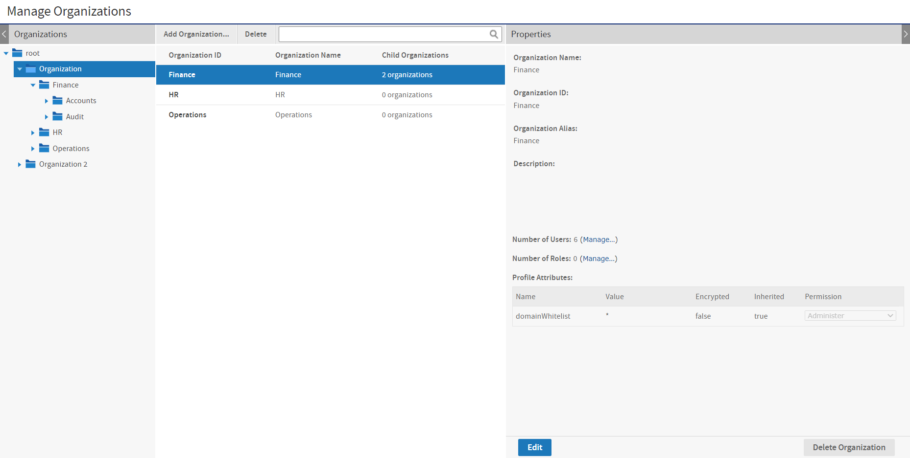
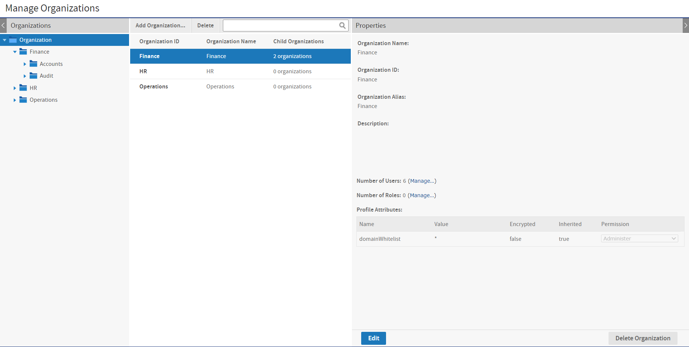
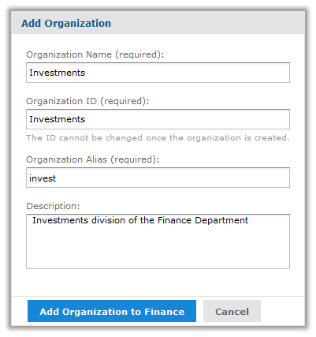
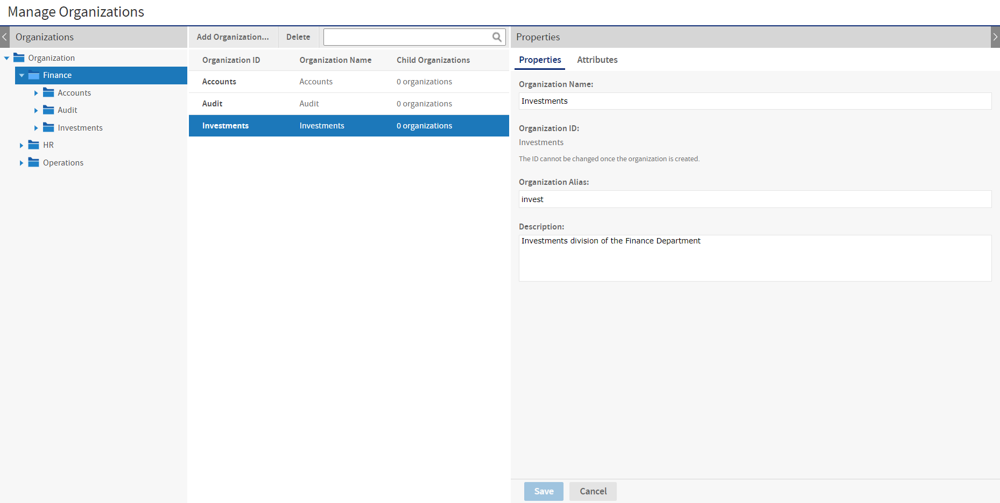

# Managing Organizations

System admins and organization admins use the same pages for managing organizations, the only difference is that system admins can manage top-level organizations, and organization admins are limited to suborganizations.

!!! note

    Administrators of deployments with a default single organization can generally skip this section. However, the procedure in <a href="managing_organizations.md">Editing an Organization</a> can be used to change the name of the default organization.

The system admin (`superuser`) can view all the organizations in the server, as shown in the following figure. In the Organizations panel on the left, the system administrator's view begins at the root of the organization hierarchy and includes all defined organizations and suborganizations, so he can manage any organization or suborganization in the server. In this example, there are two top-level organizations, and one of them has several suborganizations.

*Figure 1: System Admin View of Manage Organizations Page*

The following figure shows the same repository as seen by the admin of Organization (`jasperadmin`). It shows that this administrator's view is limited to his own organization and its suborganizations, and he can access and manage only those.

*Figure 2: Organization Admin View of Manage Organizations Page*

## Viewing Organization Properties

1.  Log in as a user with administrative privileges for the organization you want to view.
2.  Select **Manage \> Organizations**.
3.  The organization management page appears, as shown in the previous figures.
4.  To select an organization, click its parent in the left-hand Organizations panel, then select the organization in the center panel. If there are many organizations, you can search for a specific organization.

!!! note

    The search only applies to suborganizations of the parent organization currently selected in the left-hand panel.

5.  Once you select an organization, the **Properties** panel on the right shows information about it:

- **Name**: Display name of the organization that appears on the organization's top folder.
- **ID**: Unique and permanent organization ID used for logging in.
- **Alias**: Unique but editable short organization name that can also be used when logging in.
- **Description**: Optional description that appears only in this Properties panel.
- **Number of Users**: Count of all users, including those in any suborganizations. Click **Manage** to see the list of users on the user management page.
- **Number of Roles**: Count all roles, including those in any suborganizations. The number of roles does not include the system roles (such as ROLE_USER) that appear at every organization level but are defined at the root level. Click **Manage** to see the list of roles on the role management page.
- For information about attributes on the organization, see [Managing Organization Attributes](managing_attributes.md).

!!! note

    Both system admins and organization admins can also export and import entire organizations from the Manage Organizations page. This functionality can be used to duplicate organizations or change their hierarchy, or to create a backup. For more information, see <a href="../importexport/through_the_web_ui.md">Exporting from Organizations</a> and <a href="../importexport/through_the_web_ui.md">Importing to Organizations</a>.

## Creating an Organization

1.  Log in as a user with administrative privileges for the parent of the new organization.
2.  Click **Manage \> Organizations**.
3.  In the left-Organizations panel, expand the hierarchy of organizations to select the parent organization, for example Finance, then click **Add Organization** in the middle panel.
4.  The **Add Organization** dialog appears.

*Figure 3: Adding an Organization*

5.  Enter the **Organization Name**. The server automatically fills in the ID and alias based on the name. You can change the ID and alias if needed before saving the organization. Once saved, the organization ID can no longer be modified. The **Description** is optional. The previous figure shows this dialog with sample values.
6.  To save the new organization, click **Add Organization to \<organization\>**.

The new organization appears in the **Organizations** panels. When you select it in the center panel, its properties appear in the **Properties** panel on the right.

The **Properties** panel shows the number of users and roles in the organization and provides links to manage them. By default, new organizations have the following:

- Two users with default passwords: the organization admin (**jasperadmin**/**jasperadmin**) and a sample user (**joeuser/joeuser**).

!!! warning

    For security reasons, always change the default passwords immediately after creating a new organization. For instructions, see <a href="managing_users.md">Managing Users</a>.

- The new organization has no roles of its own. The default users have the system-wide roles **ROLE_USER** and **ROLE_ADMINISTRATOR**.
- In the repository, a new folder is created in the parent's Organization folder. This new organization folder contains a copy of the parent's **Organization/Folder Template** folder. To manage the **Organization** folders, select **View \> Repository**.

## Default Folders for Organizations

Every organization contains a special folder named Organizations where the server creates suborganizations and administrators can manage its resources. The Organizations folder always contains a folder named Folder Template. When you create a new organization, the entire content of the Folder Template is copied to create your new organization's folders. You can add folders and resources in the **Folder Template**, and these are copied into each organization created thereafter.

The default folders in the Folder Template are:

- **Ad Hoc Components\Topics** – The location where the Ad Hoc Editor looks for Topics to create new reports.
- **Temp** – A folder visible only administrators, used by the server to store temporary files.
- **Templates** – A folder that holds templates used when generating reports from Ad Hoc views.
- **Themes** – A special folder managed by the system to contain CSS files that define the appearance of the user interface.

!!! note

    The Public folder visible in every organization is a special linked folder at the root level. The repository makes it accessible to every organization, but it is not within the organization folder.

There is a **Folder Template** at every level of the organization hierarchy, including the root. The system admin can add content to the top-level **Folder Template** for use in creating top-level organizations. Organization admins can add content to their Folder Templates for use in creating suborganizations.

Finally, the **Folder Template** itself is copied into a new organization, so each new suborganization has the same default folders and resources as its parent.

## Editing an Organization

1.  Log in as a user with administrative privileges for the organization.
2.  Click **Manage \> Organizations**.
3.  In the left-Organizations panels, select the organization's parent. In the center Organizations panel, select the **Organization**.
4.  In the **Properties** panel, click **Edit** so you can change the organization's properties.

*Figure 4: Editing Properties of an Organization*

5.  Edit the organization **Properties** as needed. Changing the **Organization Name** changes the name of the organization's folder, as well, but no other data. You can change the alias and description. The organization ID is defined when the organization was created and cannot be modified.
6.  For information about attributes on the organization, see [Managing Organization Attributes](managing_attributes.md).
7.  Click **Save** to keep your changes, or **Cancel** to quit without saving.

## Deleting an Organization

1.  Log in as a user with administrative privileges for the organization.
2.  Click ****Manage \> Organizations****.
3.  In the left-Organizations panels, select the organization's parent. In the center Organizations panel, select the **Organization** and click **Delete**.
4.  Administrators cannot delete the organization to which they belong. Confirming the delete completely removes all users, roles, and folders of the organization and all of its suborganizations from JasperReports Server.
