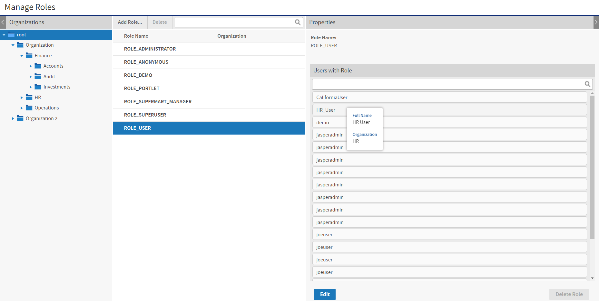
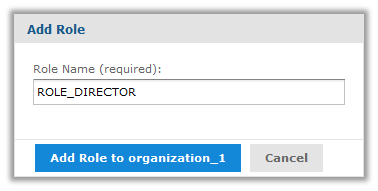
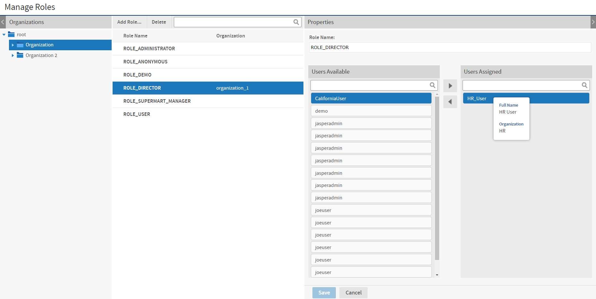

# Managing Roles

Roles define sets of users who are granted similar permissions. Administrators create roles, assign them to users, and set permissions in the repository (see [Repository Permissions](../repository/permissions.md)). By default, JasperReports Server includes the following roles; some are needed for system operation, some are included as part of the sample data:

<table>
<caption>
Default Roles in JasperReports Server Installations
</caption>
<colgroup>
<col style="width: 50%" />
<col style="width: 50%" />
</colgroup>
<thead>
<tr>
<th>
Role
</th>
<th>
Description
</th>
</tr>
</thead>
<tbody>
<tr>
<td>
ROLE_SUPERUSER
</td>
<td>
This role determines system admin privileges, as explained in <a href="../overview/users_and_roles.md">Delegated Administration</a>. It's a system-level role, but in a single-organization deployment, the system admin can assign it to an organization admin. 
Never delete this role, it's required for proper administration of the server.
</td>
</tr>
<tr>
<td>
ROLE_ADMINISTRATOR
</td>
<td>
This role determines organization admin privileges. This role is automatically assigned to the default <code>jasperadmin</code> user in every new organization. It's a special system-level role visible in every organization, and organization admins can assign it to other users, as explained in <a href="../overview/users_and_roles.md">Delegated Administration</a>. 
Never delete this role, it's required for proper administration of the server.
</td>
</tr>
<tr>
<td>
ROLE_USER
</td>
<td>
Required to log in. This role is automatically assigned to every user in the server. It's a special system-level role visible in every organization. 
Never delete this role, it's required to create users and allow them to log in.
</td>
</tr>
<tr>
<td>
ROLE_ANONYMOUS
</td>
<td>
When anonymous access is enabled, this role is automatically assigned to any agent accessing the server without logging in. It's a special system-level role visible in every organization. This role is also assigned to the default anonymous user. By default, anonymous access is disabled and this role isn't used. It's a system role that even the system admin can't delete.
</td>
</tr>
<tr>
<td>
ROLE_PORTLET
</td>
<td>
This role is only found in JasperReports Server instances that have received authentication requests from a portal such as Liferay or JBoss. If you do not use a portal server, you can delete this role.
</td>
</tr>
<tr>
<td>
ROLE_DEMO
</td>
<td>
This role grants access to the SuperMart demo Home page, reports, and if you implement Jaspersoft OLAP, OLAP views. This role is assigned to the demo user in the default organization. These objects are available only if you installed the sample data when you installed your server. It is a special system-level role that is visible in every organization 
When you no longer need the sample data, this role can be deleted.
</td>
</tr>
<tr>
<td>
ROLE_SUPERMART_MANAGER
</td>
<td>
This role is used to assign permissions relative to the sample data. It is a special system-level role that is visible in every organization. It demonstrates data security features available in Jaspersoft OLAP. See the Jaspersoft OLAP Ultimate Guide for more information. 
When you no longer need the sample data, this role can be deleted.
</td>
</tr>
</tbody>
</table>

When you need to define permissions for sets of users, administrators can create new roles and assign them to users. Users can belong to any number of roles and each can be used for access to different resources.

Except for the five special system-level roles visible in every organization, roles are defined within organizations. The same role ID can be defined in multiple organizations, as long as it is unique within each organization. Admins can manage all roles in their organizations and any suborganization, but they can never see roles in a parent or sibling organization. JasperReports Server enforces this scheme to ensure that organizations are secure and only valid roles are assigned to users.

It is possible for an administrator to assign a role to a user in a suborganization, where the role is defined in a parent organization of the user. The admin of the user's organization cannot see the role when managing the user, but the admin of the role's organization can, and permissions associated with the role are properly enforced.

## Viewing Role Properties

1.  Log in as an administrator (`jasperadmin` in the role's organization or any parent organization, or `superuser`).

2.  Select **Manage \> Roles** or, on the Admin Home page, click **Manage** under Roles. The Manage Roles page displays the roles defined in the server and in each organization and properties for each role.

    

    *Figure 1: Manage Roles Page*

    > The Roles list includes all roles in the chosen organization and its suborganizations along with the five default system-level roles. The same role name may appear more than once if roles with the same name were created in different organizations. The second column (blank in this figure) gives the organization name of a particular role.
    >
    > In this example, the system admin can see all roles in all organizations by selecting the root of the Organization hierarchy.

3.  To select a role, click its organization in the Organizations panel (Commercial edition users only). The Roles panel displays all the roles.

4.  To filter the list of roles, enter a search string in the search field of the Roles panel. The search results show all of the roles in the selected organization and suborganizations whose names contain the search string. If necessary, scroll through the new list or refine your search.

5.  Select the role in the Roles panel. The role's properties appear in the Properties panel.

> The Properties panel shows the role name, the organization where it's defined, and the users assigned to the role. You can enter a search term to find users in the list. Some user IDs may appear several times because the same ID can exist in different organizations. Hover over a user ID to see a user's full name and organization, as shown in the figure.

!!! note

    When you view the properties of a special system-level role, you only see the users with that role in your organization or any suborganization. An organization admin can never see users outside of his organization or its suborganizations.

## Creating a Role

1.  Log in as an administrator (`jasperadmin` in the role's intended organization or any parent organization, or `superuser`).

2.  Select **Manage \> Roles** or, on the Admin Home page, click **Manage** under Roles.

3.  In the Organizations panel, select the organization to which the role will belong.

4.  Click **Add Role**. The Add Role dialog appears.

    

    *Figure 2: Adding a Role*

5.  Enter the name of the role. The role name is also the role ID and does not accept spaces or special characters.

6.  Click **Add Role to \<organization\>** to create the role.

    The new role is included in the Roles panel. If you want to assign users to the role, click **Edit** in the Properties panel of the new role.

## Assigning Users to a Role

You can assign multiple users to one role. To assign multiple roles to one user, edit the user's properties as described in [Editing a User](managing_users.md).

1.  Log in as an administrator (`jasperadmin` in the role's organization or any parent organization, or `superuser`).

2.  Select **Manage \> Roles** or, on the Admin Home page, click **Manage** under Roles.

3.  In the Organizations panel, select the role's organization.

4.  Select the role in the Roles panel.

    !!! note

        Unless you are logged in as the system admin, you can't edit or delete the five special system-level roles.

5.  In the Properties panel, click **Edit**. The role's properties become editable.

    

    *Figure 3: Editing the Members of a Role*

6.  Enter a different name to change the role name throughout the server.

    !!! warning

        Permissions in the repository that use the role name are automatically updated. However, role names in security files for Domains and OLAP are not updated with the new role name and may cause a security risk. If you use security files for Domains or OLAP, do not change role names without verifying the files as well. For more information, see the JasperReports Server User Guide.

7.  To assign or remove role users, select the users, and click the arrow buttons between the Users Available and Users Assigned lists. You can enter a search term to find users in the lists. Some user IDs may appear several times because the same ID can exist in different organizations. Hover over a user ID to see a user's full name and organization, as shown in the figure.

8.  Click **Save** to keep your changes, or **Cancel** to quit without saving.

## Deleting One or More Roles

1.  Log in as an administrator (`jasperadmin` in the role's organization or any parent organization, or `superuser`).

2.  Select **Manage \> Roles** or, on the Admin Home page, click **Manage** under Roles.

3.  In the Organizations panels, select the role's organization. The Roles panel is displayed.

4.  Select the role in the Roles panel. Use Control-click and Shift-click to make multiple selections.

    !!! note

        Unless you're logged in as the system admin, you can't edit or delete the five special system-level roles.

5.  In the tool bar of the Roles panel, click **Delete** and confirm the action.
