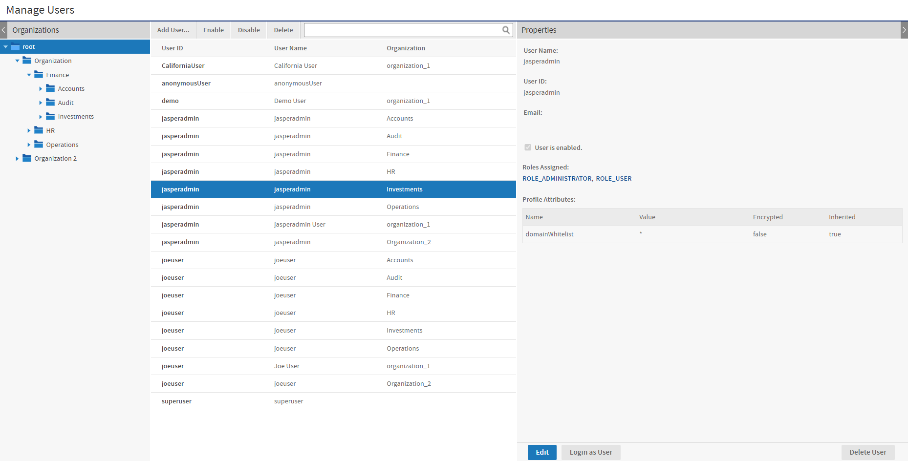
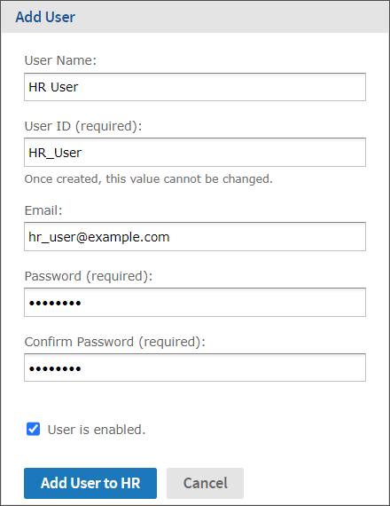
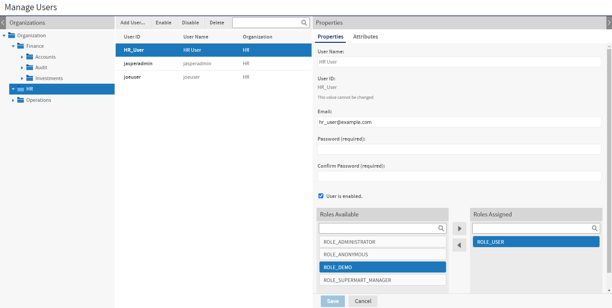

# Managing Users

As with organizations, system admins (`superuser`) can manage all users in all organizations and create users outside of organizations, as described in [Delegated Administration](../overview/users_and_roles.md). Organization admins can manage the users in their own organization and in any of its suborganizations.

In a deployment without organizations, you should still be familiar with the structure because of the system admins (`superuser` or other delegated system admins) that exist outside of the single default organization. All other users belong to the single default organization.

The default installation of JasperReports Server includes the following users:

<table>
<caption><p>Default Users after Installation</p></caption>
<colgroup>
<col style="width: 33%" />
<col style="width: 33%" />
<col style="width: 33%" />
</colgroup>
<thead>
<tr>
<th><p>Username</p></th>
<th><p>Default Password<br />
(Case sensitive)</p></th>
<th><p>Description</p></th>
</tr>
</thead>
<tbody>
<tr>
<td><p><code>superuser</code></p></td>
<td><p><code>superuser</code></p></td>
<td><p>Default system admin who does not belong to any organization (defined at the root level).</p></td>
</tr>
<tr>
<td><p><code>jasperadmin</code></p></td>
<td><p><code>jasperadmin</code></p></td>
<td><p>Default <span>organization admin in every organization</span>.</p></td>
</tr>
<tr>
<td><p><code>joeuser</code></p></td>
<td><p><code>joeuser</code></p></td>
<td><p>Default end user<span> in every organization</span>.</p></td>
</tr>
<tr>
<td><p><code>demo</code></p></td>
<td><p><code>demo</code></p></td>
<td><p>Included in the single default organization only if you install the sample data.</p></td>
</tr>
<tr>
<td><p><code>CaliforniaUser</code></p></td>
<td><p><code>CaliforniaUser</code></p></td>
<td><p>Included in the single default organization only if you install the sample data.</p></td>
</tr>
<tr>
<td><p><code>anonymousUser</code></p></td>
<td><p><code>anonymoususer</code></p></td>
<td><p>An internal system user. It is not a regular user and is not intended for normal usage.</p>
<p>**Note** Although you can disable an anonymous user's access, this user cannot be deleted.</p></td>
</tr>
</tbody>
</table>

!!! warning

    Due to security concerns, we recommend that you remove any users that are not being used in your instance, whether created by default or otherwise. Advise your users to change their passwords regularly. To configure periodic expiration of passwords, refer to the JasperReports Server Security Guide.

## Viewing User Properties

1.  Log in as an administrator (`jasperadmin` in the user's organization or any parent organization, or `superuser`).

2.  Select **Manage \> Users** or on the Admin Home page, click **Manage** in the Users workflow block. The Manage Users page displays the users in each organization and the properties of the selected user.

    

    *Figure 1: Manage Users Page*

    The columns in the Users panel list the user ID, the username, and the organization of each user. The list of users includes everyone in the chosen organization and its suborganizations. The same user ID may appear more than once, indicating that users with the same ID were created in different organizations.

    In this example, the system admin can see all users in all organizations by selecting the root of the Organization hierarchy. There are always multiple `jasperadmin` users in a hierarchy of organizations, because it is the default administrator ID in each organization.

3.  To locate a user:

    - Browse for users - Expand the organization hierarchy in the left-panel, and select an organization or suborganization. Scroll through the list of users if it is too long to fit on your screen.
    - Search for a user - Select the organization (or any parent organization) and enter a search string in the **Search** field of the Users panel. The search results show all user ID or names in the selected organization and suborganizations that match the search string.

4.  Select a user account to view its Properties in the right-hand panel.

    User status can be **Enabled** or **Disabled**. Disabled users are displayed in gray text in the Users list. For convenience, the role names link to the role management page for each role. For information about attributes on the user, see [Managing User Attributes](managing_attributes.md).

!!! note

    As the administrator of a given organization, you can see the roles defined in your organization and its suborganizations but not the parent organization (except for certain system-wide roles). A user may have roles defined and assigned from a parent organization that are not visible to the administrator of the user's organization. For more information, see [Managing Roles](managing_roles.md).

## Creating a User

1.  Log in as an administrator (`jasperadmin` in the user's intended organization or any parent organization, or `superuser`).

2.  Select **Manage \> Users** or, on the Admin Home page, click **Manage** in the Users workflow block.

3.  In the Organizations panels, select the organization for the new user and click **Add User**. The Add User dialog appears.

    

    *Figure 2: Adding a User*

4.  Enter the following information:

    - User name - The new user's full name. The name is optional but recommended. It appears in the menu bar of the UI when the user is logged in.
    - User ID - Generated automatically from the username. You can accept the suggested value or type your own. The user ID is used to log into JasperReports Server, and for administrators to manage users and resources. The User ID must be unique within the organization, but may exist in multiple organizations.
    - Email - This is optional but must be in a valid email format.
    - Password and confirmation - Enter and confirm a password for the user.
    - User is enabled - To enable the user to log in, select this check box. Users who are not enabled can't log in. If you implement role-based permissions, you might want to delay enabling the user until you assign more roles. For more information on roles, see [Managing Roles](managing_roles.md).

5.  Click **Add User to \<organization\>**.

    The new user is available in the Users panel. To assign roles to the user, click **Edit** in the user's Properties panel.

## Editing a User

One way to assign roles to a user is to edit the user's properties. Alternatively, when you edit a role, you can assign it to any number of users.

To edit a user's properties:

1.  Log in as an administrator (`jasperadmin` in the user's organization or any parent organization, or `superuser`).

2.  Click **Manage \> Users** or, on the Admin Home page, click **Manage** in the Users workflow block.

3.  In the Organizations panel, select the user's organization or a parent organization.

4.  In the Users panel, select the user.

5.  In the user's Properties panel, click **Edit**.

    

    *Figure 3: Editing the Properties of a User*

6.  Edit the user's properties as needed. You can't edit the user ID. It always has the value defined when the user was created originally.

7.  To assign or remove roles from the user, select the roles, and use the arrow buttons between the Roles Available and Roles Assigned lists.

    The Roles Available list includes any role in the organizations of the current administrator, as well as the special system-wide roles. For more information on creating and adding roles, see [Managing Roles](managing_roles.md).

8.  For information about attributes on the user, see [Managing User Attributes](managing_attributes.md).

9.  Click **Save** to keep your changes.

10. In the Properties panel, click **Login as User** to test the user's permissions, as explained in [Testing User Permissions](../repository/permissions.md).

Logging in as another user is also necessary when you are maintaining resources that use absolute references in the repository. For more information, see [Referencing Resources in the Repository](../repository/multiple_organizations.md).

## Enabling or Disabling Multiple Users

You may sometimes need to disable user accounts. For example, when making configuration changes, you may want to lock out all users until the changes are finished. Administrators can select any number of users in their organization, and the system admins (`superuser`) can select all users in the server, except themselves.

1.  Log in as an administrator (`jasperadmin` in the user's organization or any parent organization, or `superuser`).
2.  Click **Manage \> Users** or, on the Admin Home page, click **Manage** in the Users workflow block.
3.  In the Organizations panel, select the users' organization; to enable or disable users in different organizations, select the common parent organization.
4.  In the Users list, use Control-click and Shift-click to make multiple selections. If the User list is too long, enter a search term to find users and enable or disable them individually.
5.  Click **Enable** or **Disable** in the menu bar.

## Deleting One or More Users

1.  Log in as an administrator (`jasperadmin` in the user's organization or any parent organization, or `superuser`).
2.  Click **Manage \> Users** or, on the Admin Home page, click **Manage** in the Users workflow block.
3.  In the Organizations panel, select the user's organization; to delete users in different organizations, select the common parent organization.
4.  In the Users list, use Control-click and Shift-click to make multiple selections. If the list of users is too long, enter a search term to find and select the user.
5.  In the tool bar of the Users panel, click **Delete** and confirm the action.

## Preventing Deletion of a User

You can define a user from being deleted. This could be useful, for example, if you want to prevent having a superuser or jasperuser role from getting deleted.

To define a user from deletion:

1.  Edit *\<tomcat-home\>/webapp/jasperserver-pro/WEB-INF/applicationContext-security.xml*
2.  Search for *util:list bean "restrictedUsersListToBeDeleted"*

\<util:list id="restrictedUsersListToBeDeleted" list-class="java.util.ArrayList" value-type="java.lang.String"\>

\<value\>anonymousUser\</value\>

\</util:list\>

By default, this location has "*anonymousUser*", but you can add additional users, for example "*superuser*"; or for tenant user, "*jasperadmin\|organization_1*".

## Enabling a Locked User

A user's account may become disabled due to repeated failed login attempts.

An Administrator can re-enable locked-out users from their organizations by selecting the **Enable** checkbox from the **Edit user** panel.

If a superuser account gets locked out, then such an account can be re-enabled by another superuser, or by a DB Administrator (DBA) by performing the following command to update the JIUser table, which correct the following issue:

``` sql
update jiuser set enabled=‘t’ where username=‘superuser’;
```

After updating the table, restart the Tomcat server to clear the User Details Cache.

### User Authentication Best Practices

The following security considerations should be taken before re-enabling a user's account:

- All failed login attempts for External Users (except CAS, as it is not supported) before they successfully login in JasperReports Server will be tracked in JIExternalUserLoginEvents. That table has auto-clean cron-job and will reset their failed attempts by an internally scheduled process (for more details, refer to the JasperReports Server Security Guide).
- Verifying the identity of the locked out user.
- Checking logs for human error or automated attack.

!!! note

    For more information on how to check logs, see the JasperReports Server Security Guide.

- You can enable logging of user login events and failed attempts by setting:

``` text
com.jaspersoft.jasperserver.api.security.externalAuth.wrappers.spring.ldap.JSLdapAuthenticationProvider
com.jaspersoft.jasperserver.api.security.internalAuth.InternalDaoAuthenticationProvider
```

> to *DEBUG* in *Manage \> Server Settings \> Log Settings*.

## Creating a System Administrator

For security reasons, it is recommended to have a second system administrator with a custom username in case a `jasperadmin` gets locked out.
