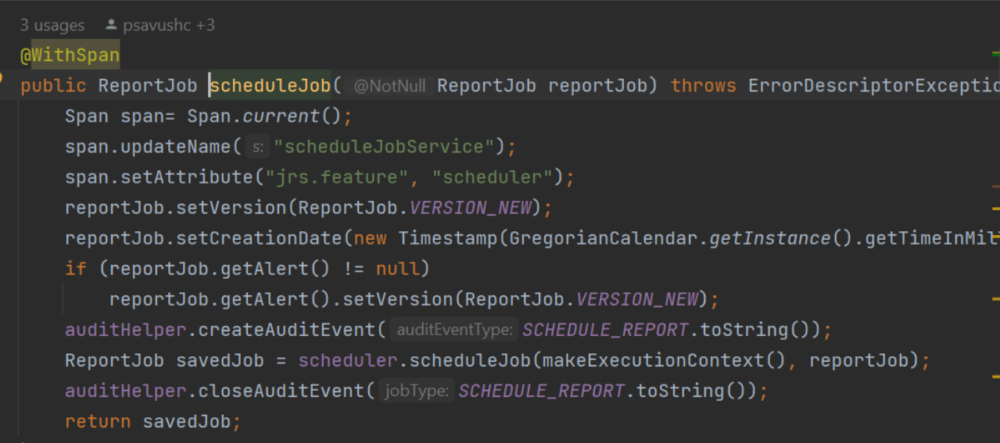

# Annotations

The span names and properties can be modified for better visibility on Jaeger. You can create an annotation by adding `@WithSpan` in the method. This creates a span for a method for which it is annotated with. These annotated method names appear under the Operations field in Jaeger UI.

The following figure shows the `@WithSpan` annotation for the Scheduler method.

*Figure 1 Adding Annotations*
