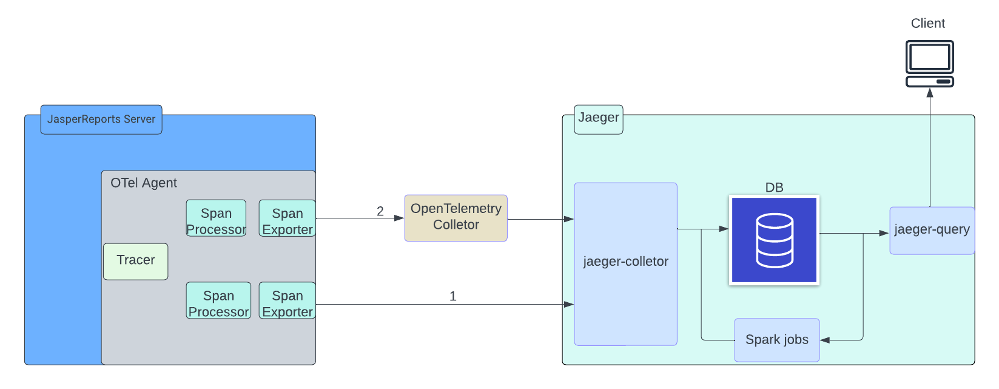

# OpenTelemetry Architecture

This section provides an overview of the setup of the OpenTelemetry framework in JasperReports Server application. This framework shows how JasperReports Server is deployed in the cluster mode to generate and view traces in Jaeger. Before configuring the OpenTelemetry framework for the JasperReports Server application, you should be familiar with the components of OTel agent and Jaeger.

The OpenTelemetry framework consists of the following components:

-   **OTel agent**: The OTel agent resides in the JasperReports Server application, which helps to generate traces.
-   **Tracer**: Tracer is a pipeline, which is responsible for starting the tracer.
-   **Span processor**: The span processor is responsible for each span lifecycle, which processes the spans.
-   **Span exporter**: The span exporter exports the data processed by the span processor to the configured endpoint.
-   **OpenTelemetry collector**: The OpenTelemetry collector is used to load balance or streamline the traces collection.
-   **Jaeger**: Jaeger is an open-source distributed tracing system tool to visualize traces.
-   **Jaeger collector**: The Jaeger collector is an endpoint, which receives traces from Jaeger agents and runs them through a processing pipeline.
-   **Jaeger query**: Jaeger query is a service that retrieves traces from the database(or storage) and hosts a UI to display them.

## OpenTelemetry Deployment

JasperReports Server is instrumented to generate traces using the OpenTelemetry framework.

When JasperReports Server is instrumented with the OTel agent, the agent resides in the JasperReports Server application and generates traces using the OpenTelemetry framework. The Tracer and Span pipeline starts with the Tracer and Span processor. The Span processor is responsible for each span lifecycle, and it processes the spans and exports them to the configured endpoint.

There are two options to configure the exports to Jaeger:

-   **Configuring directly to the Jaeger collector**: In this option, the Jaeger collector endpoint is directly configured and traces can be directly collected at Jaeger.
-   **Configuring via OpenTelemetry collector**: In this option, an OpenTelemetry collector is configured between JasperReports Server exporter and Jaeger collector. This helps to load balance or streamline the traces collection (This is completely optional).

The following illustration shows the architecture diagram of JasperReports Server instrumentation.

*Figure 1 OpenTelemetry Framework in JasperReports Server*
