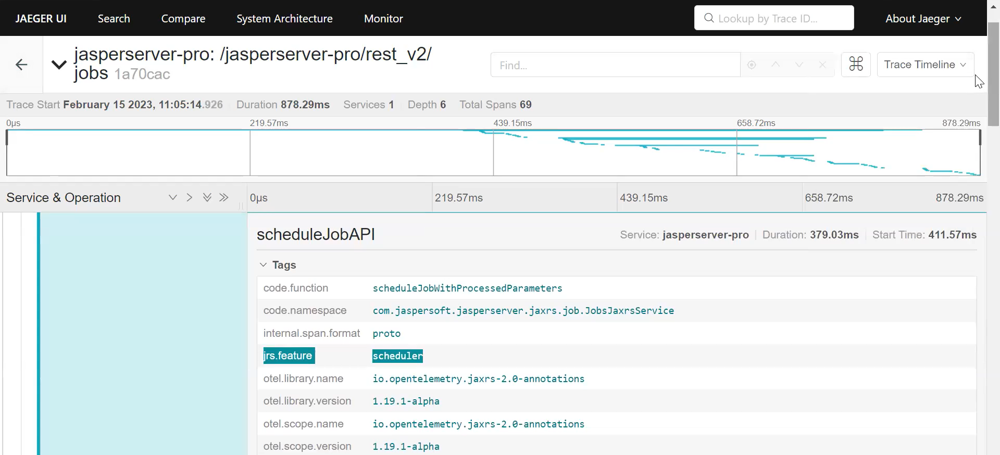
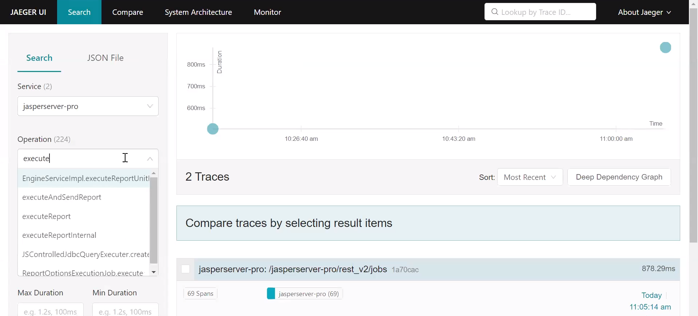

# Methods for Report Scheduling and Report Execution

In our current implementation, we have changed the Scheduler method names for scheduling and execution of the report. These method names are also known as span names of the Scheduler. By default, the method names are the combination of `<className>.<methodName>`. You can modify or rename the span name. Based on the changed name, the updated names appear in the Jaeger UI.

The below table includes the list of the changed span or method names of Scheduler. With the changed method names, you can now search traces of logs specific to report scheduling and execution in Jaeger UI.

| Original Method Names | Updated Method Names |
|----|----|
| `JobsJaxrsService.scheduleJobWithProcessedParameters` | `scheduleJob` |
| `JobsServiceImpl.scheduleJob` | `scheduleJobService` |
| `ReportSchedulingFacade.scheduleJob` | `scheduleJobDAO` |
| `HibernateReportJobsPersistenceService.saveJob` | `scheduleJobDAOImpl` |
| `ReportJobsQuartzScheduler.scheduleJob` | `scheduleQuartzJob` |
| `ReportExecutionJobMailNotificationImpl.sendMailNotification` | `sendMailNotification` |
| `ReportExecutionJobAlertImpl.sendAlertMail` | `sendAlertMail` |
| `InternalReportExecutor.createOutputs` | `createReportOutput` |
| `InternalReportExecutor.executeReport` | `executeReportInternal` |
| `EngineServiceImpl.java.runReport` | `runReport` |

Scheduler Method Names for Report Scheduling and Execution

The following figure shows the list of span names of Scheduler for report scheduling in Jaeger UI. You can search a span name by searching "schedule" in Operations to view span names specific to report scheduling in Jaeger UI.

*Figure 1: Scheduler Span Names for Report Scheduling*

The report execution happens when a job is scheduled for a report. The following figure shows the list of span names of Scheduler for report execution in Jaeger UI. You can search a span name by searching "execute" in Operations to view span names specific to report execution in the Jaeger UI.

*Figure 2: Scheduler Span Names for Report Execution*
