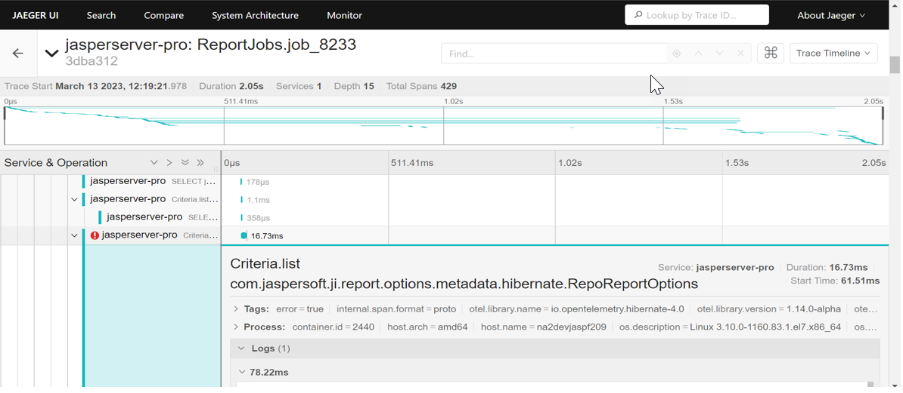
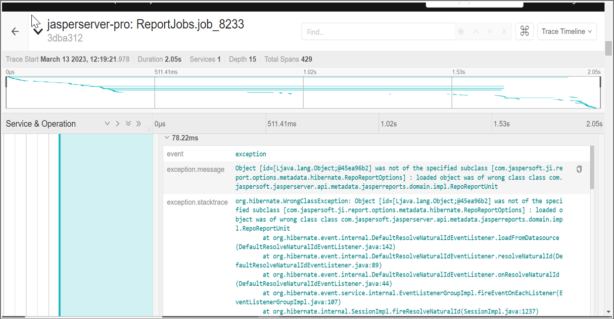

# Use cases

OpenTelemetry can be used to trace issues of Scheduler and Input Controls. It can be used to trace logs and capture errors of the Scheduler while running a report. This section includes screenshots of the traces captured in JasperReports Server during report execution in the Jaeger UI.

## Tracing Report execution triggered by Scheduler

The following figure shows an example of the errors captured for the JasperReports Server Scheduler in Jaeger UI along with the logs. It shows the list of errors captured in Jaeger UI. It includes details of span name, API execution time, span execution time, start time of logs. On expanding the log for an error, you can see the exception caused in each log along with the traces.

Example of Error Captured by OpenTelemetry in Jaeger UI

Example of Logs Captured by OpenTelemetry in Jaeger UI

## Tracing the execution of Report with Input Controls

Enabling tracing of the report execution helps to find slow SQL queries, and can help to determine if these queries were sent by report or Input Controls. In Jaeger UI you can look for slow queries by checking the start time, total execution time, and the duration of each span.

To enable tracing, you need to configure OpenTelemetry and Jaeger agents on the JasperReports Server application and cluster. For more information, refer to [Configuring OpenTelemetry and Jaeger Agent](configuring_opentelemetry_and_jaegar.md).
